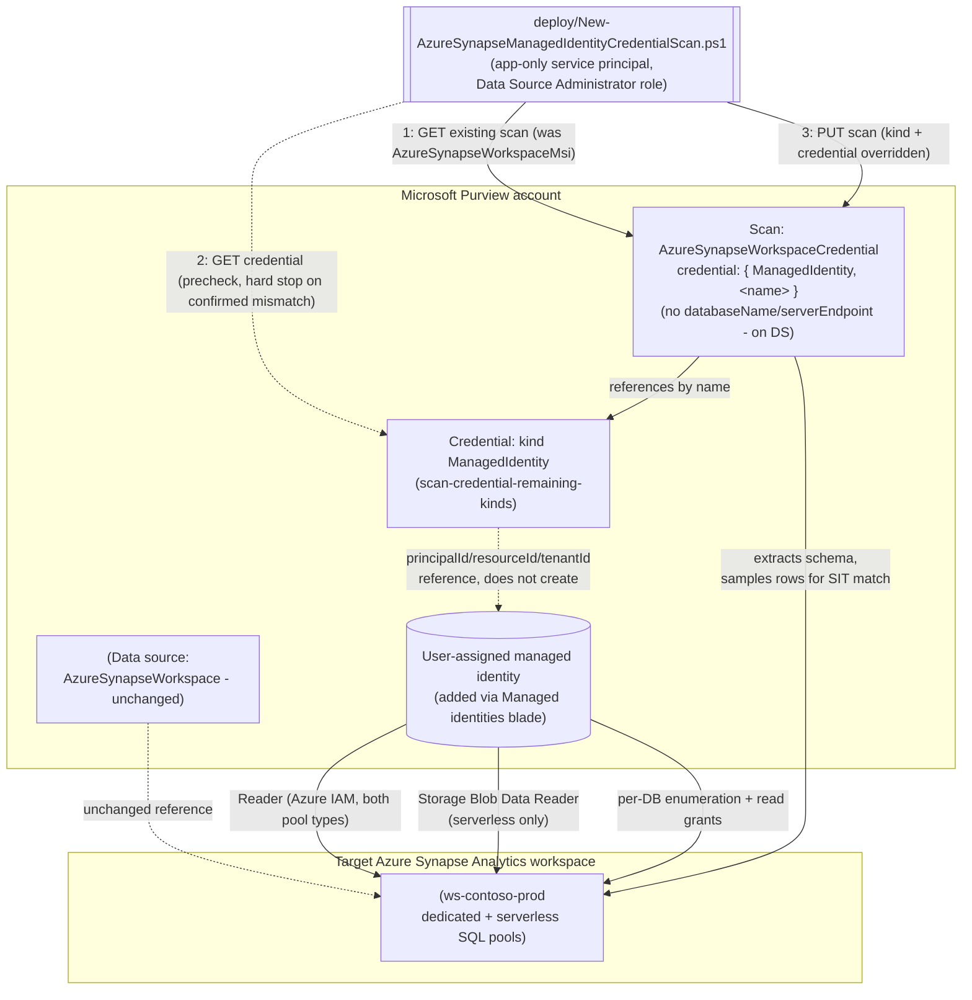

## The short version

Extends *Scan Azure Synapse Analytics Workspace and Classify Sensitive Columns*: reconciles that scenario's already-registered scan from the Purview account's shared system-assigned managed identity (SAMI) onto a
**user-assigned managed identity (UAMI)** - a separately-scoped, per-source Azure identity built via
*Scan Credentials: Remaining Kinds (Account Key, Role ARN, Consumer Key, Delegated Auth, User-Assigned Managed Identity)*'s `ManagedIdentity` credential kind. This is
the third and last sibling of `scan-azure-sql-and-classify-managed-identity-credential/` and
`scan-azure-sql-managed-instance-and-classify-managed-identity-credential/`, closing out
*Scan Credentials: Remaining Kinds (Account Key, Role ARN, Consumer Key, Delegated Auth, User-Assigned Managed Identity)* (the configuration reference)'s backlog of directly-wireable scan scenarios
completely. See the design notes for why this sibling's core REST claim (`ManagedIdentity` as a valid
`credentialType` for this exact scan kind) is more directly grounded than either predecessor's.

## Why this matters

Identical driver to both siblings: SOC 2 CC6.1 and ISO 27001 A.8.2 call for least-privilege,
blast-radius-scoped access, and a UAMI is a separate, independently-grantable and
independently-revocable Azure identity per source. A Synapse workspace that
aggregates data from many upstream systems is, if anything, a higher-value target to scope a
scanning identity narrowly around than a single database - a compromised or over-broad shared SAMI
grant on such a workspace exposes proportionally more.

## How the control works

## What it takes

### Prerequisites

Full licensing detail and citations: [Licensing matrix](/docs/licensing-matrix/). Summary for this scenario -
**additive** to the base scenario's own prerequisite table, which still applies in full (including
its Synapse-specific deltas from the Database/Managed Instance siblings: the three-part serverless
enumeration authentication, and the workspace firewall setting):

| Requirement | Minimum | Notes |
|---|---|---|
| The base scenario already deployed | *Scan Azure Synapse Analytics Workspace and Classify Sensitive Columns* scan exists (SAMI or already-reconciled credential auth) | This scenario reconciles an **existing** scan - it refuses to run against a data source/scan that doesn't exist yet |
| A user-assigned managed identity (UAMI) created and added to the Purview account | Azure identity-administration action, via the Purview account's own **Managed identities** blade | Out-of-band Azure step - see *Scan Credentials: Remaining Kinds (Account Key, Role ARN, Consumer Key, Delegated Auth, User-Assigned Managed Identity)* (the prerequisites) |
| A Purview credential object, kind `ManagedIdentity`, referencing that UAMI | Built via *Scan Credentials: Remaining Kinds (Account Key, Role ARN, Consumer Key, Delegated Auth, User-Assigned Managed Identity)* -CredentialType ManagedIdentity` | This scenario's `-CredentialReferenceName` parameter is that credential object's name |
| Reconcile the scan onto the new credential | **Data Source Administrator** role on the scan's collection | Same Purview role the base scenario's own deploy script needs |
| Azure IAM Reader on the Synapse workspace, for the **UAMI** (not the Purview account's SAMI) | Enough visibility to enumerate workspace resources | Required for **both** dedicated and serverless scanning, same as the base scenario's SAMI grant - an owner or user access administrator must assign it. The base scenario's own grant steps are worded generically ("Microsoft Purview account MSI"), not explicitly naming UAMI as an alternative selectable principal the way the Database sibling's page does - see the known limitations |
| Azure IAM Storage Blob Data Reader on the workspace's associated storage account, for the **UAMI** (**serverless only**) | Same scoping recommendation as the base scenario - prefer the storage account resource itself over resource group/subscription | A separate grant from the base scenario's SAMI grant; same generic-wording caveat as the Reader grant above - see the known limitations |
| Per-database enumeration login (**serverless only**), for the UAMI | `CREATE LOGIN [Username] FROM EXTERNAL PROVIDER;` run once per serverless SQL database, using the UAMI's exact managed-identity name | Same T-SQL pattern as the base scenario's SAMI grant - see the implementation steps |
| Per-database read grant, for the UAMI | Dedicated: `CREATE USER [Username] FROM EXTERNAL PROVIDER` + `db_datareader`. Serverless: `CREATE USER [Username] FOR LOGIN [Username]` + `db_datareader` | Same T-SQL pattern as the base scenario's SAMI grants, different `[Username]` value - see the implementation steps |
| Workspace firewall setting (unchanged from the base scenario) | **Allow Azure services and resources to access this workspace** = On | Orthogonal to which Purview identity authenticates - already satisfied if the base scenario's scan is running |
| Automation identity for the REST calls themselves | App registration with **Data Source Administrator** (and, for `validate/`, **Data Reader**) Purview role on the collection | Same as the base scenario |

> Verify current entitlement names against [Licensing matrix](/docs/licensing-matrix/) before a production rollout.

### Cost and licensing

Identical to both siblings: no new billing surface - still PAYG Data Map scanning; a UAMI itself has
no direct Azure cost, only the operational cost of provisioning, granting, and monitoring one more
identity.

## Proof it works

1. **Automated config check** - `./validate/Test-AzureSynapseManagedIdentityCredentialScan.ps1`
   confirms the scan's `kind` is `AzureSynapseWorkspaceCredential`, its `credential.credentialType`
   is `ManagedIdentity`, and (with `-ExpectedCredentialReferenceName`) that it references the
   expected credential object. `-CheckCredentialObject` additionally confirms that object itself
   still exists and is still kind `ManagedIdentity`.
2. **Scan run status** - Purview portal → **Data Map** → **Data sources** → the scan → **Recent
   scans** → confirm a run under the new identity reaches **Completed**.
3. **Access-path evidence** - confirm in each scanned database (dedicated and/or serverless) that
   the UAMI now appears as the external-provider database user actually being used by new scan runs
   (`SELECT p.name, r.name FROM sys.database_principals p ... WHERE p.authentication_type_desc =
   'EXTERNAL'`, per the base scenario's own the validation steps verification query).
4. **Negative test** - temporarily revoke the UAMI's `db_datareader` grant on one database, re-run
   with `-RunNow`, and confirm that database's assets stop being newly classified while others
   continue to succeed.

**What no script here can prove**: whether the UAMI is still attached to the Purview account
(detachable independently of the credential object); whether the workspace firewall setting the base
scenario already established remains intact - this scenario's checks are scoped to the
identity/credential layer only.

## Where it stops

- **`ManagedIdentity` (UAMI) is a Microsoft-labeled Preview capability**, inherited from
  *Scan Credentials: Remaining Kinds (Account Key, Role ARN, Consumer Key, Delegated Auth, User-Assigned Managed Identity)* - see that scenario's page the known limitations.
- **Neither SAMI nor UAMI works over a self-hosted integration runtime.** If the workspace is
  reachable only via self-hosted IR, this scenario is inapplicable - fall back to service principal
  or SQL authentication via *Key Vault-Backed Scan Credential (SQL Auth / Service Principal)*.
- **A UAMI can be deleted independently of the credential object that references it, and
  independently of this scan's configuration.** Same disclosed gap as both siblings.
- **Reverting to SAMI (rollback) assumes the SAMI's own Reader/Storage Blob Data Reader/per-database
  grants from the base scenario are still in place.** See the rollback runbook.
- **This scenario's precheck cannot detect every misconfiguration** - it confirms the credential
  object exists and is the right *kind*, not that the UAMI it references is attached to the Purview
  account or holds the Azure IAM/SQL grants - same disclosed gap as both siblings.
- **The three-part serverless grant model means a partial grant can leave serverless scanning broken
  while dedicated scanning succeeds (or vice versa).** Unchanged from the base scenario's own
  disclosure - this fragment doesn't add or remove that risk, only moves which identity the grants
  target.
- **`resourceTypes` scoping is not adopted by this scenario either**, matching the base scenario's
  own choice - see the design notes goal 2 and the base scenario's page section 11 for the newly-found
  worked example this build discovered but deliberately did not act on here.
- **VERIFY - the Azure IAM Reader/Storage Blob Data Reader role-assignment steps on this scenario's
  own base page are worded generically enough that UAMI applicability is inferred, not
  page-confirmed verbatim.** This fragment's **core** claim - that `ManagedIdentity` is a valid
  `credentialType` for the `AzureSynapseWorkspaceCredential` scan `kind` - is directly confirmed by
  a worked JSON example on this exact page, stronger grounding than either
  sibling scenario had. What is *not* independently confirmed on this page is whether its IAM
  role-assignment and T-SQL grant steps' "Microsoft Purview account MSI" wording is meant to include
  a UAMI the same way the Database sibling's own page explicitly says "your Microsoft Purview
  account name or UAMI." Since IAM role assignment and SQL external-provider users are the same
  generic mechanism regardless of principal type, this is very likely a documentation wording gap
  rather than a real product restriction - flagged rather than silently assumed.
  Confirm against a pilot tenant or a future Microsoft Learn pass before treating the implementation steps steps 2-4 as
  page-verified rather than mechanism-inferred.
- **The three-part serverless grant model means a partial grant can leave serverless scanning broken
  while dedicated scanning succeeds (or vice versa) - unchanged risk from the base scenario, now
  targeting the UAMI instead of SAMI.** No Purview API exists to verify any of the underlying Azure
  IAM or SQL grants from this scenario's scripts; the only detection is a scan run's own per-run
  status and asset counts, which cannot distinguish "serverless enumeration failed" from
  "serverless pool legitimately has nothing new to classify" without inspecting the run's own error
  detail in the portal.