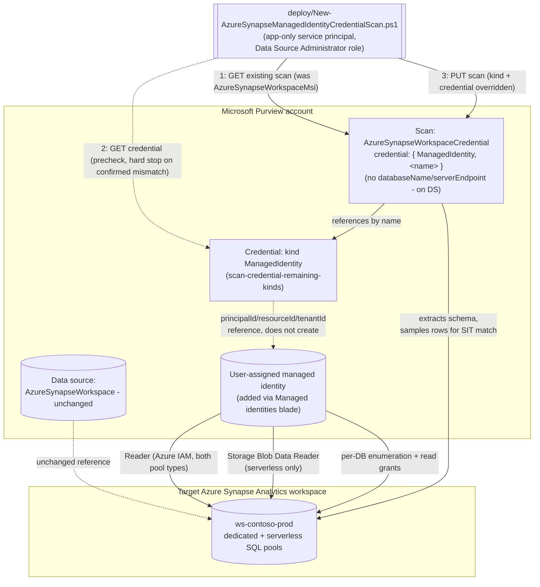

## 1. Scenario summary

Extends `scenarios/data-map/scan-azure-synapse-and-classify/`: reconciles that scenario's already-
registered scan from the Purview account's shared system-assigned managed identity (SAMI) onto a
**user-assigned managed identity (UAMI)** - a separately-scoped, per-source Azure identity built via
`scenarios/data-map/scan-credential-remaining-kinds/`'s `ManagedIdentity` credential kind. This is
the third and last sibling of `scan-azure-sql-and-classify-managed-identity-credential/` and
`scan-azure-sql-managed-instance-and-classify-managed-identity-credential/`, closing out
`scan-credential-remaining-kinds/README.md` §6's backlog of directly-wireable scan scenarios
completely. See `design.md` §1 for why this sibling's core REST claim (`ManagedIdentity` as a valid
`credentialType` for this exact scan kind) is more directly grounded than either predecessor's.

**Who it's for:** a data governance or security team that has already run the base Azure Synapse
scanning scenario, and whose governance model wants **per-source identity separation** instead of
relying on the Purview account's one shared SAMI - particularly relevant for Synapse, which
`scan-azure-synapse-and-classify/README.md` §2 already frames as a common aggregation point for
sensitive data copied in from many upstream systems.

## 2. Business/regulatory driver

Identical driver to both siblings: SOC 2 CC6.1 and ISO 27001 A.8.2 call for least-privilege,
blast-radius-scoped access, and a UAMI is a separate, independently-grantable and
independently-revocable Azure identity per source. A Synapse workspace that
aggregates data from many upstream systems is, if anything, a higher-value target to scope a
scanning identity narrowly around than a single database - a compromised or over-broad shared SAMI
grant on such a workspace exposes proportionally more.

## 3. Prerequisites

Full licensing detail and citations: [Licensing matrix](/docs/licensing-matrix/). Summary for this scenario -
**additive** to the base scenario's own prerequisite table, which still applies in full (including
its Synapse-specific deltas from the Database/Managed Instance siblings: the three-part serverless
enumeration authentication, and the workspace firewall setting):

| Requirement | Minimum | Notes |
|---|---|---|
| The base scenario already deployed | `scenarios/data-map/scan-azure-synapse-and-classify/` scan exists (SAMI or already-reconciled credential auth) | This scenario reconciles an **existing** scan - it refuses to run against a data source/scan that doesn't exist yet |
| A user-assigned managed identity (UAMI) created and added to the Purview account | Azure identity-administration action, via the Purview account's own **Managed identities** blade | Out-of-band Azure step - see `scan-credential-remaining-kinds/README.md` §3 |
| A Purview credential object, kind `ManagedIdentity`, referencing that UAMI | Built via `scenarios/data-map/scan-credential-remaining-kinds/deploy/New-PurviewScanCredentialExtended.ps1 -CredentialType ManagedIdentity` | This scenario's `-CredentialReferenceName` parameter is that credential object's name |
| Reconcile the scan onto the new credential | **Data Source Administrator** role on the scan's collection | Same Purview role the base scenario's own deploy script needs |
| Azure IAM Reader on the Synapse workspace, for the **UAMI** (not the Purview account's SAMI) | Enough visibility to enumerate workspace resources | Required for **both** dedicated and serverless scanning, same as the base scenario's SAMI grant - an owner or user access administrator must assign it. The base scenario's own grant steps are worded generically ("Microsoft Purview account MSI"), not explicitly naming UAMI as an alternative selectable principal the way the Database sibling's page does - see §11 |
| Azure IAM Storage Blob Data Reader on the workspace's associated storage account, for the **UAMI** (**serverless only**) | Same scoping recommendation as the base scenario - prefer the storage account resource itself over resource group/subscription | A separate grant from the base scenario's SAMI grant; same generic-wording caveat as the Reader grant above - see §11 |
| Per-database enumeration login (**serverless only**), for the UAMI | `CREATE LOGIN [Username] FROM EXTERNAL PROVIDER;` run once per serverless SQL database, using the UAMI's exact managed-identity name | Same T-SQL pattern as the base scenario's SAMI grant - see §5 |
| Per-database read grant, for the UAMI | Dedicated: `CREATE USER [Username] FROM EXTERNAL PROVIDER` + `db_datareader`. Serverless: `CREATE USER [Username] FOR LOGIN [Username]` + `db_datareader` | Same T-SQL pattern as the base scenario's SAMI grants, different `[Username]` value - see §5 |
| Workspace firewall setting (unchanged from the base scenario) | **Allow Azure services and resources to access this workspace** = On | Orthogonal to which Purview identity authenticates - already satisfied if the base scenario's scan is running |
| Automation identity for the REST calls themselves | App registration with **Data Source Administrator** (and, for `validate/`, **Data Reader**) Purview role on the collection | Same as the base scenario |

> Verify current entitlement names against [Licensing matrix](/docs/licensing-matrix/) before a production rollout.

## 4. Architecture



## 5. Step-by-step implementation

### Portal path (for a first manual walkthrough / to validate intent before scripting)

1. Complete `scenarios/data-map/scan-credential-remaining-kinds/`'s portal or script path for a
 `ManagedIdentity` credential first - this requires a UAMI already added under the Purview
 account's **Managed identities** blade.
2. Grant the UAMI **Reader** on the Synapse workspace (Azure portal → workspace → **Access control
 (IAM)** → **Add role assignment**), the same pane the base scenario's SAMI grant used
.
3. **Serverless pools only:** grant the UAMI **Storage Blob Data Reader** on the workspace's
 associated storage account, then run the enumeration login in Synapse Studio using the UAMI's
 exact managed-identity name:
   ```sql
   CREATE LOGIN [Username] FROM EXTERNAL PROVIDER;
   ```
 
4. Per database (dedicated or serverless), run the matching read grant using the UAMI's exact
 managed-identity name as `[Username]` - dedicated:
   ```sql
   CREATE USER [Username] FROM EXTERNAL PROVIDER
   GO
   EXEC sp_addrolemember 'db_datareader', [Username]
   GO
   ```
 serverless:
   ```sql
   CREATE USER [Username] FOR LOGIN [Username];
   ALTER ROLE db_datareader ADD MEMBER [Username];
   ```
 
5. Back in the Purview portal, open the base scenario's already-registered scan and select **Edit**.
 Under **Credential**, switch from the system-assigned managed identity to the UAMI, select **Test
 connection**, then **Save**.
6. Re-run (or wait for the next scheduled trigger) and confirm the scan still completes successfully
 under the new identity.

### Script path (idempotent, parameterized, dry-run capable)

```powershell
# 0. Prerequisite: build the ManagedIdentity credential first (if not already done)
../scan-credential-remaining-kinds/deploy/New-PurviewScanCredentialExtended.ps1 `
    -PurviewAccountName 'contoso-purview' -TenantId $TenantId -AppId $AppId -ClientSecret $ClientSecret `
    -CredentialName 'synapse-contoso-uami' -CredentialType ManagedIdentity `
    -PrincipalId $UamiPrincipalId -ResourceId $UamiResourceId

# 1. Dry run first
./deploy/New-AzureSynapseManagedIdentityCredentialScan.ps1 `
    -PurviewAccountName 'contoso-purview' -TenantId $TenantId -AppId $AppId -ClientSecret $ClientSecret `
    -DataSourceName 'ws-contoso-prod' -CredentialReferenceName 'synapse-contoso-uami' -WhatIf

# 2. Reconcile for real
./deploy/New-AzureSynapseManagedIdentityCredentialScan.ps1 `
    -PurviewAccountName 'contoso-purview' -TenantId $TenantId -AppId $AppId -ClientSecret $ClientSecret `
    -DataSourceName 'ws-contoso-prod' -CredentialReferenceName 'synapse-contoso-uami'

# 3. Reconcile and immediately prove the new identity works
./deploy/New-AzureSynapseManagedIdentityCredentialScan.ps1 `
    -PurviewAccountName 'contoso-purview' -TenantId $TenantId -AppId $AppId -ClientSecret $ClientSecret `
    -DataSourceName 'ws-contoso-prod' -CredentialReferenceName 'synapse-contoso-uami' -RunNow

# 4. Validate
./validate/Test-AzureSynapseManagedIdentityCredentialScan.ps1 `
    -PurviewAccountName 'contoso-purview' -TenantId $TenantId -AppId $AppId -ClientSecret $ClientSecret `
    -DataSourceName 'ws-contoso-prod' -ExpectedCredentialReferenceName 'synapse-contoso-uami' `
    -CheckCredentialObject
```

Same REST surface as the base scenario - Microsoft Purview Data Map / Data Governance REST API,
automation surface 4 per [Automation surface §1](/docs/automation-surface/#1-five-automation-surfaces-not-one-read-this-first).

## 6. Configuration reference

| Setting | Value this scenario uses | Notes |
|---|---|---|
| Scan `kind` (before) | `AzureSynapseWorkspaceMsi` | SAMI-authenticated - the base scenario's default |
| Scan `kind` (after) | `AzureSynapseWorkspaceCredential` | Confirmed via direct fetch of the Scans - Create Or Replace REST reference AND a worked JSON example on the base scenario's own registration page - see `design.md` §1 |
| `properties.credential.credentialType` | `ManagedIdentity` | Directly confirmed for this exact scan kind by Microsoft's own worked example, not inferred from a generic list |
| `properties.credential.referenceName` | Name of a pre-existing `ManagedIdentity`-kind credential object | Built via `scan-credential-remaining-kinds` - see §3 |
| Properties preserved unchanged from the existing scan | `collection`, `scanRulesetName`, `scanRulesetType` only - **no** `databaseName`/`serverEndpoint` | `AzureSynapseWorkspaceCredentialScanProperties` carries neither field; both dedicated/serverless endpoints live on the data source object - `design.md` §2 goal 1 |
| `-SkipCredentialPrecheck` | Off by default | Skips the read-only GET against the credential object before reconciling |
| `-Force` | Off by default | Required to proceed past a precheck that found the credential object but confirmed it is **not** kind `ManagedIdentity` |
| `-RunNow` | Off by default | Starts an immediate scan run to prove the new identity actually authenticates |
| API version pinned by this script | `2023-09-01` | Matches the base scenario |

Full cmdlet/REST-body grounding: `deploy/New-AzureSynapseManagedIdentityCredentialScan.ps1`'s inline
comments and `.NOTES` block.

## 7. Validation / how to prove it works

1. **Automated config check** - `./validate/Test-AzureSynapseManagedIdentityCredentialScan.ps1`
 confirms the scan's `kind` is `AzureSynapseWorkspaceCredential`, its `credential.credentialType`
 is `ManagedIdentity`, and (with `-ExpectedCredentialReferenceName`) that it references the
 expected credential object. `-CheckCredentialObject` additionally confirms that object itself
 still exists and is still kind `ManagedIdentity`.
2. **Scan run status** - Purview portal → **Data Map** → **Data sources** → the scan → **Recent
 scans** → confirm a run under the new identity reaches **Completed**.
3. **Access-path evidence** - confirm in each scanned database (dedicated and/or serverless) that
 the UAMI now appears as the external-provider database user actually being used by new scan runs
 (`SELECT p.name, r.name FROM sys.database_principals p... WHERE p.authentication_type_desc =
 'EXTERNAL'`, per the base scenario's own §7 verification query).
4. **Negative test** - temporarily revoke the UAMI's `db_datareader` grant on one database, re-run
 with `-RunNow`, and confirm that database's assets stop being newly classified while others
 continue to succeed.

**What no script here can prove**: whether the UAMI is still attached to the Purview account
(detachable independently of the credential object); whether the workspace firewall setting the base
scenario already established remains intact - this scenario's checks are scoped to the
identity/credential layer only.

## 8. Operations & tuning

All of the base scenario's §8 KPI and incident-response guidance applies unchanged. Two additions
specific to the UAMI path, identical to both siblings' own disclosure:

- **No Key Vault-side detective control.** `ManagedIdentity` carries no secret - the only detective
 control is `scenarios/data-map/scan-credential-inventory-report/`'s estate-wide drift report.
- **No detective control for the scan's own credential reference drifting**, as distinct from the
 credential object's content drifting. The only mitigation is re-running
 `validate/Test-AzureSynapseManagedIdentityCredentialScan.ps1 -ExpectedCredentialReferenceName` on a
 schedule.
- **Adopt selectively.** Same phased-rollout recommendation as both siblings - and arguably the
 strongest candidate of the three for early adoption, given Synapse's role as an aggregation point
 for sensitive data from many upstream systems (§2).

## 9. Rollback / decommission

See `rollback.md` for the full staged procedure. Quick reference:
`./deploy/Remove-AzureSynapseManagedIdentityCredentialScan.ps1` reverts the scan's `kind` back to
`AzureSynapseWorkspaceMsi` (SAMI), preserving every other scan property. It does not delete the
UAMI, its grants, or the `ManagedIdentity` credential object.

## 10. Cost & licensing notes

Identical to both siblings: no new billing surface - still PAYG Data Map scanning; a UAMI itself has
no direct Azure cost, only the operational cost of provisioning, granting, and monitoring one more
identity.

## 11. Known limitations & gotchas

- **`ManagedIdentity` (UAMI) is a Microsoft-labeled Preview capability**, inherited from
 `scan-credential-remaining-kinds` - see that scenario's README §11.
- **Neither SAMI nor UAMI works over a self-hosted integration runtime.** If the workspace is
 reachable only via self-hosted IR, this scenario is inapplicable - fall back to service principal
 or SQL authentication via `scan-credential-key-vault-backed`.
- **A UAMI can be deleted independently of the credential object that references it, and
 independently of this scan's configuration.** Same disclosed gap as both siblings.
- **Reverting to SAMI (rollback) assumes the SAMI's own Reader/Storage Blob Data Reader/per-database
 grants from the base scenario are still in place.** See `rollback.md`.
- **This scenario's precheck cannot detect every misconfiguration** - it confirms the credential
 object exists and is the right *kind*, not that the UAMI it references is attached to the Purview
 account or holds the Azure IAM/SQL grants - same disclosed gap as both siblings.
- **The three-part serverless grant model means a partial grant can leave serverless scanning broken
 while dedicated scanning succeeds (or vice versa).** Unchanged from the base scenario's own
 disclosure - this fragment doesn't add or remove that risk, only moves which identity the grants
 target.
- **`resourceTypes` scoping is not adopted by this scenario either**, matching the base scenario's
 own choice - see `design.md` §2 goal 2 and the base scenario's README §11 for the newly-found
 worked example this build discovered but deliberately did not act on here.
- **VERIFY - the Azure IAM Reader/Storage Blob Data Reader role-assignment steps on this scenario's
 own base page are worded generically enough that UAMI applicability is inferred, not
 page-confirmed verbatim.** This fragment's **core** claim - that `ManagedIdentity` is a valid
 `credentialType` for the `AzureSynapseWorkspaceCredential` scan `kind` - is directly confirmed by
 a worked JSON example on this exact page (§1, `design.md` §1), stronger grounding than either
 sibling scenario had. What is *not* independently confirmed on this page is whether its IAM
 role-assignment and T-SQL grant steps' "Microsoft Purview account MSI" wording is meant to include
 a UAMI the same way the Database sibling's own page explicitly says "your Microsoft Purview
 account name or UAMI." Since IAM role assignment and SQL external-provider users are the same
 generic mechanism regardless of principal type, this is very likely a documentation wording gap
 rather than a real product restriction - flagged rather than silently assumed, per `AGENTS.md` §4.
 Confirm against a pilot tenant or a future Microsoft Learn pass before treating §5 steps 2-4 as
 page-verified rather than mechanism-inferred.
- **The three-part serverless grant model means a partial grant can leave serverless scanning broken
 while dedicated scanning succeeds (or vice versa) - unchanged risk from the base scenario, now
 targeting the UAMI instead of SAMI.** No Purview API exists to verify any of the underlying Azure
 IAM or SQL grants from this scenario's scripts; the only detection is a scan run's own per-run
 status and asset counts (§7), which cannot distinguish "serverless enumeration failed" from
 "serverless pool legitimately has nothing new to classify" without inspecting the run's own error
 detail in the portal.

## 12. References

1. Connect to and manage Azure Synapse Analytics workspaces in Microsoft Purview - <https://learn.microsoft.com/purview/register-scan-synapse-workspace>
2. Microsoft Purview billing models (PAYG for Data Map) - <https://learn.microsoft.com/purview/purview-billing-models>
3. Tutorial: Authenticate for Microsoft Purview data-plane APIs - <https://learn.microsoft.com/purview/data-gov-api-rest-data-plane>
4. Connect to and manage Azure Synapse Analytics workspaces in Microsoft Purview - "Scan" / enumeration authentication and per-database grant sections (Reader + Storage Blob Data Reader + per-database CREATE LOGIN/CREATE USER for managed identity authentication) - <https://learn.microsoft.com/purview/register-scan-synapse-workspace#scan>
5. Scans - Create Or Replace REST API reference (API version 2023-09-01; confirmed `AzureSynapseWorkspaceCredentialScanProperties` field names - no `databaseName`/`serverEndpoint`; the shared `CredentialType` enum including `ManagedIdentity`) - <https://learn.microsoft.com/rest/api/purview/scanningdataplane/scans/create-or-replace>
6. Connect to and manage Azure Synapse Analytics workspaces in Microsoft Purview - "Set up a scan by using an API" (Microsoft's own worked JSON body explicitly showing `"credentialType":"SqlAuth | ServicePrincipal | ManagedIdentity (if UAMI authentication)"` for `"kind":"AzureSynapseWorkspaceCredential"` - the strongest direct confirmation of the three sibling scenarios) - <https://learn.microsoft.com/purview/register-scan-synapse-workspace#set-up-a-scan-by-using-an-api>
7. Scans and ingestion in Data Map - <https://learn.microsoft.com/purview/data-map-scan-ingestion>
8. Data governance best practices for security - Credential management (Microsoft's credential priority order) - <https://learn.microsoft.com/purview/data-gov-classic-security-best-practices>
9. Credentials for source authentication in Microsoft Purview Data Map - "Create a user-assigned managed identity" - <https://learn.microsoft.com/purview/data-map-data-scan-credentials#create-a-user-assigned-managed-identity>
10. Credential - Get / List REST API reference - <https://learn.microsoft.com/rest/api/purview/scanningdataplane/credential>
11. `scenarios/data-map/scan-credential-remaining-kinds/` - the `ManagedIdentity` credential kind this scenario consumes.
12. `scenarios/data-map/scan-azure-sql-and-classify-managed-identity-credential/`, `scan-azure-sql-managed-instance-and-classify-managed-identity-credential/` - the two sibling scenarios this scenario ports the reconciliation pattern from; see `design.md` §1 for the confirmed differences.

> Re-verify all links, API versions, and REST body shapes against current Microsoft Learn before a
> customer-facing deployment. The `ManagedIdentity` credential kind remains Microsoft-labeled
> Preview as of this writing - see §11.
