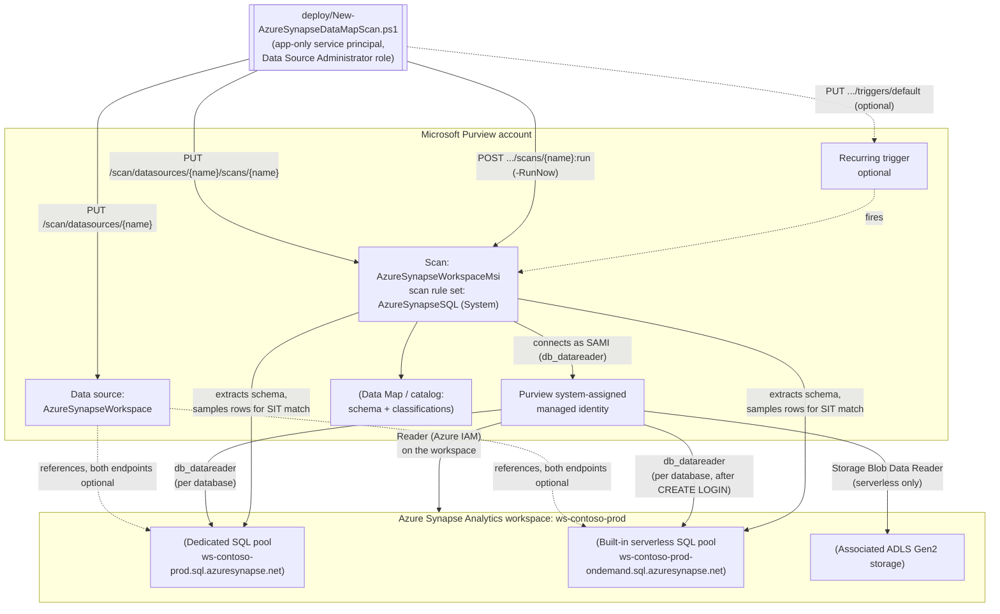

## The short version

Registers an Azure Synapse Analytics workspace as a Microsoft Purview Data Map source, configures a
scan that authenticates as the Purview account's own system-assigned managed identity (SAMI -
credential-free, no Key Vault link to manage), and runs that scan with Microsoft's system default scan
rule set for this source type (`AzureSynapseSQL`) - which includes the SSN and Credit Card Number
sensitive information types (SITs) this library already uses elsewhere - against the workspace's
dedicated and/or serverless SQL pools, so sensitive columns are automatically classified and surfaced
in the catalog. This is the third scenario in this library's Azure-SQL-family Data Map series, alongside
*Scan Azure SQL Database and Classify Sensitive Columns* (logical-server Azure SQL Database) and
*Scan Azure SQL Managed Instance and Classify Sensitive Columns* (Azure SQL Managed Instance) -
following the same proven pattern but adapted for the genuine registration, authentication, and
network differences a Synapse **workspace** has as its own Purview data source `kind` - see
the design notes for the full diff.

> **Not the same as the legacy "dedicated SQL pool (formerly SQL DW)" data source.** Microsoft
> Purview documents **two separate** data sources for dedicated SQL pools: an older, standalone one
> (registered independently of any workspace - Microsoft's own docs describe it as for a dedicated
> SQL pool that has not enabled Azure Synapse workspace features) and the `AzureSynapseWorkspace`
> source this scenario uses, which registers the whole workspace and covers **both** dedicated and
> serverless pools. If your dedicated pool already has Azure Synapse workspace features enabled (the
> common case for anything provisioned in the last several years), this scenario's workspace-based
> path is Microsoft's currently documented one to use - not the standalone legacy source. Confirm
> which of the two your existing registrations use before assuming this scenario is a drop-in
> replacement (flagged as a Product Owner finding in the review notes).

## Why this matters

Same underlying drivers as both sibling scenarios - GDPR Art. 30 records of processing, CCPA/CPRA data
inventory obligations, PCI DSS Requirement 3.2/12.5.2 cardholder data discovery, HIPAA §164.308 risk
analysis all require an accurate, current inventory of where regulated data lives. Azure Synapse Analytics is frequently the landing zone for an enterprise's
integrated analytics estate - dedicated SQL pools hosting curated, governed data marts and serverless
SQL pools querying data lake files on demand - which means it is disproportionately likely to
aggregate sensitive data copied or transformed from many upstream source systems into one place.
Scanning it with the same automated, recurring discovery this library already applies to Azure SQL
Database and Managed Instance keeps that aggregation point from becoming a classification blind spot.

## How the control works



Same two-object model as both sibling scenarios (a data source + a scan, both create-or-replace), with
one data source object carrying up to **two** SQL endpoints instead of one, and the SAMI's access
requiring an extra, serverless-only Azure IAM grant (**Storage Blob Data Reader**) neither sibling
scenario needs. Full design rationale and the complete diff table: the design notes.

## What it takes

### Prerequisites

Full licensing detail and citations: [Licensing matrix](/docs/licensing-matrix/). Summary for this scenario (deltas
from the sibling scenarios' tables are called out explicitly):

| Requirement | Minimum | Notes |
|---|---|---|
| Microsoft Purview account + Data Map | Active **Azure subscription** with the M365 tenant, resource group for the Purview account | PAYG-billed Azure consumption, not a per-user M365 entitlement - see [Licensing matrix, sections 1 and 2](/docs/licensing-matrix/#1-the-two-billing-models-read-this-first) |
| Register + configure the source/scan | **Data Source Administrator** role on the target collection | Classic Data Map role - see [RBAC model, section 5](/docs/rbac-model/#5-data-governance-roles-data-map--unified-catalog---a-separate-model) |
| Call the Data Map REST API at all (any role) | **Collection Admin** role at root collection assigns data-plane roles to the automation service principal | Only a Collection Admin can grant Purview roles to a service principal - see [RBAC model, section 5](/docs/rbac-model/#5-data-governance-roles-data-map--unified-catalog---a-separate-model) |
| Read scan results / browse classified assets (validation) | **Data Reader** role on the target collection | Least-privilege for the read-only `validate/` script |
| **Azure IAM Reader** on the Synapse workspace | Grants the Purview account's SAMI enough visibility to enumerate workspace resources | Required for **both** dedicated and serverless scanning - an *owner* or *user access administrator* must assign it |
| **Azure IAM Storage Blob Data Reader** on the workspace's associated storage account | For the Purview SAMI | **Serverless-only, new prerequisite neither sibling scenario has.** Microsoft's own documented steps assign this at the **resource group or subscription** scope containing the storage account - prefer assigning it directly on the **storage account resource itself** where your Azure RBAC delegation model allows it, so the Purview SAMI doesn't gain blob-read access to every other storage account in the same resource group/subscription (flagged as a Red Team finding in the review notes) |
| Enumeration login, server-scoped (**serverless only**) | `CREATE LOGIN [<PurviewAccountName>] FROM EXTERNAL PROVIDER;` run **once** against `master` (from any one serverless database's Synapse Studio script context - not repeated per database, a server-level statement) | **New prerequisite neither sibling scenario has** - see section 5 step 3 |
| Per-database `db_datareader` grant | Two distinct T-SQL forms - one for dedicated pools, one for serverless pools | Same underlying idea as both sibling scenarios, but Synapse needs the operator to pick the right form per pool type |
| Workspace **firewall**: "Allow Azure services and resources to access this workspace" = **On** | Azure portal → the workspace → **Firewalls** | If this cannot be enabled, the **portal cannot configure a Synapse scan at all** - Microsoft directs operators to the REST API with **SQL Auth** instead of MSI in that case |
| Automation identity for the REST calls themselves | App registration with **Data Source Administrator** (and, for the validate script, **Data Reader**) Purview role on the collection | Client-secret app-only OAuth2 - see [Automation surface, section 3](/docs/automation-surface/#3-authentication-patterns---interactive-vs-unattended) and the implementation steps below |

> Verify current entitlement names and the PAYG meter against [Licensing matrix](/docs/licensing-matrix/) before a
> sales commitment - SKU names and billing meters change.

> **Cost/effort note distinct from both sibling scenarios:** the per-database enumeration login
> (serverless) and `db_datareader` grants above are **not** a fixed, one-time cost the way both
> sibling scenarios' single-database prerequisites are - they scale with the number of databases in
> the workspace. A workspace with dozens of serverless databases means dozens of manual T-SQL grant
> operations before this scenario's scan can classify any of them (flagged as a CISO finding in
> the review notes; a bulk-grant helper script is recorded as a follow-up in the project backlog rather than
> built speculatively for this fragment).

### Cost and licensing

Same PAYG/Azure-consumption billing model as both sibling scenarios - see [Licensing matrix, sections 1 and 2](/docs/licensing-matrix/#1-the-two-billing-models-read-this-first) and *Scan Azure SQL Database and Classify Sensitive Columns* (the cost and licensing notes) for the full text (cost governance, sizing, no
M365 license consumed). No Synapse-specific billing delta from Purview's side: Data Map scanning
meters the same way regardless of the underlying Azure SQL family source type. (Azure Synapse Analytics
itself - dedicated pool DWU/vCore compute, serverless data-processed pricing - bills separately and is
out of scope for this scenario's cost notes, same as the compute layer of both sibling scenarios.)

## Proof it works

1. **Automated config check** - `./validate/Test-AzureSynapseDataMapScan.ps1` confirms the data
   source and scan objects exist with the expected `kind` and at least one configured SQL endpoint,
   and reports the most recent scan run's status. Exits non-zero on any hard failure (safe for a
   CI-style pre-flight).
2. **Scan run status** - Purview portal → **Data Map** → **Data sources** → select the source →
   **Recent scans** → the run shows **Queued → In progress → Completed**, with assets
   discovered/classified counts. Scan run history is retained for **90 days**.
3. **Classification evidence** - browse or search the **Unified Catalog** for the scanned dedicated
   and/or serverless database assets; confirm the target columns carry the **U.S. Social Security
   Number** or **Credit Card Number** classification badges.
4. **Enumeration-grant evidence (serverless only)** - in the serverless database, confirm the Purview
   account's login exists (`SELECT * FROM sys.server_principals WHERE name = '<PurviewAccountName>'`,
   run from Synapse Studio) before troubleshooting scan failures further - a missing `CREATE LOGIN` is
   the single most common serverless-specific failure this scenario's own config check cannot see.
   **Deliberately manual, not part of `validate/Test-AzureSynapseDataMapScan.ps1`:** that script
   authenticates against the Purview Data Map data-plane resource (`https://purview.azure.net`) with a
   Data Reader-scoped Purview role; confirming a serverless SQL login exists needs a separate SQL
   connection to the serverless endpoint itself - a different auth surface this scenario's automation
   identity has no other reason to hold. A dedicated SQL-permissioned checker script covering this
   (and the parallel `db_datareader` check in the validation steps check 5) is recorded as a follow-up in the project backlog
   rather than silently left unautomated (flagged as a Blue Team finding in the review notes).
5. **Access-path evidence** - confirm in each scanned database
   (`SELECT * FROM sys.database_principals WHERE type = 'E'`) that the Purview account's SAMI appears
   as an external-provider database user with `db_datareader`.

## Where it stops

- **RESOLVED (2026-09-28) - `resourceTypes` key-name conflict.** This item previously flagged a
  conflict between a worked JSON example's
  `resourceTypes.AzureSynapseServerlessSql.resourceNameFilter.resources[]` key and the formal
  `AzureSynapseWorkspaceCredentialScanProperties` REST reference's own `resourceTypes` field, typed
  `ExpandingResourceScanPropertiesResourceTypes` - whose documented key enumeration is a different,
  generic camelCase set (`azureSqlDatabase`, `azureSynapseWorkspace`, `azureSynapse`, etc.) with no
  `AzureSynapseServerlessSql` entry. A direct re-fetch (via the Microsoft Learn MCP tool, available
  this run) of the canonical `register-scan-synapse-workspace` page's own "Set up a scan by using an
  API" section confirms the PascalCase `AzureSynapseServerlessSql` key **is** Microsoft's current,
  live documented example for this exact scan kind - exactly as this item's earlier inference
  suspected, the generic `ExpandingResourceScanPropertiesResourceTypes` type reference's enumerated
  keys are confirmed incomplete for scan kinds (like this one) that reuse that shared schema type,
  not evidence the worked example is wrong. The confirmed shape for scoping a scan to named
  serverless databases is:
  ```json
  "resourceTypes": {
    "AzureSynapseServerlessSql": {
      "scanRulesetName": "AzureSynapseSQL",
      "scanRulesetType": "System",
      "resourceNameFilter": { "resources": ["{serverless_database_name_1}", "{serverless_database_name_2}"] }
    }
  }
  ```
  Microsoft's example documents only the serverless-scoping key; no equivalent dedicated-pool key is
  shown anywhere on that page, so a future `-ResourceNames` scoping parameter built from this should
  scope to serverless databases only unless a dedicated-pool key is separately confirmed. This
  scenario's deploy script continues to omit `resourceTypes` by default (the architecture's auto-enumeration design
  doesn't need it) - the fact is now grounded, not guessed, which closes the VERIFY without changing
  the script's behavior.
- **SAMI cannot be used if the workspace firewall's "Allow Azure services and resources to access this
  workspace" control cannot be enabled.** Microsoft's own documentation states the Purview portal
  cannot configure a Synapse scan at all in that case, and directs operators to the Scans REST API with
  **SQL Auth** instead of MSI - a materially different authentication and credential-management story
  (a Key Vault-backed SQL credential object) not scripted by this scenario itself, though it is no
  longer portal-only - build it with *Key Vault-Backed Scan Credential (SQL Auth / Service Principal)*.
- **Existing classifications are not retroactively removed** when a scan rule set is narrowed - same
  behavior as both sibling scenarios.
- **Azure Synapse lake databases are explicitly not supported** by this data source, per Microsoft's
  own current documentation - out of scope for this scenario regardless of authentication method.
- **U.S.-centric SIT starter set** - same caveat as every other scenario in this library using the SSN +
  Credit Card Number pair; not GDPR-complete for a non-U.S. tenant.
- **RESOLVED (2026-09-25) - credential-object REST creation.** This row originally claimed no
  documented REST endpoint existed for creating the Key Vault-backed credential object needed for
  `AzureSynapseWorkspaceCredential` scanning, describing it as portal-only. **It is not.** The
  Purview Scanning data-plane API exposes **Credential** (`PUT /scan/credentials/{credentialName}`)
  and **Key Vault Connections** as first-class documented operation groups - the same correction
  both sibling scenarios already applied to their own equivalent claim. Build the credential with
  *Key Vault-Backed Scan Credential (SQL Auth / Service Principal)* (SQL auth/service principal) or
  *Scan Credentials: Remaining Kinds (Account Key, Role ARN, Consumer Key, Delegated Auth, User-Assigned Managed Identity)* (`ManagedIdentity`, consumed by
  `scan-azure-synapse-and-classify-managed-identity-credential/`) and reference it by name.
- **Grounding method note.** `learn.microsoft.com` returned `EGRESS_BLOCKED` for every direct fetch
  attempted during this build. The portal registration/scan/permissions workflow in the prerequisites and the implementation steps is
  grounded via a verified byte-for-byte mirror of Microsoft's own `register-scan-synapse-workspace`
  article rather than a direct fetch of the canonical URL; the data source/scan object `kind` and
  property names in the configuration reference are independently confirmed via the Az.Purview PowerShell module's own worked
  examples (fetched via GitHub raw source). See the design notes for the full grounding method.