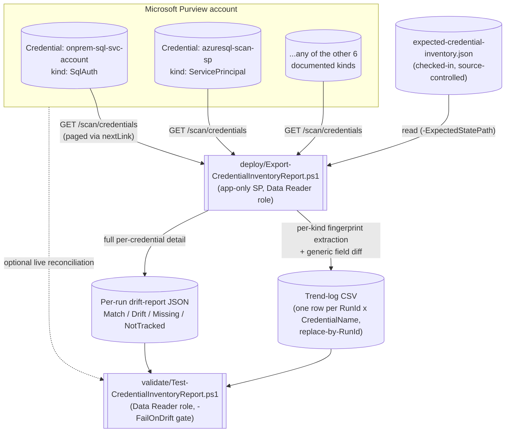

## The short version

Scripts an estate-wide, historical inventory of every Microsoft Purview Data Map **scan credential**
(`GET /scan/credentials`, all eight documented `CredentialType` kinds) and diffs each one against a
checked-in expected-state file, flagging any credential whose secret reference or identity fields no
longer match what was deployed. This closes the one open detective-control gap
*Key Vault-Backed Scan Credential (SQL Auth / Service Principal)* (the known limitations) names and does not resolve: a
Purview credential is a create-or-replace object with **no documented audit-event category**, so a
silent re-point (same name, different Key Vault secret or identity, under whichever role can write
credentials) leaves no native trail.

## Why this matters

*Key Vault-Backed Scan Credential (SQL Auth / Service Principal)* (why this matters) already makes the case for scripting credential
*creation* against SOC 2 CC6.1/CC6.3 and ISO 27001 A.5.15/A.8.2 privileged-access expectations. This
scenario completes that control's other half - **detection**, not just prevention:

- **A preventive control without a matching detective control is an incomplete control.**
  Least-privilege at creation time (Data Source Administrator, never the secret itself) does not
  stop a Data Source Administrator - or anyone who compromises that identity - from later rewriting
  an existing credential to point somewhere else. Without an inventory that is diffed on a schedule,
  that re-point is invisible until something downstream breaks, or worse, until it doesn't (because
  the credential now happily authenticates as something the attacker controls).
- **Change-management evidence for an auditor.** "Show me that your scan-authentication
  configuration hasn't drifted from what was approved" is exactly the kind of evidence a SOC 2 or
  ISO 27001 auditor evaluating change-management controls over privileged automation configuration
  will ask for. A trend log with a `Match`/`Drift`/`Missing`/`NotTracked` status per credential, per
  run, is that evidence in a form that doesn't require re-explaining Purview's object model each
  time.
- **This is a compensating control for a documented absence, not a nice-to-have.**
  *Key Vault-Backed Scan Credential (SQL Auth / Service Principal)* (the known limitations) states plainly that Microsoft's own enumerated
  Purview audit-event category table does not list credentials or Key Vault connections at all. This
  scenario is one of the three compensating controls that same section names - the one that turns a
  scheduled review from "hope someone notices" into "a script tells you."

## How the control works

The report script never modifies, creates, or deletes any credential - every call it makes is a
read-only `GET`, and no field it extracts or writes is ever a secret value (only identity properties
and Key Vault secret **references**). Full design rationale: the design notes.

## What it takes

### Prerequisites

Full licensing detail and citations: [Licensing matrix](/docs/licensing-matrix/). Summary for this scenario:

| Requirement | Minimum | Notes |
|---|---|---|
| Microsoft Purview account + Data Map | Active Azure subscription; Data Map is PAYG-billed Azure consumption | [Licensing matrix, sections 1 and 2](/docs/licensing-matrix/#1-the-two-billing-models-read-this-first). This scenario is read-only and adds no metered consumption beyond the `Credential - List` calls themselves - see the cost and licensing notes |
| At least one credential already created | e.g. via *Key Vault-Backed Scan Credential (SQL Auth / Service Principal)* | This scenario does not create any credential - see the configuration reference/the design notes |
| Run this scenario's report script | **Data Reader** role on the collection(s) whose credentials should be visible | **VERIFY, by analogy - same open question *Key Vault-Backed Scan Credential (SQL Auth / Service Principal)* (the prerequisites) already carries**: Microsoft's role reference never names *credentials* in any Data Map collection role's description. Credential is a Scanning-plane object alongside data sources and scans (which Data Reader *is* documented to read), so this scenario assumes the same role as its sibling's own read path. Confirm on a pilot tenant before designing least-privilege around it |
| Grant the automation identity a Purview role at all | **Collection Admin** at root (or the relevant sub-collection) | Only a Collection Admin can assign Data Map data-plane roles - [RBAC model, section 5](/docs/rbac-model/#5-data-governance-roles-data-map--unified-catalog---a-separate-model) |
| Automation identity for the REST calls | App registration with the Data Reader role above; client-secret app-only OAuth2 | [Automation surface, section 3](/docs/automation-surface/#3-authentication-patterns---interactive-vs-unattended) and surface 4 |
| Somewhere to persist the trend-log CSV and drift-report JSON between runs | A repo path, mounted file share, or blob storage | Not provisioned by this scenario - see the configuration reference and the rollback plan. **Treat this storage as sensitive** - see section 11 |
| A checked-in expected-state file (optional but strongly recommended) | `deploy/policy/expected-credential-inventory.json` is a worked starting point | Without it, this scenario still produces a full inventory - it just cannot flag drift, only enumerate what exists (`Status = NotTracked` for everything) |
| Review governance on changes to that file | An approver **distinct from** whoever can deploy *Key Vault-Backed Scan Credential (SQL Auth / Service Principal)*'s scripts (e.g. a `CODEOWNERS` entry or branch protection rule) | Not a Purview or Azure control - a source-control policy. See the known limitations's Red Team finding: without this separation, the same actor who re-points a credential could also silently update the "expected" record to match |

> Verify current entitlement names against [Licensing matrix](/docs/licensing-matrix/) (dated 2026-09-02) before a
> sales commitment - SKU names and billing meters change.

### Cost and licensing

- **This scenario adds no metered consumption beyond the `Credential - List` calls themselves.**
  Purview Data Map's PAYG billing is driven by scanning (vCore-hours) and Data Map capacity units,
  neither of which a read-only credential-listing call touches - see [Licensing matrix, sections 1 and 2](/docs/licensing-matrix/#1-the-two-billing-models-read-this-first).
- **No new per-user M365 licensing.** Same PAYG/Azure-consumption model as
  *Key Vault-Backed Scan Credential (SQL Auth / Service Principal)*.
- **Negligible call volume.** Even a large estate's credential count (tens to low hundreds) is
  trivial next to the `Discovery - Query` call volumes *Exportable, Historical Classification Coverage Report* already
  documents as immaterial at that scenario's own scale.
- **The real cost is process, not Azure spend:** keeping the expected-state file current as
  credentials are legitimately added or rotated. An expected-state file that isn't maintained
  produces `NotTracked` noise that erodes trust in the control - see operations and tuning.

## Proof it works

1. **Automated file-integrity check** - `./validate/Test-CredentialInventoryReport.ps1` confirms the
   trend log's schema, that no `(RunId, Name)` row is duplicated (proof the replace-by-RunId
   idempotency design is holding), and that every row's `Status`/`MismatchCount` pair is internally
   consistent. Runs without any tenant credentials.
2. **Drift gate** - with `-FailOnDrift` and `-DriftReportDirectory` supplied, fails non-zero if the
   most recent run recorded any `Drift` or `Missing` credential, and prints the exact field(s) that
   didn't match. This is the check a scheduled pipeline should gate alerting or deployment approval
   on.
3. **Live reconciliation (optional)** - supplying tenant credentials adds a check that the most
   recent run's reported credential count still matches the *current* live count, flagging any
   credential added since the last export as a `[WARN]` (informational - a legitimately new
   credential, not evidence of drift on its own).
4. **Idempotency proof** - re-run `deploy/Export-CredentialInventoryReport.ps1` a second time with
   the same `-RunId` and confirm the trend log still has exactly one row per `(RunId, Name)` - never
   two.
5. **Manual spot-check of the drift detector itself** - in a pilot tenant, deliberately re-run
   `scan-credential-key-vault-backed/deploy/New-PurviewScanCredential.ps1` with a different
   `-SecretName` against an existing credential (simulating the exact re-point Red Team finding this
   scenario exists to detect), then re-run this scenario's deploy script and confirm the credential
   now reports `Status = Drift` with `Password.SecretName` (or the equivalent field for the kind
   used) as the flagged mismatch.

## Where it stops

- **The expected-state file and drift-report output are themselves sensitive artifacts.** While no
  field this scenario extracts is ever a secret *value*, a drift-report JSON does reveal which Key
  Vault, which secret *names*, and which service-principal/user identities back each scan credential
  - reconnaissance value for an attacker planning where to target next. Store `-ExpectedStatePath`,
  `-TrendLogPath`, and `-DriftReportDirectory` output in access-controlled storage, the same
  discipline *Exportable, Historical Classification Coverage Report* (the known limitations) states for its own report artifacts.
- **VERIFY (pilot tenant): the Data Reader role assumption for reading credentials**, carried
  unchanged from *Key Vault-Backed Scan Credential (SQL Auth / Service Principal)* (the prerequisites) - Microsoft's Data Map collection
  role reference never names *credentials* specifically in any role's description.
- **VERIFY: `nextLink` pagination is followed as a directly-callable URL, not confirmed against a
  populated worked example for this endpoint.** Microsoft's Credential - List reference's own worked
  example returns exactly 2 credentials with `nextLink: null` - there is no multi-page worked example
  to confirm the field's exact contract (relative vs. fully-qualified URL) for *this specific*
  endpoint, though this is the standard Azure REST list-pagination convention followed elsewhere in
  this library. If a tenant with enough credentials to trigger a second page behaves differently, this
  is the first thing to check.
- **This scenario cannot detect a re-point to a *different secret version of the same secret name*
  when no version was pinned at creation time.** If *Key Vault-Backed Scan Credential (SQL Auth / Service Principal)* was deployed
  without `-SecretVersion` (its own recommended default - operations and tuning), the credential's
  `Password.SecretVersion` fingerprint field is always `(latest - unpinned)`, both before and after a
  vault-side rotation - which is by design (that is what "unpinned" means), but it also means an
  attacker who can write a new Key Vault secret *version* under the same name, without ever touching
  the Purview credential object at all, produces **zero drift** in this report. This is not a gap in
  this scenario's extraction - the Purview credential object genuinely doesn't change - but a reader
  relying on this report as the *only* detective control needs to know it does not cover that
  specific attack path. Key Vault's own `AuditEvent` diagnostic logging (already named as a
  compensating control in *Key Vault-Backed Scan Credential (SQL Auth / Service Principal)* (the known limitations)) is what covers it.
- **`ConsumerKeyAuth`'s `consumerKey` field, and `AmazonARN`'s `roleARN` field, are extracted and
  reported in plaintext in this scenario's drift-report JSON.** Per Microsoft's own schema, these are
  typed as plain strings, not `KeyVaultSecret` references - they are not secret *values* by
  Microsoft's own object model (a role ARN is an AWS resource identifier, not a credential; a
  "consumer key" in this API's own naming is paired with a separate `consumerSecret` reference that
  *is* the sensitive half), but treat this scenario's output as sensitive regardless, per the first
  bullet above.
- **This is a detective control, not a preventive one.** It cannot stop a re-point from happening - it
  can only report one that already did, on whatever cadence it's scheduled. See operations and tuning's runbook for what
  to do when it fires.
- **Red Team finding, resolved: default `-FailOnDrift` alone does not catch a wholly new,
  unauthorized credential.** A credential that is entirely new - not a re-point of one already in the
  expected-state file - is reported as `Status = NotTracked`, and `validate/`'s default behavior
  treats `NotTracked` as informational, not a failure, because legitimate onboarding
  routinely creates credentials faster than a human updates the expected-state file. That default is
  correct for most tenants, but it means an attacker who creates a **brand-new** rogue credential
  (rather than re-pointing an existing tracked one) passes `-FailOnDrift`'s gate silently. **Resolved
  by** the `-FailOnUntracked` switch - set it in any environment where credential creation is
  rare and tightly controlled enough that every new credential should require a reviewed,
  deliberate addition to the expected-state file before being accepted as legitimate.
- **Red Team finding, mitigated by process, not by code: the expected-state file itself is only as
  trustworthy as the review process around changes to it.** If the same actor (human or pipeline)
  who can re-point a live credential can also edit the checked-in expected-state file without
  independent review, a malicious re-point plus a matching expected-state edit in the same commit
  defeats this entire control - the drift report would show `Match` because the "expected" state was
  updated to agree with the tampering. This scenario cannot detect that from inside Purview or from
  the file alone; the mitigation is organizational: require a **separate approver** (e.g. a
  `CODEOWNERS` entry, or branch protection) on changes to the expected-state file path, distinct from
  whoever can deploy *Key Vault-Backed Scan Credential (SQL Auth / Service Principal)*'s scripts, so no single identity can both make
  the change and approve the record of what's expected. The file's own **git history** is then the
  actual audit trail Purview itself doesn't provide - see operations and tuning step 2's runbook guidance to update it
  only via "a deliberate, reviewed commit."