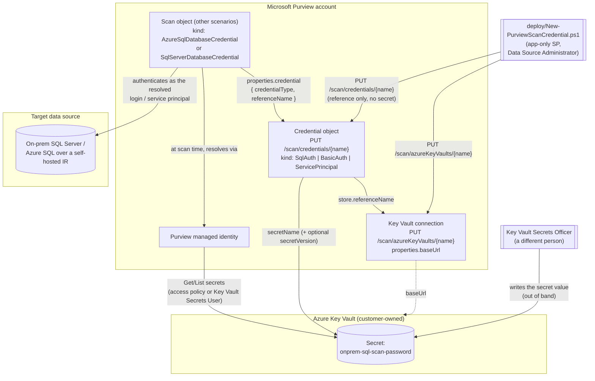

## The short version

Creates the two Microsoft Purview objects that let a Data Map scan authenticate to a data source
with a **stored credential** instead of the Purview account's own managed identity: an **Azure Key
Vault connection** (`PUT /scan/azureKeyVaults/{name}`) and a **credential object**
(`PUT /scan/credentials/{name}`) of kind `SqlAuth`, `BasicAuth`, or `ServicePrincipal`. The
credential stores only a *reference* to a Key Vault secret - vault connection, secret name,
optional secret version - never the secret itself.

This is the missing upstream prerequisite for every credential-authenticated scan in this library.
*Scan On-Premises SQL Server and Classify Sensitive Columns* requires a
`-CredentialReferenceName` that must "already exist," and
*Scan Azure SQL Database and Classify Sensitive Columns* documents the credential path as portal-only.
Both were built when no REST endpoint for credential creation had been located. One is documented,
at `api-version=2023-09-01` - this scenario closes that gap
and corrects those two scenarios' notes in place.

## Why this matters

The driver here is **completing an automated control, not adding a new one**. The regulatory case
for Data Map scanning itself (GDPR Art. 30 records of processing, PCI DSS cardholder-data
discovery, HIPAA §164.308 risk analysis) is made in
*Scan Azure SQL Database and Classify Sensitive Columns* (why this matters). This fragment removes the one manual,
un-auditable step that kept that control from being fully reproducible:

- **Reproducibility / infrastructure-as-code.** A portal-clicked credential is undocumented state.
  If a Purview account is rebuilt in DR, or a second collection is onboarded, or an auditor asks
  "how is scan authentication configured," a hand-created credential has no artifact to point at.
  This scenario makes that object a scripted, diffable, re-runnable deployment.
- **Separation of duties as an enforceable boundary, not a convention.** Because a Purview
  credential holds only a reference, the person who *configures scanning* (Data Source
  Administrator on a Purview collection) and the person who *holds the secret* (Key Vault Secrets
  Officer) can be genuinely different people - and the deploy script in this scenario provably
  never touches secret material. That is a control a portal workflow cannot demonstrate as
  cleanly, and it maps directly to SOC 2 CC6.1/CC6.3 and ISO 27001 A.5.15/A.8.2 least-privilege
  and privileged-access expectations.
- **Credential rotation becomes a routine operation.** Rotating a scan password in Key Vault is a
  vault-side action; if no version is pinned, no Purview change is needed at all. Where a version
  *is* pinned, re-running one idempotent script updates it. See operations and tuning.

## How the control works



The deploy script's path (solid arrows from `Deployer`) carries **no secret material at all** - it
writes two small metadata objects. The secret travels exactly one path, at scan time, between
Azure Key Vault and Purview's own managed identity. Full rationale: the design notes.

## What it takes

### Prerequisites

Full licensing detail and citations: [Licensing matrix](/docs/licensing-matrix/). Summary for this scenario:

| Requirement | Minimum | Notes |
|---|---|---|
| Microsoft Purview account + Data Map | Active **Azure subscription**; Data Map is **PAYG-billed Azure consumption**, not a per-user M365 entitlement | [Licensing matrix, sections 1 and 2](/docs/licensing-matrix/#1-the-two-billing-models-read-this-first). This scenario creates configuration objects only and adds **no** metered consumption by itself - see section 10 |
| Create/replace credential and Key Vault connection objects | **Data Source Administrator** on the target collection (or a parent, by inheritance) | [RBAC model, section 5](/docs/rbac-model/#5-data-governance-roles-data-map--unified-catalog---a-separate-model). **VERIFY:** Microsoft defines this role as managing "data sources and scans" and never names *credentials* in any role description - Data Source Administrator is this library's by-analogy assumption (credentials are Scanning-plane objects alongside data sources and scans), not a documented requirement. Confirm on a pilot tenant before designing least-privilege around it; if it proves insufficient, Collection Admin is the fallback |
| Assign that role to the automation service principal | **Collection Admin** at the root collection | Only a Collection Admin can grant Data Map data-plane roles - [RBAC model, section 5](/docs/rbac-model/#5-data-governance-roles-data-map--unified-catalog---a-separate-model), |
| Read back the objects (the `validate/` script) | **Data Reader** on the target collection | Least-privilege for the read-only path |
| An **Azure Key Vault**, and the secret inside it | Vault exists; the password / service-principal key is already stored as a secret | Azure-side prerequisite. This scenario never creates a vault or writes a secret - the implementation steps step 1,. **Use a Key Vault dedicated to Purview scan credentials** - see the next row for why |
| Purview's access to that vault | The Purview account's managed identity needs **Get** + **List** on **secrets** (access-policy model), **or** the **Key Vault Secrets User** role (Azure RBAC permission model) | Grant exactly one, matching the vault's permission model. This is the single most common cause of a credential that validates structurally but fails at scan time -. **Note the blast radius:** both grants are **vault-wide over secrets** - neither can be scoped to individual secrets, so the Purview managed identity gains read access to *every* secret in that vault. Point Purview at a dedicated scan-credential vault rather than a shared application vault |
| Azure IAM to *make* that grant | Key Vault **access policy** edit rights, or **User Access Administrator**/**Owner** on the vault for the RBAC path | A different privilege from any Purview role - see the implementation steps |
| (ServicePrincipal kind only) the scan's service principal | App registration with a client secret in the vault, plus source-side access (e.g. `db_datareader`) | A **different** principal from the one calling the Purview API - see the design notes, |
| Automation identity for the REST calls | App registration with the Purview roles above; client-secret app-only OAuth2 | [Automation surface, section 3](/docs/automation-surface/#3-authentication-patterns---interactive-vs-unattended) and surface 4 |

> Verify current entitlement names and the PAYG meter against [Licensing matrix](/docs/licensing-matrix/) (dated
> 2026-09-02) before a sales commitment - SKU names and billing meters change.

### Cost and licensing

- **This scenario adds no metered consumption.** It creates two small configuration objects.
  Purview Data Map's PAYG billing is driven by scanning (vCore-hours) and Data Map capacity units,
  neither of which a credential object touches - see [Licensing matrix, sections 1 and 2](/docs/licensing-matrix/#1-the-two-billing-models-read-this-first).
- **Azure Key Vault** costs apply: secret **operations** are billed per 10,000 transactions, and a
  scan resolves the secret on each run. At realistic scan frequencies this is immaterial
  (well under a cent per month), but the vault itself must exist and be in scope for whoever owns
  the Azure bill. This scenario assumes an existing vault - the same one this library's DLP/labeling
  scenarios already assume.
- **No new per-user M365 licensing.** Nothing here consumes an E5/E5 Compliance entitlement.
- **Hidden cost worth naming in a business case:** the *organizational* cost of the separation of
  duties this design enables. Two roles (Purview Data Source Administrator, Key Vault Secrets
  Officer) must coordinate for onboarding and rotation. That is the control working as intended,
  but it is a process change, not a free one - see the review notes (CISO lens).

## Proof it works

`validate/Test-PurviewScanCredential.ps1` is read-only and idempotent, prints a
`[PASS]`/`[WARN]`/`[FAIL]` line per check, and exits non-zero on any `FAIL` so it can gate a
pipeline:

1. Key Vault connection exists and exposes a `baseUrl`.
2. Credential object exists.
3. Credential `kind` matches `-ExpectedCredentialType`.
4. Secret reference points at the expected connection (`store.referenceName`) and secret
   (`secretName`); reports whether a version is pinned.
5. The two discriminator literals (`type`, `store.type`) match this scenario's defaults -
   **`[WARN]`, never `[FAIL]`**, because they are the open VERIFY in section 11. The script prints the
   *observed* values, which is exactly the evidence needed to close that VERIFY from a
   portal-created credential.
6. Kind-specific completeness (`user`, or `servicePrincipalId` + `tenant`).
7. `-CheckKeyVaultSecret`: the referenced secret exists and is enabled in the vault, with a warning
   if it expires within 30 days. Metadata only - `Get-AzKeyVaultSecret` is called **without**
   `-AsPlainText`, so the value is never retrieved.

**What no script in this scenario can prove, stated plainly:** Purview exposes no "test
credential" API. Check 7 proves the secret exists *from your identity's perspective*; it does not
prove the **Purview managed identity** can read it, and nothing here proves the stored password is
still valid at the data source. The only end-to-end proof is a scan run reaching `Succeeded` -
use the sibling scenarios' own validate scripts (for example
*Scan On-Premises SQL Server and Classify Sensitive Columns*) after wiring the
credential into a scan. In the portal, the equivalent is **Test connection** on the scan.

Manual spot-check:

```powershell
# Expect the credential's kind and a populated typeProperties block.
Invoke-RestMethod -Method Get -Headers @{ Authorization = "Bearer $token" } `
  -Uri "https://contoso-purview.purview.azure.com/scan/credentials/onprem-sql-svc-account?api-version=2023-09-01"
```

## Where it stops

- **VERIFY (pilot tenant): the two `KeyVaultSecret` discriminator literals.** Microsoft's Purview
  Credential reference defines `KeyVaultSecret` as
  `{ secretName, secretVersion, store: { referenceName, type }, type }` but types **both** `type`
  fields as an open `string` with no enumerated values, and its **only** worked request example is
  a `BasicAuth` credential carrying `description` alone - no `typeProperties`, so **no populated
  secret reference appears anywhere in the Purview documentation set**. The
  `@azure-rest/purview-scanning` SDK types them as plain `string` too, and `Az.Purview` ships no
  credential-object cmdlet at all (only *scan* objects), so no Purview-specific source pins the
  literals. This scenario's defaults - `AzureKeyVaultSecret` and `LinkedServiceReference` - come
  from two converging **indirect** sources: (a) Azure Data Factory/Synapse model an
  identically-shaped `AzureKeyVaultSecretReference` with `type` as a **required**
  `'AzureKeyVaultSecret'` literal and `store` as a `LinkedServiceReference`; and (b) Purview's **own** Key Vault Connections worked *response* returns an
  `id` ending in `/linkedservices/AzureKeyVault1` - Purview does model a Key Vault connection as a
  linked service internally, which makes that store discriminator coherent.
  That is strong structural corroboration, **not** a Purview worked example. Both are therefore
  **parameters, not constants** (`-SecretReferenceType`, `-SecretStoreReferenceType`), and
  `validate/` reports a mismatch as `[WARN]` while printing the observed values. *To close this:*
  create one credential in the portal, `GET /scan/credentials/{name}`, and record what the two
  fields actually contain.
- **VERIFY (pilot tenant): omitted `secretVersion` semantics.** Microsoft's Purview reference
  documents the property but never states what omitting it does. Data Factory's equivalent is
  documented as defaulting to the latest version, and Purview's own
  troubleshooting guidance tells you to "use the right secret name **and version**"
  without saying whether the version is optional. operations and tuning's rotation guidance
  assumes latest-on-omit; confirm before relying on rotation being a Purview-free operation.
- **VERIFY (carried, not introduced here): `BasicAuth` ↔ "Windows Authentication".** Microsoft
  documents Windows authentication as a supported method for on-premises SQL Server and lists
  `BasicAuth` in the `CredentialType` enum, but never states that they are the same thing.
  `BasicAuth` remains this library's best-effort mapping, inherited from
  *Scan On-Premises SQL Server and Classify Sensitive Columns*, not a confirmed equivalence.
- **No "test credential" API.** Purview offers no endpoint equivalent to the portal's **Test
  connection**. A structurally perfect credential can still fail at scan time - see the validation steps.
- **No reverse lookup from credential to scans.** The Scanning API documents no way to ask "which
  scans reference credential X." `Remove-PurviewScanCredential.ps1` therefore checks only whether
  *other credentials* share the Key Vault connection; it cannot warn that a live scan still points
  at the credential being deleted. Enumerate scans per data source first.
- **The deploy script cannot verify Purview's own vault access.** Granting the Purview managed
  identity **Get** + **List** on secrets (or **Key Vault Secrets User**) is an Azure-side action
  outside the Purview API. `-CheckKeyVaultSecret` proves the secret exists from *your* identity's
  perspective only.
- **A credential can be silently re-pointed, and Purview does not appear to record it.**
  Create-or-replace means an operator (or an attacker) holding Data Source Administrator can
  rewrite an existing credential to reference a *different* Key Vault secret - or a different
  service principal - under the **same name**. No new object appears, every scan that references
  it keeps running, and the scans now authenticate as something else. **Microsoft's own enumerated
  audit-event category table does not list credentials at all** - it covers Collections, Role
  assignments, Scan rule sets, Classification rules, Scans, and Data sources, and nothing else
  - and the `Security` diagnostic-log category's own description is scoped to
  "role assignments to a collection or creation or deletion of a collection". Neither `ScanStatusLogEvent` nor `DataSensitivityLogEvent`, the other two
  categories, is about configuration changes. So there is no documented detective control for this
  on the Purview side. Two honest caveats: that category table sits on a page written for the
  *classic* governance portal, and it says more categories "will be added" - so this is a
  documented **absence**, not a documented **impossibility**. **VERIFY (pilot tenant):** whether
  `PurviewSecurityLogs` in practice emits an event for a credential create/replace/delete despite
  not being documented to. Until that is settled, the compensating controls are (a) run
  `validate/` on a schedule with **all** `-Expected*` parameters supplied from a checked-in
  parameter file - a re-point then surfaces as a `[FAIL]`, now built as a scheduled,
  estate-wide control rather than a single-credential manual invocation:
  *Scan Credential Inventory & Drift Report*; (b) enable Key Vault **`AuditEvent`**
  diagnostic logging, which does record which identity read which secret, so a re-point at a
  secret *outside* the expected set is visible from the vault side; and (c) treat Data Source
  Administrator as a privileged role in your access reviews.
- **Vault-wide secret access is the real blast radius.** Neither Key Vault grant Purview supports
  (access-policy Get/List on secrets, or **Key Vault Secrets User**) can be scoped to individual
  secrets, so the Purview managed identity can read **every** secret in whichever vault you
  connect. Use a Key Vault dedicated to scan credentials - the prerequisites and the implementation steps step 2.
- **Create-or-replace means replace.** A re-run with a missing optional parameter rewrites the
  object without it - e.g. re-running without `-SecretVersion` **unpins** a previously pinned
  version. This is the documented API contract, and the same behavior the
  sibling scan scenarios rely on, but it makes a parameter file (not ad-hoc command lines) the
  right way to operate this script.
- **RESOLVED - the other five credential kinds are now scripted.** This fragment was originally
  scoped to the three kinds the SQL-family scans in this library consume, leaving `AccountKey`,
  `AmazonARN`, `ConsumerKeyAuth`, `DelegatedAuth`, and `ManagedIdentity` (user-assigned) out of
  scope. *Scan Credentials: Remaining Kinds (Account Key, Role ARN, Consumer Key, Delegated Auth, User-Assigned Managed Identity)* now creates all
  five, closing this gap - see that scenario for the (structurally different, not a parameter
  tweak) request bodies each one uses.
- **Purview's own definition name is misspelled.** `KeyVaultSecretServicePrinipalCredentialTypeProperties`
  (missing the second `c`) is Microsoft's spelling of the definition; the wire
  property names (`servicePrincipalId`, `servicePrincipalKey`) are correct. Noted so a reader
  diffing against the reference doesn't assume a typo in this library.
- **Prefer managed identity when you can.** Microsoft's own guidance is to use a managed identity
  "whenever possible" because it removes credential storage and rotation entirely, and its data-governance security best-practices guidance gives an explicit
  priority order: **(1) Purview managed identity → (2) user-assigned managed identity → (3) service
  principal → (4) account key / SQL authentication**. This scenario serves
  tiers 3 and 4, which are the *last* two choices by Microsoft's own ranking - it exists for the
  cases where the higher tiers are genuinely unavailable, and is not a recommendation to move off
  SAMI. *Scan Azure SQL Database and Classify Sensitive Columns* remains the default path for Azure SQL.
  Where you must use a stored credential, note that the same guidance ranks **service principal
  above SQL authentication**, so prefer `-CredentialType ServicePrincipal` over `SqlAuth` when the
  source supports Entra authentication at all.