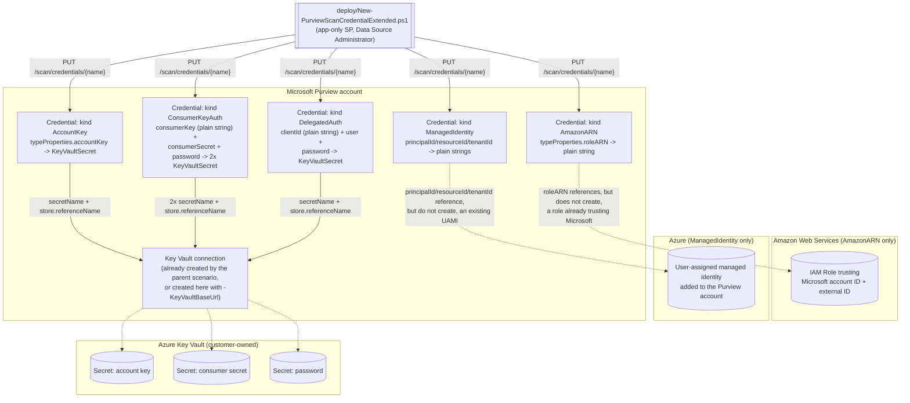

## The short version

Extends *Key Vault-Backed Scan Credential (SQL Auth / Service Principal)* to the **five** Microsoft Purview
Scanning-data-plane `CredentialType` kinds that scenario deliberately left out -
`AccountKey`, `AmazonARN`, `ConsumerKeyAuth`, `DelegatedAuth`, and `ManagedIdentity`
(user-assigned) - completing coverage of all **eight** documented kinds. Each is a genuinely different request-body shape, not a parameter tweak: three
carry no `KeyVaultSecret` reference at all, and `ConsumerKeyAuth` carries **two** independent ones.

## Why this matters

Identical to the parent scenario's why this matters - reproducibility, separation of duties, and routine
rotation for a **credential-authenticated** scan. This fragment exists so that driver isn't limited
to the three kinds the SQL-family scenarios in this library happen to consume. Two of the five kinds
here matter enough to call out specifically:

- **`ManagedIdentity` (user-assigned) is not a fallback tier - it's a *preferred* one.**
  Microsoft's own credential priority order is **(1) Purview system-assigned managed identity →
  (2) user-assigned managed identity → (3) service principal → (4) account key/SQL
  authentication/other**. The parent scenario's `ServicePrincipal`/`SqlAuth`/
  `BasicAuth` kinds serve tiers 3-4 - "the cases where the higher tiers are genuinely unavailable,"
  by its own page the known limitations. `ManagedIdentity` fills the gap directly below system-assigned identity:
  wherever a source supports it, it is Microsoft's **second-choice** authentication method, not a
  last resort - see section 11 for the licensing/preview caveat that tempers this.
- **`AccountKey`, `AmazonARN`, and `ConsumerKeyAuth` are the only paths for whole source
  categories.** Amazon S3 and Salesforce have **no** managed-identity or service-principal option
  in Microsoft's own documentation - `AmazonARN`/`ConsumerKeyAuth` are those sources' *only*
  Purview-native authentication method. Without this
  fragment, onboarding either source through this library meant a portal-only credential step with
  no scripted, diffable artifact - the same gap the parent scenario closed for SQL-family sources.

## How the control works

Three of the five arrows into `KVConn` carry a secret reference exactly like the parent scenario's
two arrows do - same trust boundary, same script that never touches secret material. The two
arrows into `Role` and `UAMI` are dotted because those objects are **not** created, or even
provisioned access for, by this fragment; the credential merely names them. Full rationale:
the design notes.

## What it takes

### Prerequisites

Full licensing detail: [Licensing matrix](/docs/licensing-matrix/). RBAC: [RBAC model, section 5](/docs/rbac-model/#5-data-governance-roles-data-map--unified-catalog---a-separate-model). This scenario's
prerequisites are **identical** to the parent scenario's prerequisites - same collection roles, same Key
Vault access model, same automation identity - with two kind-specific additions:

| Requirement | Minimum | Notes |
|---|---|---|
| Everything in *Key Vault-Backed Scan Credential (SQL Auth / Service Principal)* (the prerequisites) | - | Data Source Administrator to create, Data Reader to validate, Purview MSI Get+List (or Key Vault Secrets User) on the vault, a dedicated scan-credential Key Vault. Unchanged by this fragment |
| (`AmazonARN` only) An AWS IAM role trusting Microsoft's account | Role created in the AWS console, trusting the **Microsoft account ID** and **external ID** Purview's portal displays when you start creating a Role ARN credential | These two values are **not** properties of the credential object - Microsoft's own worked walkthrough shows them appearing only in the **portal's** "New credential" pane, and this build found no REST endpoint that returns them. **VERIFY (pilot tenant):** confirm no such endpoint exists before assuming a fully portal-free Role ARN onboarding is possible - see the known limitations |
| (`ManagedIdentity` only) A user-assigned managed identity already added to the Purview account | Created via the Purview account's **Managed identities** blade in the Azure portal (a separate Azure-side step, not a Scanning-API call) |. This fragment's script references that UAMI's `principalId`/`resourceId`/`tenantId` by value - it does not create the UAMI itself, the same "credential is downstream of an out-of-band identity" pattern the parent scenario established for the Key Vault and its secret |
| (`ManagedIdentity` only) Feature stage | **Preview** | Microsoft's own documentation labels "User-assigned managed identity" as "(preview)" as of this writing - see the known limitations before committing to it in a production design |

> Verify current entitlement names against [Licensing matrix](/docs/licensing-matrix/) (dated 2026-09-02) before a
> sales commitment.

### Cost and licensing

Identical to the parent scenario's the cost and licensing notes - no new metered Purview consumption, Key Vault
per-transaction costs apply only to the three secret-bearing kinds here, no new per-user M365
licensing. Two additions:

- **The `ManagedIdentity` kind's preview status means Microsoft's standard preview terms** (no
  SLA, subject to change) apply to that kind specifically - an organization building a business case around
  it should treat it as pre-GA, not as a bounded, stable cost line the way the parent scenario's
  three GA kinds can be treated.
- **`AmazonARN` and `ManagedIdentity` each pull in a coordination cost the parent scenario's three
  kinds never did**, worth naming for the same reason the parent scenario named the Key Vault
  Secrets Officer coordination cost (its own the cost and licensing notes/the design notes): `AmazonARN` requires an **AWS IAM
  role**, which in most enterprises is owned by a cloud infrastructure or AWS platform team entirely
  outside the Purview governance team's normal Azure-only scope - a genuinely cross-cloud dependency,
  not just a cross-team one. `ManagedIdentity` requires an Azure identity administrator to create and
  assign the user-assigned managed identity via the Purview account's own **Managed identities**
  blade - an Azure-portal action outside the Scanning REST API this scenario otherwise stays within.
  Neither is expensive, but both are process dependencies a CISO's rollout timeline should account
  for explicitly rather than discover during onboarding.

## Proof it works

`validate/Test-PurviewScanCredentialExtended.ps1` mirrors the parent scenario's validate script -
read-only, idempotent, `[PASS]`/`[WARN]`/`[FAIL]` per check, non-zero exit on any `FAIL` - extended
with a per-kind completeness table instead of the parent's single three-kind `switch`:

1. Credential exists; kind matches `-ExpectedCredentialType` if supplied.
2. Kind-specific field completeness (the right-hand column of the configuration reference's table, checked field by field).
3. For every `KeyVaultSecret`-shaped field the kind carries (one for `AccountKey`/`DelegatedAuth`,
   **two** for `ConsumerKeyAuth`, zero for `AmazonARN`/`ManagedIdentity`): the two discriminator
   literals are compared the same `[WARN]`-only way as the parent scenario.
4. `-CheckKeyVaultSecret`: resolves every secret the kind carries (both, for `ConsumerKeyAuth`) via
   `Get-AzKeyVaultSecret` without `-AsPlainText`. The Azure Key Vault name is derived the same
   authoritative way as the parent scenario's check 1 - a `GET` against the Key Vault connection
   object, then reading the real vault name out of its `baseUrl` - never assumed to equal the
   Purview connection name.
5. `AmazonARN`-specific: warns (never fails - this is a format sanity check, not an AWS-side call)
   if `-RoleArn`'s value doesn't match the `arn:aws:iam::\d{12}:role/.+` shape Microsoft's own worked
   example uses.
6. `ManagedIdentity`-specific: prints an `[INFO]` reminder that this is a **preview** capability
 and that nothing in this script can confirm the referenced UAMI is actually attached to the
   Purview account - only that the credential object carries those three ID strings.

**What no script here can prove**, beyond the parent scenario's own section 7 disclaimer: for `AmazonARN`,
that the AWS-side IAM role trust policy is configured correctly (that is an AWS-console fact, not a
Purview one); for `ManagedIdentity`, that the referenced UAMI is attached to the Purview account and
granted access at the target source. The only end-to-end proof for any of these five kinds remains a
scan run reaching `Succeeded`.

## Where it stops

- **`ManagedIdentity` is a Microsoft-labeled Preview capability.** Microsoft's own
  "Credentials for source authentication" reference lists "User-assigned managed identity
  (preview)" explicitly, current as of this fragment's grounding pass. The
  Scanning-data-plane REST reference documents the `ManagedIdentity` kind and its `typeProperties`
  shape without a preview annotation of its own - the preview label lives on the
  *product* page, not the API reference, so this fragment treats the capability as preview-status
  overall and flags it rather than picking whichever source is silent. **VERIFY (pilot tenant):**
  confirm current GA/preview status before a production commitment; re-check Microsoft's
  documentation periodically, since preview features can reach GA (or be retired) without a
  corresponding REST reference change.
- **The `AmazonARN` kind's external ID is confirmed scriptable after all - via a different plane
  than expected; the Microsoft account ID is not, and remains a portal-only VERIFY.** Re-grounded
  2026-09-28 (Microsoft Learn MCP): the two values are not exposed by the Scanning **data-plane**
  Credential API (`RoleARNCredential`'s `typeProperties` genuinely contains only `roleARN`, as
  already noted below), but the **external ID** is exposed as a read-only property on the Purview
  account's own **management/control-plane** resource instead - `Microsoft.Purview/accounts`'
  `properties.cloudConnectors.awsExternalId` - confirmed consistently across four independent SDK
  surfaces: the `Az.Purview` PowerShell module (`Get-AzPurviewAccount`'s
  `CloudConnectorAwsExternalId`, explicitly `ReadOnly`), the legacy `Microsoft.Azure.Management.Purview`
  .NET SDK, the current `Azure.ResourceManager.Purview` .NET SDK, and the `@azure-rest/purview-administration` JS SDK. A fully scripted flow can therefore call
  `Get-AzPurviewAccount` (or an ARM `GET` on `Microsoft.Purview/accounts/{name}`) to read the
  external ID - a genuinely different API surface than this fragment's Scanning-data-plane calls, not
  something `New-PurviewScanCredentialExtended.ps1` was extended to do in this maintenance pass. The
  **Microsoft account ID**, by contrast, has **no** sibling property anywhere in that same
  `cloudConnectors` schema (no `awsAccountId` or equivalent was found alongside `awsExternalId` in
  any of the four SDKs), nor anywhere else this re-grounding pass checked - it remains confirmed
  portal-only. **VERIFY (pilot tenant or a future Microsoft Learn pass) now narrows to just the
  Microsoft account ID half**; the external ID half is resolved.
- **`RoleARNCredential`'s own description overstates its `typeProperties`.** Microsoft's REST
  reference describes the `RoleARNCredential` **object** as "Credential type that uses Account ID,
  External ID and Role ARN for authentication," but `RoleARNCredentialTypeProperties` - the actual
  field list - contains only `roleARN`. This is consistent with the previous
  bullet (account ID/external ID are Microsoft-generated values used to configure the *AWS* side of
  the trust, not customer-supplied fields Purview stores) rather than a contradiction, but a reader
  diffing the description against the schema could reasonably expect two more fields. Noted so this
  fragment isn't mistaken for having missed them.
- **A second Microsoft documentation copy-paste artifact, noted for the same reason the parent
  scenario noted `KeyVaultSecretServicePrinipalCredentialTypeProperties`'s missing "c."**
  `KeyVaultSecretDelegatedAuthCredentialTypeProperties.clientId`'s documented description reads
  "Credential type that uses Account ID, External ID and Role ARN for authentication" - verbatim
  `RoleARNCredential`'s own description, evidently copy-pasted and not updated. The field itself is unambiguous from its name, type, and the Fabric/Power BI
  worked examples that populate it with an app registration's Client ID; only the reference table's prose description is wrong.
- **`ConsumerKeyAuth`'s `consumerKey` is stored as plain text, not a secret reference.** Confirmed
  directly from the schema - `typeProperties.consumerKey` is typed `string`, unlike `consumerSecret`
  and `password`, which are both `KeyVaultSecret`. This matches Salesforce's own
  OAuth model, where a Connected App's Consumer Key (client ID) is not treated as sensitive the way
  its Consumer Secret is - but it does mean this scenario's credential object itself carries that
  value in the clear inside Purview's metadata store, not inside Key Vault. Not a defect in this
  fragment; a property of the kind as Microsoft defined it.
- **Everything the parent scenario's own the known limitations discloses still applies, unmodified, to the
  secret-bearing kinds here**: the two `KeyVaultSecret` discriminator-literal VERIFYs, the
  undocumented `secretVersion`-omitted behavior, the absence of a "test credential" API, the absence
  of a credential-to-scan reverse lookup, the vault-wide (never per-secret) blast radius of the Key
  Vault grant, create-or-replace's silent-re-point risk with no enumerated Purview audit-event
  category for credentials, and create-or-replace's "a re-run without an optional parameter unpins
  it" behavior. Not re-derived here - see the parent scenario's known limitations for the full text and citations.
- **No consuming scan scenario exists yet in this library** for `AccountKey`'s four source types,
  `AmazonARN`, `ConsumerKeyAuth`, or `DelegatedAuth`. This fragment produces a correctly-shaped,
  validated credential object with nothing in this library to hand it to yet - see the configuration reference and the design notes for the natural future pairings.