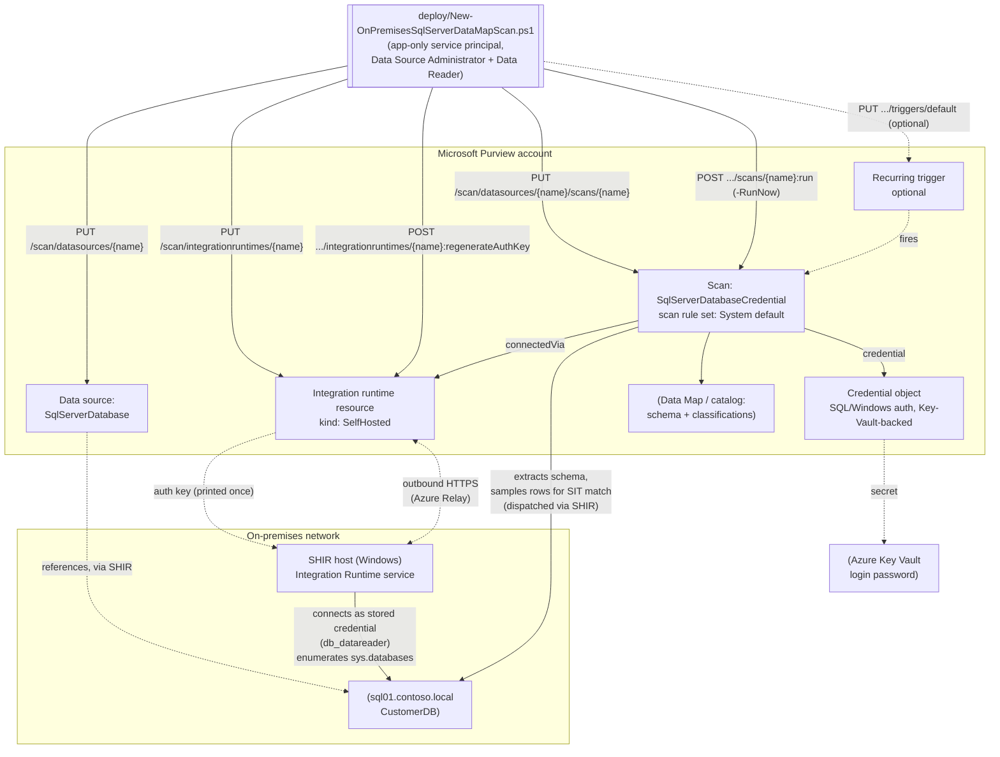

## The short version

Provisions a self-hosted integration runtime (SHIR) resource in Microsoft Purview and retrieves its
registration key, registers an on-premises SQL Server instance as a Data Map source, and configures a
credential-authenticated scan against it using Microsoft's system default scan rule set - which
includes the SSN and Credit Card Number sensitive information types (SITs) this library already uses
elsewhere - so sensitive columns are automatically classified and surfaced in the catalog. This is the
fourth Data Map scan scenario in this library and the first covering a **non-Azure** source: it follows
the same proven data-source-plus-scan pattern as *Scan Azure SQL Database and Classify Sensitive Columns*,
`scan-azure-sql-managed-instance-and-classify/`, and `scan-azure-synapse-and-classify/`, adapted for
the genuine registration, network, and authentication differences on-premises SQL Server has - see
the design notes for the full diff.

## Why this matters

Same underlying drivers as the three Azure siblings - GDPR Art. 30 records of processing, CCPA/CPRA
data inventory obligations, PCI DSS Requirement 3.2/12.5.2 cardholder data discovery, HIPAA section 164.308
risk analysis all require an accurate, current inventory of where regulated data lives. On-premises SQL Server is disproportionately likely to be where an organization's
**oldest, least-documented** regulated data lives - instances that predate a cloud migration program,
were never in scope for it, or are deliberately kept on-premises for latency, licensing, or regulatory
reasons. An automated, recurring discovery-and-classification pass over these instances closes exactly
the blind spot a cloud-only Data Map deployment would otherwise leave: the assumption that "we migrated
everything that matters" is rarely fully true, and this scenario is how an organization finds out.

## How the control works

Same two-object model as the three Azure siblings (a data source + a scan, both create-or-replace),
plus a third object type none of them needed: the **integration runtime resource** itself, which this
scenario's deploy script also provisions via REST - a genuine automation improvement over the Azure
siblings' portal-only credential/SHIR setup steps, even though the SHIR *software* installation and the
credential object still require a manual step. Full design rationale and the complete
on-premises-vs-Azure diff: the design notes.

## What it takes

### Prerequisites

Full licensing detail and citations: [Licensing matrix](/docs/licensing-matrix/). Summary for this scenario (deltas
from the Azure sibling scenarios' tables are called out explicitly):

| Requirement | Minimum | Notes |
|---|---|---|
| Microsoft Purview account + Data Map | Active **Azure subscription** with the M365 tenant, resource group for the Purview account, and (per Microsoft's own prerequisite) **the enterprise version of Microsoft Purview** or an active account using the classic governance portal | PAYG-billed Azure consumption, not a per-user M365 entitlement - see [Licensing matrix, sections 1 and 2](/docs/licensing-matrix/#1-the-two-billing-models-read-this-first) |
| Register + configure the source/scan | **Data Source Administrator** *and* **Data Reader** on the target collection | Microsoft's own prerequisite for this source type names both roles explicitly, not just Data Source Administrator alone as the Azure siblings' pages state - see [RBAC model, section 5](/docs/rbac-model/#5-data-governance-roles-data-map--unified-catalog---a-separate-model) |
| Call the Data Map REST API at all (any role) | **Collection Admin** role at root collection assigns data-plane roles to the automation service principal | Only a Collection Admin can grant Purview roles to a service principal - see [RBAC model, section 5](/docs/rbac-model/#5-data-governance-roles-data-map--unified-catalog---a-separate-model) |
| Read scan results / browse classified assets (validation) | **Data Reader** role on the target collection | Least-privilege for the read-only `validate/` script |
| **A self-hosted integration runtime (SHIR)** | A Windows host (or Kubernetes cluster, SQL-auth-only) with network reachability to both the target SQL Server and the Purview service | **Mandatory, not optional** - Microsoft's own documentation states on-premises source types are "currently supported only via self-hosted IR-based scans." This scenario's deploy script provisions the Purview-side *resource* and its auth key; installing the SHIR software and registering the node is a manual step - see the implementation steps. **The host itself is almost always owned by an infrastructure/on-prem-ops team, not the data governance/security team standing up this scenario** - budget for that as a coordination dependency, not just a technical prerequisite, the same way *Scan Azure SQL Managed Instance and Classify Sensitive Columns*'s Directory Readers grant needed IAM sign-off from a different team |
| **A stored credential (SQL or Windows Authentication)** | A SQL/Windows login with `db_datareader` on the target database(s), its password in an Azure Key Vault secret, and a Purview credential object created from it | **No managed-identity path exists for this source type at all** - every Azure sibling defaults to credential-free SAMI; this scenario cannot. Build the credential object with *Key Vault-Backed Scan Credential (SQL Auth / Service Principal)* (scripted; the "portal-only, no REST endpoint" note this row originally carried was incorrect - see the known limitations) |
| SQL Server version | SQL Server 2005 and above | **SQL Server Express LocalDB isn't supported** - confirmed directly from Microsoft's on-premises SQL Server reference page |
| Network path (SHIR host → SQL Server) | The account used to scan must have access to the `master` database (`sys.databases` lives there) | Confirmed directly from Microsoft's own documentation - see the implementation steps step 3 |
| Automation identity for the REST calls themselves | App registration with **Data Source Administrator** and **Data Reader** (and, for the validate script, at minimum **Data Reader**) Purview role on the collection | Client-secret app-only OAuth2 - see [Automation surface, section 3](/docs/automation-surface/#3-authentication-patterns---interactive-vs-unattended) and the implementation steps below |

> Verify current entitlement names and the PAYG meter against [Licensing matrix](/docs/licensing-matrix/) before a
> sales commitment - SKU names and billing meters change.

### Cost and licensing

Same PAYG/Azure-consumption billing model as every sibling scenario - see [Licensing matrix, sections 1 and 2](/docs/licensing-matrix/#1-the-two-billing-models-read-this-first) and *Scan Azure SQL Database and Classify Sensitive Columns* (the cost and licensing notes) for the full text. Two on-premises-specific
additions: (a) the SHIR host itself is a cost this scenario's licensing table doesn't cover - a
dedicated VM or on-premises server sized per Microsoft's SHIR guidance, plus its own OS/patching
overhead; (b) no Data Map scanning meter changes based on source type (Azure vs. on-premises) - the
same consumption-based billing applies regardless of where the SHIR runs.

## Proof it works

1. **Automated config check** - `./validate/Test-OnPremisesSqlServerDataMapScan.ps1` confirms the
   integration runtime, data source, and scan objects exist with the expected `kind`, server
   endpoint, `connectedVia`, and credential reference, and reports the most recent scan run's status.
   Exits non-zero on any hard failure (safe for a CI-style pre-flight).
2. **SHIR node health (manual, not automatable by this script)** - Purview portal → **Data Map** →
   **Integration runtimes** → the runtime → **Nodes** tab → confirm the node shows **Running**, not
   *Disconnected* or *Offline*. The Data Map REST API's Integration Runtimes - Get operation returns
   the resource definition, not live node health, so `validate/Test-OnPremisesSqlServerDataMapScan.ps1`
   cannot check this - a scan can pass every automated check and still fail at run time if no node has
   registered yet.
3. **Scan run status** - Purview portal → **Data Map** → **Data sources** → select the source →
   **Recent scans** → the run shows **Queued → In progress → Completed**, with assets
   discovered/classified counts. Scan run history is retained for **90 days**.
4. **Classification evidence** - browse or search the **Unified Catalog** for the scanned database
   asset; confirm the target columns carry the **U.S. Social Security Number** or **Credit Card
   Number** classification badges.
5. **Credential evidence** - confirm in the database (e.g. `SELECT name, type_desc FROM
   sys.server_principals WHERE name = '<login>'`) that the login used by the credential object exists
   and, via `sys.database_role_members`, holds `db_datareader` on the target database(s).

## Where it stops

- **~~VERIFY~~ CONFIRMED 2026-09-26 - system scan rule set name.** This scenario defaults
  `-ScanRulesetName` to `'SqlServerDatabase'`. The Microsoft Learn **System Scan Rulesets - Get**
  REST reference page (`GET .../scan/systemScanRulesets/datasources/{dataSourceType}`,
  `api-version=2023-09-01`) publishes its own worked request/response example for `dataSourceType:
  AzureStorage`, returning `{"kind": "AzureStorage", "scanRulesetType": "System", "id":
  "systemscanrulesets/AzureStorage", "name": "AzureStorage"}` - a directly-confirmed example (not an
  inference) that a system scan ruleset's `name` is always identical to its `kind`, and that its `id`
  is always `systemscanrulesets/{kind}`. `SqlServerDatabase` is a documented `kind`/`DataSourceType`
  enum value in that same schema (alongside `AzureStorage` and every other sibling type), so by the
  same mechanism the on-premises SQL Server system scan ruleset is `{"kind": "SqlServerDatabase",
  "scanRulesetType": "System", "id": "systemscanrulesets/SqlServerDatabase", "name":
  "SqlServerDatabase"}`. This scenario's default is correct as shipped.
- **VERIFY - Windows Authentication's `CredentialType` value.** Microsoft's portal documents both "SQL
  Authentication" and "Windows Authentication" as supported methods for this source type, but the REST
  `CredentialType` enum (`AccountKey` / `ServicePrincipal` / `BasicAuth` / `SqlAuth` / `AmazonARN` /
  `ConsumerKeyAuth` / `DelegatedAuth` / `ManagedIdentity`) has no value confirmed in this build to map
  specifically to Windows Authentication. This script's `-CredentialType` parameter accepts `'SqlAuth'`
  (default, and the value Microsoft's own worked example for this scan kind uses) or `'BasicAuth'`
  (this library's best-effort mapping, unconfirmed) - do not rely on `'BasicAuth'` for a Windows
  Authentication deployment without confirming against a pilot tenant first.
- **~~The credential object and~~ the SHIR software install remain portal-only. CORRECTED
  2026-09-16 - the credential half of this claim was wrong.** This build concluded that no
  documented REST endpoint existed for creating a Purview credential object. It does: **Credential**
  (`PUT /scan/credentials/{credentialName}`) and **Key Vault Connections**
  (`PUT /scan/azureKeyVaults/{azureKeyVaultName}`) are first-class documented operation groups at
  `api-version=2023-09-01`, now scripted by *Key Vault-Backed Scan Credential (SQL Auth / Service Principal)*.
  Build this scenario's `-CredentialReferenceName` there instead of clicking it in the portal. The
  Microsoft disaster-recovery statement that "there's no API to extract credentials" was
  over-read here: it is about **exporting existing secret material** (which is true, and by
  design - a credential object only ever holds a *reference*), not about creating the object.
  Installing/registering SHIR software on a host does remain inherently a physical action on that
  host, not a REST call. With the credential gap closed, the only manual step left in this scenario
  is the SHIR install itself.
- **The printed auth key is shown once and not stored anywhere by this script - treat its console
  output as sensitive.** Anyone who registers a host with a leaked key becomes a trusted SHIR node
  that receives real scan jobs (see the "Blast-radius note" in operations and tuning). Never run the initial provisioning
  call (without `-SkipIntegrationRuntimeAuthKey`) inside a CI/CD pipeline step that persists stdout to
  durable logs, a chat/ticketing integration, or any artifact store - run it interactively, copy the
  key immediately into the SHIR installer, and pass `-SkipIntegrationRuntimeAuthKey` on every
  subsequent reconciliation run. If lost, re-run without that switch to issue a new key - this
  invalidates the old one for any node still using it, so re-registration of every existing node is
  required after a rotation.
- **A single self-hosted integration runtime can serve multiple data sources and scans.** If you
  already have a SHIR registered for another purpose, point `-IntegrationRuntimeName` at it instead of
  creating a new one - `New-OnPremisesSqlServerDataMapScan.ps1`'s create-or-replace call against an
  existing runtime is a benign no-op (it only updates the `description` field).
- **Existing classifications are not retroactively removed** when a scan rule set is narrowed - same
  behavior as every sibling scenario.
- **U.S.-centric SIT starter set** - same caveat as every other scenario in this library using the SSN +
  Credit Card Number pair; not GDPR-complete for a non-U.S. tenant.
- **Kubernetes-based self-hosted data integration runtime is a different, newer capability** -
  Microsoft's own documentation describes a separate, container-based self-hosted *data* integration
  runtime (SQL Server and Oracle only, SQL-authentication-only) distinct from the classic Windows-host
  SHIR this scenario scripts. Not covered here - see the design notes.