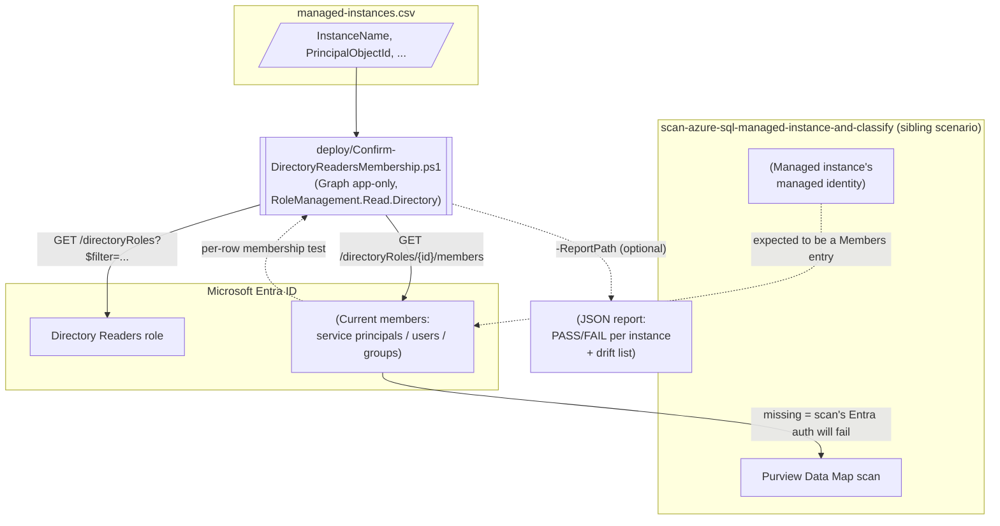

## The short version

A read-only Microsoft Graph checker that confirms every Azure SQL Managed Instance backing a
Microsoft Purview Data Map source (*Scan Azure SQL Managed Instance and Classify Sensitive Columns*)
still has its system-assigned managed identity as a current member of the Microsoft Entra ID
**Directory Readers** role - the prerequisite Managed Instance requires before Microsoft Entra
authentication works at all - and flags any *other*, unexpected member of that same tenant-wide role
as membership drift. Closes the Blue Team gap that scenario's own review notes flagged: its Purview
Data Map-scoped validate script has no reason to also hold a Graph directory-read permission.

## Why this matters

This scenario doesn't itself discover or classify data - it protects the *availability* of a
control that does. GDPR Art. 30, PCI DSS Requirement 3.2/12.5.2, and HIPAA section 164.308 (cited by the
sibling scenario's own why this matters) all depend on an accurate, *current* data inventory; a Data Map
scan that has silently stopped authenticating produces stale classification results that look
identical, in the Unified Catalog, to a scan that is still running correctly. Detecting the loss of
this one prerequisite before it causes an unnoticed classification-coverage regression is itself a
control-effectiveness/monitoring requirement most of the same frameworks expect (e.g. PCI DSS
Requirement 10's logging/monitoring intent, HIPAA's ongoing risk-analysis expectation) - this
scenario is the monitoring half of a control the sibling scenario only stands up once.

## How the control works

This scenario is intentionally decoupled from the sibling scenario's own object model - it reads
Microsoft Entra ID directly, never the Purview Data Map REST API. Full rationale:
the design notes.

## What it takes

### Prerequisites

Full licensing detail: [Licensing matrix](/docs/licensing-matrix/). This scenario has **no licensing delta** -
reading a built-in Microsoft Entra ID directory role's membership is a Microsoft Entra ID Free-tier
capability, not a P1/P2 feature ([Licensing matrix, sections 8 and 9](/docs/licensing-matrix/#8-adjacent-product-family-microsoft-entra-id-p2-conditional-access-risk-based-conditions) cover the *paid* Entra add-ons this
repo uses elsewhere; neither applies here).

| Requirement | Minimum | Notes |
|---|---|---|
| Run the checker itself (read Directory Readers membership) | Microsoft Graph application permission **`RoleManagement.Read.Directory`**, consented by a Global Administrator/Privileged Role Administrator once | Least-privileged option confirmed for both `Get-MgDirectoryRole` and `Get-MgDirectoryRoleMember` - see the references |
| Resolve a member's friendly name in the drift report (optional, best-effort) | The same app registration additionally benefits from `User.Read.All`/`Group.Read.All`/application-level service-principal read access if drift members of those types appear | Falls back to a raw object ID + `(could not resolve)` label if not granted - never fails the run |
| Populate the inventory CSV's `PrincipalObjectId` column | **Reader** (or any role that can read resource properties) on each managed instance, to run `Get-AzSqlInstance` once per instance | One-time, per-instance; not needed again unless the instance is redeployed - see the implementation steps |
| **Fix** a FAIL finding (grant Directory Readers) | **Privileged Role Administrator** | This scenario never performs the grant itself - see the design notes Non-goals and the sibling scenario's own the prerequisites, which documents the same requirement for the *initial* grant |
| Automation identity for the Graph calls | App registration with the `RoleManagement.Read.Directory` application permission, admin-consented | Client-secret or certificate app-only OAuth2 - see [Automation surface, section 3](/docs/automation-surface/#3-authentication-patterns---interactive-vs-unattended) |

> **For the approval conversation:** `RoleManagement.Read.Directory` sounds higher-privilege than it
> is because of the word "RoleManagement" - it is a **read-only** permission (Microsoft's own
> reference confirms it as the *least*-privileged of the four alternatives for both cmdlets this
> scenario uses; the broader options are `RoleManagement.ReadWrite.Directory`, `Directory.Read.All`,
> `Directory.ReadWrite.All`) and grants no ability to assign, remove, or otherwise modify any role
> membership - see the references reference 3/4. Lead an approval request with that distinction.

> Verify current role/permission names against [RBAC model](/docs/rbac-model/) and
> [Licensing matrix](/docs/licensing-matrix/) before a sales commitment.

> **Not a duplicate of Microsoft's own Purview data-source readiness checklist.** Microsoft
> publishes a separate, broader `data-map-data-sources-check-azure-readiness` script that validates
> the **Purview account's own managed identity** (Reader + `db_datareader` roles, network/firewall
> reachability, whether Microsoft Entra authentication is enabled on the SQL resource at all) -
> see the references reference 11. It does not check Directory Readers membership for the **managed
> instance's own** identity specifically, which is the one, narrower prerequisite this scenario
> exists to monitor on an ongoing (not one-time-readiness) basis. Run both - they check different
> identities for different purposes.

### Cost and licensing

No licensing delta. Reading a built-in Entra ID directory role's membership via Microsoft
Graph is available on every Entra ID tier, including Free. The only cost is the automation
identity's own hosting (e.g. a scheduled pipeline runner) - no Purview, Azure SQL, or Microsoft
Graph API call in this scenario is separately metered.

## Proof it works

1. **Automated input/output check** - `./validate/Test-DirectoryReadersMembershipInputs.ps1`
   confirms the inventory CSV's shape (required columns, no empty/duplicate/non-GUID
   `PrincipalObjectId` values) and, if a report was already produced, that it parses and matches the
   inventory it should have been run against. Exits non-zero on any hard failure; needs no tenant
   connection - live-exercised during this scenario's build against both a clean and a deliberately
   malformed CSV.
2. **Live run status** - the deploy script's own console output and exit code are the primary
   evidence; a `0` exit with `0 FAIL` findings means every inventoried instance's managed identity is
   currently a Directory Readers member.
3. **Cross-check against the portal** - Microsoft Entra admin center → **Identity** → **Roles &
   administrators** → **Directory Readers** → **Assignments** should list exactly the set this
   scenario's report shows as current members (inventory `PASS` rows + drift `WARN` entries
   combined).
4. **Negative-path evidence** - temporarily remove a test instance's identity from Directory
   Readers (in a non-production tenant) and confirm the next run reports it as `FAIL` with a
   non-zero exit code, then re-add it and confirm the next run returns to `PASS`.

## Where it stops

- **The JSON report is itself sensitive - treat it like the privileged-role reconnaissance data it
  is.** Every report lists the **current full membership** of a tenant-wide, security-sensitive
  Entra role, by object ID and (best-effort) display name - exactly the information an attacker
  attempting privilege escalation would want. Do not write `-ReportPath` to a broadly-readable
  location (a public share, an unrestricted CI artifact bucket); restrict it the same way you would
  restrict output from *Entra Privileged Role Monitoring*'s own
  privileged-role audit trail. Flagged as a Red Team finding in the review notes.
- **The inventory CSV's integrity determines the drift check's integrity.** Because drift is
  computed as "current members minus inventory rows," anyone who can edit
  `-ManagedInstanceInventoryPath` before a run can add an arbitrary object ID to it and make that
  principal's Directory Readers membership stop being reported as drift - silently defeating the one
  detection this scenario provides for an unauthorized addition to the role. Treat the inventory CSV
  as a change-controlled artifact (checked into source control with required review, not a freely
  editable local file) - same discipline as any other allowlist this library's DLP scenarios already
  apply to their own approved-device lists. Flagged as a Red Team finding in the review notes.
- **Role-not-yet-activated is indistinguishable from "definitely not a member" in this script's
  output - by design, not oversight.** `Get-MgDirectoryRole -Filter "displayName eq 'Directory
  Readers'"` only returns roles *activated* at least once in the tenant (Microsoft's own "List
  directoryRoles" reference). A brand-new tenant that has never granted Directory Readers to anyone
  reports every inventory row as `FAIL` with an explicit warning naming the cause - see the design notes - rather than a misleading "0 members, nothing wrong."
- **Does not distinguish an active grant from a PIM-eligible-but-not-activated one.**
  `Get-MgDirectoryRoleMember` returns only the role's active member set; a principal with only an
  eligible (not yet activated) Privileged Identity Management assignment correctly shows as `FAIL`
  here (Managed Instance's Entra authentication needs the active grant), but this scenario does not
  separately label that case as "eligible" versus "never granted" - see the design notes Non-goals.
- **Drift resolution is best-effort.** A drift member whose underlying object was since deleted (a
  stale directory reference) is reported with a `(could not resolve - possibly deleted)` label
  rather than a real display name - see the deploy script's `.NOTES`.
- **This scenario reports, it does not remediate.** See the design notes - consistent with this
  repo's established convention for high-privilege, one-time directory grants.
- **VERIFY (pilot tenant): `Get-MgDirectoryRoleMember`'s member-type coverage for this specific
  role.** Microsoft's reference documents the cmdlet as returning users, service principals, or
  groups generically; this scenario's own grounding pass found no worked example specific to
  Directory Readers confirming all three types can simultaneously appear as members of *this* role
  in practice (as opposed to being merely permitted by the general schema). The drift-resolution
  logic handles all three regardless, so this is a documentation/expectation gap, not a functional
  one.
- **Inherits the sibling scenario's own open VERIFY items** where relevant (e.g. the exact Case ID/
  object-ID format conventions Microsoft uses) - this scenario does not re-state them; see
  *Scan Azure SQL Managed Instance and Classify Sensitive Columns* (the known limitations).