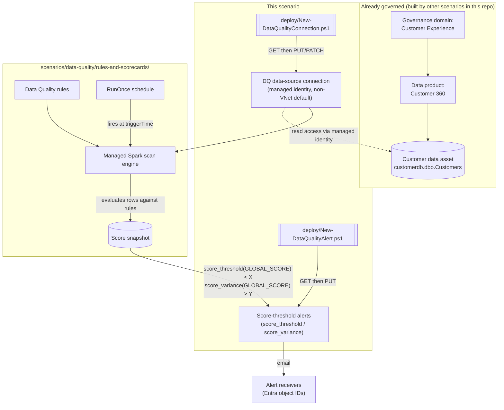

## The short version

> **Public Preview.** The Data Quality REST API for Unified Catalog this scenario automates is a
> Microsoft **Public Preview** surface as of this build - the portal experience is GA, but this
> scenario's *automation* rides on a preview API that can change without the notice a GA surface
> gets. Pilot before relying on it for a compliance commitment.

Scripts the two prerequisites the sibling scenario *Configure Rules and Review Scorecards for a Governed Data Asset*
deliberately left as portal-only steps: the **data-source connection** a Data Quality scan
authenticates through, and the **score-threshold alerts** that turn a score regression into an
email notification. Without a connection, no scan can run at all. Without an alert, a score
regression produces zero automatic notification - the sibling scenario's own operations guidance
states plainly it "should not be considered monitored" until one exists. This scenario closes both
gaps for the same "Customer" (Azure SQL `customerdb.dbo.Customers`) asset the sibling scenario
already scores, completing the connect → rule → schedule → score → **alert** chain end to end.

## Why this matters

Same driver as *Configure Rules and Review Scorecards for a Governed Data Asset* Section 2 (BCBS 239 risk-data-aggregation
accuracy, GDPR Art. 5(1)(d) accuracy, SOX data-integrity controls) - a data quality score is only
evidence of a *monitored* control if a regression actually reaches a human. An unmonitored score is
indistinguishable, from a regulator's or auditor's perspective, from no scoring at all: nobody can
show they would have noticed a drop. This scenario is what turns "we compute a score" into "we are
notified when the score says something is wrong" - the operational half of the same compliance
claim, and the piece an auditor is most likely to test directly ("show me the alert that fired the
last time this dropped below threshold").

## How the control works

The connection and alerts this scenario deploys are consumed by the sibling scenario's schedule and
rules - this scenario itself never triggers a scan. Full design rationale, including how the
`computeId` blocker the sibling scenario disclosed was narrowed to the managed-VNet case only:
the design notes.

## What it takes

### Prerequisites

Full licensing detail and citations: [Licensing matrix](/docs/licensing-matrix/). Summary for this scenario (same
licensing/role family as *Configure Rules and Review Scorecards for a Governed Data Asset* Section 3 - not repeated in full here):

| Requirement | Minimum | Notes |
|---|---|---|
| Microsoft Purview Data Quality | **PAYG only** - DGPU-metered, Basic/Standard/Advanced SKUs | No per-user M365 entitlement covers this feature - [Licensing matrix, section 2](/docs/licensing-matrix/#2-master-capability--license-matrix) |
| Deploy/manage the connection and alerts | **Data Quality Steward** role on the target governance domain | Same governance-domain-wide, sub-role composition (also requires Governance Domain Reader + Data Product Owner) as *Configure Rules and Review Scorecards for a Governed Data Asset* (the prerequisites) documents -. Concretely for **this** scenario: that role lets its holder retarget an alert's `receivers` to any mailbox, or point a connection at any source, for **any** asset in the domain, not just "Customer" - a compromised or malicious holder of this role could silently redirect (not delete) a monitoring alert, which passes an existence check but defeats the control. operations and tuning wires the validate script's receivers check into a recurring pipeline specifically to catch this. |
| Read the connection and alerts only (validation) | **Data Quality Reader** role on the target governance domain | Least-privilege for `validate/` - |
| The target governance domain, data product, and data asset already exist | Created by *Curate a Business Glossary* (domain) and assumed by *Configure Rules and Review Scorecards for a Governed Data Asset* (product/asset) | This scenario does not create any of the three - see the design notes |
| The source database's own read grant | e.g. `db_datareader` on `customerdb` for the Purview managed identity | Source-side action, not scripted here - same grant *Scan Azure SQL Database and Classify Sensitive Columns* (operations and tuning) already documents for the same source |
| (Managed-VNet path only) A VNet compute location provisioned for the connection's Azure region | **Governance Domain Administrator** role, portal-only (**Settings > Unified Catalog > Virtual network**) | No REST provisioning endpoint found - see the known limitations and the design notes |
| Automation identity for the REST calls | App registration with **Data Quality Steward** (deploy) or **Data Quality Reader** (validate) Purview role on the governance domain | Client-secret app-only OAuth2, same token endpoint as *Configure Rules and Review Scorecards for a Governed Data Asset* - [Automation surface, section 3](/docs/automation-surface/#3-authentication-patterns---interactive-vs-unattended) |

> Verify current entitlement names, DGPU pricing, and role names against [Licensing matrix](/docs/licensing-matrix/)
> and [RBAC model](/docs/rbac-model/) before a sales commitment - this is a **Public Preview** feature and its
> API surface, roles, and metering are explicitly subject to change.

### Cost and licensing

- **PAYG, DGPU-metered, not per-user** - same billing family as *Configure Rules and Review Scorecards for a Governed Data Asset* (the cost and licensing notes) and [Licensing matrix, section 2](/docs/licensing-matrix/#2-master-capability--license-matrix). Neither the connection object nor an
  alert definition itself is separately metered; cost is driven by the scans the connection
  authenticates, not by how many alerts watch the resulting scores.
- **The managed-VNet path has its own cost dimension** - a provisioned virtual-network compute
  location and any private endpoints are Azure networking resources with their own cost, separate
  from Data Quality's DGPU metering. Budget for this before enabling `-EnableManagedVNet` at scale
  across multiple regions.
- **Alert emails have no metering cost** beyond the DGPU cost of the scans that produce the scores
  they evaluate - but an alert with an overly broad scope (many data products/assets) or an overly
  sensitive threshold generates operational cost in the form of alert fatigue, not billing cost.

## Proof it works

1. **Automated config check** - `./validate/Test-DataQualityConnectionAndAlerts.ps1` confirms the
   connection exists with the expected type/region/VNet setting, and every alert exists with the
   expected condition/status/receivers. Exits non-zero on any hard failure.
2. **Connection reachability** - portal: **Manage** → **Connections** → select the connection →
   confirm status; or run/schedule a scan via *Configure Rules and Review Scorecards for a Governed Data Asset* and confirm it completes
   rather than failing on a connection error (the sibling scenario's own runbook, operations and tuning
   item (a), covers diagnosing a connection-side scan failure).
3. **Alert-fires proof** - after a scan completes with a score the alert's condition should trip
   (e.g. temporarily lower the `score_threshold` value above the asset's current score, or insert a
   bad row per *Configure Rules and Review Scorecards for a Governed Data Asset* (the validation steps) negative test), confirm the configured
   `receivers` actually receive the notification email, then restore the original threshold.
4. **Alert-status proof** - run `New-DataQualityAlert.ps1 -SetStatus Disabled`, confirm via the
   validate script that the alert's `status` is now `Disabled`, then `-SetStatus Enabled` to
   restore it - proof the pause/resume path works independently of the full reconcile path.

## Where it stops

- **`computeId` - narrowed, not eliminated.** This build confirmed `computeId` is required only for
  the managed-VNet connection path (Create Data Source's own worked example is VNet-enabled; Get/
  Update Data Source's own non-VNet worked example omits the field entirely) and is provisioned
  exclusively via the portal's **Settings > Unified Catalog > Virtual network** page by a
  Governance Domain Administrator - no REST "Get Compute"/"List Compute" operation exists in the
  current Data Quality REST operation-group index. `New-DataQualityConnection.ps1` scripts the
  non-VNet path fully; the managed-VNet path requires a pre-provisioned `-ComputeId` supplied by
  the caller. See the design notes for the full grounding trail.
- **VERIFY - whether `computeId` is truly optional (not merely absent) for a non-VNet connection.**
  Create Data Source's request-body property table does not mark any field required/optional
  explicitly (unlike its URI-parameter table, which does) - this build infers optionality from the
  shape of the confirmed non-VNet examples, not from an explicit requiredness statement. Confirm
  against a pilot tenant before assuming a non-VNet `Create Data Source` call can never fail for
  omitting it.
- **VERIFY - Create Data Source's create-vs-replace semantics against an already-existing
  `dataSourceId`.** Unlike `Update Alert` (see the confirmed entry below), Create Data Source's
  own REST reference does not describe its `dataSourceId` URI parameter as "to create or replace"
  - only "to be created." Whether a PUT against an existing ID 409s, no-ops, or silently replaces
  is still unconfirmed. This scenario's script never depends on the answer (it always `GET`s first
  and only calls PUT on a confirmed 404 - the design notes), but a production integration calling
  Create Data Source directly should confirm this against a pilot tenant.
- **CONFIRMED (2026-09-27, direct Microsoft Learn fetch), not a remaining VERIFY - Update Data
  Source's PATCH is a partial merge, not a full replace.** A re-fetch of the operation's own
  worked example (`2026-01-12-preview`) shows the request body omits the `name` field entirely,
  yet the response echoes back the resource's existing `name` ("testconn iceberg") unchanged -
  direct evidence that a field left out of the PATCH body is preserved, not cleared. This
  corrects an earlier misreading of the same example (recorded in this scenario's `.NOTES` as
  "Microsoft's own worked example sends the complete object shape on PATCH") - the example is in
  fact a partial body. Never affected this scenario's idempotency (`New-DataQualityConnection.ps1`
  always sends the full known object shape on both PUT and PATCH, which is safe under either
  semantics), but a caller relying on omission-means-preserved for its own partial updates now has
  an authoritative citation instead of an open question.
- **VERIFY - `receivers`' accepted value type.** Every worked example in Microsoft's Alert REST
  reference pages shows a Microsoft Entra object ID (GUID), never a raw SMTP address or UPN, even
  though the portal's own conceptual documentation calls the equivalent field a "recipient alias."
  This scenario's scripts send whatever string the definition file supplies unmodified and do not
  attempt UPN-to-object-ID resolution.
- **CONFIRMED (2026-09-27, direct Microsoft Learn fetch), not a remaining VERIFY - `Update Alert`'s
  PUT semantics against an already-existing `alertId`.** A re-fetch of the operation's REST
  reference page (`2026-01-12-preview`) shows Microsoft now documents the `alertId` URI parameter
  itself as "Unique identifier of the alert **to create or replace**" - explicit create-or-replace
  (full-replace) semantics, not create-only. This scenario's idempotency never depended on the
  answer (the ID is always caller-chosen and stable - the design notes), but a direct caller of the
  raw API now has an authoritative citation instead of an open question.
- **This scenario does not test the connection or grant source-side read access.** Both are
  documented manual/portal prerequisites with no independently confirmed REST equivalent
  found in this build's grounding pass.
- **This scenario does not create the governance domain, data product, or data asset it targets.**
  Same non-goal as *Configure Rules and Review Scorecards for a Governed Data Asset* - see the design notes.
- **No audit trail for connection/alert changes exists today - grounded and closed, not a
  remaining VERIFY.** A dedicated follow-up pass (tracked in the project backlog) set out to ground
  `Search-UnifiedAuditLog`'s `RecordType`/`Operations` coverage for Data Quality connection/alert
  `Create`/`Update`/`Delete` actions and add a companion `Export-*AuditTrail.ps1` script matching
  this library's eDiscovery scenarios' own pattern (see e.g.
  *Legal Hold, Collection, Review, and Export*). That
  pass found the opposite of a grounding gap: **no such coverage exists to ground.** Three
  independent findings, none from a single source alone:
  1. Microsoft's own "Audit log activities" reference (the same page this library's eDiscovery/
     Communication Compliance/Compliance Manager audit-trail scripts cite for their confirmed
     `RecordType`/`Operations` values) has no Unified Catalog, Data Quality, or governance-domain
     section - its Purview-related coverage is `PurviewDataMapOperation` (classic Data Map API
     calls: search, entity CRUD, classification), a different object model from
     the governance-domain-scoped Data Quality connection/alert objects this scenario's scripts
     call.
  2. The classic Data Map's own data-plane **Audit - Query** REST API (`POST
     .../datamap/api/audit/query`, `category`/`operationType` values like `Asset`/`EntityUpdated`)
     covers Atlas-model Data Map entities specifically - and Microsoft's own
     connection-setup documentation confirms a Data Quality connection is its own Unified Catalog
     object (optionally *pointing at* a Data Map-registered source) rather than a Data Map Atlas
     entity itself, so this API's coverage doesn't reach it either.
  3. An independent, dated (March 2026) third-party analysis concludes plainly that comprehensive
     audit logging for Purview Unified Catalog "does not exist today" -
     corroborating (1) and (2) rather than standing alone.

  > **VERIFY (grounding caveat specific to this build):** this cloud execution environment's
  > egress policy blocks direct `WebFetch` access to `learn.microsoft.com` (same limitation
  > the project backlog's "Blocked / needs user" log recorded on 2026-09-09) and the Microsoft Learn MCP
  > tool was not present in this session's tool list either - findings 1 and 2 above are grounded
  > through `WebSearch`'s synthesized snippets of the cited Microsoft Learn pages (titles and URLs
  > confirmed real and on-topic), not a verbatim direct fetch. All three findings independently
  > point the same direction, which is why this is written as a confirmed conclusion rather than a
  > VERIFY - but re-confirm findings 1 and 2 with a direct fetch or the Microsoft Learn MCP tool
  > when either is available, before treating "no coverage exists" as final.
  No fourth, Unified-Catalog-specific audit mechanism was found. operations and tuning's incident-response runbook
  item (d) is phrased as a question to ask, not a query to run, because of this - not because the
  grounding was left incomplete. **Re-open this item** (in the project backlog, not silently) if Microsoft
  ever documents a `RecordType`/`Operations` pair for Unified Catalog/Data Quality objects, or a
  dedicated Data Quality audit REST endpoint.
- **Alert scope granularity - asset-level and product-level example files both ship.**
  `customer-master-score-alerts.json` scopes both example alerts to the single "Customer" data
  asset (matching the sibling scenario's single-asset focus). `customer-360-product-score-alert.json`
  is the product-level companion: one alert covering every asset in the "Customer 360" data product,
  built by omitting `dataAssetId` from the alert entry - `New-DataQualityAlert.ps1` needed no code
  change to support this, since its scope-construction logic already treats `dataProductId` and
  `dataAssetId` as independently optional. **Grounding status:** Microsoft's own `Update Alert` REST
  worked example sets `dataProduct` and `dataAsset` together (asset-level scope); no worked example
  with `dataAsset` omitted was found. The `AlertScope` object's schema reference lists `dataAsset`
  and `dataProduct` as two separately optional `Reference` fields (neither documented as requiring
  the other), and the portal's own "Set up data quality alerts" conceptual doc describes the
  Scope tab as choosing "data products and data assets that the alert will monitor" as distinct
  selections - both corroborate but do not independently confirm the product-only shape a live
  `PUT` would need to accept it. Treat as inferred-from-schema, not pilot-tenant-confirmed, the same
  VERIFY class as the `receivers` UPN gap below.
  **Operational trade-off (Blue Team finding, the review notes round 2):** a product-level alert tells
  an operator that *something* in "Customer 360" regressed, not *which* asset - for a product with
  more than a handful of assets, pair it with the portal's own per-asset score view (or scope
  additional product-level alerts more narrowly) rather than relying on it alone to localize a
  regression during incident response.
- **Public Preview.** The entire Data Quality REST API for Unified Catalog is Public Preview as of
  this build. Re-verify the operation set before a customer-facing deployment.