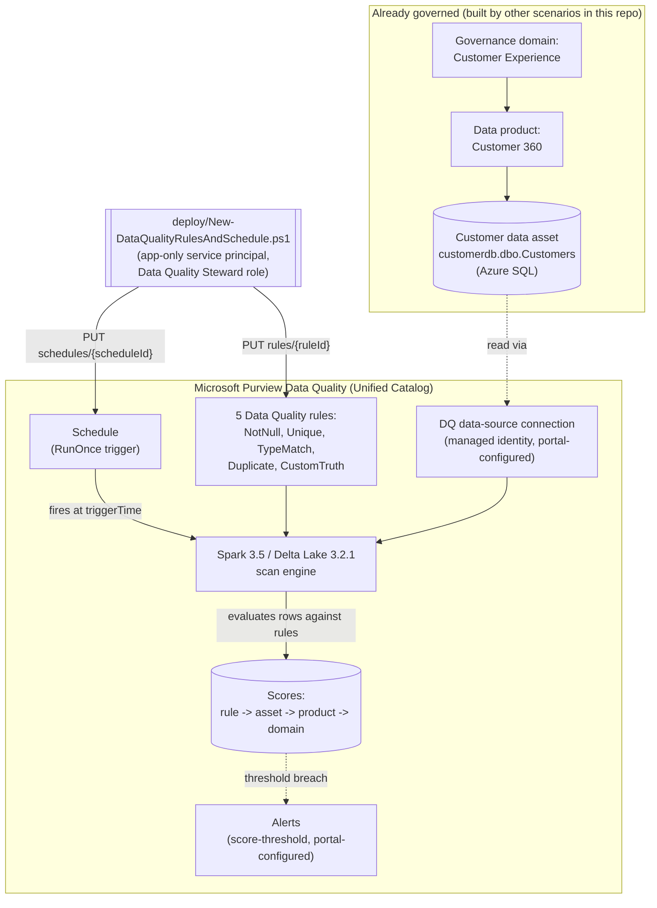

## The short version

> **Public Preview.** The Data Quality REST API for Unified Catalog this scenario automates is a
> Microsoft **Public Preview** surface as of this build (December 2025 GA-only API coverage - see
> the known limitations) - the portal experience is GA, but this scenario's *automation* rides on a preview API that
> can change without the notice a GA surface gets. Pilot before relying on it for a compliance
> commitment.

Deploys a set of Microsoft Purview Unified Catalog **Data Quality** rules - covering completeness,
uniqueness, conformity, and accuracy - against an already-governed data asset (a data asset already
registered in Data Map, scanned, and added to a Unified Catalog data product), then schedules a
one-time scan so those rules produce a **data quality score**: at the rule level, rolled up to the
asset, the data product, and the governance domain. This is the scenario that turns "we scanned and
classified the data" (*Scan Azure SQL Database and Classify Sensitive Columns*) and "we named and governed
the data" (*Curate a Business Glossary*) into "we can prove, with a number,
whether the data is actually trustworthy" - the third leg of this library's Data Governance stack.

## Why this matters

Regulators and internal risk functions increasingly require organizations to be able to *demonstrate*
data quality, not just claim it. BCBS 239 (risk data aggregation and risk reporting) requires banks to
maintain "accuracy and integrity" of risk data with automated reconciliation, not manual spot checks.
GDPR Art. 5(1)(d)'s accuracy principle requires personal data to be "accurate and, where necessary,
kept up to date." SOX financial-reporting controls depend on the integrity of the data feeding them.
And in the AI era, Microsoft's own product framing for this feature is explicit: "the reliability of
data directly impacts the accuracy of AI-driven insights... without trustworthy data, there's a risk
of eroding trust in AI systems and hindering their adoption" - directly relevant to
any organization already running *Copilot Sensitive Data Exposure Protection* in this library, since
a Copilot answer is only as trustworthy as the governed data it's grounded in.

This scenario gives that claim a number: a **Customer** data asset's data quality score, computed from
named, versioned, code-reviewed rules - auditable evidence for a risk committee, a regulator, or an
internal data-trust program, instead of "we believe the customer data is generally fine."

## How the control works

Rules and the schedule are both created against **existing** governance-domain/data-product/data-asset
IDs - this scenario's deploy script never creates or discovers those IDs, it only takes them as input
(from the JSON definition file). The scan itself runs on Microsoft-managed Apache Spark, authenticating
to the source via the DQ connection's managed identity - the same "no credential to manage" pattern
this library already uses for Data Map scanning. Full design rationale: the design notes.

## What it takes

### Prerequisites

Full licensing detail and citations: [Licensing matrix](/docs/licensing-matrix/). Summary for this scenario:

| Requirement | Minimum | Notes |
|---|---|---|
| Microsoft Purview Data Quality | **PAYG only** - metered in **Data Governance Processing Units (DGPU)**, Basic/Standard/Advanced SKUs | No per-user M365 entitlement covers this feature - see [Licensing matrix, section 2](/docs/licensing-matrix/#2-master-capability--license-matrix) |
| Deploy/manage rules, schedules, and alerts | **Data Quality Steward** role on the target governance domain | A *sub-role*: requires the user/service principal to **also** hold **Governance Domain Reader** and **Data Product Owner** on that domain - see section 5 and. **This role is granted at the governance-domain level, not per data product or per asset** - a service principal holding it for "Customer Experience" can create, edit, or delete Data Quality rules on *any* asset in *any* data product inside that domain, not just the one this scenario targets. There is no narrower, asset-scoped role documented for this action; treat the automation identity's credential with the same care as any domain-wide write credential, and review governance-domain role membership periodically ([RBAC model, section 9](/docs/rbac-model/#9-microsoft-intune-rbac---a-fifth-system-for-intune-deployed-scenarios)) |
| Read rules and scores only (validation) | **Data Quality Reader** role on the target governance domain | Least-privilege for the read-only `validate/` script; same sub-role composition as above |
| The target data asset already exists in Unified Catalog | Registered + scanned in Data Map (*Scan Azure SQL Database and Classify Sensitive Columns*), then added to a data product in a governance domain | This scenario does **not** create the governance domain, data product, or data asset - see the validation steps/the design notes |
| A Data Quality **connection** to the source is configured | Portal-only in this build - managed identity is the **only** supported authentication option for DQ scans on Microsoft-native sources (Azure SQL, ADLS Gen2, Fabric, Synapse, Azure SQL Managed Instance) | See the known limitations for why this scenario doesn't script the connection object |
| Automation identity for the REST calls themselves | App registration with **Data Quality Steward** (deploy) or **Data Quality Reader** (validate) Purview role on the governance domain | Client-secret app-only OAuth2, same token endpoint as Data Map/Unified Catalog - [Automation surface, section 3](/docs/automation-surface/#3-authentication-patterns---interactive-vs-unattended) |

> Verify current entitlement names, DGPU pricing, and role names against [Licensing matrix](/docs/licensing-matrix/)
> and [RBAC model](/docs/rbac-model/) (dated 2026-09-03) before a sales commitment - this is a **Public Preview**
> feature and its API surface, roles, and metering are explicitly subject to change.

### Cost and licensing

- **PAYG, DGPU-metered, not per-user.** Data Quality is **PAYG only** - no per-user M365 entitlement
  covers it. Cost is metered in **Data Governance Processing Units (DGPU)** across Basic/Standard/
  Advanced SKUs, the same billing family as Unified Catalog's governed-assets/day meter - see
  [Licensing matrix, section 2](/docs/licensing-matrix/#2-master-capability--license-matrix).
- **Cost scales with scan frequency and data volume**, not with the number of rules configured in
  isolation - a rule evaluates against the rows the scan actually reads, so a `Full`-equivalent scan
  of a large table costs more per run than a scan scoped with the incremental (time-based) filter
  option. Prefer incremental scans for steady-state monitoring once a baseline
  score exists, matching this library's established Data Map guidance to reserve full scans for the
  first run and periodic re-baselines.
- **This scenario's own default (a single `RunOnce` schedule) does not itself create a recurring
  cost** - re-running `deploy/New-DataQualityRulesAndSchedule.ps1` (or the portal's recurring
  schedule) is what turns this into an ongoing metered cost; budget for that before rolling out
  beyond a pilot asset.
- **Cost governance.** As with the Data Map PAYG scenario in this library, set an Azure Cost Management
  budget/alert before scaling this pattern to many assets or a daily/weekly recurring cadence - DGPU
  consumption has no natural ceiling once a schedule is running unattended.

## Proof it works

1. **Automated config check** - `./validate/Test-DataQualityRulesAndScorecard.ps1` confirms every
   rule in the definition file exists with the expected status, the schedule exists, and (once a scan
   has run) reports the asset's current score. Exits non-zero on any hard failure.
2. **Scan run status** - portal: **Health management** → **Data quality** → domain → data product →
   asset → **Monitoring** shows the run's status (queued/running/completed/failed) and pass/fail row
   counts per rule.
3. **Score evidence** - the asset's **Overview** tab shows the rolled-up global score and per-rule
   history (last 50 runs); the `Get Asset Scores For Asset DQ` call the validate
   script makes returns the same number programmatically.
4. **Negative test** - temporarily insert (in a non-production copy of the source data) a row with a
   duplicated `CustomerId`, re-run the scan, and confirm the `Unique_values_CustomerId` rule's pass
   count drops and the asset's global score decreases proportionally - this is the concrete proof the
   rule is actually evaluating live data, not a static portal toggle.
5. **Draft-vs-Active proof** - deploy with `-RuleStatus Draft`, confirm via the validate script that
   the rules exist but the asset score is unaffected (still whatever it was before, or unavailable if
   no `Active` rule has ever run), then re-deploy with the default `Active` and confirm the score
   changes on the next run.

## Where it stops

- **This scenario does not script the DQ data-source connection.** Creating the managed-identity
  connection object (`Create Data Source` in the REST operation groups) requires a `computeId` field
  whose provisioning mechanism this build could not independently confirm - Microsoft's own worked
  example shows it as a pre-existing GUID with no documented endpoint to obtain one. Set up the
  connection once via the portal; it persists and does not need to be recreated per rule
  deployment. Flagged as VERIFY/follow-up rather than fabricated -.
- **Confirmed (2026-09-27 maintenance pass, not merely unconfirmed): no recurring (non-`RunOnce`)
  schedule trigger type is documented in the current REST schema.** The portal's own **Scheduled
  scans** wizard visibly supports daily/weekly/monthly recurrence, but a direct fetch of the `Create
  Schedule`/`Get Schedule` REST reference (api-version `2026-01-12-preview` - the same version this
  scenario's script targets) shows the `Trigger` object's `type` property typed as a bare `string`
  with no enumerated values, and its `TypeProperties` object formally defined with exactly three
  fields - `isScheduled`, `timezone`, `triggerTime` - all `RunOnce`-specific. Unlike Data Map's Scans
  trigger (which documents `Hour`/`Day`/`Week`/`Month` `Recurrence` explicitly) or Azure ML's
  `TriggerBase` (a documented `Cron`/`Recurrence` discriminated union), this object's schema is not
  published as a discriminated union at all - there is no second `type` variant with its own
  `typeProperties` shape anywhere in the reference, example or Definitions section alike. This
  scenario's script therefore schedules a single one-time run by design, not as a workaround for an
  unconfirmed gap; for an ongoing cadence, either re-invoke the script periodically (e.g. from a
  pipeline's own scheduler) or use the portal wizard, which likely re-issues `RunOnce` schedules (or
  calls an undocumented endpoint) under the hood rather than exercising a public `Recurrence` trigger
  type. Re-check this REST reference on a future API version if Microsoft ever documents a `Recurrence`
  shape for this operation.
- **VERIFY - `TypeMatch` rule's target-type selection mechanism.** See the deploy script's `.NOTES`:
  the confirmed `TypeProperties` schema has no field name for "the type this column is expected to
  be," despite Microsoft's conceptual documentation describing exactly that behavior. Shipped with
  `column` only, per Microsoft's own example; confirm against a pilot tenant.
- **VERIFY - Create Rules' create-vs-replace semantics when reused against an existing `ruleId`.**
  This script's idempotency does not depend on the answer (see the deploy script's `.DESCRIPTION`),
  but a production integration bypassing this script's existence check should confirm it.
- **VERIFY - Alerts REST operations not independently exercised.** `Get Alerts`/`Update Alert` appear
  in the REST operation-group index (confirming the API surface exists) but were not fetched and
  grounded in this build; alert configuration is documented as portal-only in operations and tuning pending that follow-up.
- **200-active-rule cap per asset is product-enforced**, not something this script checks for you -
  a scan fails outright above the cap, per the configuration reference and operations and tuning.
- **The example `Custom_Email_format_valid` rule is a starter validator, not a compliance-grade
  one.** Its regex (`^[^@\s]+@[^@\s]+\.[^@\s]+$`) accepts most real addresses and rejects most
  garbage, but is not RFC 5322-complete and will both false-positive and false-negative on edge
  cases (quoted local parts, IP-literal domains, etc.). Passing this scenario's validation is proof
  the *rule infrastructure* works end-to-end, not proof the *rule content* is production-ready -
  replace the expression with the organization's actual email-validation standard before trusting
  the resulting score in a compliance narrative.
- **This scenario does not create the governance domain, data product, or data asset it targets.**
  It assumes the Data Governance path (*Scan Azure SQL Database and Classify Sensitive Columns* →
  *Curate a Business Glossary* or a future data-products scenario) has
  already run - see the design notes.
- **Public Preview.** The entire Data Quality REST API for Unified Catalog is Public Preview as of
  this build and covers GA Data Quality features only - no alerting, schema-import, or preview-feature
  API coverage yet. Re-verify the operation set before a customer-facing
  deployment; preview APIs can change without the same notice as GA surfaces.