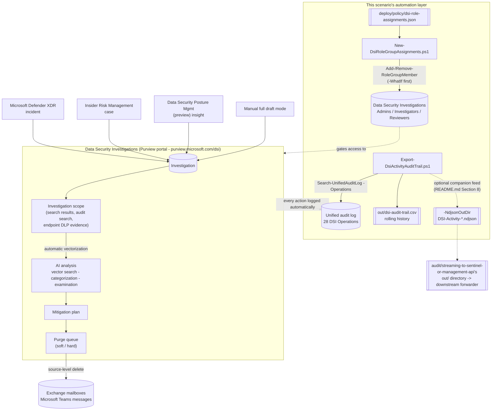

## The short version

Stands up **Microsoft Purview Data Security Investigations (DSI)** - an AI-enabled investigation
workspace that triages a data breach or insider-leak incident down to the specific sensitive items
exposed, then executes an audited, source-level purge (Exchange mailbox and/or Microsoft Teams) - as
a governed capability: least-privilege RBAC for the three dedicated DSI role groups, and a continuous,
exportable audit trail with the single highest-risk action (purge) flagged on sight.

## Why this matters

Breach-notification regimes (GDPR's 72-hour regulator notification, most U.S. state breach laws, SEC
cyber-disclosure rules) all hinge on the same bottleneck: knowing **what data was actually exposed**,
fast, across volumes too large for manual file-by-file review. DSI's AI-assisted categorization and
examination compress that triage step - Microsoft's own worked examples describe exactly this: a
breach-response investigator using DSI to identify which downloaded document contained unfiled
patents, or an investigator confirming what a departing employee actually exfiltrated before deciding
on notification scope. Getting from "we think this was exposed" to "here is the
confirmed, prioritized list" faster is the difference between a defensible notification timeline and
a missed regulatory deadline. Grounding the *governance* layer (RBAC, audit trail) before a live
incident - rather than improvising it during one - is this scenario's specific contribution.

## How the control works

The DSI workflow itself (top box) is entirely Microsoft-portal-driven - no write API exists for any
step inside it. This scenario's own deliverable is the automation layer around it:
declarative RBAC for who can do what inside DSI, and a continuous, exportable record of what they did.

## What it takes

### Prerequisites

Full licensing detail: [Licensing matrix](/docs/licensing-matrix/). RBAC: [RBAC model, section 4](/docs/rbac-model/#4-purview-role-groups-by-module-representative-not-exhaustive). Summary:

| Requirement | Detail |
|---|---|
| License | **No dedicated enterprise plan/license required** - DSI is pay-as-you-go only (data storage meter + AI compute units); a Defender XDR or Insider Risk Management license unlocks those specific investigation-creation entry points, not DSI itself |
| Privacy terms | First access to DSI in the Purview portal requires accepting Microsoft's Privacy Statement - a one-time, portal-only step |
| Role groups (this scenario provisions) | **Data Security Investigations Admins**, **Data Security Investigations Investigators**, **Data Security Investigations Reviewers** - see section 6 for the exact permission matrix |
| Role groups with implicit DSI access (not provisioned here - pre-existing) | **Compliance Administrator** (Admin access), **Organization Management** (Admin + Contributor access), **Data Security Management** (Contributor access), **Insider Risk Management** (Contributor access) |
| Automation identity (RBAC script) | A Security & Compliance PowerShell session (`Connect-IPPSSession`) held by an identity with the **Role Management** role (default: Organization Management / Data Security Investigations Admins) |
| Automation identity (audit-trail script) | An Exchange Online PowerShell session (`Connect-ExchangeOnline`) held by an identity with the **View-Only Audit Logs** or **Audit Logs** role - [RBAC model, section 6](/docs/rbac-model/#6-exchange-online-dependency-the-most-common-permissions-gap) |
| Billing/AI capacity | Configured once, in the portal, before first use - pay-as-you-go, requires the Data Security Investigations Admins role group |
| Global Administrator note | Global admins must still be assigned to one of the DSI role groups for DSI to grant them investigation access - being Global Administrator alone is not sufficient |

> Verify current entitlement names and role requirements against [Licensing matrix](/docs/licensing-matrix/) and
> [RBAC model](/docs/rbac-model/) (dated 2026-09-02) before a sales commitment.

### Cost and licensing

- **No dedicated per-user license required** to use DSI itself - it's pay-as-you-go only. A Microsoft 365/Office 365 license already covers the
  underlying Exchange/Teams/SharePoint data DSI investigates; a Defender XDR or Insider Risk
  Management license is needed only to use those specific *entry points* into DSI, not DSI's core
  features.
- **Two independent meters**: the **data storage meter** (GB/month, summed across every investigation
  currently holding scoped data) and **Data Security Investigations compute units** (AI processing for
  vectorization/categorization/examination).
- **Not pausable.** Unlike several other Purview pay-as-you-go capabilities (Communication Compliance,
  Audit, Information Protection), Data Security Investigations does not appear as a pausable feature
  in the Purview Usage center - deleting an investigation (not just idling it) is
  the only way to stop its storage charge, and charges are prorated to the day it's deleted, with a
  full day charged if created and deleted within the same 24-hour period.
- **Proactive AI insights from DSPM**, if enabled, incurs storage and compute costs continuously on a
  24-hour refresh cycle - configure billing before enabling that toggle, not after.

## Proof it works

**RBAC:**
1. Run `./validate/Test-DsiRoleGroupAssignments.ps1` - confirms all three role groups are readable,
   membership matches the declared config, the Admins group is non-empty, and unified audit logging
   is enabled.
2. Confirm in the portal: **Purview portal** → **Settings** → **Roles and groups** → select a DSI
   role group → membership list matches the config.

**Audit trail:**
1. Run `./deploy/Export-DsiActivityAuditTrail.ps1` once; confirm the CSV is created with a header row
   (even if 0 rows matched - that's expected before any DSI activity has occurred in the window).
2. Perform a benign, identifiable DSI action (e.g. view the investigation list - logs
   `DSIInvestigationListViewed`), wait for typical audit-log ingestion latency (~60-90 minutes for
   core services), re-run the script, and confirm the record appears.
3. **There is no documented API to confirm an investigation's AI-analysis job status, or a purge job's
   completion, outside the portal.** The portal's **Activities** tab (per-investigation) is the
   authoritative status source - the audit script confirms an action was *initiated*
   (`DSIPurgeStarted`), not that it *completed successfully*. See the known limitations.

**SIEM companion feed (optional):**
1. Run `./deploy/Export-DsiActivityAuditTrail.ps1` with `-NdjsonOutDir` pointed at a scratch
   directory; confirm a `DSI-Activity-<runStamp>.ndjson` file is created only when `$rowsToAdd` is
   non-empty (a run that merges zero new records writes no NDJSON file - matches Path B's own
   "no records in this window" behavior).
2. Confirm each line is valid, single-line JSON with `CreationDate`/`Operation`/`UserIds`/
   `RecordType`/`AuditData` keys, and that `AuditData` is a nested JSON object (not an escaped
   string) - e.g. `Get-Content <file> | ForEach-Object { $_ | ConvertFrom-Json }` should not throw.
3. Run the script twice in a row over an overlapping window; confirm the second run's NDJSON file
   (a new, later `runStamp`) contains **zero** records for anything already exported by the first
   run - the same `$rowsToAdd` de-duplication the CSV merge already relies on.

## Where it stops

- **No write API for the DSI workflow itself.** Investigation creation, search, scope management, AI
  analysis, mitigation-plan changes, and purge are all portal-only - this is not a
  gap this scenario's scripts work around; it's a real, disclosed boundary of what's automatable
  today.
- **Purge is source-scope-limited.** Even though an investigation's *scope* can include SharePoint and
  OneDrive content, **purge itself does not support those sources at all** - selecting them disables
  purge actions entirely. An organization expecting DSI to purge an overshared SharePoint
  site needs a different control (sharing/permissions remediation, not DSI purge).
- **RecordType for `Search-UnifiedAuditLog` (resolved 2026-09-27).** The Office 365 Management
  Activity API schema's AuditLogRecordType enum documents value 333 as `DataSecurityInvestigation`
  - `Export-DsiActivityAuditTrail.ps1` now passes `-RecordType
  DataSecurityInvestigation` alongside `-Operations` (defense in depth; `-Operations` remains the
  authoritative filter) - see the script's `.NOTES`.
- **No documented job-status API.** Neither an AI-analysis job's completion nor a purge job's outcome
  is checkable through a documented API this build found - the portal's per-investigation Activities
  tab is authoritative. `validate/Test-DsiRoleGroupAssignments.ps1` cannot and does not attempt to
  confirm either.
- **RBAC propagation delay.** Role group membership changes can take up to 30 minutes to propagate to
  a user's actual portal access, even though `Get-RoleGroupMember` reflects the change immediately
  - don't treat a user's immediate post-change access failure as this scenario's
  script having failed.
- **Purging does not remove data from DSI's own storage.** A purge removes items from Exchange/Teams;
  the copy already added to the investigation's scope remains in DSI's Azure storage (and keeps
  billing) until the investigation itself is deleted - see the rollback runbook.
- **Global Administrator alone is not sufficient** to access DSI - even a Global Admin must be
  explicitly assigned to a DSI role group.
- **`-NdjsonOutDir`'s "DSI-Activity" label is this library's own convention, not a real Office 365
  Management Activity API content type.** DSI audit records come from `Search-UnifiedAuditLog`
  directly, not from the Management Activity API `audit/streaming-to-sentinel-or-management-api`
  uses for its own Path B content types (`Audit.Exchange`, `DLP.All`, etc.) - the hyphenated name
  is deliberate, to avoid implying otherwise. Sharing an output directory is a filesystem-level
  convenience, not a claim that DSI events flow through that API.