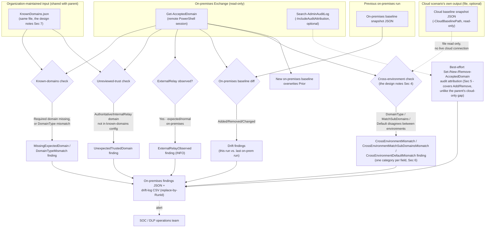

## The short version

A read-only, scheduled control that runs *Accepted-Domains Hygiene Check*'s same
detection model against an **on-premises Exchange Management Shell** session instead of Exchange
Online PowerShell - closing that scenario's disclosed blind spot for a **hybrid** Exchange Online/
on-premises tenant. Reuses the same organization-curated `KnownDomains.json` config and optionally
cross-references the cloud scenario's own last-recorded baseline to detect the hybrid-specific risk
neither environment's independent check can see: the two sides silently disagreeing about a domain's
trust status. Creates, modifies, or deletes nothing in Exchange or Purview.

## Why this matters

The parent scenario's the design notes disclosed, rather than silently assumed away, that it
authenticates to Exchange Online only - a hybrid tenant's on-premises accepted domains, including the
only place `DomainType ExternalRelay` is actually reachable (parent the design notes), are invisible to
it. This scenario closes that gap and adds a check the parent structurally cannot perform even for a
hybrid tenant running both scenarios independently: whether the two environments' accepted-domains
configuration has **drifted apart from each other**.

Regulatory/business drivers this scenario supports (in addition to the parent's own, *Accepted-Domains Hygiene Check* (why this matters), which apply equally here):
- **Complete hybrid coverage for a DLP-integrity control narrative.** An organization telling an auditor "we
  monitor our accepted-domains configuration for drift" needs that claim to be true for the whole
  hybrid estate, not just the cloud half.
- **A concrete answer to "what if the on-premises and cloud sides disagree."** Before this scenario,
  neither this library nor (per this build's grounding pass) any single Microsoft control answered that
  question for a hybrid tenant's accepted domains.
- **On-premises audit attribution the cloud side cannot offer.** `New-AcceptedDomain`/
  `Remove-AcceptedDomain` are on-premises-only cmdlets - this scenario's
  `-IncludeAuditAttribution` switch can attribute a domain add/remove event to a specific admin action
  here, a capability the parent scenario explicitly cannot offer for Exchange Online.

## How the control works

This scenario introduces **no new Exchange or Purview object** - see the rollback runbook. It never opens a
live connection to Exchange Online; `-CloudBaselinePath` is a plain file read.

## What it takes

### Prerequisites

Full licensing detail and citations: [Licensing matrix](/docs/licensing-matrix/). **This scenario requires no
incremental Purview or Copilot licensing** and no incremental Exchange Online licensing - it targets
an **on-premises Exchange Server** the deploying organization already operates as part of their hybrid deployment.

| Requirement | Minimum | Notes |
|---|---|---|
| On-premises Exchange Server | Exchange Server 2010/2013/2016/2019/SE with a configured Hybrid Configuration Wizard coexistence | `Get-AcceptedDomain`, `New-AcceptedDomain`, `Remove-AcceptedDomain`, and `Search-AdminAuditLog` are all confirmed applicable to this range. |
| RBAC system | On-premises Exchange RBAC (a **separate**, ninth role-group system from [RBAC model](/docs/rbac-model/)'s Purview/Exchange Online/Entra/Intune/Conditional-Access/app-registration/Defender-for-Endpoint models - see [RBAC model, section 13](/docs/rbac-model/#13-exchange-server-on-premises-rbac---a-ninth-system-for-hybridon-premises-scenarios), and the known limitations below) | This scenario needs an on-premises role/role group granting `Get-AcceptedDomain`/`Search-AdminAuditLog` read rights at minimum - **Organization Management** (the on-premises Exchange superset administrative role group, same name as its Exchange Online counterpart but a distinct on-premises RBAC object) is confirmed sufficient; no narrower least-privilege role was independently confirmed by this build - see the known limitations and [RBAC model, section 13](/docs/rbac-model/#13-exchange-server-on-premises-rbac---a-ninth-system-for-hybridon-premises-scenarios)'s disclosed **Compliance Management**/**View-Only Organization Management**/**Recipient Management** leads. |
| Connection surface | On-premises Exchange remote PowerShell, **not** any of [Automation surface](/docs/automation-surface/)'s five (all-cloud) surfaces | `New-PSSession -ConfigurationName Microsoft.Exchange -ConnectionUri http://<ServerFQDN>/PowerShell/ -Authentication Kerberos`, then `Import-PSSession` - the implementation steps, the design notes. Requires network line-of-sight to the on-premises Client Access/Mailbox server and a Kerberos-capable identity (typically a domain-joined machine or an account authenticating within the corporate network) - this cannot run from an arbitrary cloud-hosted runbook the way the parent scenario's certificate-based unattended auth can ([Automation surface, section 3](/docs/automation-surface/#3-authentication-patterns---interactive-vs-unattended)), unless that runbook runs on a hybrid/self-hosted runner with that network access. |
| PowerShell version | Windows PowerShell 5.1 (the on-premises Exchange remote-session pattern is confirmed for this and is the conventional platform for on-premises Exchange Management Shell automation) | This script itself has no PowerShell-7-specific syntax and runs under 5.1; see the known limitations for the platform note. |
| Known-domains config | The **same** `KnownDomains.json` file the parent scenario uses (schema: `../accepted-domains-hygiene-check/deploy/KnownDomains.sample.json`) | Reused, not duplicated - the design notes. |
| `-CloudBaselinePath` (optional) | The parent scenario's own `-BaselinePath` output file, readable from wherever this script runs | A plain file read, not a live cloud connection - copy or share the file if the two scripts run on different machines. |
| Deployment posture note | **On-premises-only check.** This scenario authenticates to the on-premises Exchange organization exclusively | Run the parent *Accepted-Domains Hygiene Check* scenario separately for the Exchange Online side - the implementation steps, the design notes explains why the two are not combined into one live session by default. |

### Cost and licensing

- **No incremental Purview, Copilot, or Exchange Online licensing required.** This scenario targets
  an on-premises Exchange Server the deploying organization already operates as part of an existing hybrid deployment
  - see the prerequisites.
- **On-premises compute cost is whatever already runs the Exchange server and the scheduling
  mechanism** (a Windows Task Scheduler task, or an Azure Automation hybrid runbook worker with
  network access to the on-premises environment) - negligible at this scenario's call volume (one
  `Get-AcceptedDomain` call and, optionally, one `Search-AdminAuditLog` call per scheduled run).
- Running this scenario alongside the parent doubles the deploying organization's total accepted-domains hygiene
  automation footprint but adds no licensing tier beyond what each half already requires
  independently.

## Proof it works

1. **Automated file-integrity check** - `./validate/Test-OnPremisesAcceptedDomainsHygieneReport.ps1`
   confirms the on-premises baseline/drift-log files have the expected shape and no duplicate rows for
   the same `RunId`; exits non-zero on any hard failure. Same structure as the parent scenario's
   validate script.
2. **Live reconciliation** - pass `-CheckLive` (with `-KnownDomainsConfigPath` and an active
   on-premises Exchange remote session) to confirm every live untrusted-but-accepted on-premises
   domain is reflected as an `UnexpectedTrustedDomain` finding in the most recent drift-log run.
3. **Functional test - on-premises detection** - in a test/lab on-premises Exchange organization
   (never a production one), add a test accepted domain with `New-AcceptedDomain` without adding it to
   `KnownDomains.json`. Run the deploy script. Expect: an `UnexpectedTrustedDomain` finding, and (with
   `-IncludeAuditAttribution` and confirmed `-AdminAuditLogCmdlets` coverage, the known limitations) an attributable
   `Search-AdminAuditLog` event for the `New-AcceptedDomain` call - the on-premises attribution
   capability the parent scenario structurally lacks. Remove the test domain
   afterward with `Remove-AcceptedDomain`.
4. **Functional test - cross-environment mismatch** - in a lab hybrid pairing, deliberately set a
   test domain's on-premises `DomainType` to differ from its recorded cloud-baseline `DomainType`
   (e.g. on-premises `Authoritative`, cloud baseline `ExternalRelay`... note `ExternalRelay` is
   excluded from this check by design, the architecture and the configuration reference - use two in-organization types that differ instead,
   e.g. on-premises `InternalRelay` vs. cloud `Authoritative`). Run this scenario's deploy script with
   `-CloudBaselinePath` pointed at the (unchanged) cloud baseline. Expect: a `CrossEnvironmentMismatch`
   finding (`WARN`, since both remain in-organization types). Revert afterward.
5. **Functional test - cross-environment `MatchSubDomains`/`Default` mismatch** - same lab pairing as
   step 4, but instead (or in addition) diverge the test domain's `MatchSubDomains` or `Default` flag
   between the two recorded states (`Set-AcceptedDomain -MatchSubDomains`/`-MakeDefault` on whichever
   side). Run the deploy script with `-CloudBaselinePath`. Expect: a
   `CrossEnvironmentMatchSubDomainsMismatch` (`FAIL` if either side is `$true`) and/or
   `CrossEnvironmentDefaultMismatch` (`WARN`) finding, as its own drift-log row distinct from any
   `CrossEnvironmentMismatch` row the same domain also produces - confirmed directly during this
   scenario's own build via a mocked-`Get-AcceptedDomain` PowerShell 7.4.6 run producing all three
   categories for two domains in one pass, then validated with `-CheckLive`'s symmetric reconciliation,
   not just statically reviewed. Revert afterward.
6. **Evidence** - the per-run findings JSON file and the on-premises drift-log CSV are the audit trail
   for this side of the hybrid deployment, same pattern as the parent scenario's own files.

## Where it stops

- **On-premises-only visibility, by design (the mirror of the parent's own limitation).** This
  scenario sees only the on-premises side; run the parent scenario for the cloud side. The two are
  not combined into one live session by default - the prerequisites, the design notes.
- **Live combined session is unsafe unless `-Prefix` is used - now detected automatically, not just
  documented.** `Connect-ExchangeOnline` and the on-premises `Import-PSSession` pattern both export a
  proxy cmdlet named `Get-AcceptedDomain`; the second one imported into the same PowerShell process
  silently wins the unqualified name - confirmed directly from Microsoft's own `Import-PSSession`
  reference. Both `deploy/Export-OnPremisesAcceptedDomainsHygieneReport.ps1` and
  `validate/Test-OnPremisesAcceptedDomainsHygieneReport.ps1` call `Get-Command Get-AcceptedDomain
  -All` at startup and emit a loud warning (not a hard failure - the collision alone doesn't prove
  which environment actually got queried) if more than one is loaded, after this build's own Red Team
  review found the first draft would have silently queried whichever session won and reported a
  clean, false-negative result with no indication anything was wrong. If you need both
  sessions in one process, re-import one with `Import-PSSession ... -Prefix OnPrem` (or similar) and
  adjust this script's cmdlet calls accordingly - not done by default.
- **`-AdminAuditLogCmdlets`'s default coverage: RESOLVED.** A 2026-09-27 Microsoft Learn re-fetch of
  `Set-AdminAuditLogConfig`'s reference page found its parameter-properties table now states
  **Default value: None** for `-AdminAuditLogCmdlets` outright - a fresh on-premises install audits
  **no** cmdlets by default; `*` (audit everything) is never on out of the box. `Set-AcceptedDomain`/
  `New-AcceptedDomain`/`Remove-AcceptedDomain` are therefore **not** covered unless the organization
  has explicitly configured `-AdminAuditLogCmdlets`. Still run `Get-AdminAuditLogConfig |
  Select-Object AdminAuditLogCmdlets` before relying on `-IncludeAuditAttribution`'s output for an
  incident investigation, to confirm the organization's actual (non-default) configuration covers
  these three cmdlets - the design notes, deploy script `.NOTES`.
- **90-day audit-log ceiling.** Even with `-AdminAuditLogCmdlets` correctly configured, the
  organization's `-AdminAuditLogAgeLimit` (90 days by default) caps how far back `Search-AdminAuditLog`
  can ever see - `-AuditLookbackDays` values beyond that ceiling silently find nothing, regardless of
  what actually happened, unless the deploying organization has widened the limit.
- **`CrossEnvironmentMismatch` findings are not automatically misconfigurations.** Which `DomainType`
  is "correct" for a shared-namespace hybrid domain depends on that domain's actual migration/
  coexistence state. Triage against the known-domains config's `owner` field, not against a blanket
  assumption that the two sides must always match - a live tenant can legitimately be mid-migration
  on one side and not the other.
- **Resolved (later build): cross-environment reconciliation now also covers `MatchSubDomains` and
  `Default`, not just `DomainType`.** the design notes originally deferred this as a non-goal pending a
  concrete organization need; closed via two new sibling finding categories,
  `CrossEnvironmentMatchSubDomainsMismatch` and `CrossEnvironmentDefaultMismatch`, each its own
  category rather than folded into `CrossEnvironmentMismatch` so a domain diverging on more than one
  field never collides on the drift log's `(RunId, Category, DomainName)` row key - a real bug this
  build's own functional test caught in an earlier single-category draft before it shipped. One VERIFY
  carried forward rather than guessed: whether `Set-AcceptedDomain -MakeDefault $true` on one domain
  automatically clears `Default` from whichever domain previously held it - Microsoft's own reference
  states what `-MakeDefault` does but not this side effect (operations and tuning above, the references).
- **Resolved (later build): the parent scenario's `KnownDomains.sample.json` `hybrid.contoso.com`
  entry (`expectedDomainType: InternalRelay`) is correct as written.** A prior build of this scenario
  flagged this as an open question, having found only community/Microsoft Q&A guidance (not an
  authoritative Microsoft Learn conceptual page) suggesting a shared-namespace hybrid domain is
  commonly left `Authoritative` on both sides to support Directory Based Edge Blocking (DBEB). A later
  `WebSearch` pass (direct `WebFetch` to `learn.microsoft.com` was blocked again, the references) found three
  authoritative Microsoft Learn conceptual pages that resolve it: the "Accepted domains" page defines
  `InternalRelay` as precisely the shared-namespace case; "Manage accepted domains in Exchange Online"
  states a migration-in-progress domain must "remain configured as internal relay rather than
  authoritative" to avoid mail loops for not-yet-migrated recipients; and the DBEB page confirms
  `Authoritative`+DBEB is the state a domain reaches only *after* all recipients have been added to
  Exchange Online and replicated - a later, different state than an active coexistence domain, not a
  contradiction of it. The sample's own "hybrid ... coexistence domain" label already describes the
  pre-migration-complete state `InternalRelay` is correct for. See the design notes for the full citation
  trail. No code or sample change was needed.
- **On-premises RBAC is now cross-referenced in [RBAC model, section 13](/docs/rbac-model/#13-exchange-server-on-premises-rbac---a-ninth-system-for-hybridon-premises-scenarios).** That cross-cutting
  reference documents the on-premises Exchange RBAC model (role groups like `Organization
  Management` that share a name, but not an identity, with their Exchange Online counterparts) as a
  ninth system alongside Purview/Exchange Online/Entra/Intune/Conditional-Access/app-registration/
  Defender-for-Endpoint RBAC - closed as a project follow-up in a later build.
- **No independently-confirmed least-privilege on-premises role narrower than Organization
  Management** was found for `Get-AcceptedDomain`/`Search-AdminAuditLog` read access during this
  build's grounding pass - same class of disclosed gap as the parent scenario's own RBAC note
  (the parent scenario's prerequisites). [RBAC model, section 13](/docs/rbac-model/#13-exchange-server-on-premises-rbac---a-ninth-system-for-hybridon-premises-scenarios) records three unconfirmed narrower leads
  (**Compliance Management**, **View-Only Organization Management**, **Recipient Management**) for
  a future build or pilot tenant to close, rather than guessing which one actually covers both
  `Get-AcceptedDomain` and `Search-AdminAuditLog` together.