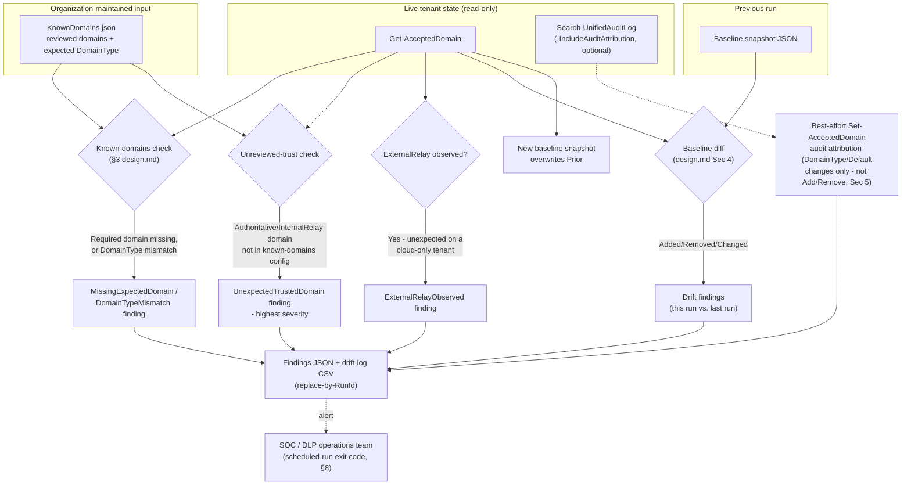

## The short version

A read-only, scheduled control that cross-references the tenant's live Exchange **accepted domains**
configuration (`Get-AcceptedDomain`) against a organization-curated allowlist of known/reviewed domains and
the previous run's recorded state. It flags both directions of hygiene risk: a legitimate partner or
subsidiary domain silently excluded from "in organization" trust, and an unreviewed domain silently
granted it. Creates, modifies, or deletes nothing in Exchange or Purview - the entire control is
detection, not enforcement.

## Why this matters

Every `FromScope`-consuming DLP condition in this tenant - including
*Copilot External Email Block*'s Rule 3, which this scenario was scoped as a
follow-up from (that scenario's the Red Team review, finding 1) - evaluates "internal vs. external"
entirely against the tenant's accepted-domains configuration, specifically each domain's `DomainType`. No DLP rule, alert, or dashboard in Purview surfaces when that underlying
configuration is wrong, incomplete, or has silently changed. This is a **compensating control for an
unmonitored dependency**, not a new DLP capability - the same class of control a mature security
program runs against any allowlist a preventive control's correctness quietly depends on.

Regulatory/business drivers this scenario supports:
- **DLP control integrity** - an organization relying on *Copilot External Email Block*, *PCI Teams Card-Data Exfiltration Block*, *Exchange PII Exfiltration Block (Block or Encrypt)*, or any other `FromScope`-based rule in this library for a PCI-DSS,
  GDPR, or SOC 2 control narrative needs assurance that the trust boundary those rules evaluate
  against is itself correct and reviewed - this scenario is that assurance mechanism.
- **Change-management visibility** - a newly-accepted domain or a changed `DomainType` is exactly the
  kind of tenant configuration change an auditor expects to see detected and reviewed, not discovered
  after the fact during an incident.
- **A concrete answer to "how would you know if someone added a rogue accepted domain"** - a
  legitimate question in any DLP/data-boundary control review; before this scenario, the honest answer
  for this library's other scenarios was "you wouldn't, automatically."

## How the control works

This scenario introduces **no new Exchange or Purview object** - see the rollback runbook. Every arrow into
"Live tenant state" is a read-only call; every output is a local file.

## What it takes

### Prerequisites

Full licensing detail and citations: [Licensing matrix](/docs/licensing-matrix/). **This scenario requires no
incremental Purview or Copilot licensing** - `Get-AcceptedDomain` and `Search-UnifiedAuditLog` are
core Exchange Online PowerShell surfaces available on any Exchange Online plan ([Automation surface, section 1](/docs/automation-surface/#1-five-automation-surfaces-not-one-read-this-first), Surface 1), unlike the E5-class Copilot-DLP tier the originating
*Copilot External Email Block* scenario needs. Verify as of the date you deploy against current
Microsoft Learn.

| Requirement | Minimum | Notes |
|---|---|---|
| RBAC system | Exchange Online RBAC ([RBAC model, section 6](/docs/rbac-model/#6-exchange-online-dependency-the-most-common-permissions-gap)), **not** a Purview role group | `Get-AcceptedDomain`/`Search-UnifiedAuditLog` are pure Exchange Online PowerShell cmdlets - no Purview portal role covers them. |
| Role to run the deploy/validate scripts interactively, or to assign to the app's service principal for unattended use | **Organization Management** (Exchange Online role group) | Confirmed sufficient (it is Exchange Online's superset administrative role group); Microsoft's own `Get-AcceptedDomain` reference page names no narrower least-privilege role, directing instead to the generic "Find the permissions required to run any Exchange cmdlet" article - same disclosed gap as *Exchange-Side Legacy Authentication Block* (the known limitations). **View-Only Organization Management** is the conventional least-privilege read-only Exchange Online role group for organization-configuration objects and is expected to cover `Get-AcceptedDomain`, but this is not independently confirmed by a Microsoft-published cmdlet-to-role mapping - see the known limitations. |
| Additional role for `-IncludeAuditAttribution` | An Exchange Online role with audit-log-search rights ([RBAC model, section 6](/docs/rbac-model/#6-exchange-online-dependency-the-most-common-permissions-gap) - Compliance Administrator/Organization Management alone are explicitly **not** sufficient per Microsoft; a dedicated Exchange Online audit role/role group is required in addition) | Only needed if the deploy script's `-IncludeAuditAttribution` switch is used. |
| PowerShell module | `ExchangeOnlineManagement` 3.2.0+ | Same module as every other Exchange Online PowerShell scenario in this library - [Automation surface, sections 1 and 4](/docs/automation-surface/#1-five-automation-surfaces-not-one-read-this-first). |
| Connection surface | `Connect-ExchangeOnline` (Surface 1) | **Not** `Connect-IPPSSession` (Surface 2, Security & Compliance PowerShell) - `Get-AcceptedDomain` and `Search-UnifiedAuditLog` are Exchange Online PowerShell cmdlets, a distinction this library's [Automation surface, section 1](/docs/automation-surface/#1-five-automation-surfaces-not-one-read-this-first) draws explicitly. |
| Known-domains config | A organization-maintained JSON file (schema: `deploy/KnownDomains.sample.json`) | No Microsoft-documented source can auto-derive which accepted domains are "reviewed and expected" - see the configuration reference and the design notes. Must be created and kept current by the deploying organization's own change-management process. |
| Deployment posture note | **Cloud-only check.** This scenario authenticates to Exchange Online exclusively | A hybrid Exchange Online/on-premises tenant's on-premises accepted domains (where `DomainType ExternalRelay` is actually reachable - see the design notes) are invisible to this script. See the known limitations. |

### Cost and licensing

- **No incremental Purview or Copilot licensing required.** `Get-AcceptedDomain` and
  `Search-UnifiedAuditLog` are core Exchange Online PowerShell surfaces on any Exchange Online plan -
  see the prerequisites. This is meaningfully cheaper to run than the `FromScope`-consuming scenarios it protects
  (e.g. *Copilot External Email Block*'s E5-class Copilot-DLP tier requirement).
- **Compute/storage cost is the automation platform's own** (Azure Automation/Functions runtime,
  wherever the recurring schedule runs) - negligible at the call volume this scenario generates (one
  `Get-AcceptedDomain` call and, optionally, one `Search-UnifiedAuditLog` call per scheduled run).
- Re-verify no licensing change has occurred for `Get-AcceptedDomain`/`Search-UnifiedAuditLog`
  specifically before a sales commitment - [Licensing matrix, section 6](/docs/licensing-matrix/).

## Proof it works

1. **Automated file-integrity check** - `./validate/Test-AcceptedDomainsHygieneReport.ps1` confirms
   the baseline and drift-log files have the expected shape and no duplicate rows for the same
   `RunId`; exits non-zero on any hard failure.
2. **Live reconciliation** - pass `-CheckLive` (with `-KnownDomainsConfigPath` and an active
   `Connect-ExchangeOnline` session) to additionally confirm every live untrusted-but-accepted domain
   is actually reflected as an `UnexpectedTrustedDomain` finding in the most recent drift-log run -
   proof the deploy script's own detection logic isn't silently under-reporting.
3. **Functional test - false-positive-exclusion direction** - in a test tenant, temporarily edit
   `KnownDomains.json` to mark a domain that genuinely IS accepted as `required: true` under a
   *different* `expectedDomainType` than its live value (e.g. expect `Authoritative` for a domain
   actually configured `InternalRelay`). Run the deploy script. Expect: a `DomainTypeMismatch` finding
   for that domain. Revert the config afterward.
4. **Functional test - silent-bypass direction** - in a test tenant, add a new accepted domain (real
   test domain you control, `Authoritative` type) without adding it to `KnownDomains.json`. Run the
   deploy script. Expect: an `UnexpectedTrustedDomain` finding (and, on the next run, a
   `DomainAddedSincePreviousRun` finding once a baseline exists) for that domain. Remove the test
   domain afterward via the Microsoft 365 admin center (the known limitations - not via PowerShell; see the cmdlet
   availability note).
5. **Functional test - `MatchSubDomains` trust-expansion direction** - in a test tenant, flip
   `MatchSubDomains` to `$true` on an already-accepted, already-known test domain (`Set-AcceptedDomain
   -Identity <domain> -MatchSubDomains $true`) without any `DomainType` change. Run the deploy script
   twice (once to record the change in a new baseline, per operations and tuning's cadence - the finding fires on the run
   that observes the change relative to the *previous* baseline). Expect: a
   `MatchSubDomainsChangedSincePreviousRun` finding. Revert afterward.
6. **Evidence** - the per-run findings JSON file (`<RunId>-accepted-domains-findings.json`, written
   alongside the drift log) and the drift-log CSV itself are the audit trail; both are ordinary files
   suitable for ingestion into a SIEM or ticketing system.

## Where it stops

- **Cloud-only visibility - now closed by a companion scenario.** This scenario authenticates to
  Exchange Online exclusively (`Connect-ExchangeOnline`). A hybrid tenant's on-premises accepted
  domains - including the only place `DomainType ExternalRelay` is actually reachable, see next bullet
  - are entirely invisible to it. *On-Premises Accepted-Domains Hygiene Check (Hybrid Companion)* is the
  on-premises companion that closes this gap, reusing this scenario's own `KnownDomains.json` and
  optionally cross-referencing this scenario's own baseline file to detect the two environments
  drifting apart from each other - see that scenario's this page for the full hybrid-specific
  detection model. See the design notes (non-goals) for why this scenario itself stays cloud-only.
- **`ExternalRelay` is on-premises Exchange only - a genuinely new finding from this build's
  grounding pass, not previously documented anywhere in this library.** Microsoft's `Set-AcceptedDomain`
  reference states this explicitly. A pure Exchange Online tenant can never have an `ExternalRelay`
  accepted domain; every accepted domain on such a tenant counts as in-organization for `FromScope`
  purposes. If this script's `ExternalRelayObserved` finding ever fires against a
  cloud tenant, that is independently surprising and worth investigating as a possible hybrid
  coexistence artifact - a project follow-up tracks backporting this correction into
  *Copilot External Email Block* (the architecture), which currently states the general mechanism without
  this cloud-vs-on-premises qualifier.
- **No Exchange Online cmdlet exists to add or remove an accepted domain.** `New-AcceptedDomain` and
  `Remove-AcceptedDomain` are both on-premises-Exchange-only per Microsoft's own applicability
  statements (fetched directly this build). A cloud tenant's accepted domains are managed exclusively
  through the Microsoft 365 admin center's domain-verification/removal flow. Two consequences: (1)
  this scenario's own testing must add/remove test domains through the admin center, not
  PowerShell; (2) this script **cannot attribute** a `DomainAddedSincePreviousRun`/
  `DomainRemovedSincePreviousRun` finding to a specific admin action via `Search-UnifiedAuditLog`'s
  `ExchangeAdmin` record type - there is no such Exchange admin event for a cloud tenant.
  **Confirmed 2026-09-27** (Microsoft Learn MCP): `Search-UnifiedAuditLog` cannot substitute for this
  either. Microsoft Entra ID's `Add verified domain`/`Remove verified domain`/`Add unverified
  domain`/`Remove unverified domain` `DirectoryManagement` activities belong to the separate Microsoft
  Entra audit log (Entra admin center / Graph `auditLogs/directoryAudits`); the Microsoft 365 unified
  audit log's own domain-event reference (`purview/audit-log-activities`, "Directory administration
  activities") exposes only the differently-named, coarser `Add domain to company.`/`Remove domain
  from company.` (no verified/unverified distinction) and `Verify domain.` (one-way; no "unverify"
  event). None of the four Entra-native names are queryable via `Search-UnifiedAuditLog`. Attributing
  a domain add/remove therefore requires querying the **Microsoft Entra audit log directly**, not
  `Search-UnifiedAuditLog` - out of scope for this script, which is an Exchange Online PowerShell tool
  by design (the validation steps non-goals). See the design notes.
- **`Set-AcceptedDomain` audit-log attribution (`-IncludeAuditAttribution`) - VERIFY closed 2026-09-28
  (Microsoft Learn MCP, maintenance pass).** No Microsoft-published worked example names
  `Set-AcceptedDomain` specifically, but Microsoft's own "Audit log activities" reference states the
  rule this cmdlet is measured against directly: *"Exchange administrator audit logging (which
  Microsoft 365 enables by default) logs an event in the audit log when an administrator ... makes a
  change in your Exchange Online organization ... by running a cmdlet in Exchange Online PowerShell.
  The audit log doesn't record cmdlets that begin with the verbs Get-, Search-, or Test-."* The same
  page's only other named exception is narrower still - internal Microsoft-datacenter/service-account
  maintenance cmdlets, reportable to Microsoft Support via a DCR if found unaudited.
  `Set-AcceptedDomain` is a customer-facing `Set-` cmdlet, not a `Get-`/`Search-`/`Test-` cmdlet and
  not an internal-maintenance cmdlet - it falls under the default-audited rule, not either named
  exception. This is the strongest grounding obtainable short of a pilot-tenant test or a worked
  example naming this exact cmdlet, and this scenario now treats the `RecordType ExchangeAdmin`/
  `Operations 'Set-AcceptedDomain'` shape as confirmed rather than merely the general default -
  see the design notes.
- **`KnownDomains.json` and the baseline file are trusted inputs this script does not protect -
  restrict write access to both.** An actor able to write either file can suppress a finding
  entirely: adding a malicious domain to `KnownDomains.json` makes it pass as reviewed, and
  pre-seeding the baseline with a domain makes it invisible to `DomainAddedSincePreviousRun`
  detection. Store both under the same access control and change-review discipline as any other
  security-relevant configuration (e.g. a source-controlled path requiring pull-request review for
  `KnownDomains.json` changes, and a baseline path writable only by the automation identity itself).
  This scenario does not enforce or verify either control - it is an operational prerequisite, the
  same class of dependency as *Copilot External Email Block*'s own reliance on correctly-configured
  accepted domains (that scenario's the prerequisites).
- **The known-domains config has no automated source of truth.** Every entry in `KnownDomains.json`
  is a human decision; this scenario cannot detect that a domain was added to the config
  *incorrectly* (e.g. approved without real review) - only that live state diverges from whatever the
  config currently says. Garbage in, garbage out, the same limitation every allowlist-based control has.
- **`DomainTypeMismatch` severity depends on whether the trust boundary actually moves.**
  `Authoritative`↔`InternalRelay` drift is `WARN` (both count as in-organization); a mismatch that
  crosses the in-organization boundary is `FAIL`. Don't read every `DomainTypeMismatch` as
  equally urgent - check the finding's own `Detail` text, which states which case applies.