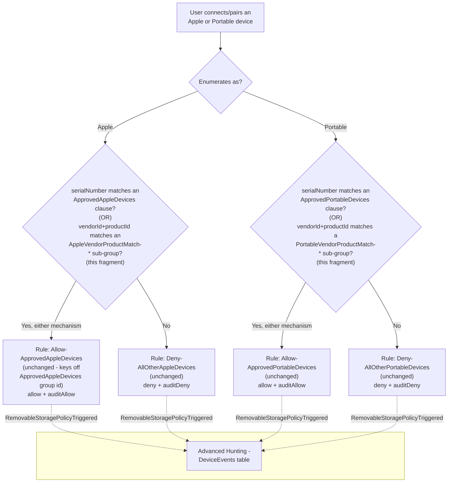

## The short version

Extends *Defender for Endpoint Device Control (macOS): Apple/Portable/Bluetooth Device Coverage*'s
`serialNumber`-only Apple and Portable device allowlists with a second, independent matching
mechanism - **vendorId+productId compound matching** - for approved iPhones/iPads or
cameras/Android-in-PTP-mode devices that have no readable serial number. Any number of
vendorId/productId-matched devices can be added per family, on top of (never instead of) each
family's existing `serialNumber`-matched devices, with no new Intune profile and no new policy rule.
This is the direct Apple/Portable analog of
*Defender for Endpoint Device Control (macOS): vendorId/productId Compound-Matched Device Allowlist*, which already
closed the identical gap for removable-media (USB mass-storage) devices.

## Why this matters

Identical regulatory framing to the parent and portable-device-coverage scenarios
(*Defender for Endpoint Device Control (macOS): USB Default-Deny Allowlist* (why this matters)) - GDPR Article 32, HIPAA's 45 CFR
§164.312 media controls, PCI DSS Requirement 3, SOC 2 CC6. This fragment closes a specific
operational gap in the Apple/Portable coverage control: a tenant that cannot approve a legitimate
IT-issued iPad or barcode scanner because it lacks a serial number is left choosing between an
unapproved control gap (the device stays denied, prompting shadow-IT workarounds or a support ticket
asking to "just turn off device control for that team") or weakening the control tenant-wide -
neither of which an auditor accepts as "no unapproved Apple/Portable device, period."

## How the control works



This fragment adds `groups[]` entries (one per configured device, per family, plus a `groupId`
clause on each family's existing Approved group) to the **same** `macOSCustomConfiguration` object
the parent scenario created and the portable-device-coverage fragment already widened. Every
Allow/Deny rule is unchanged - both already reference their family's Approved group's id directly,
so a device newly matched through either mechanism is automatically covered. Full rationale:
the design notes.

## What it takes

### Prerequisites

Same product family and licensing as the parent and portable-device-coverage scenarios - see
[Licensing matrix, section 7](/docs/licensing-matrix/#7-adjacent-product-family-microsoft-defender-for-endpoint--intune-device-control-scenarios) and *Defender for Endpoint Device Control (macOS): Apple/Portable/Bluetooth Device Coverage* (the prerequisites), which apply unchanged. The requirements this fragment adds are per family
(Apple, Portable) - configure only the family/families you need:

| Requirement | Minimum | Notes |
|---|---|---|
| Portable-device-coverage scenario deployed | `defender-device-control-usb-allowlist-macos-portable-device-coverage/deploy/Add-MacPortableDeviceCoverage.ps1` has been run at least once | This fragment's deploy script refuses to run for a family unless devices are already configured (see next row). |
| At least one `serialNumber` device already configured **for the family you want to extend** | `approvedAppleDevices`/`approvedPortableDevices` on the portable-device-coverage fragment's own `-ConfigPath` has ≥1 entry, so its `ApprovedAppleDevices`/`ApprovedPortableDevices` group and `Allow-Approved*Devices` rule already exist | A deliberate scope boundary - this fragment never creates either object from a zero-`serialNumber` starting state. An organization with zero `serialNumber` devices for a family must first add one via the prerequisite fragment. |
| PowerShell | 7.0 or later | Uses `System.Security.Cryptography.SHA1` for its deterministic per-device group id derivation - no additional module beyond the Microsoft Graph PowerShell SDK already required. |
| Automation identity | Same Entra app registration and `DeviceManagementConfiguration.ReadWrite.All` Graph application permission as the parent scenario | No new permission - this fragment PATCHes the same `macOSCustomConfiguration` object. |
| Dependency (not deployed by this scenario) | The approved devices' **vendor ID** and **product ID** (each a four-digit hexadecimal string) | Obtain via `system_profiler SPUSBDataType` on a Mac with the device connected, or the device manufacturer's own documentation. |

### Cost and licensing

- **No PAYG component and no incremental licensing cost** - identical to the parent and
  portable-device-coverage scenarios (*Defender for Endpoint Device Control (macOS): USB Default-Deny Allowlist* (the cost and licensing notes)).
  This fragment adds no new Microsoft capability, only a different matching mechanism inside the
  same already-licensed policy object.
- **No additional Azure subscription or Intune licensing line** beyond what the prerequisite
  scenarios already require.

## Proof it works

1. **Automated config check** - `./validate/Test-MacApplePortableVendorProductDeviceAllowlist.ps1
   -ConfigPath ./deploy/config/mac-apple-portable-vendor-product-device-allowlist.sample.json`
   confirms, per family: the prerequisite Approved group/Allow rule are present, every configured
   device's sub-group exists with the expected deterministic id and AND-clauses, the Approved group
   references it via a `groupId` clause, no orphaned sub-group or stale `groupId` clause remains, and
   the sibling fragments' own groups are unaffected; exits non-zero on any hard failure.
2. **Profile sync check** - same as the parent scenario's section 7 step 3: Intune admin center → confirm
   pilot Macs show **Succeeded**, not **Pending** or **Error**, after this fragment's PATCH.
3. **Client-side status check** - same as the parent scenario's section 7 step 4
   (`mdatp health --details device_control`); this fragment does not change any Full Disk Access or
   engine-enable requirement.
4. **Functional test (vendorId/productId-approved Apple/Portable device)** - connect a device whose
   vendor+product pair is in the relevant family's config list (and whose serial number, if any, is
   **not** separately approved - to isolate this fragment's own mechanism). Expect: the operation
   succeeds, and a `RemovableStoragePolicyTriggered` event with `Verdict = Allow` appears in Advanced
   Hunting.
5. **Functional test (unapproved device)** - connect a device matching neither a `serialNumber`
   clause nor a configured `vendorId`+`productId` pair for its family. Expect: denied, identical to
   the portable-device-coverage scenario's own the validation steps steps 4/6.
6. **Advanced Hunting query** - identical query shape to the portable-device-coverage scenario's own
   the validation steps step 8; this fragment adds no new `AdditionalFields` and requires no query change:
   ```kusto
   DeviceEvents
   | where ActionType == "RemovableStoragePolicyTriggered"
   | extend parsed = parse_json(AdditionalFields)
   | project Timestamp, DeviceName,
       Verdict = tostring(parsed.RemovableStoragePolicyVerdict),
       PolicyRule = tostring(parsed.RemovableStoragePolicy),
       SerialNumberId = tostring(parsed.SerialNumber)
   | order by Timestamp desc
   ```

## Where it stops

- **`vendorId`+`productId` identify a device MODEL, not a unique physical unit - this is a
  materially weaker guarantee than `serialNumber` matching, not an equivalent alternative.** Any
  device sharing the configured pair matches the exception. Approve device models here only for a
  genuine, narrow business need where no serial-numbered alternative exists (the design notes, same
  disclosure the removable-media sibling fragment already carries).
- **This fragment requires at least one `serialNumber` device already configured for a family before
  it can add a vendorId/productId device to that same family** - it never creates
  `ApprovedAppleDevices`/`ApprovedPortableDevices` or their Allow rules from a zero-`serialNumber`
  starting state. Not a mere convenience gap: Microsoft's own `device_control_policy_schema.json`
  declares a group's `query.clauses` array `"minItems": 1`, so an empty Approved group is
  schema-invalid, not just unbuilt - a real fix needs a cross-fragment ownership/sequencing change
  (whichever script runs first creates the group, conditioned on the *combined* serialNumber +
  vendorId/productId count), not a one-line guard relaxation (the design notes update).
  Tracked as a re-scoped follow-up in the project backlog.
- **KNOWN CROSS-FRAGMENT ORDERING HAZARD, more severe than the Bluetooth sibling's own disclosed
  equivalent:** if *Defender for Endpoint Device Control (macOS): Apple/Portable/Bluetooth Device Coverage*'s own `Add-MacPortableDeviceCoverage.ps1 -Force` is re-run after this fragment, it
  unconditionally rebuilds `ApprovedAppleDevices`/`ApprovedPortableDevices` from **its own**
  `serialNumber` list only - silently dropping this fragment's `groupId` clauses, and (if that
  family's `serialNumber` list is emptied) removing the group and its Allow rule entirely, orphaning
  this fragment's sub-groups. Remediation: re-run this fragment's own deploy script afterward.
  `validate/Test-MacApplePortableVendorProductDeviceAllowlist.ps1` detects and flags this specific
  drift condition per family, distinct from "never configured."
- **VERIFY (pilot tenant or a future Microsoft Learn/GitHub-samples pass):** no directly-confirmed
  Microsoft worked example pairs `vendorId`+`productId` AND-clause matching with the `apple_devices`
  or `portable_devices` primaryId families specifically - Microsoft's own published GitHub sample
  policies demonstrate this exact AND-clause shape only for `bluetooth_devices`
  (`deny_all_bluetooth_devices_except_samsung.json`), and a single-clause `vendorId`-only variant for
  `removable_media_devices` (`deny_removable_media_except_kingston.json`). This fragment generalizes
  the shape to two more families on the same basis the removable-media sibling fragment already
  generalized it once (the clause type definitions themselves are documented family-agnostically),
  not on a new, independently confirmed worked example. `audit_all_apple_devices_except_serial_
  numbers.json` and `deny_mobile_devices.json` were both re-fetched during this fragment's build and
  confirmed to use `serialNumber`/`primaryId` matching only for these two families, never
  `vendorId`/`productId`. `deploy/Add-MacApplePortableVendorProductDeviceAllowlist.ps1`'s `.NOTES`
  flags this inline.
- **The deterministic per-device group id (RFC 4122 the architecture.3 UUIDv5) is this fragment's own namespace
  constant and hash-input format, distinct from every sibling fragment's own scheme.** If a future
  engineer changes the namespace constant, the hash input string, the family tag, or the
  normalization (`ToLowerInvariant`) applied to `vendorId`/`productId` before hashing, every
  previously-deployed device's computed id changes, and the deploy script will treat every existing
  sub-group as orphaned on the next run.
- **VERIFY (pilot tenant, before production reliance):** the same open `macOSCustomConfiguration`
  `payload` PATCH replace-vs-merge question the parent scenario's own page already flags
  (*Defender for Endpoint Device Control (macOS): USB Default-Deny Allowlist* (the known limitations)) applies identically here.
- **This fragment inherits every non-goal already disclosed by the parent and portable-device-coverage scenarios** - no content awareness, the Full Disk Access hard prerequisite, the
  `portable_devices`-`serialNumber` VERIFY that scenario's own page already carries, and the known
  Microsoft-documented Android-PTP-mode-only and Xcode-transfer product limitations.