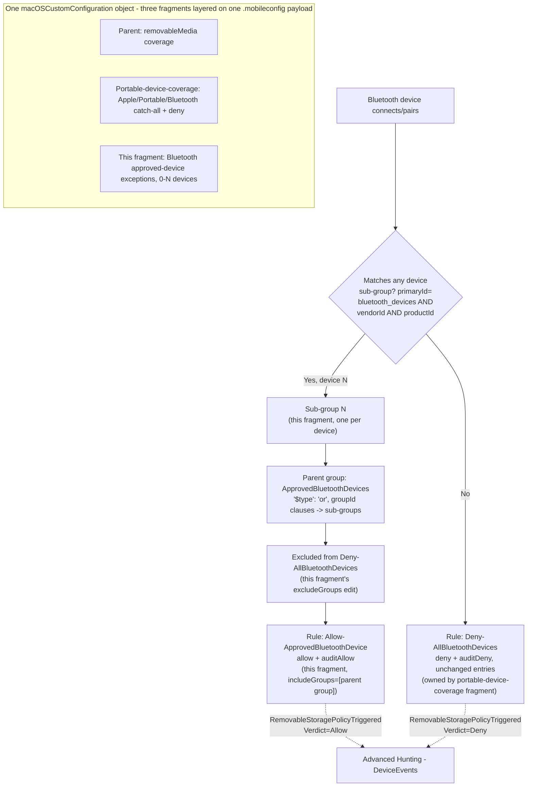

## The short version

Adds one or more vendor+product-matched approved-device exceptions to the unconditional Bluetooth
deny rule that *Defender for Endpoint Device Control (macOS): Apple/Portable/Bluetooth Device Coverage*
ships - closing that fragment's deliberately deferred "Bluetooth is always default-deny, no
exceptions" scope boundary using the exact `vendorId`+`productId` AND-match shape Microsoft's own
published sample policy demonstrates, extended to any number of devices via the same per-device
sub-group + OR'd parent group technique `defender-device-control-usb-allowlist-macos-apple-portable-vendor-product-matching/` already proved out for the identical AND-then-OR problem. This is a third-layer companion fragment, not a standalone policy: it widens the same shared
`macOSCustomConfiguration` object's `.mobileconfig` payload the parent and portable-device-coverage
fragments already extend, adding one parent group, one sub-group per approved device, and one rule,
and modifying one existing rule in place.

## Why this matters

The portable-device-coverage fragment's own the known limitations states the trade-off plainly:
Bluetooth ships default-deny-only because Microsoft's own worked exception sample for this family
uses a structurally different, single-device `vendorId`+`productId` match, not the OR'd
multi-device `serialNumber` pattern used for Apple/Portable devices. In practice this means an organization
with even one legitimate Bluetooth file-transfer use case has exactly two options without this
fragment: block it entirely (a genuine business-disruption cost) or turn off Bluetooth enforcement
for the whole fleet (reopening the exact invisibility gap the parent fragments exist to close).
Neither is acceptable to a security team trying to run a policy pilot without generating support
tickets. This fragment closes that gap the same way the rest of this control's approved-device
model works: a small, named, audited allowlist - not a blanket carve-out.

The same regulatory drivers the parent scenario cites (GDPR Article 32, HIPAA 45 CFR §164.312
media controls, PCI DSS Requirement 3, SOC 2 CC6) apply unchanged; this fragment doesn't introduce
a new compliance citation, it removes an operational blocker to actually running the existing
control's Bluetooth coverage in enforce mode.

## How the control works



The same one Intune macOS Custom device configuration profile (`Device Control (macOS) - USB
Removable Media Default-Deny Allowlist`) has its embedded `deviceControl.policy` JSON widened a
third time: one per-device sub-group for each approved device, one parent group
(`ApprovedBluetoothDevices`, `$type: "or"`) referencing them all, one new rule
(`Allow-ApprovedBluetoothDevice`), and one existing rule modified in place
(`Deny-AllBluetoothDevices` gains `excludeGroups` = [the parent group's id]). No new Intune profile,
no new assignment. Full rule-by-rule rationale, including why the parent-group-of-sub-groups shape
is needed at all: the design notes.

## What it takes

### Prerequisites

This scenario extends the shared policy object a second time and inherits every prerequisite from
both fragments below it.

| Requirement | Minimum | Notes |
|---|---|---|
| Parent policy already deployed | *Defender for Endpoint Device Control (macOS): USB Default-Deny Allowlist* has been run | Same Defender for Endpoint Plan 1, Intune, Full Disk Access, and minimum client version `101.91.92` prerequisites as the parent (the prerequisites there). |
| Portable-device-coverage fragment already deployed | *Defender for Endpoint Device Control (macOS): Apple/Portable/Bluetooth Device Coverage* has been run at least once | **Hard prerequisite, enforced at runtime.** `deploy/Add-MacBluetoothDeviceAllowlist.ps1` refuses to run if the `AllBluetoothDevices` group and `Deny-AllBluetoothDevices` rule that fragment creates are not both present - this fragment only adds an exception to existing Bluetooth coverage, it never creates Bluetooth coverage itself. |
| Dependency (not deployed by this scenario) | The approved Bluetooth device's `vendorId` and `productId` (four-digit hexadecimal, e.g. `0075`/`0100`) | Obtainable from the device's Bluetooth pairing/product documentation, or from a prior `DeviceEvents` deny event's `AdditionalFields` once the device has attempted (and been denied) a connection at least once - see the validation steps. |

### Cost and licensing

No incremental licensing cost beyond the parent scenario's cost and licensing notes - this fragment adds
one group and one rule to the same Defender for Endpoint Plan 1 macOS device control capability
already licensed for the parent and portable-device-coverage fragments. The only new cost
consideration is operational: reviewing and maintaining a small, IT-managed approved-Bluetooth-device list, and the ordering-hazard runbook step.

## Proof it works

1. **Automated config check** - `./validate/Test-MacBluetoothDeviceAllowlist.ps1 -ConfigPath
   ./deploy/config/mac-bluetooth-device-allowlist.sample.json` confirms the prerequisite Bluetooth
   coverage exists, the approved-device group/allow rule (if configured) match the current
   `-ConfigPath` definition, the deny rule's `entries` are unchanged, and sibling Apple/Portable/
   removable-media coverage is unaffected. It also specifically distinguishes "never configured"
   from the known ordering-hazard drift condition rather than reporting both the same way.
2. **Device onboarding/Full Disk Access check** - same as the parent scenario's the validation steps step 1/4;
   nothing in this fragment enforces without both already being true on the pilot Mac.
3. **Profile sync check** - Intune admin center → **Devices** → **macOS** →
   **Configuration profiles** → the policy → **Device status** → **Succeeded**.
4. **Functional test (unapproved Bluetooth device)** - pair a Bluetooth device not matching any
   configured device's `vendorId`/`productId` and attempt a file transfer. Expect: denied, with a
   `RemovableStoragePolicyTriggered` event, `Verdict = Deny`.
5. **Functional test (approved Bluetooth devices)** - pair each approved device in turn and attempt
   a file transfer. Expect: the operation succeeds for every configured device, and a
   `RemovableStoragePolicyTriggered` event with `Verdict = Allow` still appears for each (audited,
   not silent) - confirm no device is silently missed if more than one is configured.
6. **Finding `vendorId`/`productId` for a device that has already been denied at least once** -
   query the deny events (extends the portable-device-coverage fragment's own the validation steps step 8 query):
   ```kusto
   DeviceEvents
   | where ActionType == "RemovableStoragePolicyTriggered"
   | extend parsed = parse_json(AdditionalFields)
   | where tostring(parsed.RemovableStoragePolicy) == "Deny-AllBluetoothDevices"
   | project Timestamp, DeviceName,
       VendorId = tostring(parsed.VendorId),
       ProductId = tostring(parsed.ProductId)
   | order by Timestamp desc
   ```
   **VERIFY (pilot tenant):** `VendorId`/`ProductId` as literal `AdditionalFields` property names for
   a macOS Bluetooth deny event are not independently confirmed by a Microsoft worked example - this
   query is a reasonable extension of the same cross-platform `DeviceEvents`/`AdditionalFields`
   schema assumption the parent and portable-device-coverage fragments already establish (confirmed
   there for `Verdict`/`SerialNumberId`/`RemovableStoragePolicy`), not a directly confirmed field
   name for these two specifically. If the field names differ, obtain `vendorId`/`productId` from
   the device's own pairing/product documentation instead.

## Where it stops

- **RESOLVED - any number of approved devices is supported (v2).** Microsoft's "Access policy rule"
  reference is explicit: "If multiple groups are in the `includeGroups`, it's *AND*" - so two
  separate vendor+product device groups cannot simply both be listed in one allow rule's
  `includeGroups`. This fragment's original v1 release worked around that by capping the config at
  exactly one device and throwing a clear error otherwise, deferring multi-device support as a
  follow-up. That follow-up is now closed: `defender-device-control-usb-allowlist-macos-apple-portable-vendor-product-matching/` independently built and validated the per-device sub-group +
  `groupId`-clause-nesting technique for the identical AND-then-OR problem after this fragment's v1
  shipped, so v2 ports that proven technique instead of inventing a second, differently-shaped
  multi-device mechanism - see the design notes for the full before/after and section 4 for the architecture.
- **`vendorId`+`productId` identify a device *model*, not a unique physical unit - a materially
  weaker allowlist than this control's `serialNumber`-based exceptions elsewhere, not merely the
  same class of risk at a different layer.** A `serialNumber` allowlist (removable media, Apple,
  Portable families) at least requires acquiring or firmware-spoofing the one approved physical
  unit's identity. `vendorId`+`productId` are, by design, identical across **every** unit of a given
  model - no forgery is even needed to get a second, unapproved unit of the same approved
  phone/scanner model through this exception. Deliberate impersonation is also plausible without any
  physical device: Bluetooth HCI/GAP vendor and product identifiers are commonly software-configurable on inexpensive BLE development boards and some commodity dongles, putting spoofing a
  specific approved model's identifiers within reach of a moderately capable attacker with no
  physical access to an approved unit at all. This is not a gap in this fragment's design; it is the
  only documented matching mechanism Microsoft provides for the `bluetooth_devices` family (no
  `serialNumber` clause is demonstrated for Bluetooth in any Microsoft-published sample - see
  the design notes for why this fragment does not attempt one). Approve only device *models* with a
  genuine, narrow business need, size the approved-unit count you expect, and see operations and tuning for the
  operational triage this residual gap needs.
- **Known ordering hazard: re-running the portable-device-coverage fragment's own
  `Add-MacPortableDeviceCoverage.ps1 -Force` after this fragment silently drops the exclusion.**
  That script unconditionally rebuilds the `Deny-AllBluetoothDevices` rule with no `excludeGroups`
  on every `-Force` run (it has no awareness this fragment exists) - the approved device would then
  be denied again, with no error raised by either script at the time. Remediation: re-run this
  fragment's own `deploy/Add-MacBluetoothDeviceAllowlist.ps1` afterward to restore the exclusion.
  `validate/Test-MacBluetoothDeviceAllowlist.ps1` detects this exact drift condition (approved
  group/allow rule present, but `excludeGroups` missing) and reports it as a distinct, actionable
  `[FAIL]` rather than conflating it with "never deployed." See operations and tuning for the operational runbook this
  belongs in.
- **This fragment restricts Bluetooth file transfer only, not all Bluetooth functionality for the
  approved device** - inherited unchanged from the portable-device-coverage fragment's own the known limitations
  disclosure; the `bluetoothDevice` entry type's only documented access operations are
  `download_files_from_device`/`send_files_to_device`.
- **This fragment does not change the parent's assignment** - widening the shared payload takes
  effect for every device already assigned the parent policy.
- **VERIFY (pilot tenant, before relying on it for triage):** the exact `AdditionalFields` property
  names for a Bluetooth device's `vendorId`/`productId` in a `RemovableStoragePolicyTriggered` deny
  event are not independently confirmed by a Microsoft worked example.
- **This fragment inherits every prerequisite-fragment limitation** not superseded above - Full Disk
  Access as a hard, silent prerequisite; the open VERIFY on `payload` PATCH replace-vs-merge
  semantics; the possible conflict with an independently-deployed `com.microsoft.wdav` preferences
  profile; and no remote, at-scale check for Full Disk Access grant status (the parent scenario's known limitations,
  portable-device-coverage the known limitations).