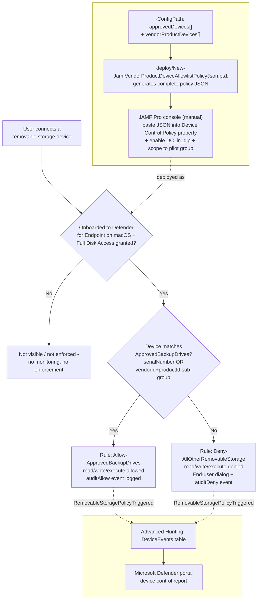

## The short version

Extends *Defender for Endpoint Device Control (macOS, JAMF-managed): USB Default-Deny Allowlist*'s default-deny USB
allowlist for JAMF-managed macOS endpoints with a second, independent device-matching mechanism:
**vendorId+productId compound matching**, for approved backup/imaging drives that have no readable
`serialNumber` (bulk-imaged imaging docks, some third-party enclosures, certain OEM hardware). This
is the **JAMF-managed sibling** of
*Defender for Endpoint Device Control (macOS): vendorId/productId Compound-Matched Device Allowlist* (Intune-managed)
- the identical policy content, generated as a single local artifact instead of an incremental Graph
PATCH, because JAMF's device control deployment path has no documented API to patch.

## Why this matters

Identical framing to both the base JAMF scenario and the Intune vendor-product-matching sibling -
GDPR Article 32, HIPAA's 45 CFR §164.312 media controls, PCI DSS Requirement 3, and SOC 2 CC6 all
reference media/physical safeguards broadly enough to expect device-identity coverage regardless of
whether a specific approved drive happens to expose a serial number. A tenant that deploys the base
JAMF scenario but has any approved drive with no readable serial number has a real, disclosed gap in
that scenario's own the known limitations - this scenario closes it for JAMF-managed fleets, the same way
its Intune sibling closes it for Intune-managed fleets.

A companion assessment-side scenario, *PCI DSS v4.0 Assessment*, tracks the
same PCI DSS v4.0 improvement actions this technical control and its siblings support.

## How the control works



Unlike the Intune sibling (which PATCHes a **live** Graph object incrementally), this script has
nothing live to read: JAMF's Device Control Policy property has no documented API, so every
deployment - with or without vendor/product matching - is "regenerate the complete artifact locally,
then paste the whole thing into the JAMF Pro console by hand". This script's output
**supersedes** the base scenario's own output; run it instead of (not alongside) the base scenario's
`New-JamfDeviceControlPolicyJson.ps1` once vendor/product matching is needed. Full rule-by-rule
rationale: the design notes.

## What it takes

### Prerequisites

| Requirement | Minimum | Notes |
|---|---|---|
| Base scenario | *Defender for Endpoint Device Control (macOS, JAMF-managed): USB Default-Deny Allowlist* **prerequisites only** (device control licensing, JAMF Pro, MDE-on-JAMF onboarding, Full Disk Access for `com.microsoft.dlp.daemon`, the existing `com.microsoft.wdav` custom-schema profile) | This scenario adds no new prerequisite beyond the base scenario's own the prerequisites - it is a superset artifact, not a separately-deployed object. |
| Device control (macOS) | **Microsoft Defender for Endpoint Plan 1** (bundled in Microsoft 365 E3) or higher | Confirmed against Microsoft's JAMF-specific device control deployment guide - same minimum as both siblings. |
| Device management | **JAMF Pro** (macOS Configuration Profiles, Application & Custom Settings) | Same JAMF Pro tenant already managing the target Macs per the base scenario. |
| Existing base policy JSON (recommended, not required) | The base scenario's `output/jamf-device-control-policy.json`, or its `deploy/config/*.json` config | Useful as a starting point for this scenario's combined config - see step 1 of the implementation steps. |
| Approved devices' identifiers | The physical approved drives' serial numbers (if any) and/or their `vendorId`/`productId` (four-digit hex each) | Must be known before running this scenario's deploy script. `vendorId`/`productId` can be read from `system_profiler SPUSBDataType` on a Mac with the device connected, or from the device's own documentation. |
| Automation identity | **None required for this scenario's script** | Same as the base JAMF scenario - reads a local config file and writes a local JSON file only; no Microsoft Graph or JAMF Pro API call. |
| Local tooling (optional) | `mdatp` CLI, only if using `-ValidateWithMdatp` | Requires running the deploy or validate script on an already-onboarded Mac's Terminal. |
| Role to author in the JAMF Pro console (human operator) | JAMF Pro role with permission to edit **Configuration Profiles** | Same JAMF-issued RBAC as the base scenario - outside the scope of [RBAC model](/docs/rbac-model/). |

> Verify current entitlement names and the Product Terms before a sales commitment - SKU names
> change. This scenario's licensing story is identical to the base JAMF scenario's cost and licensing notes; it adds no
> incremental licensing cost of its own.

### Cost and licensing

- **No PAYG component and no incremental licensing cost over the base JAMF scenario.** Device control
  for macOS is bundled into Defender for Endpoint Plan 1 (itself bundled into Microsoft 365 E3)
  - this fragment adds no new licensed capability.
- **JAMF Pro is a separate, third-party licensing line**, entirely outside Microsoft's Product Terms -
  unchanged from the base scenario.
- **No Microsoft Graph application permission or Entra app registration required** - this fragment's
  script, like the base scenario's, never calls Microsoft Graph or the JAMF Pro API.

## Proof it works

1. **Device onboarding/Full Disk Access check** - identical to the base scenario's the validation steps check 1.
2. **Local artifact check** - `./validate/Test-JamfVendorProductDeviceAllowlistPolicyJson.ps1
   -ConfigPath ./deploy/config/mac-jamf-vendor-product-device-allowlist.sample.json` confirms every
   `approvedDevices` serialNumber and every `vendorProductDevices` sub-group (present, correctly
   AND-clause-shaped, referenced from `ApprovedBackupDrives` via `groupId`, and correctly ordered
   before it in the `groups` array) match the config, flags any orphaned `VendorProductMatch-` group,
   and - if `mdatp` is available - re-runs the local schema validator. **This check cannot confirm
   the JSON was actually pasted into JAMF Pro** - see the known limitations.
3. **JAMF Pro console check** - identical to the base scenario's section 7 check 3.
4. **Client-side status check** (Terminal on a pilot Mac) - identical to the base scenario's the validation steps
   check 4 (`mdatp health --details device_control`).
5. **Functional test (vendor/product-matched drive, no serial number)** - plug in a drive whose
   `vendorId`/`productId` is in the config's `vendorProductDevices` list. Expect: read/write
   succeeds, and a `RemovableStoragePolicyTriggered` event with `Verdict = Allow` appears in Advanced
   Hunting (audited, not silent).
6. **Functional test (unapproved drive)** - identical to the base scenario's the validation steps check 5.
7. **Advanced Hunting query** (identical to every sibling in this family - `DeviceEvents` is a single,
   OS- and MDM-agnostic table):
   ```kusto
   DeviceEvents
   | where ActionType == "RemovableStoragePolicyTriggered"
   | extend parsed = parse_json(AdditionalFields)
   | project Timestamp, DeviceName, Verdict = tostring(parsed.RemovableStoragePolicyVerdict),
       SerialNumberId = tostring(parsed.SerialNumber)
   | order by Timestamp desc
   ```

## Where it stops

- **`vendorId`/`productId` identify a device model, not a unique physical unit.** Any device sharing
  the configured pair - a colleague's identical drive model, or a unit with spoofed/reprogrammed USB
  descriptor fields - matches the exception, not just the one physically approved unit. This is
  **not** a variant of the same risk level as `serialNumber` matching; it is a strictly weaker
  guarantee. Presented as such, not as an equivalent alternative for convenience.
- **This scenario's automation stops at generating and locally validating the policy JSON - it does
  not deploy anything**, and pasting the result into JAMF Pro **replaces** the prior content
  wholesale - identical, already-disclosed gap and mechanic to the base JAMF scenario
  (the known limitations there).
- **No remote, at-scale way to confirm the pasted JSON matches the intended artifact** - identical gap
  to the base JAMF scenario; the same JAMF-console-only audit trail limitation applies here, now also
  covering vendor/product-matched entries.
- **A device presenting as a Portable Device, Apple (iOS/iPadOS) device, or Bluetooth media is
  completely invisible to this control** - unchanged, disclosed scope boundary inherited from the
  base scenario; this fragment does not extend vendor/product matching to those families (a separate
  follow-up, tracked in the project backlog, the same as for the Intune sibling).
- **VERIFY (pilot tenant or a future Microsoft Learn/GitHub-samples grounding pass):** no directly-confirmed Microsoft worked example pairs a `groupId` clause with **more than one** sibling sub-group
  inside one `any` query. The `groupId` clause type itself, its "match if a device is a member of
  another group" semantics, and the "group must be defined within the policy before the clause"
  ordering requirement are directly confirmed from Microsoft's own Clause reference table, but the N-sub-groups-in-one-OR-query composition this fragment performs is this
  repository's own application of that documented primitive - inherited unresolved from the Intune
  sibling's own equivalent VERIFY, not independently re-checked or newly resolved by this fragment.
- **VERIFY (`developer.jamf.com`, or a pilot JAMF Pro tenant):** whether a documented JAMF Pro
  REST/Classic API exists for setting the Device Control Policy custom-schema property
  programmatically - the same open item the base JAMF scenario's own the known limitations already tracks.
  If resolved, this fragment's Step 3 could be automated end-to-end the same way it would close
  the base scenario's equivalent gap.
- **Device control has no content awareness at all** - pair with a future macOS-scoped Endpoint DLP
  control for content inspection on the approved path too, the same complementary-layers framing as
  every sibling in this family.