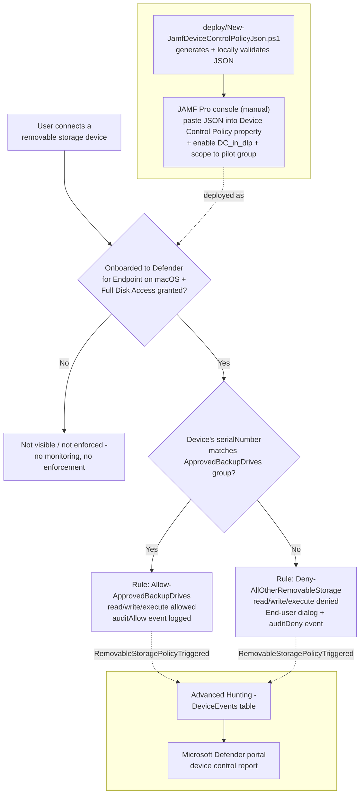

## The short version

Denies **all** removable USB storage devices on JAMF-managed macOS endpoints by default, allowing
only a short, named allowlist of IT-issued, identity-verified backup/imaging drives (matched by
serial number) to read and write. This is the **JAMF-managed sibling** of
*Defender for Endpoint Device Control (macOS): USB Default-Deny Allowlist* (Intune-managed) - the identical
policy content, delivered through JAMF Pro's own device-control mechanism instead of Microsoft
Graph, for organizations whose Mac fleet is managed by JAMF rather than Intune.

## Why this matters

Identical regulatory framing to both siblings - GDPR Article 32, HIPAA's 45 CFR 164.312 media
controls, PCI DSS Requirement 3, and SOC 2 CC6 all reference media/physical safeguards broadly
enough to expect device-identity coverage regardless of which MDM manages a given endpoint. A
tenant that deploys *Defender for Endpoint Device Control (macOS): USB Default-Deny Allowlist* (Intune) but has any
JAMF-managed Macs in scope has the same "no unapproved USB storage device, period" overclaim risk
that scenario itself closes for Intune-managed Macs - this scenario closes the JAMF-managed half
of that same gap.

A companion assessment-side scenario, *PCI DSS v4.0 Assessment*, tracks
the same PCI DSS v4.0 improvement actions this technical control and its siblings support.

## How the control works



The policy JSON (two groups, two mutually-exclusive rules) is generated locally by
`deploy/New-JamfDeviceControlPolicyJson.ps1`, then pasted by hand into a JAMF Pro **Device Control
Policy** custom-schema property - Microsoft documents no API for that last step. Enforcement happens **locally on the Mac** via the Defender for Endpoint sensor,
identical to the Intune sibling. Full rule-by-rule rationale: the design notes.

## What it takes

### Prerequisites

| Requirement | Minimum | Notes |
|---|---|---|
| Device control (macOS) | **Microsoft Defender for Endpoint Plan 1** (bundled in Microsoft 365 E3) or higher | Confirmed directly against Microsoft's JAMF-specific device control deployment guide, which states the same Microsoft 365 E3 minimum in language matching the Intune and Windows guides. |
| Device management | **JAMF Pro** (macOS Configuration Profiles, Application & Custom Settings) | This scenario's manual steps assume an existing JAMF Pro tenant already managing the target Macs. |
| Device onboarding | Mac already onboarded to **Microsoft Defender for Endpoint via JAMF**, running Defender for Endpoint on macOS client version **101.91.92** or later | Not performed by this scenario - see `mac-jamfpro-policies` for the full JAMF-based MDE onboarding procedure. |
| MDE Preferences profile | An existing JAMF Pro **Custom Schema**-sourced Application & Custom Settings profile, Preference Domain **exactly** `com.microsoft.wdav`, with the current `schema.json` loaded | Confirmed as a strict requirement - Microsoft's JAMF setup guide states "You must use exact `com.microsoft.wdav` as the Preference Domain". This scenario's Step 3 updates this existing profile; it does not create it from scratch. |
| **Full Disk Access for `com.microsoft.dlp.daemon`** | A Privacy Preferences Policy Control (PPPC) profile (JAMF: uploaded `fulldisk.mobileconfig`, or the equivalent GUI-built PPPC payload) granting Full Disk Access to this specific process | **macOS-specific prerequisite with no Windows equivalent**, identical to the Intune sibling. Device control cannot enforce without it. Not performed by this scenario - see step 0 of the implementation steps and the known limitations. |
| Supported OS | macOS, versions listed in Microsoft's Defender for Endpoint on macOS system requirements | See `microsoft-defender-endpoint-mac` for the current supported-OS list. |
| Role to author in the JAMF Pro console (human operator) | JAMF Pro role with permission to edit **Configuration Profiles** | JAMF's own RBAC model, not a Microsoft/Purview role - outside the scope of [RBAC model](/docs/rbac-model/), which covers Microsoft-issued roles only. |
| Automation identity | **None required for this scenario's script** | Unlike the Intune sibling, `deploy/New-JamfDeviceControlPolicyJson.ps1` calls no Microsoft Graph or JAMF Pro API - it only reads a local config file and writes a local JSON file. |
| Local tooling (optional) | `mdatp` CLI, only if using `-ValidateWithMdatp` | Requires running the deploy or validate script on an already-onboarded Mac's Terminal - see the implementation steps and the validation steps. |
| Dependency (not deployed by this scenario) | The physical **approved backup drives'** serial numbers, and a JAMF Pro **Computer Group** scoping the pilot set of Macs | Must exist/be known before running `deploy/New-JamfDeviceControlPolicyJson.ps1` and before completing the implementation steps's manual JAMF-console steps. |

> Verify current entitlement names and the Product Terms before a sales commitment - SKU names
> change. This scenario's licensing story is identical in shape to both siblings'. Unlike
> either, this scenario's own automation makes **no API calls at all** - see section 11 for why.

### Cost and licensing

- **No PAYG component.** Device control for macOS is bundled into Defender for Endpoint Plan 1
  (itself bundled into Microsoft 365 E3) - identical to both siblings.
- **JAMF Pro is a separate, third-party licensing line**, entirely outside Microsoft's Product
  Terms - size and budget it against JAMF's own pricing, not Microsoft's.
- **No additional Azure subscription required**, and - unlike the Intune sibling - **no Microsoft
  Graph application permission or Entra app registration is required at all**, since this
  scenario's script never calls Microsoft Graph.
- **Sizing note:** license only the Macs in the Device Control profile's JAMF Computer Group scope
  - staged rollout limits initial licensing exposure to the pilot group.

## Proof it works

1. **Device onboarding/Full Disk Access check** - confirm pilot Macs show as onboarded in the
   Microsoft Defender portal and have Full Disk Access granted to `com.microsoft.dlp.daemon` before
   assuming any functional test result - device control silently does nothing without both.
2. **Local artifact check** - `./validate/Test-JamfDeviceControlPolicyJson.ps1 -ConfigPath
   ./deploy/config/mac-device-control-usb-allowlist-jamf.sample.json` confirms the generated JSON's
   groups/rules/settings match the intended config and, if `mdatp` is available on the validating
   machine, re-runs the local schema validator. **This check cannot confirm the JSON was actually
   pasted into JAMF Pro** - see the known limitations.
3. **JAMF Pro console check** - open the profile from section 5 and visually confirm the **Device Control
   Policy** text box still contains the expected JSON, the **DC_in_dlp** feature is `enabled`, and
   the **Scope** tab targets the intended pilot Computer Group.
4. **Client-side status check** (Terminal on a pilot Mac) -
   ```sh
   mdatp health --details device_control
   ```
   Confirm `v2_configured: true`, `v2_state: "enabled"`, and `v2_full_disk_access: "approved"`
   before running a functional test - identical check to the Intune sibling; this output is the
   same regardless of which MDM delivered the policy.
5. **Functional test (unapproved drive)** - plug in a removable USB drive **not** on the approved
   list. Expect: read/write denied, an end-user dialog naming the restriction, and a
   `RemovableStoragePolicyTriggered` event with `RemovableStoragePolicyVerdict = Deny` in Advanced
   Hunting.
6. **Functional test (approved drive)** - plug in a drive whose serial number is in the
   `approvedDevices` config list. Expect: read/write succeeds, and a
   `RemovableStoragePolicyTriggered` event with `Verdict = Allow` still appears (audited, not
   silent - why this matters).
7. **Advanced Hunting query** (identical to both siblings - `DeviceEvents` is a single, OS- and
   MDM-agnostic table):
   ```kusto
   DeviceEvents
   | where ActionType == "RemovableStoragePolicyTriggered"
   | extend parsed = parse_json(AdditionalFields)
   | project Timestamp, DeviceName, Verdict = tostring(parsed.RemovableStoragePolicyVerdict),
       SerialNumberId = tostring(parsed.SerialNumber)
   | order by Timestamp desc
   ```

## Where it stops

- **This scenario's automation stops at generating and locally validating the policy JSON - it does
  not deploy anything.** Unlike both siblings (which call an API end-to-end), Steps 3-4 are
  manual JAMF Pro console actions because Microsoft documents no API for JAMF's Device Control
  Policy custom-schema property, and this build's own grounding pass could not independently confirm
  a JAMF Pro API shape for it either (`developer.jamf.com` was unreachable in this build's network
  environment - the design notes). This is a genuine, disclosed automation gap, not an oversight: a
  organization evaluating this scenario against the Intune sibling should expect a materially higher manual
  step count and a JAMF-console-only audit trail for every allowlist change.
- **A device presenting as a Portable Device, Apple (iOS/iPadOS) device, or Bluetooth media is
  completely invisible to this control, not merely unrestricted.** Identical gap to the Intune
  sibling's own disclosed Portable-Device/Apple-device boundary
  (*Defender for Endpoint Device Control (macOS): USB Default-Deny Allowlist* (the known limitations)) - this scenario's policy scopes
  enforcement to `removable_media_devices` only. Not re-scoped here because the underlying
  policy JSON is identical to the Intune sibling's; closing it there (tracked in the project backlog)
  closes it here too once this scenario adopts the updated policy shape.
- **This scenario matches approved devices by `serialNumber` only, not `vendorId`/`productId`** -
  identical scope boundary and rationale to the Intune sibling (the design notes there).
- **Full Disk Access for `com.microsoft.dlp.daemon` is a hard, silent prerequisite.** Identical to
  the Intune sibling - always check `mdatp health --details device_control`'s
  `v2_full_disk_access` value (the validation steps check 4) before concluding a functional test failure is a policy
  bug.
- **No remote, at-scale way to confirm the pasted JSON matches the intended artifact.** JAMF Pro's
  console shows the pasted text, but this library found no documented JAMF Pro API to read it back
  programmatically - `validate/Test-JamfDeviceControlPolicyJson.ps1` can only confirm the **local**
  generated file is correct, never that the JAMF-console paste step was performed
  correctly or at all. A silent copy/paste error (partial paste, stale JSON from a previous config)
  is not detectable by anything in this scenario's automation - only by the manual console check
  (the validation steps check 3) or a functional test (the validation steps checks 5-6).
- **Device control has no content awareness at all** - pair with a future macOS-scoped Endpoint DLP
  control for content inspection on the approved path too, the same complementary-layers framing as
  both siblings.
- **VERIFY (pilot tenant or a future grounding pass against `developer.jamf.com`):** whether a
  documented JAMF Pro API request body exists for programmatically setting a Custom-Schema-sourced
  Application & Custom Settings property's value (as opposed to uploading a plain `.plist` file, a
  different and simpler mechanism JAMF also supports for other Defender for Endpoint preferences).
  If one is found, Steps 2-4 of the implementation steps could be automated end-to-end, closing this scenario's primary
  disclosed gap above. `developer.jamf.com` was unreachable from this build's network environment.