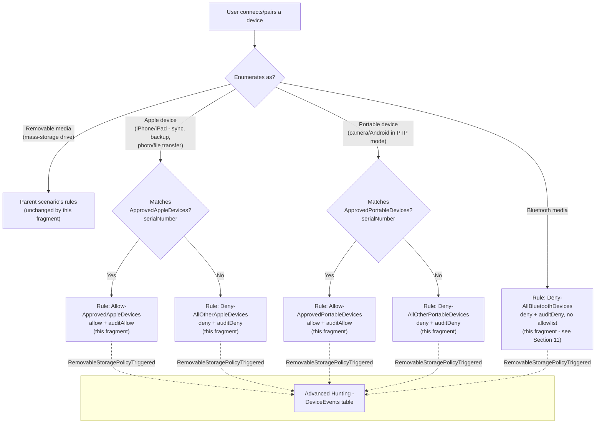

## The short version

Extends *Defender for Endpoint Device Control (macOS): USB Default-Deny Allowlist*'s default-deny USB allowlist
to also cover **Apple (iOS/iPadOS) devices**, **Portable devices** (cameras, Android phones in
PTP-analogous modes), and **Bluetooth media** - three device families that scenario's own Red Team
review confirmed are **completely invisible** to a policy scoped to `removable_media_devices` only.
This is a companion fragment, not a standalone policy: it widens the parent's existing
`macOSCustomConfiguration` object's `.mobileconfig` payload in place, adding three new feature
enables, three new catch-all groups, two optional named allowlists, and five new rules.

## Why this matters

the parent scenario's known limitations documents the gap directly: a policy scoped to
`removable_media_devices` enforces nothing against a device that instead enumerates as
`apple_devices`, `portable_devices`, or `bluetooth_devices` - no block, no notification, no
Advanced Hunting event. A user who syncs data to a personal iPhone, downloads photos from a camera
in PTP mode, or transfers a file over Bluetooth bypasses the parent policy's entire
"default-deny, named allowlist" model with zero signal. That is a materially worse gap than "this
activity type isn't restricted": it is a silent, undetected bypass of a control whose stated
purpose is "no unapproved USB storage device, period" (the parent scenario's short version).

The same regulatory drivers the parent scenario cites - GDPR Article 32, HIPAA 45 CFR §164.312
media controls, PCI DSS Requirement 3, SOC 2 CC6 - reference "media controls"/"physical
safeguards" broadly enough that an auditor who learns the control has a phone-shaped (or
Bluetooth-shaped) hole in it will treat that as an open finding, not a footnote. Closing it
converts the parent scenario's narrative from "we control removable storage" to "we control
removable, portable, Apple, and Bluetooth media," the platform-complete claim most of those
frameworks actually expect - and brings macOS to parity with the Windows fleet once the Windows
WPD-coverage sibling is also deployed there.

## How the control works



One existing Intune macOS Custom device configuration profile (the parent scenario's
`Device Control (macOS) - USB Removable Media Default-Deny Allowlist`) has its embedded
`deviceControl.policy` JSON widened: three new `settings.features` entries enable enforcement for
`appleDevice`/`portableDevice`/`bluetoothDevice` (each disabled by default per Microsoft's own
documentation), three new catch-all groups scope each family by `primaryId`, and up to five new
rules mirror the parent's audited-allow/audited-deny pattern per family. Full rule-by-rule
rationale: the design notes.

## What it takes

### Prerequisites

This scenario extends the parent policy object and inherits every prerequisite in
*Defender for Endpoint Device Control (macOS): USB Default-Deny Allowlist* (Defender for Endpoint
Plan 1, Intune, Full Disk Access for `com.microsoft.dlp.daemon`, minimum client version
`101.91.92`, the parent policy already deployed). No additional client-version threshold is
documented for these three families specifically (unlike the Windows WPD-coverage sibling, which
needs a later client than its own parent's baseline) - Microsoft's "Device Control for macOS"
reference lists `appleDevice`/`portableDevice`/`bluetoothDevice` alongside `removableMedia` in the
same, single Settings/Features table with no separate version callout.

| Requirement | Minimum | Notes |
|---|---|---|
| Parent policy already deployed | *Defender for Endpoint Device Control (macOS): USB Default-Deny Allowlist* has been run at least once | `deploy/Add-MacPortableDeviceCoverage.ps1` refuses to run if the parent policy doesn't exist - this fragment only extends an existing object, it never creates one from scratch. |
| Dependency (not deployed by this scenario) | Approved Apple/Portable devices' serial numbers, if an allowlist is wanted for either family | Must be known before running `deploy/Add-MacPortableDeviceCoverage.ps1` - see the implementation steps and the configuration reference. Bluetooth has no allowlist option in this fragment. |

### Cost and licensing

No incremental licensing cost beyond the parent scenario's cost and licensing notes - Apple/Portable/
Bluetooth device control is part of the same Defender for Endpoint Plan 1 macOS device control
capability, not a separately licensed feature. The only new cost consideration
is operational: reviewing and maintaining up to two additional approved-device lists.

## Proof it works

1. **Automated config check** - `./validate/Test-MacPortableDeviceCoverage.ps1 -ConfigPath
   ./deploy/config/mac-portable-device-coverage.sample.json` confirms the three feature flags, the
   three catch-all groups, the mandatory deny rules, the optional approved-device groups/allow
   rules (matching `-ConfigPath`'s current definition), and that the parent's original
   `removableMedia` coverage is untouched; exits non-zero on any hard failure.
2. **Device onboarding/Full Disk Access check** - same as the parent scenario's the validation steps step 1/4;
   nothing in this fragment enforces without both already being true on the pilot Mac.
3. **Profile sync check** - Intune admin center → **Devices** → **macOS** →
   **Configuration profiles** → the policy → **Device status** → **Succeeded**.
4. **Functional test (unapproved Apple device)** - connect an iPhone/iPad not on
   `approvedAppleDevices` and attempt a sync/backup/photo transfer. Expect: denied, an end-user
   dialog, and a `RemovableStoragePolicyTriggered` event with `Verdict = Deny` in Advanced Hunting.
5. **Functional test (approved Apple device, if configured)** - connect a device whose serial
   number is in `approvedAppleDevices`. Expect: the operation succeeds, and a
   `RemovableStoragePolicyTriggered` event with `Verdict = Allow` still appears (audited, not
   silent).
6. **Functional test (portable device)** - connect a camera or Android phone in PTP mode; repeat
   steps 4-5 for the `approvedPortableDevices` list.
7. **Functional test (Bluetooth)** - pair a Bluetooth device and attempt a file transfer. Expect:
   denied unconditionally, with an `auditDeny` event - there is no approved-device path to test for
   this family in this fragment.
8. **Advanced Hunting query** - the parent scenario's own `DeviceEvents`/
   `RemovableStoragePolicyTriggered` query works unchanged; extend it with the
   `RemovableStoragePolicy` field (the rule name, confirmed directly against Microsoft's own worked
   Advanced Hunting example) to distinguish which family/rule triggered:
   ```kusto
   DeviceEvents
   | where ActionType == "RemovableStoragePolicyTriggered"
   | extend parsed = parse_json(AdditionalFields)
   | project Timestamp, DeviceName,
       Verdict = tostring(parsed.RemovableStoragePolicyVerdict),
       PolicyRule = tostring(parsed.RemovableStoragePolicy),
       SerialNumberId = tostring(parsed.SerialNumber)
   | order by Timestamp desc
   ```
   `PolicyRule` is expected to read `Allow-ApprovedAppleDevices`/`Deny-AllOtherPortableDevices`/
   `Deny-AllBluetoothDevices`/etc. for events this fragment's rules generate, letting an analyst
   distinguish them from the parent's own `removableMedia`-family rule names without needing a
   separate query per device family. This field is directly confirmed only via Microsoft's
   Windows-side worked example; the macOS parent scenario's own the validation steps already establishes
   the working assumption that `DeviceEvents`/`AdditionalFields` is one OS-agnostic schema shared
   across both platforms (confirmed there for `Verdict`/`SerialNumberId`), which this step extends
   to `RemovableStoragePolicy` on the same basis rather than an independent macOS-side worked
   example.

## Where it stops

- **Bluetooth devices have no approved-device allowlist in this fragment - always default-deny, no
  exceptions.** Microsoft's own worked sample for this family
  (`deny_all_bluetooth_devices_except_samsung.json`) demonstrates an exception group matched by
  `vendorId`+`productId` (AND'd within a single group query for one specific device), a
  structurally different, single-device matching model from the OR'd multi-device `serialNumber`
  pattern this fragment uses for Apple/Portable devices. Rather than introduce a
  second, differently-shaped config schema for one family, this fragment ships Bluetooth as
  default-deny-only; a `vendorId`+`productId`-matched Bluetooth allowlist is tracked as a follow-up
  in the project backlog rather than guessed into an unverified shape.
- **VERIFY (pilot tenant, before relying on it for a true allowlist):** `serialNumber` matching for
  the `portable_devices` family has no directly-confirmed Microsoft worked example - only
  `removable_media_devices` (parent scenario) and `apple_devices` (this fragment, via
  `audit_all_apple_devices_except_serial_numbers.json`) are confirmed by a
  published sample. Microsoft's Clause reference table is presented as one flat, family-unscoped
  list (a materially stronger starting position than the ambiguity the Windows WPD-coverage
  sibling had to flag for `SerialNumberId`/`VID_PID`), but this is not the same as a direct worked
  example. `validate/Test-MacPortableDeviceCoverage.ps1` checks `approvedPortableDevices` entries
  as `[WARN]`, not `[PASS]`/`[FAIL]`, pending confirmation.
- **A device without a readable serial number cannot be allowlisted for the Apple or Portable
  families** - same scope boundary the parent scenario already carries for removable media
  (the known limitations there), and the same reason this fragment doesn't attempt `vendorId`/`productId`
  compound matching for those two families (it would need the same per-device, dynamic-sub-group
  idempotency model the parent scenario already deferred as a follow-up - the design notes).
- **`serialNumber` is spoofable, not just a coarse identifier.** The same class of risk the parent
  scenario's own Red Team review (finding 2) already accepts for `removable_media_devices`
  applies identically to an `ApprovedAppleDevices`/`ApprovedPortableDevices` allowlist entry: a
  reported serial number is firmware-level metadata, and commodity USB-controller/device-property
  spoofing tooling that rewrites it exists. `serialNumber` is still the *strongest* standalone
  identifier this schema documents for these families (it "doesn't match if the device doesn't have
  a serial number" - a hard match, not a probabilistic one), but an approved-device allowlist here
  is a compensating control, not a cryptographic identity boundary. Keep either allowlist small and
  IT-managed, the same mitigation the parent scenario and the Windows WPD-coverage sibling already
  recommend for their own analogous identifiers.
- **Bluetooth device control here restricts file transfer only, not all Bluetooth functionality.**
  The `bluetoothDevice` entry type's only documented access operations are
  `download_files_from_device` and `send_files_to_device` - this fragment's
  `Deny-AllBluetoothDevices` rule blocks those two operations for every Bluetooth device, but has no
  effect on Bluetooth audio, HID (keyboard/mouse), tethering, or pairing itself. Do not describe
  this control to an organization as "Bluetooth is disabled" - it is scoped to data exfiltration via file
  transfer specifically, the same operation-scoped framing Microsoft's own product design uses
  (compare `portableDevice`'s equally narrow, enumerated access-type list rather than a blanket
  "block the device class" switch).
- **This fragment does not change the parent's assignment.** Widening the shared
  `.mobileconfig` payload takes effect for every device already assigned the parent policy - there
  is no separate pilot-then-widen step for these three families specifically. If a more cautious
  rollout is wanted, stage it against a pilot-scoped **copy** of the parent policy in a lower
  environment first, since the deploy script always targets the policy by
  `parentPolicyDisplayName` and there is exactly one such object per tenant in this design.
- **This fragment inherits every parent-scenario limitation** not superseded above - Full Disk
  Access as a hard, silent prerequisite; the open VERIFY on `payload` PATCH replace-vs-merge
  semantics (this fragment's own PATCH calls carry the identical, not a new, risk); the possible
  conflict with an independently-deployed `com.microsoft.wdav` preferences profile; and no remote,
  at-scale check for Full Disk Access grant status (the parent scenario's known limitations).
- **Known Microsoft-documented product limitation (not specific to this scenario's design):**
  device control on macOS restricts Android devices connected in PTP mode **only** - File Transfer,
  USB Tethering, and MIDI modes are not restricted, the same limitation the parent scenario already
  documents.