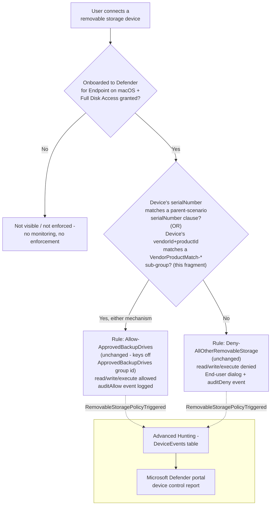

## The short version

Extends *Defender for Endpoint Device Control (macOS): USB Default-Deny Allowlist*'s `serialNumber`-only approved
backup-drive allowlist with a second, independent matching mechanism - **vendorId+productId compound
matching** - for approved removable-storage devices that have no readable serial number. Any number
of vendorId/productId-matched devices can be added, on top of (never instead of) the parent
scenario's existing serialNumber-matched devices, with no new Intune profile and no new policy rule.

## Why this matters

Identical regulatory framing to the parent scenario (`defender-device-control-usb-allowlist-macos/
why this matters) - GDPR Article 32, HIPAA's 45 CFR 164.312 media controls, PCI DSS Requirement 3, and
SOC 2 CC6. This fragment closes a specific operational gap in that control's own coverage: a tenant
that cannot approve a legitimate IT-issued drive because it has no serial number is left choosing
between an unapproved control gap (leaving the drive functionally denied, prompting shadow-IT
workarounds) or weakening the control tenant-wide - neither of which an auditor would accept as
"no unapproved USB storage device, period."

## How the control works



This fragment adds `groups[]` entries (one per configured device, plus a `groupId` clause on the
existing `ApprovedBackupDrives` group) to the **same** `macOSCustomConfiguration` object the parent
scenario created. `Allow-ApprovedBackupDrives` and `Deny-AllOtherRemovableStorage` are unchanged -
both already reference `ApprovedBackupDrives`' group id directly, so a device newly matched through
either mechanism is automatically covered. Full rationale: the design notes.

## What it takes

### Prerequisites

Same product family and licensing as the parent scenario - see [Licensing matrix, section 7](/docs/licensing-matrix/#7-adjacent-product-family-microsoft-defender-for-endpoint--intune-device-control-scenarios) and
*Defender for Endpoint Device Control (macOS): USB Default-Deny Allowlist* (the prerequisites), which apply unchanged. The only new
requirement this fragment adds:

| Requirement | Minimum | Notes |
|---|---|---|
| Parent policy already deployed | *Defender for Endpoint Device Control (macOS): USB Default-Deny Allowlist* has been run at least once | This fragment's deploy script refuses to run if the parent's `ApprovedBackupDrives` group is not found - see the implementation steps. |
| PowerShell | 7.0 or later | `deploy/Add-MacVendorProductDeviceAllowlist.ps1` uses `System.Security.Cryptography.SHA1` for its deterministic per-device group id derivation - no additional module beyond the Microsoft Graph PowerShell SDK already required by the parent scenario. |
| Automation identity | Same Entra app registration and `DeviceManagementConfiguration.ReadWrite.All` application permission as the parent scenario | No new permission - this fragment PATCHes the same `macOSCustomConfiguration` object. |
| Dependency (not deployed by this scenario) | The approved devices' **vendor ID** and **product ID** (each a four-digit hexadecimal string) | Obtain via `system_profiler SPUSBDataType` on a Mac with the device connected (look for `Vendor ID` / `Product ID`), or the device manufacturer's own documentation. Not performed by this scenario. |

### Cost and licensing

- **No PAYG component and no incremental licensing cost** - identical to the parent scenario
  (*Defender for Endpoint Device Control (macOS): USB Default-Deny Allowlist* (the cost and licensing notes)). This fragment adds no new Microsoft
  capability, only a different matching mechanism inside the same already-licensed policy object.
- **No additional Azure subscription or Intune licensing line** beyond what the parent scenario
  already requires.

## Proof it works

1. **Automated config check** - `./validate/Test-MacVendorProductDeviceAllowlist.ps1 -ConfigPath
   ./deploy/config/mac-vendor-product-device-allowlist.sample.json` confirms every configured
   device's sub-group exists with the expected deterministic id and AND-clauses, `ApprovedBackupDrives`
   references it via a `groupId` clause, no orphaned `VendorProductMatch-*` group or stale `groupId`
   clause remains, and the parent's own groups/rules are unaffected; exits non-zero on any hard
   failure.
2. **Profile sync check** - same as the parent scenario's section 7 step 3: Intune admin center → confirm
   pilot Macs show **Succeeded**, not **Pending** or **Error**, after this fragment's PATCH.
3. **Client-side status check** - same as the parent scenario's section 7 step 4
   (`mdatp health --details device_control`); this fragment does not change any Full Disk Access or
   engine-enable requirement, so a device that already worked for `serialNumber`-matched drives needs
   no additional client-side check.
4. **Functional test (vendorId/productId-approved drive)** - plug in a drive whose vendor+product
   pair is in the `vendorProductDevices` config list (and whose serial number, if any, is **not**
   separately approved - to isolate this fragment's own mechanism). Expect: read/write succeeds, and
   a `RemovableStoragePolicyTriggered` event with `Verdict = Allow` appears in Advanced Hunting.
5. **Functional test (unapproved drive)** - plug in a drive matching neither a `serialNumber` clause
   nor a configured `vendorId`+`productId` pair. Expect: denied, identical to the parent scenario's
   own the validation steps step 5.
6. **Advanced Hunting query** - identical query shape to the parent scenario's the validation steps step 7; this
   fragment adds no new `AdditionalFields` and requires no query change:
   ```kusto
   DeviceEvents
   | where ActionType == "RemovableStoragePolicyTriggered"
   | extend parsed = parse_json(AdditionalFields)
   | project Timestamp, DeviceName, Verdict = tostring(parsed.RemovableStoragePolicyVerdict),
       SerialNumberId = tostring(parsed.SerialNumber)
   | order by Timestamp desc
   ```

## Where it stops

- **`vendorId`+`productId` identify a device MODEL, not a unique physical unit - this is a materially
  weaker guarantee than the parent scenario's `serialNumber` matching, not an equivalent alternative.**
  Any device sharing the configured pair - a colleague's identical drive model, or a unit with a
  reprogrammed USB descriptor - matches the exception. Approve device models here only for a genuine,
  narrow business need where no serial-numbered alternative exists, not as a convenience shortcut for
  hardware that does have a readable serial number.
- **VERIFY (pilot tenant or a future Microsoft Learn/GitHub-samples pass):** no directly-confirmed
  Microsoft worked example pairs a `groupId` clause with **more than one** sibling sub-group inside a
  single `any` query - Microsoft's own samples only ever demonstrate a single vendorId+productId
  exception device per policy. The `groupId` clause type itself and its "member of another group"
  semantics are directly documented; this fragment's N-devices-in-one-OR-query
  composition is this library's own application of that documented primitive, not itself a worked
  example. `deploy/Add-MacVendorProductDeviceAllowlist.ps1`'s `.NOTES` flags this inline.
- **The deterministic per-device group id (RFC 4122 the architecture.3 UUIDv5) is a design choice unique to this
  fragment, not a pattern used by any sibling fragment in this library.** If a future engineer
  changes the namespace constant, the hash input string, or the normalization (`ToLowerInvariant`)
  applied to `vendorId`/`productId` before hashing, every previously-deployed device's computed id
  changes, and the deploy script will treat every existing sub-group as orphaned on the next run -
  the namespace constant and hash-input format in `deploy/Add-MacVendorProductDeviceAllowlist.ps1`
  and `validate/Test-MacVendorProductDeviceAllowlist.ps1` must never drift apart from each other.
- **VERIFY (pilot tenant, before production reliance):** the same open `macOSCustomConfiguration`
  `payload` PATCH replace-vs-merge question the parent scenario's own page already flags
  (*Defender for Endpoint Device Control (macOS): USB Default-Deny Allowlist* (the known limitations)) applies identically here - this
  fragment's reconcile path assumes full replacement.
- **This fragment inherits every non-goal already disclosed by the parent scenario** - no content
  awareness, no Apple/Portable/Bluetooth coverage, the Full Disk Access hard prerequisite, and the
  known Microsoft-documented Android-PTP-mode-only and Xcode-transfer product limitations
  (*Defender for Endpoint Device Control (macOS): USB Default-Deny Allowlist* (the known limitations)).