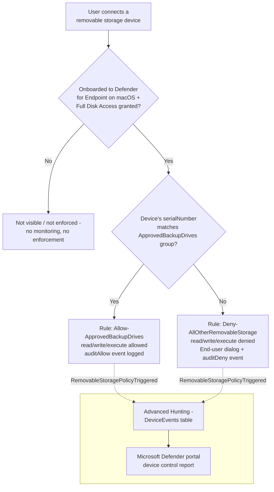

## The short version

Denies **all** removable USB storage devices on onboarded macOS endpoints by default, allowing
only a short, named allowlist of IT-issued, identity-verified backup/imaging drives (matched by
serial number) to read and write. This is the **macOS sibling** of
*Defender for Endpoint Device Control: USB Default-Deny Allowlist* (Windows) - same device-identity control,
same content-blind scope boundary, translated to macOS's own device control policy model
(JSON `groups`/`rules`/`settings` deployed as a `.mobileconfig` payload) instead of Windows'
OMA-URI/XML mechanism.

## Why this matters

Identical regulatory framing to the Windows sibling (`defender-device-control-usb-allowlist/
why this matters) - GDPR Article 32, HIPAA's 45 CFR §164.312 media controls, PCI DSS Requirement 3,
and SOC 2 CC6 all reference media/physical safeguards broadly enough to expect device-identity
coverage regardless of endpoint operating system. A tenant that deploys the Windows sibling alone
and tells an auditor "no unapproved USB storage device, period" is materially overclaiming if any
Mac in scope has no equivalent control - this scenario closes that specific, platform-shaped gap.

A companion assessment-side scenario, *PCI DSS v4.0 Assessment*, tracks
the same PCI DSS v4.0 improvement actions this technical control and its Windows sibling support.

## How the control works



One Intune macOS **Custom** device configuration profile
(`Device Control (macOS) - USB Removable Media Default-Deny Allowlist`) whose payload is a single
`.mobileconfig`, carrying the `DC_in_dlp` engine-enable feature flag plus an embedded JSON device
control policy (two groups, two mutually-exclusive rules). Full rule-by-rule rationale:
the design notes. Enforcement happens **locally on the Mac** via the Defender for Endpoint sensor,
driven by policy synced from Intune.

## What it takes

### Prerequisites

Same product family as the Windows sibling - see [Licensing matrix, section 7](/docs/licensing-matrix/#7-adjacent-product-family-microsoft-defender-for-endpoint--intune-device-control-scenarios) for the
cross-cutting Defender for Endpoint + Intune entitlement summary (that section's licensing
guidance applies identically to macOS; Microsoft's own macOS-specific documentation independently
confirms the same Microsoft 365 E3 / Defender for Endpoint Plan 1 minimum).

| Requirement | Minimum | Notes |
|---|---|---|
| Device control (macOS) | **Microsoft Defender for Endpoint Plan 1** (bundled in Microsoft 365 E3) or higher | Confirmed directly against Microsoft's Intune/JAMF deployment guides for macOS device control, both of which state the Microsoft 365 E3 minimum in identical terms to the Windows product. |
| Device management | **Microsoft Intune** (device configuration profiles) | This scenario deploys via an Intune macOS Custom configuration profile - same separate-licensing-line caveat as the Windows sibling. |
| Device onboarding | Mac onboarded to **Microsoft Defender for Endpoint**, enrolled in **Intune**, running Defender for Endpoint on macOS client version **101.91.92** or later | Not performed by this scenario's deploy script. |
| **Full Disk Access for `com.microsoft.dlp.daemon`** | A Privacy Preferences Policy Control (PPPC) configuration profile granting Full Disk Access to this specific process | **macOS-specific prerequisite with no Windows equivalent.** Device control cannot enforce without it - Microsoft documents deploying `fulldisk.mobileconfig` (or an equivalent PPPC profile) as a prerequisite step, separate from the device-control policy this scenario deploys. Not performed by this scenario - see the implementation steps step 1 and the known limitations. |
| Supported OS | macOS, versions listed in Microsoft's Defender for Endpoint on macOS system requirements | See `microsoft-defender-endpoint-mac` for the current supported-OS list. |
| Role to author via the Intune portal (human operator) | **Policy and Profile manager** Intune role, at minimum | Same built-in role as the Windows sibling - Intune's device-configuration RBAC category is not OS-specific; see [RBAC model, section 9](/docs/rbac-model/#9-microsoft-intune-rbac---a-fifth-system-for-intune-deployed-scenarios). |
| Automation identity | Entra app registration granted the Microsoft Graph **application** permission `DeviceManagementConfiguration.ReadWrite.All`, admin-consented | Confirmed identically for `macOSCustomConfiguration` as for the Windows `windows10CustomConfiguration` type - same permission, same admin-consent requirement. |
| Dependency (not deployed by this scenario) | An Entra ID group scoping the **pilot** set of Mac endpoints (device group recommended), and the physical **approved backup drives'** serial numbers | Must exist/be known before running `deploy/New-MacDeviceControlUsbAllowlistPolicy.ps1` - see the implementation steps. |

> Verify current entitlement names and the Product Terms before a sales commitment - SKU names
> change. This scenario's licensing story is identical in shape to the Windows sibling's cost and licensing notes;
> the one genuinely new prerequisite line is the Full Disk Access PPPC profile above, which has no
> licensing cost but is a real deployment dependency this scenario does not create.

### Cost and licensing

- **No PAYG component.** Device control for macOS is bundled into Defender for Endpoint Plan 1
  (itself bundled into Microsoft 365 E3) - confirmed identically to the Windows product. No incremental per-seat cost for a tenant already licensed
  at E3 or above.
- **Intune is a separate licensing line if not already present** - same caveat as the Windows
  sibling.
- **No additional Azure subscription required.**
- **Sizing note:** license only the Macs in the device control assignment scope - staged rollout
 limits initial licensing exposure to the pilot group.

## Proof it works

1. **Device onboarding/Full Disk Access check** - confirm pilot Macs show as onboarded in the
   Microsoft Defender portal and have Full Disk Access granted to `com.microsoft.dlp.daemon` before
   assuming any functional test result - device control silently does nothing without both.
2. **Automated config check** - `./validate/Test-MacDeviceControlUsbAllowlistPolicy.ps1
   -ConfigPath ./deploy/config/mac-device-control-usb-allowlist.sample.json` confirms the device
   configuration object exists, its `.mobileconfig` payload decodes and contains the expected
   groups/rules/settings, and the pilot group assignment is present; exits non-zero on any hard
   failure.
3. **Profile sync check** - Intune admin center → **Devices** → **macOS** →
   **Configuration profiles** → the policy → **Device status**; confirm pilot Macs show
   **Succeeded**, not **Pending** or **Error**.
4. **Client-side status check** (Terminal on a pilot Mac) -
   ```sh
   mdatp health --details device_control
   ```
   Confirm `v2_configured: true`, `v2_state: "enabled"`, and `v2_full_disk_access: "approved"`
   before running a functional test - if `v2_full_disk_access` is not `approved`, device control
   cannot enforce regardless of what the Graph-side policy object contains.
5. **Functional test (unapproved drive)** - plug in a removable USB drive **not** on the approved
   list. Expect: read/write denied, an end-user dialog naming the restriction, and a
   `RemovableStoragePolicyTriggered` event with `RemovableStoragePolicyVerdict = Deny` in Advanced
   Hunting.
6. **Functional test (approved drive)** - plug in a drive whose serial number is in the
   `approvedDevices` config list. Expect: read/write succeeds, and a
   `RemovableStoragePolicyTriggered` event with `Verdict = Allow` still appears (audited, not
   silent - why this matters, the design notes).
7. **Advanced Hunting query** (same query shape as the Windows sibling, `Verdict`/`SerialNumberId`
   fields populated identically across both platforms per Microsoft's own worked example
  ):
   ```kusto
   DeviceEvents
   | where ActionType == "RemovableStoragePolicyTriggered"
   | extend parsed = parse_json(AdditionalFields)
   | project Timestamp, DeviceName, Verdict = tostring(parsed.RemovableStoragePolicyVerdict),
       SerialNumberId = tostring(parsed.SerialNumber)
   | order by Timestamp desc
   ```

## Where it stops

- **A device presenting as a Portable Device (`portable_devices` - many phones and cameras in
  PTP/MTP-analogous modes) or an Apple (iOS/iPadOS) device is completely invisible to this
  control, not merely unrestricted.** This scenario's policy scopes enforcement to
  `removable_media_devices` only; Microsoft documents `apple_devices`, `portable_devices`, and
  `bluetooth_devices` as distinct `primaryId` families. This is the **direct
  macOS analog of the Windows sibling's Windows Portable Device (WPD) gap**
  (*Defender for Endpoint Device Control: USB Default-Deny Allowlist* (the known limitations)) - a user who exfiltrates data via a
  phone or camera connected in one of these other modes bypasses this scenario's deny-by-default
  posture entirely, with no audit event. Closing this requires explicitly adding
  `portableDevice`/`appleDevice` entries and groups to the policy - deliberately out of this
  scenario's initial scope, tracked as a follow-up in the project backlog.
- **This scenario matches approved devices by `serialNumber` only, not `vendorId`/`productId`.**
  Unlike the Windows sibling (which can mix `SerialNumberId` and `VID_PID` freely in one group),
  macOS's schema requires a separate per-device sub-group to AND a vendor+product pair together -
  a materially more complex, dynamic-GUID idempotency model this fragment deliberately defers
  rather than build unverified. An organization whose approved drives lack a readable
  serial number cannot use this scenario as-is; that gap is tracked as a follow-up, not silently
  dropped.
- **Full Disk Access for `com.microsoft.dlp.daemon` is a hard, silent prerequisite.** A Mac
  onboarded to Defender for Endpoint but missing this PPPC grant enforces nothing and reports
  `v2_full_disk_access` as not `approved` - always check this before concluding a
  functional test failure is a policy bug.
- **Device control has no content awareness at all** - pair with a future macOS-scoped Endpoint DLP
  control for content inspection on the approved path too, the same complementary-layers framing
  as the Windows sibling.
- **VERIFY (pilot tenant, before production reliance):** whether `macOSCustomConfiguration`'s
  `payload` PATCH semantics fully replace the prior `.mobileconfig` or merge/append at the plist
  level - Microsoft's `Update macOSCustomConfiguration` reference documents `payload` as an
  updatable property but does not state replace-vs-merge semantics explicitly, the same open
  question the Windows sibling's `omaSettings` PATCH carries. This scenario's `-Force` reconcile
  path assumes full replacement (rebuilds and sends the complete `.mobileconfig` on every PATCH).
  Flagged inline in the deploy script's `.NOTES`.
- **VERIFY (pilot tenant):** whether a tenant that already runs a separate `com.microsoft.wdav`
  preferences profile for other Defender for Endpoint on macOS settings (e.g. cloud-delivered
  protection configuration) experiences a conflict, silent overwrite, or a documented merge when
  this scenario's own `com.microsoft.wdav`-typed profile is also assigned to the same Mac - Apple's
  MDM profile-merge behavior for two profiles sharing a `PayloadIdentifier` from different sources
  is not addressed by Microsoft's device control documentation. Not resolved by guessing; confirm
  against a pilot tenant that already has other MDE-for-macOS configuration profiles deployed
  before assuming this scenario's profile coexists cleanly.
- **Known Microsoft-documented product limitations (not specific to this scenario's design):**
  device control on macOS restricts Android devices connected in PTP mode **only** - File Transfer,
  USB Tethering, and MIDI modes are not restricted; and device control does not prevent software
  built with Xcode from being transferred to an external device.