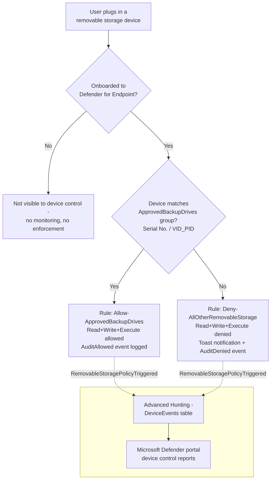

## The short version

Denies **all** removable USB storage devices on onboarded Windows endpoints by default, allowing
only a short, named allowlist of IT-issued, identity-verified backup/imaging drives (matched by
serial number or USB vendor/product ID) to read and write. This is a **device-identity** control -
it does not inspect file content at all - and is the direct companion to
*Endpoint DLP: Block USB Removable Media Exfiltration*'s **content-aware** control: that scenario stops regulated
data leaving on *any* USB drive; this one stops *any* USB drive that isn't on the approved list,
regardless of what is or isn't on the file being copied.

## Why this matters

Content-based DLP (this library's *Endpoint DLP: Block USB Removable Media Exfiltration*) cannot see *which device* a file moves
to - only whether the file's content matches a sensitive-information-type pattern. That leaves a
real gap: malware staged from an unmanaged drive, a bulk copy of files that individually don't
match any SIT pattern, or content in a format Endpoint DLP can't scan (encrypted archives,
unsupported file types - see that scenario's own the known limitations) all cross a USB port unimpeded by a
content-only control. Device-identity control closes that gap by asking a different question
entirely: not "is this content sensitive?" but "is this physical device one we've approved?" -
the same two-layer posture (content-aware + device-identity-aware) that regulators and auditors
increasingly expect for removable-media handling under GDPR Article 32, HIPAA's 45 CFR §164.312
media controls, PCI DSS Requirement 3, and SOC 2 CC6, none of which name this exact control but
all of which reference "media controls"/"physical safeguards" broadly enough to expect both
dimensions covered, not just one.

Two secondary drivers:
- **A defensible, closed allowlist for audit.** "Here is the exact list of drives with write
  access to any endpoint in scope, by serial number, and here is the log of every time each one
  was used" is a materially stronger answer to an auditor than "we block drives if the files on
  them look sensitive."
- **Coherence with the sibling scenario's exception model.** Both scenarios use the same "default
  block, one named group, audited not silently trusted" shape - an organization running both has one
  consistent mental model for removable-media controls, not two independently designed ones.

## How the control works



One Intune Windows Custom device configuration profile
(`Device Control - USB Removable Media Default-Deny Allowlist`), carrying seven OMA-URI settings
under `./Vendor/MSFT/Defender/Configuration/` - device control enable, scope-to-removable-storage,
fail-closed default, one approved-devices group, one catch-all group, and two mutually-exclusive
rules (allow/deny). Full rule-by-rule rationale: the design notes. Enforcement happens **locally on
the device** via the Defender for Endpoint sensor, driven by policy synced from Intune.

## What it takes

### Prerequisites

This is the first scenario in this library built on **Microsoft Defender for Endpoint device
control + Microsoft Intune**, not a Purview policy object - see [Licensing matrix, section 7](/docs/licensing-matrix/#7-adjacent-product-family-microsoft-defender-for-endpoint--intune-device-control-scenarios) for
the cross-cutting entitlement summary for this product family. Prerequisites below are grounded
directly against Microsoft Learn.

| Requirement | Minimum | Notes |
|---|---|---|
| Device control (Windows) | **Microsoft Defender for Endpoint Plan 1** (bundled in **Microsoft 365 E3**, or standalone) or higher | Device control is listed as a Plan 1 attack-surface-reduction capability; Plan 2 (bundled in Microsoft 365 E5) also includes it. |
| Device management | **Microsoft Intune** (any plan that includes device configuration profiles - bundled in Microsoft 365 E3/E5, or standalone Intune Plan 1) | This scenario deploys via an Intune Custom device configuration profile; Intune device enrollment/management is a separate prerequisite from Defender for Endpoint licensing. |
| Device onboarding | Devices onboarded to **Microsoft Defender for Endpoint** and enrolled in **Intune**, running anti-malware client `4.18.2103.3` or later | Not performed by this scenario's deploy script - same onboarding dependency the sibling *Endpoint DLP: Block USB Removable Media Exfiltration* scenario documents (shared onboarding package) |
| Supported OS | Windows 10/11 (client only - **device control is not supported on Windows Server**) | macOS device control uses a separate JSON/`mobileconfig` authoring path not covered by this scenario - see the design notes and the sibling scenario *Defender for Endpoint Device Control (macOS): USB Default-Deny Allowlist* |
| Role to author via the Intune portal (human operator, not this scenario's automation) | **Policy and Profile manager** Intune role, at minimum | Built-in Intune RBAC role; see [RBAC model, section 9](/docs/rbac-model/#9-microsoft-intune-rbac---a-fifth-system-for-intune-deployed-scenarios) |
| Automation identity | Entra app registration granted the Microsoft Graph **application** permission `DeviceManagementConfiguration.ReadWrite.All`, admin-consented | This is what actually authorizes this scenario's app-only Graph calls - the Intune RBAC role above governs human/portal access, not app-only Graph calls made with an admin-consented application permission |
| Dependency (not deployed by this scenario) | An Entra ID group scoping the **pilot** set of Windows endpoints (device group recommended), and the physical **approved backup drives'** serial numbers or VID/PID values | Must exist/be known before running `deploy/New-DeviceControlUsbAllowlistPolicy.ps1` - see the implementation steps |

> Verify current entitlement names and the Product Terms before a sales commitment - SKU names
> change. This scenario's licensing story (Defender for Endpoint + Intune) is intentionally kept
> in its own table above rather than folded into [Licensing matrix](/docs/licensing-matrix/)'s Purview-module
> table, since it isn't a Purview policy object - see that doc's the validation steps for the cross-cutting
> summary, including the CISO-relevant cost note that Microsoft 365 E3 alone (no Purview E5
> add-on) already covers both this scenario and its WPD-coverage sibling.

### Cost and licensing

- **No PAYG component.** Device control is bundled into Defender for Endpoint Plan 1 (itself
  bundled into Microsoft 365 E3) - see the prerequisites. No incremental per-seat cost for a tenant already
  licensed at E3 or above for other reasons.
- **Intune is a separate licensing line if not already present.** Unlike the sibling
  *Endpoint DLP: Block USB Removable Media Exfiltration* scenario (pure Purview/Exchange licensing), this scenario's deployment
  mechanism requires Intune device management specifically - confirm the target tenant already has
  Intune (bundled in Microsoft 365 E3/E5, or standalone) before selling this as a zero-incremental-cost add-on.
- **No additional Azure subscription required.**
- **Sizing note:** license only the users/devices in the device control assignment scope - this
  scenario's staged rollout means initial licensing exposure is limited to the pilot group,
  widening only after tuning.

## Proof it works

1. **Device onboarding/enrollment check** - confirm pilot devices show as onboarded in the
   Microsoft Defender portal and enrolled in Intune before assuming any functional test result -
   an unenrolled or unonboarded device silently ignores this policy entirely, the same
   "check enrollment before blaming the policy" caution the sibling scenario's the validation steps documents.
1. **Automated config check** - `./validate/Test-DeviceControlUsbAllowlistPolicy.ps1
   -ConfigPath ./deploy/config/device-control-usb-allowlist.sample.json` confirms the device
   configuration object and its seven OMA settings exist with the expected values, and that the
   pilot group assignment is present; exits non-zero on any hard failure (safe for a CI-style
   pre-flight).
2. **Profile sync check** - Intune admin center → **Devices** → **Configuration profiles** → the
   policy → **Device status**; confirm pilot devices show **Succeeded**, not **Pending** or
   **Error**, before running a functional test.
3. **Functional test (unapproved drive)** - from a pilot device, plug in a removable USB drive
   **not** on the approved list. Expect: read/write denied, a toast notification within the hour
   (device control's documented notification cadence), and a
   `RemovableStoragePolicyTriggered` event with `RemovableStoragePolicyVerdict = Deny` in Advanced
   Hunting.
4. **Functional test (approved drive)** - plug in a drive whose serial number/VID_PID is in the
   `approvedDevices` config list. Expect: read/write succeeds, and a `RemovableStoragePolicyTriggered`
   event with `RemovableStoragePolicyVerdict = Allow` still appears (the allow path is audited, not
   silent - why this matters, the design notes).
5. **Advanced Hunting query** (Microsoft Defender portal → **Advanced hunting**):
   ```kusto
   DeviceEvents
   | where ActionType == "RemovableStoragePolicyTriggered"
   | extend parsed = parse_json(AdditionalFields)
   | project Timestamp, DeviceName, Verdict = tostring(parsed.RemovableStoragePolicyVerdict),
       SerialNumberId = tostring(parsed.SerialNumber), VID_PID = strcat(tostring(parsed.VendorId), "_", tostring(parsed.ProductId))
   | order by Timestamp desc
   ```
   (Query pattern grounded directly from Microsoft's own worked example.)

   **Do not confuse this with `ActionType == "PnPDeviceBlocked"`** - that `ActionType` is emitted
   by a *different* Microsoft control (Windows device installation restrictions, the design notes),
   not this scenario's device control policy. An analyst querying the wrong `ActionType` will see
   zero results and may incorrectly conclude the policy isn't firing.

## Where it stops

- **`VID_PID` approves a product line, not one physical drive.** A `VID_PID` entry like
  `0781_5591` matches *every* drive of that make/model, not the specific unit issued to IT - for a
  true "these exact drives and nothing else" allowlist, use `SerialNumberId` per drive instead (or
  in addition). The sample config defaults to `SerialNumberId`; the design notes documents this
  tradeoff explicitly.
- **Device control has no content awareness at all.** This scenario says nothing about *what* an
  approved drive carries on or off the network - pair it with *Endpoint DLP: Block USB Removable Media Exfiltration* for content
  inspection on the approved path too; the two scenarios are complementary layers, not
  alternatives.
- **Group Policy and Intune device control cannot coexist on the same machine.** Microsoft's own
  FAQ states that if a device is covered by both, only the Group Policy setting applies
  - confirm no conflicting GPO-based device control policy exists on pilot
  devices before troubleshooting an apparently-ignored Intune assignment.
- **No native Graph resource for the portal's "Device Control profile" template was found and
  independently confirmed during this build** - this scenario deliberately uses the lower-level,
  fully-documented Custom OMA-URI mechanism instead. If Microsoft later publishes
  a confirmed schema for the native profile type, migrating to it would let a future revision
  reuse Intune's own reusable-settings groups instead of hand-built XML.
- **A device presenting as a Windows Portable Device (WPD) - many phones, tablets, and cameras in
  MTP/PTP mode - is completely invisible to this control, not merely unrestricted.** This
  scenario's `SecuredDevicesConfiguration` value scopes device control enforcement to the
  `RemovableMediaDevices` family only; Microsoft treats `WpdDevices` as a distinct device
  family with its own `PrimaryId`. A user who exfiltrates data by connecting a
  phone in MTP mode rather than a USB mass-storage drive bypasses this scenario's deny-by-default
  posture entirely - no audit event, no notification. Closing this requires explicitly adding
  `WpdDevices` to `SecuredDevicesConfiguration` (a multi-value, pipe-separated string per the CSP
  reference) and extending both the catch-all and approved-device groups to
  cover WPD-classified hardware - deliberately out of this scenario's initial scope because it changes the device-matching properties available (`FriendlyNameId`/`PrimaryId`
  only for WPD, not `SerialNumberId`/`VID_PID`), and is tracked as a follow-up in the project backlog
  rather than bundled in here unverified.
- **This scenario does not restrict Bluetooth, network shares, printing, or CD/DVD drives** -
  only `RemovableMediaDevices` (USB drives that create a disk letter) and, as just noted, not
  WPD-classified devices either. See the design notes for the full non-goals list, including the
  still-Preview BitLocker-encryption-state device control option.
- **A device not onboarded to Defender for Endpoint, or not Intune-enrolled, is invisible to this
  control entirely** - no error, no block, no audit event. Always confirm onboarding/enrollment
  status before concluding a functional test failure is a policy bug.
- **VERIFY (pilot tenant, before production reliance):** whether Intune's Custom OMA-URI profile
  PATCH semantics fully replace the `omaSettings` collection on an update, or merge/append -
  Microsoft's `Update windows10CustomConfiguration` reference documents `omaSettings` as an
  updatable property but does not state replace-vs-merge semantics explicitly. This scenario's
  `-Force` reconcile path assumes full replacement (sends the complete, freshly-built array on
  every PATCH); confirm this against a pilot tenant before relying on `-Force` to *remove* a
  previously-approved device from the allowlist, since a merge-not-replace behavior would leave a
  removed device's group entry stranded rather than deleted. Flagged inline in the deploy script's
  `.NOTES`.