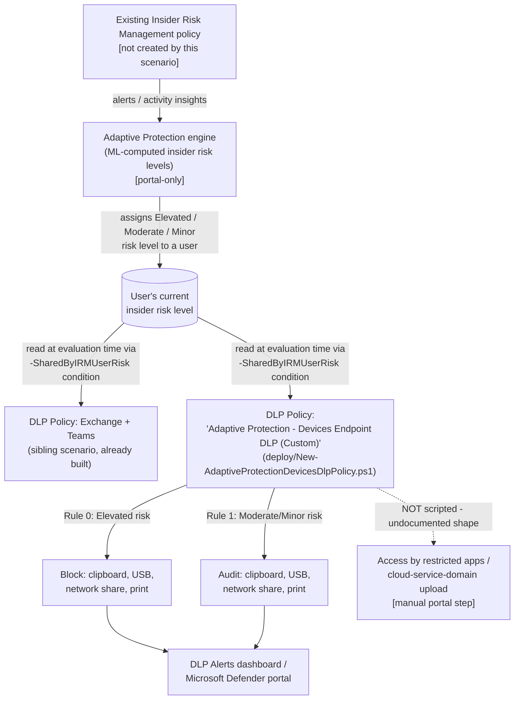

## The short version

Deploys the **Devices** half of Adaptive Protection: a Microsoft Purview Endpoint DLP policy that
automatically blocks clipboard copy, USB removable-media copy, network-share copy, and printing
for users Insider Risk Management currently assigns **Elevated** risk, and audits the same four
activities for **Moderate**/**Minor** risk - on any device already onboarded to Microsoft Purview
device management. As a user's insider risk level changes, this policy's evaluation of them
changes on the next matching activity, with no analyst action required for the first response.

**Scope, stated plainly up front:** Microsoft's own Quick Setup for this same policy type
restricts **six** activities; this scenario scripts the **four** with an independently-grounded
`-EndpointDlpRestrictions` action shape (clipboard, USB, network share, print) and deliberately
does not fabricate the remaining two ("Access by restricted apps," cloud/browser upload
restriction), whose rule-level action syntax is undocumented - see step 6 of the implementation steps and the known limitations before
representing this scenario as full Quick Setup parity to an organization.

## Why this matters

Same underlying driver as the Exchange/Teams sibling scenario (faster incident containment,
SOC 2/ISO 27001 control-automation evidence, analyst workload reduction via targeted rather than
blanket restrictions, cyber-insurance underwriting questions) - not repeated here. This scenario's
specific, additional contribution:

- **Closes a named, real bypass, not a theoretical one.** The sibling scenario's own Red Team
  review flagged the device channel as an active exfiltration path for a user already blocked from
  the network channel. Deploying both scenarios together removes that specific bypass rather than
  leaving it as an accepted residual risk.
- **Matches Microsoft's own documented reference architecture.** Microsoft's Quick Setup for
  Adaptive Protection creates a Devices policy alongside the Exchange/Teams one specifically
  because a single-location control is known to be incomplete for this use case - this scenario
  reproduces that same two-policy shape via the custom-setup path.

## How the control works

Full rule-by-rule rationale, including exactly what this scenario can and cannot script, is in
the design notes.

## What it takes

### Prerequisites

Full licensing detail and citations: [Licensing matrix, section 2](/docs/licensing-matrix/#2-master-capability--license-matrix). Summary for this scenario
(identical Adaptive Protection/IRM/role prerequisites to the Exchange/Teams sibling - see that
scenario's the prerequisites for the same rows, not repeated in full here):

| Requirement | Minimum | Notes |
|---|---|---|
| Adaptive Protection | **Microsoft 365 E5**, **Purview Suite**, or the underlying IRM + DLP add-ons | Same entitlement as the Exchange/Teams sibling scenario - no incremental license for this Devices policy specifically |
| Endpoint DLP (Devices) | **E5** | [Licensing matrix, section 2](/docs/licensing-matrix/#2-master-capability--license-matrix), DLP row |
| Feeder Insider Risk Management policy | Already deployed and generating alerts/insights | Not created by this scenario - see the Exchange/Teams sibling's own the prerequisites and the implementation steps |
| Adaptive Protection enabled, insider risk levels defined | Portal-only | Same one-time setup as the sibling scenario - do this once, both Devices and Exchange/Teams policies consume it |
| **Device onboarding** (Devices-specific, not needed by the Exchange/Teams sibling) | Target Windows/macOS devices already onboarded to Microsoft Purview device management | See *Endpoint DLP: Block USB Removable Media Exfiltration* (the prerequisites) for the full onboarding prerequisite - reused here, not repeated |
| **Advanced classification scanning and protection** (Devices-specific) | Turned ON in Endpoint DLP settings | Required for Adaptive Protection to work on Devices at all - portal-only, no PowerShell/Graph toggle found during this build |
| Role to configure Adaptive Protection settings/insider risk levels | **Insider Risk Management** or **Insider Risk Management Admins** role group | |
| Role to create/manage the DLP policy in this scenario | One of: **Compliance Administrator**, **Compliance Data Administrator**, **DLP Compliance Management**, **Global Administrator** | - see [RBAC model](/docs/rbac-model/) |
| Automation identity for the deploy script | App-only certificate authentication to Security & Compliance PowerShell | [Automation surface, section 3](/docs/automation-surface/#3-authentication-patterns---interactive-vs-unattended) |

> Verify current entitlement names against [Licensing matrix](/docs/licensing-matrix/) and the Product Terms
> before a sales commitment - SKU names change.

### Cost and licensing

- **No incremental license cost for a tenant already at E5/Suite for the feeder IRM policy and
  the Exchange/Teams sibling scenario** - this Devices policy consumes the same Adaptive
  Protection/Endpoint DLP entitlement, not a separate SKU ([Licensing matrix, section 2](/docs/licensing-matrix/#2-master-capability--license-matrix)).
- **Endpoint DLP requires per-device onboarding effort** (not a licensing cost, but a deployment
  cost) distinct from the Exchange/Teams sibling, which needs none - see
  *Endpoint DLP: Block USB Removable Media Exfiltration* (the cost and licensing notes) for that scenario's own device-onboarding
  cost discussion, reused here.
- **No PAYG component for this scenario specifically.**
- **No additional infrastructure cost** beyond the one-time deploy and periodic validate runs.

## Proof it works

1. **Automated checks** - `./validate/Test-AdaptiveProtectionDevicesDlpPolicy.ps1` confirms the
   policy and both rules exist with the correct location, `SharedByIRMUserRisk` GUIDs, and
   Block/Audit values on all four scripted settings. Exits non-zero on a hard failure.
2. **Manual checklist** - the same script prints a checklist for device onboarding, Advanced
   classification scanning and protection, Adaptive Protection enablement, insider risk levels,
   the feeder IRM policy, the two unscripted Quick Setup actions, and the interaction
   with *Endpoint DLP: Block USB Removable Media Exfiltration* if also deployed - none of which has an API
   this script can query.
3. **End-to-end functional test (non-production accounts/devices only)** - assign a test account
   a confirmed insider risk level, then attempt to copy a file to a USB drive, copy to a network
   share, copy to clipboard, or print it from an onboarded device. Confirm the expected rule fires:
   a block + notification for Elevated, or an audit-only entry for Moderate/Minor. Wait the full
   36-hour propagation window before concluding a test failed.
4. **Cross-check against the portal's own Adaptive Protection view** - Purview portal → **Insider
   Risk Management** → **Adaptive protection** → **Data Loss Prevention** tab should list this
   policy alongside the Exchange/Teams sibling.

## Where it stops

- **Two of Microsoft's six documented Quick Setup Devices actions are NOT scripted by this
  scenario: "Access by restricted apps" and "Upload to a restricted cloud service domain or
  access from unallowed browsers."** Microsoft's `New-DlpComplianceRule`/`Set-DlpComplianceRule`
  reference documents the `-EndpointDlpRestrictions` `UnallowedApps` `Setting` only as a mechanism
  to declare *which app* is restricted (`Value` = executable name, `value2` = friendly name) -
  never how to attach a Block/Audit *action* to that declaration at the rule level, and no
  `Setting` name for the cloud/browser restriction is documented anywhere this build found.
  Fabricating either shape would violate this library's grounding standard. This
  scenario's policy is therefore a **4-of-6-action subset** of Microsoft's full Quick Setup
  reference configuration - real, useful, and independently grounded for what it does cover, but
  not a complete substitute for Quick Setup's own output. step 6 of the implementation steps documents the manual portal
  completion step for an organization that wants full parity. **Re-grounded 2026-09-28** (Microsoft
  Learn MCP): still undocumented - the full `New-DlpComplianceRule` reference page was re-fetched
  and its `-EndpointDlpRestrictions` example list is unchanged (`Print`, `CopyPaste`,
  `ScreenCapture`, `RemovableMedia`, `NetworkShare`, `UnallowedApps` only). Two things worth
  recording for an operator who wants to check this directly rather than wait on documentation:
  (1) `-EndpointDlpRestrictions` requires Compliance Administrator or Compliance Data Administrator
  role membership in Microsoft Entra ID; (2) Microsoft's own reference points to
  `Get-PolicyConfig`/`Set-PolicyConfig` as the supported way to view and configure an
  organization's endpoint restrictions - a pilot-tenant `Get-PolicyConfig` call is the fastest
  path to confirming whether either missing `Setting` name actually exists, without guessing at
  one. (A superficially similar `unallowedBrowserMode` key documented on Microsoft's newer macOS 27
  Endpoint DLP page was checked and ruled out: it configures a different feature - the device
  profile's permission-notification behavior for cloud egress when browser context is unavailable -
  not a `-EndpointDlpRestrictions` rule-level `Setting`.)
- **`NotifyUser`/Block tension, disclosed not resolved.** Microsoft's cmdlet reference states
  Block or Warn values require the `NotifyUser` parameter to be supplied, yet the same documented
  Quick Setup rule table shows "User Notification: Off" for this exact Devices Block rule. This
  script supplies `-NotifyUser` on the Block rule to satisfy the documented cmdlet requirement.
  **VERIFY** the resulting end-user experience (does a visible toast/notification actually appear,
  despite Quick Setup's own table showing "Off"?) against a pilot tenant before describing this
  rule's user-facing behavior to a customer.
- **This scenario's rule is broader than Microsoft's Quick Setup output in file-type scope, but
  narrower in activity scope.** Quick Setup's own Devices rule adds a "File Type is" condition
  (Word processing, Spreadsheet, Presentation, Archive, Mail) alongside the risk-level condition;
  this scenario satisfies the same underlying prerequisite via Advanced classification scanning
  and protection instead, so its rule has **no file-type restriction at all** - it
  evaluates every file type on the four scripted activities, not just the five Quick Setup names.
  An organization that specifically wants Quick Setup's narrower, file-type-scoped behavior should add a
  File Type condition manually via the portal rather than assume this script already matches it.
- **Advanced classification scanning and protection has its own file-size and file-type limits**
  that indirectly bound how well this policy's underlying content classification works: a 64-MB
  limit on text files, a 50-MB limit on image files when OCR is enabled, and full support limited
  to Office (Word, Excel, PowerPoint) and PDF file types. A sensitive file
  outside these bounds may not benefit from cloud-based advanced classification even though this
  scenario's four scripted restrictions (which key off the risk-level condition, not content
  classification) still apply to it regardless - but any *content-based* condition an organization later
  layers on top of this rule (e.g. a sensitive-information-type condition) would inherit this
  limit.
- **`ContentFileTypeMatches`'s value syntax is undocumented** - both `New-DlpComplianceRule` and
  `Set-DlpComplianceRule`'s official reference pages carry unpublished placeholder text for this
  parameter. This scenario avoids it entirely by using the Advanced-classification-scanning
  prerequisite path instead rather than fabricating a File Type condition value.
- **Up to 36 hours before Adaptive Protection actions apply after first enabling** - identical,
  shared backend delay to the Exchange/Teams sibling scenario; not a property of this scenario's
  policy.
- **Interaction with *Endpoint DLP: Block USB Removable Media Exfiltration*, if deployed in the same tenant.**
  Microsoft documents: "If a user is targeted by a default Adaptive Protection Device DLP policy
  and is targeted by an independent Device DLP policy, only the actions of the *most restrictive*
  policy will be applied". This is safe-by-default behavior (the stricter
  outcome always wins), not a silent downgrade - but **VERIFY** the combined behavior in a pilot
  tenant rather than assuming two independently-reviewed policies compose exactly as expected once
  layered on the same user.
- **This policy alone still does not cover every exfiltration channel.** It closes the four
  device-level channels Microsoft's reference configuration names, but a user could still, for
  example, photograph a screen, or exfiltrate through a channel neither this policy nor the
  Exchange/Teams sibling inspects (e.g. a personal mobile hotspot on an unmanaged network path).
  Communicate this plainly: layered controls narrow the gap, they do not eliminate every possible
  exfiltration path.
- **This scenario does not configure Endpoint DLP device onboarding, Advanced classification
  scanning and protection, Adaptive Protection enablement, insider risk level definitions, or the
  feeder IRM policy** - all five are prerequisites this scenario's script assumes are already met
  and cannot verify are correctly configured beyond the manual checklist in
  `validate/Test-AdaptiveProtectionDevicesDlpPolicy.ps1`.