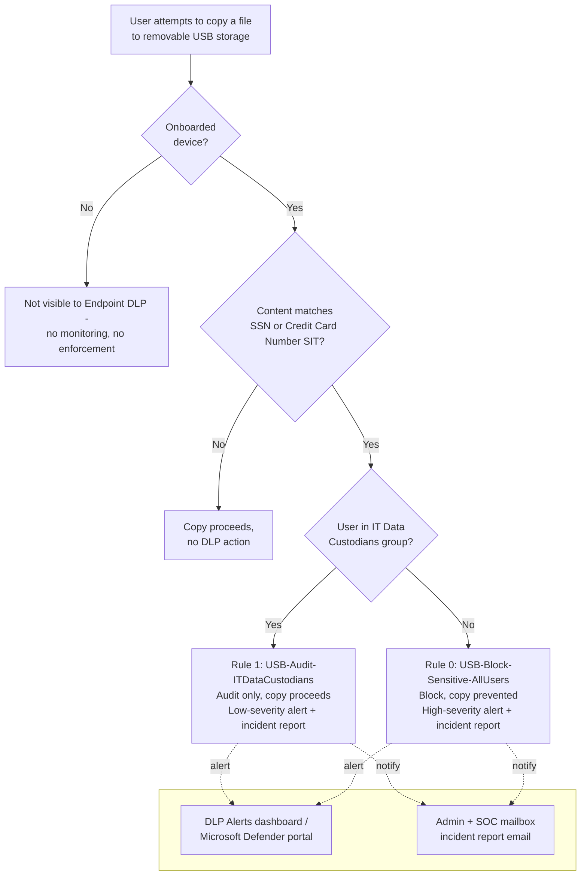

## The short version

Blocks copying of files containing U.S. Social Security Numbers or credit card numbers from
onboarded Windows/macOS endpoints to USB removable storage, using Microsoft Purview Endpoint Data
Loss Prevention (Endpoint DLP). A named exception path (audit-only, not blocked) is carved out for
the IT Data Custodians group, who perform legitimate offline backup/imaging work that a hard block
would otherwise break. This is the same classify-then-control pattern as
*Auto-Label Confidential PII in SharePoint & OneDrive*, extended from "label it
Confidential" to "stop it leaving via USB" using the same sensitive-content definition.

## Why this matters

Removable media is one of the oldest and least monitored data-exfiltration channels: a departing
or malicious employee, or simply careless handling, can move gigabytes of regulated data off a
managed endpoint in seconds, with no email, chat, or cloud-sharing trail at all. This is a control
area referenced across nearly every regulatory framework this library's organizations face - GDPR Article 32
("appropriate technical measures" against unauthorized disclosure), HIPAA Security Rule technical
safeguards (45 CFR §164.312, media controls), PCI DSS Requirement 3 (protect stored cardholder
data) and SOC 2 CC6 (logical access controls) - without any one of them mandating this specific
technical control by name. Organizations typically deploy this as a baseline data-loss-prevention control
alongside, not instead of, the classification work in *Auto-Label Confidential PII in SharePoint & OneDrive* and the
external-sharing controls in *PCI Teams Card-Data Exfiltration Block*.

Two secondary drivers this control also supports:
- **Audit/incident-response evidence** - every block and every IT Data Custodian copy is logged
  (alert, incident report, Activity explorer event), giving an investigator or auditor a record of
  what left the organization via removable media and when.
- **Consistency with the tenant's existing "sensitive" definition** - this scenario deliberately
  reuses the exact SIT pair *Auto-Label Confidential PII in SharePoint & OneDrive* uses to apply the Confidential
  label, so an organization running both scenarios has one coherent definition of "sensitive," not two
  independently tuned ones that can drift apart.

## How the control works

One DLP policy (`Endpoint DLP - Block USB Removable Media Exfiltration`), scoped to the
**Devices** (Endpoint DLP) location, containing two priority-ordered rules. Full rule-by-rule
rationale is in the design notes. Enforcement happens **locally on the device**, via the
Purview/Defender client, driven by policy synced from Security & Compliance PowerShell.

## What it takes

### Prerequisites

Full licensing detail and citations: [Licensing matrix](/docs/licensing-matrix/). Summary for this scenario:

| Requirement | Minimum | Notes |
|---|---|---|
| Endpoint Data Loss Prevention (DLP) | **Microsoft 365 E5/A5/G5**, **Microsoft Purview Suite/EDU/GOV/FLW**, **Microsoft Defender + Purview Suite FLW**, or **Microsoft 365 E5/A5/F5/G5 Information Protection & Governance** | Confirmed per-user for every endpoint user covered by the policy |
| Device onboarding | Devices must be onboarded to Microsoft Purview device management (shared onboarding with Microsoft Defender for Endpoint) and actively reporting into Activity explorer | Onboarding is a package deployment (local script up to 10 machines, Group Policy, Configuration Manager, or Intune) - **not** something this scenario's deploy script performs. See the implementation steps and the design notes |
| Supported OS | Windows 10/11 (specific builds per KB), Windows Server 2019+ (opt-in), or macOS (three latest released major versions) | Full current build matrix: `device-onboarding-overview` |
| Role to onboard devices / manage device monitoring | **Security Administrator**, **Compliance Administrator**, or **Global Administrator** (Microsoft Entra role) | Device management currently supports **only** Entra roles - Purview role groups (including DLP Compliance Management) do **not** grant onboarding or device-monitoring rights, even though they do grant policy-authoring rights (next row) |
| Role to author/edit DLP policies | **DLP Compliance Management** role (built into the *Compliance Administrator* / custom S&C role group) | See [RBAC model, section 3](/docs/rbac-model/#3-microsoft-entra-roles-that-map-into-purview) (Purview role groups). Note this is a **separate** permission from device onboarding above - an organization's DLP author may not be able to onboard devices, and vice versa |
| Automation identity | App registration with **Exchange Online Protection → `Exchange.ManageAsApp`** application permission, granted the DLP-authoring role group | Certificate-based app-only auth - see [Automation surface, section 3](/docs/automation-surface/#3-authentication-patterns---interactive-vs-unattended). Does not cover device onboarding, which has no PowerShell/Graph automation surface documented as of this writing (VERIFY at deploy time) |
| Dependency (not deployed by this scenario) | A mail-enabled security group or Microsoft 365 group for **IT Data Custodians** | Must exist before running `deploy/New-EndpointDlpUsbBlockPolicy.ps1` |

> Verify current entitlement names against [Licensing matrix](/docs/licensing-matrix/) (dated 2026-09-02) and the
> Product Terms before a sales commitment - SKU names change.

### Cost and licensing

- **No PAYG component.** Endpoint DLP is a per-user entitlement feature, not billed through
  Purview's Azure consumption model - see [Licensing matrix, sections 1 and 2](/docs/licensing-matrix/#1-the-two-billing-models-read-this-first). Cost is the marginal
  cost of moving any currently-sub-E5 endpoint users up to a qualifying SKU (the prerequisites above).
- **No additional Azure subscription required** for this control specifically.
- **Device onboarding has no separate license fee** beyond the qualifying per-user SKU, but it
  does carry an operational cost: package deployment to every in-scope endpoint via existing
  device-management tooling (Intune/Configuration Manager/Group Policy), which is real deployment
  effort an organization should budget for separately from the DLP policy authoring this scenario covers.
- **Sizing note:** license only the users in scope - typically all knowledge-worker endpoints
  handling regulated data, which in the enterprises this library targets is often already covered by
  an existing E5 estate.

## Proof it works

1. **Pilot-tenant first deploy (do this before the validation steps.2-4 in any tenant)** - the `-EndpointDlpRestrictions`
   `Setting`/`Value` strings this script uses are confirmed against Microsoft's official cmdlet
   reference, but run `deploy/New-EndpointDlpUsbBlockPolicy.ps1` once against a
   non-production/pilot tenant and confirm it completes without a parameter-validation error
   before relying on it elsewhere, as a routine first-deploy sanity check.
2. **Automated config check** - `./validate/Test-EndpointDlpUsbBlockPolicy.ps1
   -ITCustodiansGroupEmail 'it-custodians@contoso.com'` confirms the policy and both rules exist
   with the expected scoping, exits non-zero on any hard failure (safe for a CI-style pre-flight).
3. **Device onboarding check** - Purview portal → **Settings** → **Device onboarding** →
   **Devices**; confirm the target test device shows **Configuration status: Updated** and
   **Policy Sync status: Updated** before running a functional test - an unsynced device will not
   enforce the policy regardless of how correct the policy configuration is.
4. **Functional test (non-Custodian user)** - from a test account **not** in the IT Data
   Custodians group, on an onboarded device, attempt to copy a test file containing a documented
   test SSN or card-brand-issued test card number (never a real person's SSN or a real
   cardholder's PAN) to a USB drive. Expect: copy blocked, a toast notification on the endpoint,
   and a high-severity alert in the DLP Alerts dashboard.
5. **Functional test (IT Data Custodian)** - same test, from an account in the IT Data Custodians
   group. Expect: copy succeeds (not blocked), but a low-severity alert appears in the DLP Alerts
   dashboard.
6. **Functional test (non-sensitive content)** - copy a file with no SSN/card-number content to a
   USB drive from either account. Expect: copy succeeds, no DLP alert.
7. **Activity explorer** - Purview portal → Data loss prevention → Activity explorer → filter by
   policy name to confirm ongoing match volume once in `Enable` mode.

## Where it stops

- **`EndpointDlpRestrictions` `Setting`/`Value` strings are confirmed against Microsoft's official
  cmdlet reference.** Both the `New-DlpComplianceRule` and `Set-DlpComplianceRule` Learn reference
  pages state directly: "The available values for `<Value>` are: Audit, Block, Ignore, or Warn,"
  with a worked example `@{"Setting"="RemovableMedia"; "Value"="Block";}` matching this scenario's
  Rule 0 exactly/. The same pages confirm `Setting` names
  beyond `RemovableMedia` - `Print`, `CopyPaste`, `ScreenCapture`, `NetworkShare`, and
  `UnallowedApps` - none deployed by this scenario (see the non-restricted-activities bullet
  below). The Microsoft Security Blog Tech Community walkthrough previously cited as the primary
  source for this shape is retained only as a secondary, corroborating
  citation now that the official reference confirms the same shape directly.
- **`Warn` is a real, documented action, and is now available as an opt-in for the IT Data
  Custodians exception.** Both Learn pages state: "When you use the values Block or Warn in this
  parameter, you also need to use the NotifyUser parameter" - grouping `Warn` with the user-facing
  `Block` action rather than the silent `Audit`/`Ignore` pair. That is strong, but not literal,
  evidence that `Warn` is the enum value behind the portal's "Block with override" activity option
  (a user-facing justification prompt, not a hard block) - Microsoft's reference does not spell
  out that exact portal-name mapping. `deploy/New-EndpointDlpUsbBlockPolicy.ps1` now accepts
  `-ITExceptionAction Audit|Warn` (default `Audit`, unchanged prior behavior); choosing `Warn`
  justification-gates the IT Data Custodians path instead of silently logging it, at the cost of
  interrupting that team's legitimate workflow with a prompt on every matching copy. VERIFY (pilot
  tenant) the actual on-screen prompt behavior before describing it to a customer as "Block with
  override" by name.
- **Switching `-ITExceptionAction` from `Warn` back to `Audit` with `-Force` may leave stale
  `NotifyUser`/`NotifyPolicyTipCustomText` values on the live rule.** `Set-DlpComplianceRule` is
  not documented to clear a property simply because a later call omits it. Confirm those
  properties with `Get-DlpComplianceRule` after switching away from `Warn` rather than assuming
  `-Force` fully reverts every `Warn`-only property.
- **Device onboarding is a separate, non-scripted prerequisite.** This scenario's deploy script
  authors the DLP policy only; it assumes devices are already onboarded. A policy
  deployed against un-onboarded devices has no effect and generates no error - always confirm
  device onboarding/policy-sync status before concluding a functional test failure is
  a policy bug.
- **Encrypted or password-protected files are not scanned.** Endpoint DLP inspects file content;
  a password-protected archive or an encrypted container cannot be opened and classified, so a
  user who zips-with-password a sensitive file before copying it to USB will not trigger either
  rule. Microsoft documents dedicated policies for files it cannot scan
  (`dlp-create-policy-files-edlp-doesnt-scan`) - pair this scenario with that guidance if
  encrypted-archive exfiltration is a realistic threat in the target environment.
- **Unsupported/unscanned file types and photographs of screens are not covered.** As with every
  content-pattern DLP control in this library (see *PCI Teams Card-Data Exfiltration Block* (the known limitations)), a file
  type Endpoint DLP doesn't parse, or a photo taken of a screen with a phone, bypasses text-pattern
  matching entirely - this is an inherent limitation of content inspection, not a configuration
  gap this scenario can close.
- **This scenario does not restrict Print, clipboard, network share, Bluetooth, or RDP.** Only
  **copy to removable media** is restricted. Microsoft's official cmdlet reference now confirms
  the exact `Setting` names for four of those activities - `Print`, `CopyPaste` (clipboard),
  `ScreenCapture`, and `NetworkShare` - plus `UnallowedApps`; the design notes documents how to
  extend the `EndpointDlpRestrictions` array with one more `@{Setting=...; Value=...}` hashtable
  per activity using those confirmed names. Bluetooth and RDP restriction `Setting` names were not
  found in that reference and remain unconfirmed.
- **This scenario does not configure Removable USB device groups** (per-physical-device
  allowlisting of specific IT-issued encrypted backup drives by Vendor ID/Product ID/Instance ID,
  distinct from the group-based IT Data Custodians *user* exception this scenario does implement).
  A dedicated grounding pass confirmed the portal workflow end-to-end: create the
  group under **Purview portal → Settings → Data loss prevention → Endpoint DLP settings →
  Removable USB device groups** (name it, add each device by Vendor ID/Product ID/Instance ID, and
  give it an alias that appears only in the Purview console), then reference that group as an
  **exclusion in a rule's actions/exceptions** back in the policy editor. The pass found the *cmdlet-level* half genuinely undocumented rather than
  merely undiscovered: `Set-PolicyConfig` does expose a `-DlpRemovableMediaGroups` parameter
  (`PswsHashtable`) confirmed to exist in Microsoft's own reference, alongside four sibling
  device-group parameters (`-DlpPrinterGroups`, `-DlpNetworkShareGroups`, `-DlpAppGroups`,
  `-DlpExtensionGroups`) - but as of this pass, every one of those five parameters' descriptions,
  and the cmdlet's entire `EXAMPLES` section, are unpublished placeholder text in Microsoft's
  official reference; and `New-DlpComplianceRule`/`Set-DlpComplianceRule`
  expose no parameter of any kind for referencing a device group as a rule condition or exception
 / - confirming the rule-level reference step is portal-only
  too, not merely the device-registration step already flagged. Scripting this without a
  documented hashtable shape would mean fabricating dictionary keys this library's grounding standard
 does not permit, so it stays a portal-only workflow until Microsoft publishes
  one. Combining it with this scenario would let an organization scope the IT exception down from "any
  removable media, watched" to "only these specific backup drives, unrestricted" - tracked as a
  closed, investigated-not-built item in the project backlog rather than an open build item.
- **This scenario does not replace Microsoft Defender for Endpoint device control.** Device
  control can deny an unapproved USB device outright regardless of content (content-blind, at the
  driver level); Endpoint DLP is content-aware but requires the device to already be a recognized
  disk. An organization wanting "no unknown USB devices, period" needs device control in addition to this
  scenario, not instead of it - see the design notes.