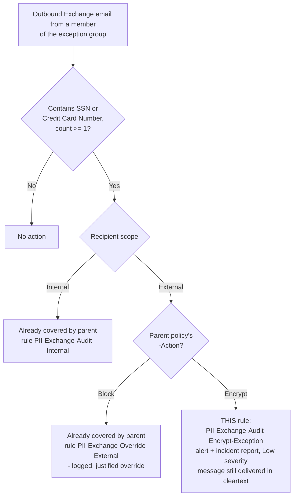

## The short version

A single, additive DLP rule that closes a specific, previously-documented gap in
*Exchange PII Exfiltration Block (Block or Encrypt)*: when that scenario is deployed with `-Action Encrypt`
**and** a business-exception group (`-ExceptionGroupEmail`), a member of that group who sends
matching PII content (SSN / Credit Card Number) to an external recipient currently leaves the
tenant in **cleartext with zero alert, incident report, or override record** - because
`EncryptRMSTemplate` is a non-halting action with no override concept, the exception group is
simply excluded from it (`ExceptIfFromMemberOf`) rather than routed through a logged path. This
companion adds one low-severity, non-blocking audit rule scoped to exactly that combination, so the
event is at least visible even though - by design, and by the base scenario's own accepted
trade-off - it is not blocked or encrypted.

## Why this matters

Same drivers as the parent scenario - **GDPR Article 32**, **CCPA/CPRA**, and **ISO/IEC 27001:2022
Annex A.5.12/A.8.2** - narrowed to a specific audit-trail-completeness gap: a control that is silent
for one specific, identifiable population (the exception group, in Encrypt mode) is a weaker
evidentiary position for a regulator or auditor than one where every matching event - enforced or
not - leaves a record. This companion doesn't change what data protection the base scenario
provides; it changes what the tenant can *prove happened* to that specific population.

## How the control works

One additional rule (`PII-Exchange-Audit-Encrypt-Exception`), added to the parent scenario's
**existing** policy (`PII DLP - Exchange External Send Control` by default) rather than a new
policy - see the design notes for why. Full architecture rationale: the design notes.

## What it takes

### Prerequisites

Full licensing detail and citations: [Licensing matrix](/docs/licensing-matrix/).

| Requirement | Minimum | Notes |
|---|---|---|
| *Exchange PII Exfiltration Block (Block or Encrypt)* already deployed | `-Action Encrypt` and a non-empty `-ExceptionGroupEmail` | This companion is meaningless without both - see the known limitations "Dependency, not a standalone control." |
| DLP for Exchange Online | **Microsoft 365 E3** (basic) | Same tier as the parent scenario - this companion adds only a `GenerateAlert`/`GenerateIncidentReport` rule, no advanced classification or Teams condition. |
| Role to author/edit the DLP rule | **Compliance Administrator**, **Compliance Data Administrator**, or a custom role group with the **DLP Compliance Management** role | [RBAC model, section 3](/docs/rbac-model/#3-microsoft-entra-roles-that-map-into-purview), DLP row - identical to the parent scenario. |
| Automation identity | App registration with **Exchange.ManageAsApp**, granted a role group with DLP Compliance Management | Certificate-based app-only auth - [Automation surface, section 3](/docs/automation-surface/#3-authentication-patterns---interactive-vs-unattended) |
| Tenant configuration: unified audit logging on | Audit log search enabled | Required for the alert/incident report this rule generates to be visible. |

> Verify current entitlement names against [Licensing matrix](/docs/licensing-matrix/) (dated 2026-09-02) and the
> Product Terms before a sales commitment - SKU names change.

### Cost and licensing

- **No incremental license cost.** This companion adds one `GenerateAlert`/`GenerateIncidentReport`
  rule to an already-licensed E3-tier DLP policy - no new capability tier, no Teams condition, no
  advanced classification.
- **No additional Azure subscription required.**
- **Effectively free to deploy relative to the risk it closes visibility on** - this is the cheapest
  fragment in this library's DLP module, by design: it is a pure compensating control for a gap the
  parent scenario already flagged rather than new detection surface.

## Proof it works

1. **Automated config check** - `./validate/Test-ExchangePiiEncryptModeAuditCompanion.ps1
   -ExceptionGroupEmail 'hr-benefits-ops@contoso.com'` confirms the rule exists on the target
   policy, scoped to the exception group and external recipients, non-blocking, with an alert and
   incident report configured. Exits non-zero on any hard failure.
2. **Dependency check** - the same validation script also confirms the parent scenario's own
   `PII-Exchange-Protect-External` rule still carries `ExceptIfFromMemberOf` for the same group
   (warns, does not fail, if not - see the known limitations: this companion is inert if the parent's exclusion is
   ever removed, since the exception-group traffic would then hit the Protect rule directly).
3. **Functional test.** While the parent policy is in simulation or enforced mode and running in
   Encrypt mode, send a test message containing a documented test SSN or card-brand test number
   (never real PII) from a member of the exception group to an external test mailbox you control.
   Confirm: (a) the message is delivered - normal Encrypt-mode exception behavior, unchanged by this
   companion; (b) a Low-severity alert/incident report now appears for
   `PII-Exchange-Audit-Encrypt-Exception`, where previously nothing did.
4. **Non-member control test.** Send the same content from a sender who is **not** a member of the
   exception group to an external recipient. Confirm the parent's own
   `PII-Exchange-Protect-External` rule still fires (encrypted, High-severity) and this companion's
   rule does **not** also fire for that sender - it should be exception-group-exclusive.
5. **Negative test - Block mode.** If the parent policy is ever switched to `-Action Block`, confirm
   (via the automated check, the known limitations) that this companion rule is flagged as no longer meaningful - it
   remains harmless (it never matches Block-mode traffic differently than before) but has no
   purpose in that mode, since `PII-Exchange-Override-External` already provides a logged path.

## Where it stops

- **This does not block or encrypt anything - it only makes the existing gap visible.** The
  underlying residual risk documented in *Exchange PII Exfiltration Block (Block or Encrypt)* (a member of the
  exception group can still send matching PII externally in cleartext in Encrypt mode) is
  **unchanged** by this companion. What changes is that the event is now recorded - an alert and
  incident report exist where previously there were none. An organization that needs the traffic actually
  stopped, not just logged, needs a different design (e.g., dropping the exception group entirely in
  Encrypt mode, or switching that population to `-Action Block` where the existing logged-override
  rule already applies).
- **Dependency, not a standalone control.** This fragment has no independent value without the
  parent scenario deployed in Encrypt mode with a non-empty `-ExceptionGroupEmail`. Deploying it
  against a Block-mode policy, or one without an exception group, creates a rule that can never
  match anything (no traffic reaches it - the parent's own rules already cover every other case) -
  the deploy script warns but does not block this, since an organization may deploy this companion ahead of
  switching the parent scenario to Encrypt mode.
- **Drift risk if the parent scenario's `-ExceptionGroupEmail` or `-PolicyName` changes without
  re-running this script.** This companion's rule hard-codes the exception-group SMTP address and
  target policy name at deploy time; it does not read the parent policy's live configuration to stay
  in sync. `validate/Test-ExchangePiiEncryptModeAuditCompanion.ps1` checks for this drift (comparing
  this rule's `FromMemberOf` against the parent's `PII-Exchange-Protect-External` rule's
  `ExceptIfFromMemberOf`) and warns, but does not auto-correct it.
- **Priority placement is explicit and deploy-script-computed, not portal-default.** Microsoft's own
  guidance states that for hosted-service locations like Exchange, a rule's priority is normally
  assigned in the order it is created within a policy; this script instead
  computes and passes an explicit `-Priority` (one past the current highest priority in the target
  policy) so a re-run is deterministic and idempotent rather than dependent on creation-order
  side effects. If an operator has manually reordered rules in the portal since this companion was
  last deployed, re-running with `-Force` will re-set this rule's priority to the computed value,
  not preserve a manual reordering - flagged here rather than silently overwritten without notice.
- **A match on this rule and a match on another rule in the same policy are independent - Microsoft
  documents that when content matches multiple rules, only the single most-restrictive rule's action
  is *enforced*, but every matching rule's match is still recorded in audit logs and DLP reports
 .** In this scenario's specific design, this rule is scoped so it is the *only*
  rule that can match its target population (exception-group members, external recipients, Encrypt
  mode) - see the Non-member control test in the validation steps step 4 - so this nuance should not, in practice,
  cause a double-count or a suppressed alert here. Documented for completeness because it is a
  genuine, non-obvious DLP evaluation behavior relevant to anyone extending this pattern to a
  population that could also match another rule in the same policy.
- **Config validation is not match validation.** `validate/
  Test-ExchangePiiEncryptModeAuditCompanion.ps1` confirms the rule is shaped correctly; it cannot
  confirm any email from the exception group has actually been logged. Always run the functional
  test in the validation steps before treating a green validation run as proof.