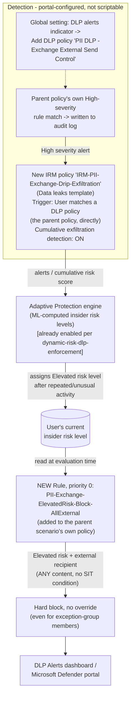

## The short version

Extends *Exchange PII Exfiltration Block (Block or Encrypt)* with a behavioral compensating control for the
gap that scenario's own the known limitations and the review notes deliberately left open: a sender who
splits a Social Security Number (SSN) or credit-card number (PAN) across multiple emails, or
otherwise obfuscates it so no single message matches the SSN/Credit Card Number sensitive
information type (SIT), defeats per-message DLP pattern matching entirely. This fragment wires a
dedicated Insider Risk Management (IRM) policy and Adaptive Protection to detect the *pattern* of
repeated, exfiltration-adjacent activity such an attempt produces, and automatically blocks that
sender from any further external Exchange mail once their insider risk level reaches **Elevated**
- closing the channel for continued attempts, not the first one.

## Why this matters

Same GDPR Article 32 / CCPA/CPRA / ISO/IEC 27001:2022 Annex A.5.12/A.8.2 driver as Part 1 - this
fragment doesn't add a new compliance citation, it strengthens the existing control's
defensibility. An auditor who asks "what stops someone from just splitting the SSN across two
emails?" is asking the single most common DLP bypass question; Part 1 alone answers "nothing, and
we document that." This fragment changes the answer to "a behavioral control that shuts off the
channel once the pattern is detected - not the first message, but every one after it," which is a
materially stronger, still-honest position for a board-level or audit narrative.

## How the control works

Unlike this fragment's Microsoft Teams sibling, **no Communication Compliance policy is required**
- Exchange Online is a natively supported "High Severity DLP Alert" indicator workload, so the
feeder IRM policy triggers directly off the parent scenario's own DLP policy. Full rule-by-rule
rationale and the reasoning behind this simplification are in the design notesa.

## What it takes

### Prerequisites

Full licensing detail and citations: [Licensing matrix](/docs/licensing-matrix/).

| Requirement | Minimum | Notes |
|---|---|---|
| *Exchange PII Exfiltration Block (Block or Encrypt)* already deployed | The named policy `PII DLP - Exchange External Send Control` with at least one existing rule | This fragment's deploy script errors out if the parent policy has no rules to compact around - see the design notes |
| Insider Risk Management + Adaptive Protection | **Microsoft 365 E5**, **Purview Suite**, or the underlying add-ons | Same entitlement *Dynamic Risk-Based DLP Enforcement* (the prerequisites) already documents in full. **This is a new licensing requirement beyond what Part 1 alone needs** - Part 1's own the cost and licensing notes notes DLP for Exchange is included at base **E3**; adding this fragment moves the overall deployment onto the E5/Purview Suite tier. See the cost and licensing notes below. |
| Adaptive Protection already enabled, with Elevated/Moderate/Minor risk levels defined | Portal-only prerequisite | Assumed already complete if *Dynamic Risk-Based DLP Enforcement* is deployed; if not, complete its the implementation steps Steps 1-3, 5 first |
| Role to configure IRM policies and the DLP-alerts indicator | **Insider Risk Management** or **Insider Risk Management Admins** role group | Same role used in *Dynamic Risk-Based DLP Enforcement* (the prerequisites) |
| Role to extend the DLP policy | **Compliance Administrator**, **Compliance Data Administrator**, or **DLP Compliance Management** | Same DLP-authoring roles used throughout this library |
| Automation identity for the deploy script | App-only certificate authentication to Security & Compliance PowerShell | [Automation surface, section 3](/docs/automation-surface/#3-authentication-patterns---interactive-vs-unattended) |

> Verify current entitlement names against [Licensing matrix](/docs/licensing-matrix/) and the Product Terms before
> a sales commitment - SKU names change.

### Cost and licensing

- **This fragment moves the overall deployment onto the E5/Purview Suite licensing tier.** Part 1
  alone (*Exchange PII Exfiltration Block (Block or Encrypt)* (the cost and licensing notes)) deliberately stays on base **E3** by avoiding
  advanced classification or Teams conditions. Adding this fragment requires Insider Risk
  Management and Adaptive Protection, both **Microsoft 365 E5 / Purview Suite** capabilities - a
  organization choosing this fragment accepts that tier uplift for the whole deployment, not just an
  incremental add-on charge. State this plainly when quoting: "Part 1 alone" and "Part 1 + Part 2"
  are materially different licensing conversations.
- **No incremental license cost beyond that tier uplift** - this fragment reuses the same
  E5/Purview Suite entitlement for IRM, Adaptive Protection, and DLP that
  *Dynamic Risk-Based DLP Enforcement* and the Teams sibling fragment already require. No PAYG component.
- **No additional Azure subscription required.**

## Proof it works

1. **Automated config check** - `./validate/Test-ExchangePiiElevatedRiskBlock.ps1` confirms the
   new rule exists at priority 0 with the correct condition/action, and that every other rule on
   the parent policy was compacted to unique, contiguous priorities starting at 1 without their
   own conditions being altered. Exits non-zero on a hard failure.
2. **Manual checklist** - the same script prints a checklist for everything it has no API to query
   (Exchange DLP-alerts indicator enabled and pointed at the parent policy, feeder IRM policy
   configuration, Adaptive Protection scope) - see its output.
3. **End-to-end functional test (non-production accounts only, pilot tenant) - VERIFY, see the known limitations:**
   a. Confirm a test account's insider risk level is currently **not** Elevated (Purview portal →
      Insider Risk Management → Users).
   b. Drive that account's insider risk level to Elevated - either by waiting for a real detection
      from the feeder policy's trigger (repeated High-severity matches against the parent DLP
      policy), or via **Start scoring activity for users** (Purview portal → Insider Risk
      Management → Policies) to manually add the test account to the feeder policy for a defined
      window, then generating qualifying activity.
   c. From that account, attempt to send a test message (any content, containing no real PII) to
      an external test mailbox. Expect: **blocked**, no override offered, even if the account is
      an `-ExceptionGroupEmail` member.
   d. From the same account, attempt an internal-only message. Expect: **not** blocked by this
      rule (external-only scope) - the parent scenario's own `PII-Exchange-Audit-Internal` rule
      still applies if the content matches SSN/Credit Card Number.
4. **Evidence for review** - confirm the blocked event appears in the DLP Alerts dashboard /
   Microsoft Defender portal under rule name `PII-Exchange-ElevatedRisk-Block-AllExternal`, and
   cross-reference the triggering IRM alert by user and timestamp (operations and tuning - no shared correlation ID
   exists, same manual-correlation caveat *Dynamic Risk-Based DLP Enforcement* (operations and tuning) already
   documents).

## Where it stops

- **This control does NOT detect or block a single, perfectly-executed split-SSN/PAN message.** No
  Microsoft Purview capability performs cross-message content reconstruction or correlation as of
  this writing (grounded during this build - see the design notes). This fragment is a behavioral
  compensating control that shortens the *exposure window after* a qualifying signal, not a fix
  for the underlying per-message pattern-matching limitation. State this plainly to an organization -
  overclaiming here is the single easiest way to lose credibility with a technical reviewer.
- **Zero detectable signal against a maximally disciplined attacker.** If a sender splits an
  SSN/PAN finely enough that *no single message* ever contains a recognizable fragment (e.g., one
  digit per message) and generates no other exfiltration-type activity during the attempt, then
  neither the parent DLP policy's High-severity alert nor any other Cumulative Exfiltration
  Detection indicator this fragment relies on produces any scored signal for that user at all -
  Adaptive Protection has nothing to elevate. This control's real-world value is bounded to senders
  whose evasion attempt is imperfect (some fragment still trips a SIT, or the attempt is paired
  with other exfiltration-type behavior Cumulative Exfiltration Detection already tracks), not to a
  theoretically perfect one. Communicate this bound plainly - it is the honest limit of what any
  currently-documented Purview capability can do here, not a gap specific to this fragment's
  design.
- **The parent scenario's `-ExceptionGroupEmail` population in `-Action Encrypt` mode gets ZERO
  additional protection from this fragment, by construction.** The parent scenario's own the known limitations already documents that an exception-group member's matching external mail is a "silent
  exception" in Encrypt mode - excluded from `PII-Exchange-Protect-External` (High severity) via
  `ExceptIfFromMemberOf`, with no equivalent override rule created (Encrypt mode has no
  `PII-Exchange-Override-External` rule at all). Unless
  *Exchange PII Exfiltration Block: Encrypt-Mode Audit Companion* is *also* deployed, that
  traffic generates **no alert of any severity**; even with the companion deployed, its rule is
  fixed at **Low** severity by design (routine-audit priority for expected, approved-exception
  traffic). This fragment's feeder IRM policy only triggers on **High**-severity alerts from the
  parent policy - so a compromised or malicious exception-group member sending
  split-SSN/PAN content externally in Encrypt mode never accumulates the signal this fragment relies
  on, no matter how much they send. **This is not a gap this fragment can close without changing the
  companion scenario's own severity default** (a decision that scenario's own docs already justify
  for its stated purpose - routine-exception visibility, not high-risk detection - and this
  fragment does not relitigate). An organization running `-Action Encrypt` with an exception group who wants
  this fragment's protection to actually cover that population should raise the companion rule's
  `-ReportSeverityLevel` to `High` (a parameter that script already exposes) as a prerequisite,
  understanding the resulting trade-off (routine exception traffic now triaged at the same priority
  as this fragment's feeder trigger).
- **A user can reach Elevated risk - and be fully blocked from external Exchange sharing by this
  rule - from activity that has nothing to do with SSN/PAN data.** Cumulative Exfiltration
  Detection scores *all* enabled indicators for an in-scope user, not just repeated matches against
  the parent DLP policy. A legitimate bulk SharePoint migration, a large but authorized external
  file share, or the Teams sibling fragment's own feeder-policy activity could independently drive
  a user to Elevated and trigger this rule with no PII-data involvement at all. The
  incident-response runbook exists specifically to catch this - always confirm the
  underlying IRM alert's actual triggering source before assuming a PII-data drip-feed pattern.
- **Cumulative exfiltration detection is evaluated ~daily, not in real time** - Microsoft describes
  it as identifying "unusual levels of risk activities when evaluated daily".
  Combined with Adaptive Protection's own up-to-36-hour propagation delay after first enabling
  (already documented in *Dynamic Risk-Based DLP Enforcement* (the known limitations)), the realistic end-to-end
  exposure window between a user's first qualifying High-severity alert and this rule actually
  blocking them can be **on the order of one to two days**, not minutes. Track this via the KPI in
  operations and tuning rather than assuming near-real-time response.
- **No shared correlation ID between a DLP incident report and the IRM alert that produced the
  triggering risk level.** Same manual-correlation-by-user-and-timestamp caveat
  *Dynamic Risk-Based DLP Enforcement* (operations and tuning) already documents - not resolved by this fragment.
- **This rule does not block internal Exchange mail.** Deliberately scoped to external recipients
  only - an Elevated-risk user can still email colleagues internally. See the design notes for
  why this is the proportionate choice, not an oversight.
- **VERIFY (pilot tenant): rule priority compaction behavior.** This fragment's deploy script
  explicitly reassigns every other rule's priority rather than relying on `New-DlpComplianceRule
  -Priority 0` to auto-shift existing rules, because Microsoft's cmdlet reference does not document
  whether that auto-shift happens - see `deploy/New-ExchangePiiElevatedRiskBlock.ps1` `.NOTES`.
  This is the same open item already flagged for the Teams sibling fragment's analogous
  reprioritization step. Confirm the resulting priority order with
  `validate/Test-ExchangePiiElevatedRiskBlock.ps1` after deployment.
- **VERIFY (pilot tenant or a future Microsoft Learn pass): no single Microsoft-published example
  validates this exact end-to-end composition** (a named DLP policy's High-severity alerts →
  Data-leaks direct trigger → Cumulative exfiltration scoring → Adaptive Protection → a rule on
  that same named policy). Every individual piece is independently grounded; the combination has
  not been run against a live tenant during this build. See the design notesb.
- **Inherits every "VERIFY before go-live" item already flagged in the parent scenario's and
  *Dynamic Risk-Based DLP Enforcement*'s own Known Limitations sections** - this fragment does not
  re-verify `BlockAccess` behavior for `ExchangeLocation` rules, the `AccessScope`-only condition
  form, or the exact `Get-RMSTemplate` name used when the parent policy runs `-Action Encrypt`; all
  three are still open VERIFY items in those scenarios' own docs.