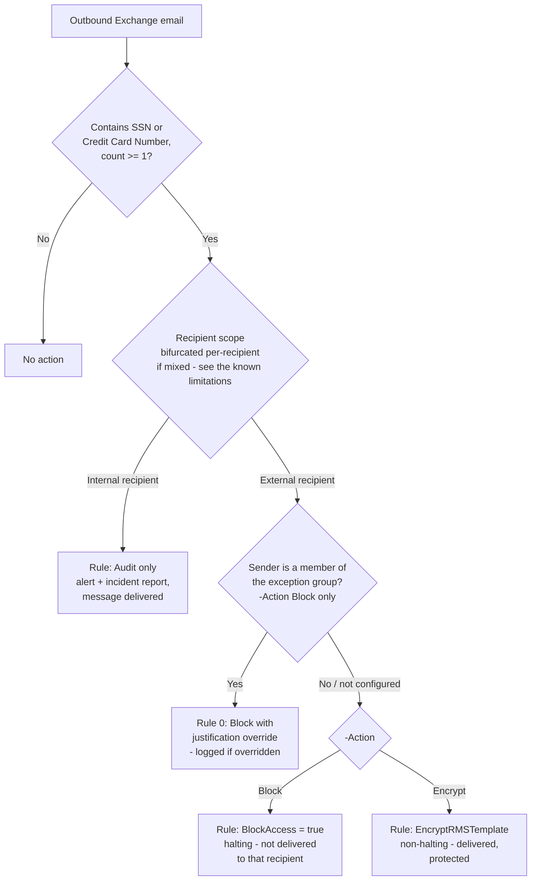

## The short version

A content-based Microsoft Purview DLP policy that inspects outbound Exchange Online email for
U.S. Social Security Numbers and credit card numbers, and - for mail addressed to at least one
**external** recipient - either **hard-blocks delivery** or **forces Microsoft Purview Message
Encryption**, per an operator choice. A nominated business-exception group can be given a logged,
justified override path (Block mode only). Internal-only sharing of the same content is
audit-only, matching this library's staged-rollout posture. Unlike this library's Information
Protection auto-labeling scenarios, this policy never references a sensitivity label - it acts on
content directly and independently of whether any label has been applied.

## Why this matters

Same drivers as the sibling scenarios in this library - **GDPR Article 32**, **CCPA/CPRA**, and
**ISO/IEC 27001:2022 Annex A.5.12/A.8.2** - but aimed specifically at the moment data leaves the
tenant, not just at classifying it. *Auto-Label Confidential PII in Exchange Email* (the known limitations) documents the
gap this scenario exists to close: by default, an internal-sender message matching SSN/Credit Card
Number conditions is labeled Confidential, but a message to an **external** recipient leaves the
tenant in cleartext unless a separate Rights Management owner is configured on that policy. A
regulator or auditor evaluating "what actually stops this data from leaving the company" needs an
answer that doesn't depend on a label's side effects - this scenario is that answer.

## How the control works

One DLP policy (`PII DLP - Exchange External Send Control`), two or three rules depending on
parameters, deployed as a named custom policy rather than the built-in **U.S. Patriot Act**
template it structurally overlaps with - see the design notesa for why. Full architecture rationale:
the design notes.

## What it takes

### Prerequisites

Full licensing detail and citations: [Licensing matrix](/docs/licensing-matrix/).

| Requirement | Minimum | Notes |
|---|---|---|
| DLP for Exchange Online | **Microsoft 365 E3** (basic) | This scenario uses only built-in sensitive information types and standard conditions - no advanced classification, no Teams - so it does not require the E5-tier uplift [Licensing matrix](/docs/licensing-matrix/) DLP row notes for advanced classification/Teams. |
| `-Action Encrypt` mode (Microsoft Purview Message Encryption / `EncryptRMSTemplate`) | Included in the same **Office 365 / Microsoft 365 Enterprise E3 or E5** entitlement - no extra license for the basic Encrypt-Only/Do Not Forward templates this scenario uses | Only the **Advanced** Message Encryption add-on (expiration, revocation, custom branding) needs a higher tier - not used by this scenario. |
| Azure Rights Management activated | Usually active by default for eligible plans | Prerequisite for `-Action Encrypt` only. Confirm with `Get-IRMConfiguration` (`AzureRMSLicensingEnabled = $true`); see the design notes and Microsoft's "Set up Message Encryption" guide. |
| Role to author/edit the DLP policy and rules | **Compliance Administrator**, **Compliance Data Administrator**, or a custom role group with the **DLP Compliance Management** role | [RBAC model, section 3](/docs/rbac-model/#3-microsoft-entra-roles-that-map-into-purview), DLP row. |
| Automation identity | App registration with **Exchange.ManageAsApp**, granted a role group with DLP Compliance Management | Certificate-based app-only auth - [Automation surface, section 3](/docs/automation-surface/#3-authentication-patterns---interactive-vs-unattended) |
| Business-exception group (optional) | An existing mail-enabled security group or Microsoft 365 group | Not created by this scenario - see `-ExceptionGroupEmail` in `deploy/New-ExchangePiiDlpPolicy.ps1` |
| Tenant configuration: unified audit logging on | Audit log search enabled | Required for DLP Alerts / Activity Explorer / incident reports |

> Verify current entitlement names against [Licensing matrix](/docs/licensing-matrix/) (dated 2026-09-02) and the
> Product Terms before a sales commitment - SKU names change.

### Cost and licensing

- **No PAYG component for M365 mail.** Base DLP for Exchange is included at **E3**, not E5 - this
  scenario deliberately avoids advanced classification or Teams conditions that would raise the
  tier, per [Licensing matrix](/docs/licensing-matrix/) DLP row. This is a genuine cost advantage over
  *PCI Teams Card-Data Exfiltration Block*, which needs E5 for Teams DLP.
- **`-Action Encrypt` adds no incremental license cost** for the basic templates this scenario
  uses (Encrypt-Only / Do Not Forward) - included in the same E3/E5 entitlement as base Message
  Encryption. Only Advanced Message Encryption (not used
  here) requires a higher tier.
- **No additional Azure subscription required.**
- **Sizing note:** `ExchangeLocation = All` means every licensed mailbox is in scope by default -
  no incremental licensing decision beyond the tenant's existing E3/E5 population.

## Proof it works

1. **Automated config check** - `./validate/Test-ExchangePiiDlpPolicy.ps1 -Action Block` (or
   `-Action Encrypt`, matching deploy) confirms the policy and rules exist with the expected
   recipient scope, action, and (if configured) exception-group wiring. Exits non-zero on any hard
   failure. Proves the policy is *shaped* correctly, not that it is *matching real mail* - do steps
   2-5 before trusting it in production.
2. **Simulation results** - Purview portal → Data loss prevention → Policies → select the policy →
   **Activity** / **Insights** tab, reviewing matches from simulation-mode traffic.
3. **Functional test - external block/encrypt.** While in simulation or enforced, send a test
   message containing a documented test SSN or card-brand test number (never real PII) from an
   in-scope mailbox to an external test mailbox you control. In Block mode, confirm the sender
   receives a policy-tip/NDR-style notice and the message is not delivered externally. In Encrypt
   mode, confirm the external recipient receives a protected message (Encrypt-Only prompts for a
   one-time passcode or Microsoft account sign-in) rather than plaintext.
4. **Functional test - internal audit.** Send the same test content to an internal-only recipient.
   Confirm the message is delivered normally and an alert/incident report is generated (audit, not
   block).
5. **Override test (Block mode + exception group only).** Send matching content from a member of
   the exception group to an external test recipient. Confirm the policy tip offers an override
   with justification, and confirm the resulting override is visible in the DLP Alerts /
   incident-report history - this is the control that makes the exception auditable rather than
   silent.
6. **Bifurcation test.** Send one message with both an internal and an external recipient,
   containing matching content. Confirm the internal recipient still receives their copy
   (audited) while the external copy is blocked/encrypted independently - see the design notes and
   section 11 below.
7. **Enforcement confirmation** - after moving to `-Mode Enable`, re-run the automated config
   check and confirm it reports `Mode: Enable` rather than a `Test*` value.

## Where it stops

- **Single-message evaluation boundary - no cross-message correlation.** A PAN or SSN split across
  two separate emails, or spelled out to defeat pattern matching, is not detected by this policy -
  the same accepted, documented residual risk as *PCI Teams Card-Data Exfiltration Block* (Red Team
  finding 1). Cross-message behavioral detection is a different capability
  (*PCI Teams Exfiltration Block, Part 2: Split/Obfuscated PAN Compensating Control*'s Adaptive Protection /
  IRM pattern), not something this content-based DLP rule alone can provide.
- **Bifurcation means "one message" is not always "one decision."** A message to a mixed
  internal/external recipient list is split into independent forks per recipient before rules
  evaluate it, each generating its own alert/incident report. An operator
  reviewing a single incident report should not assume it represents the fate of the whole
  message - the internal recipient(s) may have received their copy normally while the external
  fork was blocked or encrypted. the design notes covers this in full.
- **Exception-group handling differs by `-Action`, and the Encrypt-mode version is a silent
  exception, not a logged override.** In Block mode, the exception group gets a
  block-with-justification override - every use is logged. In Encrypt mode, the exception group is
  simply excluded from the encrypt rule (`ExceptIfFromMemberOf`) because a non-halting action has
  no override concept to log against. **This means a member of the exception group in Encrypt mode
  sends matching content to an external recipient in cleartext, with no alert, no incident report,
  and no override record** - a genuine, unmitigated gap for that specific combination, flagged as
  a Red Team finding in the review notes. An organization that needs Encrypt mode **and** a logged exception
  path should not use `-ExceptionGroupEmail` as designed here without a compensating control (e.g.,
  a separate low-severity audit rule scoped to `FromMemberOf` the same group).
- **Encrypt-Only protects the exfiltration path, not what the recipient does after decrypting.**
  The default `-EncryptTemplateName 'Encrypt-Only'` imposes no forward/print/reply restriction
  - a legitimate external recipient can decrypt the message and then forward
  its plaintext content onward with no further control from this scenario. An organization whose threat
  model treats the external recipient themselves as a risk (not just the network path) should
  deploy with `-EncryptTemplateName 'Do Not Forward'` instead, accepting that template's usage-rights restrictions. See the design notes for the full trade-off.
- **`-Action Encrypt`'s default RMS template name is not independently confirmed for every
  tenant.** `Encrypt-Only` is a real, Microsoft-documented ad-hoc template automatically available
  once Message Encryption is active, but neither that documentation nor the
  `Get-RMSTemplate` reference gives a canonical, byte-exact `Name` property value guaranteed
  identical across tenants. **VERIFY** the exact name in your tenant (`Get-RMSTemplate -ResultSize
  Unlimited | Select-Object Name`) before relying on the default - the deploy script's pre-flight
  check fails clearly rather than silently misconfiguring the rule if the name doesn't match, but
  a mismatch still blocks a first deploy until corrected.
- **No worked Microsoft example combines `-AccessScope NotInOrganization` with `BlockAccess`/
  `EncryptRMSTemplate` for this exact Exchange SIT pair.** Every individual parameter is confirmed
  from official Microsoft Learn references (the design notes References), and the pattern directly
  mirrors *PCI Teams Card-Data Exfiltration Block*'s own combination for Teams (there also flagged as unconfirmed
  by a Teams-specific worked example) - but **VERIFY** by running the functional tests in section 7
  before relying on `-Mode Enable` in production, the same standard already applied to that
  sibling scenario.
- **Content-based, so no shared audit trail with the auto-labeling scenario.** This policy's own
  incident reports/alerts and *Auto-Label Confidential PII in Exchange Email*'s Activity Explorer entries are
  two independent signals for potentially the same message - deliberate, per the design notes, but
  an analyst correlating "was this message labeled AND blocked/encrypted" needs to check both
  surfaces, not one unified dashboard.
- **Config validation is not match validation.** `validate/Test-ExchangePiiDlpPolicy.ps1` confirms
  the policy and rules are shaped correctly; it cannot confirm any email has actually been
  blocked, encrypted, or audited. Always run the functional tests in the validation steps before treating a green
  validation run as end-to-end proof.
- **Same U.S.-centric SIT scope caveat as every sibling scenario.** SSN and Credit Card Number are
  a representative starter set, not jurisdiction-complete personal-data coverage - see
  *Auto-Label Confidential PII in SharePoint & OneDrive* (why this matters) for the full discussion (not repeated here to
  avoid drift between multiple copies of the same caveat).