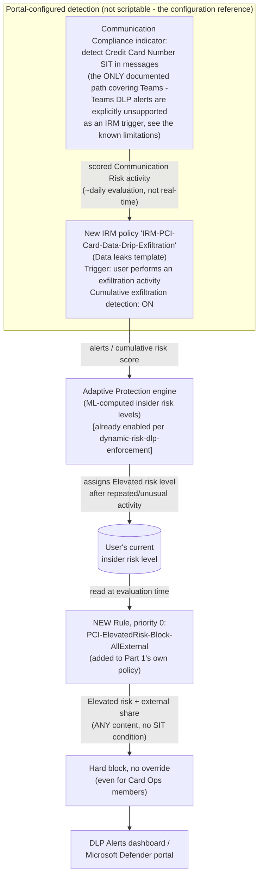

## The short version

Extends *PCI Teams Card-Data Exfiltration Block* with a behavioral compensating control for the
one gap that scenario's own Red Team review flagged and deliberately left open: a sender who
splits a credit-card number (PAN) across multiple Teams messages, or otherwise obfuscates it so
no single message matches the Credit Card Number sensitive information type (SIT), defeats
per-message DLP pattern matching entirely. This fragment wires a dedicated Insider Risk
Management (IRM) policy and Adaptive Protection to detect the *pattern* of repeated,
exfiltration-adjacent activity such an attempt produces, and automatically blocks that sender
from any further external Teams sharing once their insider risk level reaches **Elevated** -
closing the channel for continued attempts, not the first one.

## Why this matters

Same PCI DSS v4.0.1 Requirement 4.2 driver as Part 1 - this fragment doesn't add a new compliance
citation, it strengthens the existing control's defensibility. A QSA (Qualified Security Assessor)
or auditor who asks "what stops someone from just splitting the number across two messages?" is
asking the single most common DLP bypass question; Part 1 alone answers "nothing, and we document
that." This fragment changes the answer to "a behavioral control that shuts off the channel once
the pattern is detected - not the first message, but every one after it," which is a materially
stronger, still-honest position for a board-level or audit narrative.

## How the control works

Full rule-by-rule rationale and the Teams-coverage constraint that shapes this design are in
the design notes.

## What it takes

### Prerequisites

Full licensing detail and citations: [Licensing matrix](/docs/licensing-matrix/). This fragment adds no new
licensing requirement beyond what Part 1 and *Dynamic Risk-Based DLP Enforcement* already require - Adaptive Protection, DLP for Teams, and Insider
Risk Management are all built on the same Microsoft 365 E5 / Purview Suite entitlement tier.

| Requirement | Minimum | Notes |
|---|---|---|
| *PCI Teams Card-Data Exfiltration Block* already deployed | The named policy `PCI DSS - Teams Card Data Exfiltration Block` with its original three rules | This fragment's deploy script errors out if the parent policy or its rules aren't found - see the design notes |
| Insider Risk Management + Adaptive Protection | **Microsoft 365 E5**, **Purview Suite**, or the underlying add-ons | Same entitlement *Dynamic Risk-Based DLP Enforcement* (the prerequisites) already documents in full |
| Communication Compliance (for the SIT-in-Teams-messages indicator) | Included in the same E5/Purview Suite entitlement | This fragment enables one specific Communication Compliance indicator, not a standalone Communication Compliance deployment - see *Workplace Harassment & Code of Conduct* for that module's own scenario |
| Adaptive Protection already enabled, with Elevated/Moderate/Minor risk levels defined | Portal-only prerequisite | Assumed already complete if *Dynamic Risk-Based DLP Enforcement* is deployed; if not, complete its the implementation steps Steps 1-3, 5 first |
| Role to configure IRM policies and Communication Compliance indicators | **Insider Risk Management** or **Insider Risk Management Admins** role group | Same role used in *Dynamic Risk-Based DLP Enforcement* (the prerequisites) |
| Role to extend the DLP policy | **Compliance Administrator**, **Compliance Data Administrator**, or **DLP Compliance Management** | Same DLP-authoring roles used throughout this library |
| Automation identity for the deploy script | App-only certificate authentication to Security & Compliance PowerShell | [Automation surface, section 3](/docs/automation-surface/#3-authentication-patterns---interactive-vs-unattended) |

> Verify current entitlement names against [Licensing matrix](/docs/licensing-matrix/) and the Product Terms
> before a sales commitment - SKU names change.

### Cost and licensing

No incremental license cost beyond what Part 1 and *Dynamic Risk-Based DLP Enforcement* already
require - this fragment reuses the same E5/Purview Suite entitlement for IRM, Adaptive
Protection, DLP, and the one Communication Compliance indicator it enables. No PAYG component.

## Proof it works

1. **Automated config check** - `./validate/Test-PciElevatedRiskTeamsBlock.ps1` confirms the new
   rule exists at priority 0 with the correct condition/action, and that Part 1's three original
   rules were re-prioritized without their own conditions being altered. Exits non-zero on a hard
   failure.
2. **Manual checklist** - the same script prints a checklist for everything it has no API to
   query (Communication Compliance indicator enabled, feeder IRM policy configuration, Adaptive
   Protection scope) - see its output.
3. **End-to-end functional test (non-production accounts only, pilot tenant):**
   a. Confirm a test account's insider risk level is currently **not** Elevated
      (Purview portal → Insider Risk Management → Users).
   b. Drive that account's insider risk level to Elevated - either by waiting for a real
      detection from the feeder policy's indicators, or via **Start scoring activity for users**
      (Purview portal → Insider Risk Management → Policies) to manually add the test account to
      the feeder policy for a defined window, then generating qualifying activity.
   c. From that account, attempt to send a Teams message (any content) to an external guest.
      Expect: **blocked**, no override offered, even if the account is a Card Operations group
      member.
   d. From the same account, attempt an internal Teams message. Expect: **not** blocked by this
      rule (external-only scope) - Part 1's own Rule 2 (audit-internal) still applies if the
      content matches Credit Card Number.
4. **Evidence for review** - confirm the blocked event appears in the DLP Alerts dashboard /
   Microsoft Defender portal under rule name `PCI-ElevatedRisk-Block-AllExternal`, and
   cross-reference the triggering IRM alert by user and timestamp (operations and tuning - no shared correlation ID
   exists, same manual-correlation caveat *Dynamic Risk-Based DLP Enforcement* (operations and tuning) already
   documents).

## Where it stops

- **This control does NOT detect or block a single, perfectly-executed split-PAN message.** No
  Microsoft Purview capability performs cross-message content reconstruction or correlation as of
  this writing (grounded during this build - see the design notes). This fragment is a behavioral
  compensating control that shortens the *exposure window after* a qualifying signal, not a fix
  for the underlying per-message pattern-matching limitation. State this plainly to an organization -
  overclaiming here is the single easiest way to lose credibility with a technical reviewer.
- **Microsoft Teams DLP alerts are explicitly not a supported Insider Risk Management trigger
  workload.** Microsoft's own documentation states this "is by design" - only Exchange Online,
  SharePoint Online, and OneDrive for Business DLP alerts feed the "High Severity DLP Alert"
  indicator. This is why this fragment routes through the Communication
  Compliance SIT indicator instead of wiring Part 1's own DLP policy directly - see the design notes for the full reasoning.
- **The Communication Compliance SIT indicator shares the same per-message blind spot.** It is
  still Credit Card Number pattern matching under the hood - a perfectly split PAN evades it the
  same way it evades Part 1's DLP rule. Its value here is as one more contributing signal to
  Cumulative Exfiltration Detection's volume/pattern analysis, not as an independent content-fix.
- **Zero detectable signal against a maximally disciplined attacker.** If a sender splits a PAN
  finely enough that *no single message* ever contains a recognizable card-shaped fragment (e.g.,
  one digit per message) and generates no other exfiltration-type activity (no external file
  shares, no SharePoint/OneDrive downloads) during the attempt, then **neither** the Communication
  Compliance SIT indicator **nor** any other Cumulative Exfiltration Detection indicator this
  fragment enables produces any scored signal for that user at all - Adaptive Protection has
  nothing to elevate. This control's real-world value is bounded to senders whose evasion attempt
  is imperfect (some fragment still trips a SIT, or the attempt is paired with other
  exfiltration-type behavior Cumulative Exfiltration Detection already tracks), not to a
  theoretically perfect one. Communicate this bound plainly - it is the honest limit of what any
  currently-documented Purview capability can do here, not a gap specific to this fragment's
  design.
- **A user can reach Elevated risk - and be fully blocked from external Teams sharing by this
  rule - from activity that has nothing to do with card data.** The triggering event ("user
  performs an exfiltration activity") and Cumulative Exfiltration Detection both score *all*
  enabled indicators for an in-scope user, not just the Credit Card Number one this fragment
  cares about. A legitimate bulk SharePoint migration or an unusually large but authorized
  external file share could independently drive a user to Elevated and trigger this rule with no
  card-data involvement at all. The incident-response runbook exists specifically to
  catch this - always confirm the underlying IRM alert's actual indicator before assuming a
  card-data drip-feed pattern.
- **Cumulative exfiltration detection is evaluated ~daily, not in real time** - Microsoft
  describes it as identifying "unusual levels of risk activities when evaluated daily". Combined with Adaptive Protection's own up-to-36-hour propagation delay
  after first enabling (already documented in *Dynamic Risk-Based DLP Enforcement* (the known limitations)), the
  realistic end-to-end exposure window between a user's first qualifying activity and this rule
  actually blocking them can be **on the order of one to two days**, not minutes. Track this via
  the KPI in operations and tuning rather than assuming near-real-time response.
- **No shared correlation ID between a DLP incident report and the IRM alert that produced the
  triggering risk level.** Same manual-correlation-by-user-and-timestamp caveat
  *Dynamic Risk-Based DLP Enforcement* (operations and tuning) already documents - not resolved by this fragment.
- **This rule does not block internal Teams messages.** Deliberately scoped to external share
  only - an Elevated-risk user can still message colleagues internally. See the design notes
  for why this is the proportionate choice, not an oversight.
- **VERIFY (pilot tenant): rule priority reordering behavior.** This fragment's deploy script
  explicitly re-prioritizes Part 1's three rules rather than relying on `New-DlpComplianceRule
  -Priority 0` to auto-shift existing rules, because Microsoft's cmdlet reference does not
  document whether that auto-shift happens - see `deploy/New-PciElevatedRiskTeamsBlock.ps1`
  `.NOTES`. Confirm the resulting priority order with `validate/
  Test-PciElevatedRiskTeamsBlock.ps1` after deployment.
- **Inherits every "VERIFY before go-live" item already flagged in Part 1's and
  *Dynamic Risk-Based DLP Enforcement*'s own Known Limitations sections** - this fragment does not
  re-verify `BlockAccess` behavior for `TeamsLocation` rules or the `AccessScope`-only condition
  form; both are still open VERIFY items in those scenarios' own docs.