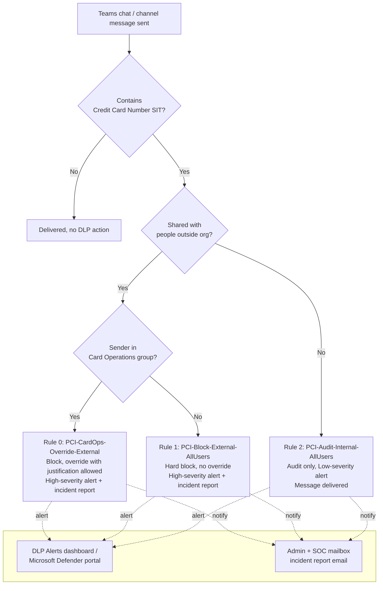

## The short version

Blocks full credit-card numbers (PANs) from leaving the tenant through Microsoft Teams chat and
channel messages, using Microsoft Purview Data Loss Prevention (DLP) for Teams. A named
exception path (block-with-logged-justification) is carved out for the Card Operations /
Finance team, who have a legitimate, already-approved workflow that occasionally requires
confirming card details with the acquiring bank over a guest-enabled Teams channel. Internal
(non-external) card-number sharing is audited, not blocked, on initial rollout.

## Why this matters

**PCI DSS v4.0.1, Requirement 4.2** - "Never send unprotected PANs by end-user messaging
technologies (for example, e-mail, instant messaging, SMS, chat, etc.)." Assessors test this by
sampling outbound transmissions and confirming PAN is rendered unreadable or blocked. Microsoft
Teams chat and channel messages are exactly the "chat" end-user messaging technology this
requirement names. This scenario is the technical control an assessor expects
to see evidenced for that requirement in a tenant where Teams is in scope for the cardholder data
environment (CDE) or connects to systems that are.

Two secondary drivers this control also supports:
- **PCI DSS Requirement 10** (logging and monitoring) - every block and every override is logged
  (alert, incident report, and - for overrides - a business-justification record in the audit
  log), giving the evidence trail a QSA will ask for.
- **General data-minimization hygiene** - even *internal* PAN sharing over chat puts unencrypted
  cardholder data into Teams message history, search indexes, and (if litigation or a subject
  access request arises) eDiscovery scope. The internal-audit rule exists to
  surface that exposure, not to eliminate it on day one.

Microsoft Purview Compliance Manager ships a **premium PCI DSS v4.0 assessment template**
(`assessment templates` page in Compliance Manager) that can track this control as an improvement
action alongside the technical implementation - see *PCI DSS v4.0 Assessment* for the assessment-side companion scenario, which also cross-references this
control in its own control crosswalk.

## How the control works

One DLP policy (`PCI DSS - Teams Card Data Exfiltration Block`), scoped to the **Teams chat and
channel messages** location, containing three priority-ordered rules. Full rule-by-rule rationale
is in the design notes. Enforcement happens server-side in the Teams service, driven by policy
synced from Security & Compliance PowerShell (~1 hour propagation after a change).

## What it takes

### Prerequisites

Full licensing detail and citations: [Licensing matrix](/docs/licensing-matrix/). Summary for this scenario:

| Requirement | Minimum | Notes |
|---|---|---|
| Purview DLP for Teams (chat + channel, including private channels) | **Microsoft 365 E5 / A5 / G5**, **Office 365 E5 / A5 / G5**, **Microsoft Purview Suite** (or the **E5 Information Protection & Governance** add-on), or **Microsoft 365/F5 Compliance / F5 Security & Compliance** | Confirmed per-user for every sender covered by the policy; DLP for SharePoint/OneDrive/Exchange (including Teams files) is covered at E3, but **Teams chat DLP specifically requires E5** |
| Tenant-level service toggle | **Microsoft Communications DLP** service enabled under the qualifying license in the Microsoft 365 admin center | Required in addition to the per-user license - this is a tenant service flag, not just an entitlement |
| Role to author/edit DLP policies | **DLP Compliance Management** role (built into the *Compliance Administrator* / custom S&C role group) | See [RBAC model, section 3](/docs/rbac-model/#3-microsoft-entra-roles-that-map-into-purview) (Purview role groups) |
| Automation identity | App registration with **Exchange Online Protection → `Exchange.ManageAsApp`** application permission, granted the DLP-authoring role group | Certificate-based app-only auth - see [Automation surface, section 3](/docs/automation-surface/#3-authentication-patterns---interactive-vs-unattended) |
| Dependency (not deployed by this scenario) | A mail-enabled security group or Microsoft 365 group for **Card Operations** | Must exist before running `deploy/New-PciTeamsDlpPolicy.ps1` |
| Scoping nuance | Policy location must include a **group**, not just individual accounts | Individual-account scoping in Teams DLP covers only 1:1/n chats - **not** standard/private/shared channel messages. This scenario uses `TeamsLocation = "All"`, which covers both |

> Verify current entitlement names against [Licensing matrix](/docs/licensing-matrix/) (dated 2026-09-02) and the
> Product Terms before a sales commitment - SKU names change.

### Cost and licensing

- **No PAYG component.** Teams chat/channel DLP is a per-user entitlement feature, not billed
  through Purview's Azure consumption model - see [Licensing matrix, sections 1 and 2](/docs/licensing-matrix/#1-the-two-billing-models-read-this-first). Cost is the
  marginal cost of moving any currently-E3 users who send Teams messages containing regulated
  card data up to E5 (or an E5-tier add-on) - see the prerequisites above for qualifying SKUs.
- **No additional Azure subscription required** for this control specifically (contrast with
  Data Map/Unified Catalog scenarios, which do require PAYG).
- **Sizing note:** license only the users in scope - this typically means retail/support/finance
  staff who handle payment conversations, not the whole tenant, unless the whole tenant is already
  E5 for other reasons (a common state in the enterprises this library targets).

## Proof it works

1. **Automated config check** - `./validate/Test-PciTeamsDlpPolicy.ps1 -CardOpsGroupEmail
   'card-ops@contoso.com'` confirms the policy and all three rules exist with the expected
   scoping, exits non-zero on any hard failure (safe for a CI-style pre-flight).
2. **Functional test (non-Card-Ops user)** - from a test account **not** in the Card Ops group,
   send a Teams chat message containing a test card number (use a documented test PAN, e.g. a
   card-brand-issued test number - never a real cardholder's PAN) to an external guest. Expect:
   message blocked, "Preview Unavailable" shown to the recipient, sender sees a blocked-message
   policy tip with no override option.
3. **Functional test (Card Ops user)** - same test, from an account in the Card Ops group. Expect:
   message blocked by default, but the sender's policy tip offers **Override** with a
   justification text box; after override, the message sends.
4. **Functional test (internal)** - send the same test content to an internal colleague. Expect:
   message delivered (not blocked), but a Low-severity alert appears in the DLP Alerts dashboard.
5. **Evidence for the QSA** - in the **DLP Alerts dashboard** (Purview portal → Data loss
   prevention → Alerts) or the **Microsoft Defender portal** incidents queue, confirm the three
   test events appear with the correct rule name and severity. For the override event, search the
   **audit log** for the `ExceptionInfo` value to retrieve the logged business justification text
   - this is the artifact a QSA will sample.
6. **Activity Explorer** - Purview portal → Data loss prevention → Activity explorer → filter by
   policy name to confirm ongoing match volume once in `Enable` mode.

## Where it stops

- **Chat-initiator asymmetry.** Microsoft's documented external-chat blocking behavior requires
  **your tenant to be the initiator of the chat or thread** - if an external guest initiates the
  thread, verify (VERIFY: confirm current behavior for guest-initiated threads against
  `dlp-microsoft-teams` at deploy time - Microsoft's docs describe the initiator requirement for
  the "protecting sensitive information in messages" scenario but don't fully enumerate every
  guest-initiated-thread edge case) whether coverage differs before relying on this control for
  guest-initiated support channels.
- **Individual-account scoping gap.** A policy location scoped to individual user accounts (not
  groups) does **not** cover standard/private/shared channel messages - only 1:1/n chats. This
  scenario avoids the gap by using `TeamsLocation = "All"`, but an organization that narrows scope later
  must re-verify group coverage.
- **No user notification email for Teams matches.** Unlike Exchange/SharePoint/OneDrive DLP,
  Teams DLP does not send a notification email to the sender - only an in-Teams message flag. If an organization's process assumes an email trail for every block, this scenario's
  admin/SOC alert (not a user-facing email) is the artifact instead.
- **~1 hour propagation delay** after any policy change before it's fully synced to the Teams
  service - do not test immediately after deploying/updating.
- **Copy/paste of an image containing a card number is not caught** by this text-pattern SIT
  match - DLP for Teams inspects message text, not OCR'd image content. If card images (e.g.
  screenshots) are a realistic exfiltration path in the target environment, pair this control with
  endpoint DLP (*Endpoint DLP: Block USB Removable Media Exfiltration*, planned) or a broader review of allowed
  attachment types.
- **This scenario does not cover Teams meeting chat/transcript export**, voice/video content, or
  third-party bridged meeting participants - scope is limited to the DLP-inspectable chat and
  channel message text.
- **Split/obfuscated PAN evasion is not mitigated by this control alone.** The Credit Card Number
  SIT evaluates each message independently within its own proximity window; a sender who splits a
  16-digit PAN across two or more separate messages (or spells digits as words, or inserts
  zero-width/unusual separators the pattern doesn't tolerate) will not trigger a match on any
  single message. This is an inherent limitation of per-message, pattern-based DLP, not a
  configuration gap this scenario can close. Residual-risk mitigation: pair with
  *Departing Employee Data Theft* (planned) or
  *Dynamic Risk-Based DLP Enforcement* (planned) for cumulative,
  behavior-based detection that correlates multiple near-in-time messages from the same sender,
  rather than relying on this control as the sole line of defense.
- **VERIFY before go-live:** confirm in a pilot tenant that `BlockAccess $true` on a
  `TeamsLocation`-scoped rule fully blocks message delivery (not merely a link/attachment
  sub-action) - Microsoft's DLP policy reference documents "Restrict access or encrypt the
  content in Microsoft 365 locations" as the one supported action *category* for Teams, and `BlockAccess` is the same underlying Security & Compliance PowerShell
  flag used for that category across Exchange/SharePoint/OneDrive/Teams, but Microsoft's
  cmdlet reference does not show a Teams-specific worked example. Run the functional tests in the validation steps
  before relying on this in production.