## The short version

Adds a fourth rule to the Microsoft 365 Copilot and Copilot Chat DLP policy: when an email a user
received was sent from a sender outside the organization's accepted domains, Copilot excludes that
email from grounding, summarization, and citation entirely. This closes out the fourth and final
documented Copilot-location action Microsoft currently publishes - **"Block external email from
being processed"** - completing the rule set this library's `dspm-for-ai` scenarios build against the
shared policy first deployed by `copilot-sensitive-data-exposure/` and extended by
`copilot-prompt-full-block/`.

## Why this matters

This rule is a **prompt-injection and untrusted-data-influence control**, not a sensitive-data-leakage control - a materially different driver from this policy's other three rules. Microsoft's
own worked use case for this action:

> *"Contoso wants employees to keep using Microsoft 365 Copilot for productivity, but is concerned
> that external email could carry untrusted instructions or prompt-injection content. They want
> Copilot to ground responses only in trusted internal data."*

Regulatory/business drivers this scenario supports:
- **AI-application security hygiene** - as organizations increasingly treat Copilot as an agent that
  can read, summarize, and reason over a user's inbox, an attacker-controlled external email becomes
  a plausible injection vector for steering that reasoning. This control removes external email from
  the trusted-grounding set entirely, closing that vector at the data-source level rather than relying
  on prompt-level defenses.
- **A "trusted sources only" narrative for AI governance reviews** - pairs with this library's other
  three Copilot-location rules to let an organization state, with specifics, exactly which categories of
  content Copilot is barred from grounding on (sensitive-labeled content, SIT-laden prompts, and now
  untrusted external email) - see the design notes for why this driver is framed differently from the
  other three rules.
- **Graceful degradation, not user-facing friction** - unlike Rule 2 (*Copilot Prompt Full-Response Block*),
  which fully refuses a response, this rule only removes external email from the grounding set;
  Copilot still answers using internal email and other permitted sources, and the user's own access
  to the excluded email is unaffected. This is the lightest-touch rule in the
  policy from a user-experience standpoint.

**Scope note carried from the parent scenario:** this rule protects Copilot's **grounding inputs**
only. It has no bearing on the unlabeled-oversharing problem that only the DSPM for AI data risk
assessment finds, and no bearing on sensitive data the user themselves types into a prompt (Rule 1/
Rule 2's problem) - see *Copilot Sensitive Data Exposure Protection* (why this matters) and section 11 for the full scope
discussion, which applies unchanged here.

## How the control works

```mermaid
flowchart TD
    E[Email received by a user] --> S{Sender domain in tenant's<br/>Exchange accepted domains?<br/>&#40;FromScope&#41;}
    S -- "No - external" --> B["Rule 3: Copilot-Exclude-ExternalEmail-Processing<br/>Prevent Copilot from processing content<br/>Email excluded from grounding, summarization, citation"]
    S -- "Yes - internal" --> N["Email remains eligible for<br/>Copilot grounding, subject to Rule 0-2"]
    U[User asks Copilot to summarize inbox<br/>or reason over recent email] --> Q{Does the referenced<br/>email pass Rule 3?}
    Q -- Excluded --> R1[Copilot responds using internal<br/>email + other permitted sources only.<br/>User sees: some content excluded<br/>by organizational policy]
    Q -- Not excluded --> R2["Email eligible as grounding input,<br/>subject to Rule 0-2's own checks"]
    B -.alert.-> A[DLP Alerts dashboard /<br/>Microsoft Defender portal]
    B -.-> U2[User's own access to the<br/>excluded email is unaffected]
```

This scenario adds **one rule** (`Copilot-Exclude-ExternalEmail-Processing`, priority 3) to the
**same** DLP policy the parent scenario deploys and *Copilot Prompt Full-Response Block* already extended
(`Copilot DLP - Sensitive Data Exposure Protection`, scoped to the Microsoft 365 Copilot Applications
location, `EnforcementPlanes = CopilotExperiences`). It does not create a new policy or duplicate any
existing rule - see the design notes for why a shared policy remains the correct model even for a
structurally different condition type. Same up-to-four-hour propagation window as every rule in this
policy family.

## What it takes

### Prerequisites

Full licensing detail and citations: [Licensing matrix](/docs/licensing-matrix/). This scenario adds to, and assumes,
*Copilot Sensitive Data Exposure Protection*'s prerequisites (section 3 of that scenario's this page). Delta for this
scenario specifically:

| Requirement | Minimum | Notes |
|---|---|---|
| ***Copilot Sensitive Data Exposure Protection* already deployed** | The named policy from that scenario must already exist | This scenario adds a fourth rule to that policy by name (default `Copilot DLP - Sensitive Data Exposure Protection`); it does not create a new policy. |
| "Block external email from being processed" feature | **Preview** as of this writing | No fixed tenant-rollout date documented by Microsoft for this specific action - confirm it's selectable in the portal before relying on the script. |
| DLP to author the Copilot-location policy | Same Copilot-location-specific role list as the parent scenario (Purview Data Security AI Admin(s), Compliance Administrator, Microsoft Entra AI Admin, etc.) | See the parent scenario's prerequisites and [RBAC model, section 3](/docs/rbac-model/#3-microsoft-entra-roles-that-map-into-purview) - unchanged by this addition. |
| Tenant accepted domains configured correctly | Every legitimate internal/partner sending domain must already be a correctly-configured accepted domain in Exchange Online | This rule's "external" determination is driven entirely by the tenant's Exchange accepted-domains list - a misconfigured accepted domain (e.g. a legitimate subsidiary domain not yet added) would cause this rule to over-exclude that subsidiary's mail from Copilot grounding. Not a new prerequisite this scenario introduces, but one this scenario's correctness now directly depends on. Ongoing monitoring for this dependency: *Accepted-Domains Hygiene Check*. |

**Licensing note specific to this action.** Microsoft's Purview service description draws a tier
split between the two file/email-facing Copilot DLP capabilities and the prompt-facing one:
"Purview DLP to restrict Copilot from processing **files and emails**" is listed **No** for
Microsoft 365 Business Basic/Standard/Premium and the E3/A3/A1/G3/F3/F1 tiers, **Yes** only for
E5/A5-class tiers (Microsoft Purview Suite/EDU/FLW, Microsoft 365 E5/A5 Information Protection and
Governance) and Office 365 E5/A5; "Purview DLP to safeguard **prompts**" is listed **Yes*** for every
tier with Copilot access. This rule's condition ("Email is received from") is a
files-and-emails-category capability by Microsoft's own grouping, not a prompt-safeguarding one - so,
unlike Rule 1/Rule 2's broader Copilot-DLP-for-prompts entitlement, this rule specifically requires
the higher E5-class tier the "files and emails" row names. This split is now also reflected in
[Licensing matrix, section 2](/docs/licensing-matrix/#2-master-capability--license-matrix) (DSPM for AI rows) - re-verify both against current Microsoft Learn
before a sales commitment.

> Verify current entitlement names and the preview/GA status of this specific action against
> [Licensing matrix](/docs/licensing-matrix/) and current Microsoft Learn before a sales commitment - this is the
> newest of the four Copilot-location DLP actions this library documents.

### Cost and licensing

- **This rule sits in Microsoft's "files and emails" Copilot-DLP licensing tier, not the broader
  "prompts" tier** - see the prerequisites's licensing note. Unlike Rule 1/Rule 2 (available to any tenant with
  Copilot access, per Microsoft's own `*` footnote), this rule specifically requires an E5-class
  entitlement (or the standalone Microsoft Purview Suite equivalent). Confirm this
  before assuming this rule is a "free" addition once the parent policy already exists.
- **Confirm preview-to-GA licensing has not changed** before quoting - this is a newer, faster-moving
  capability than even *Copilot Prompt Full-Response Block*'s own action; re-verify against
  [Licensing matrix](/docs/licensing-matrix/) and current Microsoft Learn before a sales commitment.

## Proof it works

1. **Automated config check** - `./validate/Test-CopilotExternalEmailBlockRule.ps1` confirms the rule
   exists with the expected priority, `FromScope` condition, and `RestrictAccess` setting; exits
   non-zero on any hard failure. The `FromScope` condition check is `[WARN]`, not `[FAIL]`, per the
   the implementation steps VERIFY note - re-run it after creating the rule once through the portal to confirm the two
   match.
2. **Functional test** - from a test mailbox, send a test email from a genuinely external domain
   (e.g. a personal/test account you control, never a real third party's address) to a test user's
   internal mailbox. Ask Copilot to summarize that user's inbox or reason over the received message.
   Expect: the external email is excluded from the response, and the user sees a message indicating
   some content was excluded by an organizational policy.
3. **Negative test** - send an equivalent test email from an internal-domain account. Expect: Copilot
   includes it normally when summarizing/reasoning over the inbox, confirming this rule hasn't
   inadvertently widened to exclude internal mail too.
4. **Evidence** - DLP Alerts dashboard or Microsoft Defender portal incidents queue, confirm the test
   event appears under rule name `Copilot-Exclude-ExternalEmail-Processing`.
5. **DSPM for AI Activity explorer** - Purview portal → DSPM for AI (classic) → Activity explorer →
   filter by **DLP rule match** to confirm ongoing match volume once live.

## Where it stops

- **The `-FromScope` condition is not independently confirmed for the Microsoft 365 Copilot
  location** - see the detailed VERIFY in the implementation steps. This is the single most important caveat in this
  scenario; confirm via `Get-DlpComplianceRule` against a portal-created rule before production
  reliance.
- **Preview feature, tenant rollout not guaranteed on any fixed date.** Confirm the condition is
  selectable in the portal for your tenant before assuming the script will succeed.
- **Metadata-only: this rule never inspects email body content.** A prompt-injection payload
  delivered from a domain that happens to be on the tenant's accepted-domains list (e.g. a
  compromised partner-organization mailbox, or an internal account) is not covered - this rule's
  entire detection surface is sender-domain comparison, nothing more.
- **Accepted-domains misconfiguration is a real, silent failure mode.** See the prerequisites and operations and tuning - a legitimate
  sending domain not yet added to (or wrongly removed from) the tenant's Exchange accepted-domains
  list will be treated as external by this rule, with no error or warning surfaced anywhere in this
  scenario's own scripts (they don't independently re-derive or check the accepted-domains list). For
  ongoing, automated monitoring of exactly this dependency (in both directions - a domain silently
  excluded from trust, and a domain silently granted it), see *Accepted-Domains Hygiene Check*, built as this finding's compensating control.
- **No independent simulation mode for this one rule** - see section 8. Adding it to an already-enforcing
  policy means it enforces on first propagation, with no per-rule staging option Microsoft documents.
- **Higher licensing tier than its Rule 1/Rule 2 siblings.** See sections 3 and 10 - do not assume this rule is
  licensing-neutral just because the parent policy and its other rules already exist in the tenant.
- **Expected high match volume is not itself a signal of malicious activity or misconfiguration** -
  see operations and tuning's KPI guidance; a naive "alert count went up" read of this rule's dashboard will
  systematically over-alarm relative to its three siblings.
- **Does not, by itself, defend against prompt injection delivered through any channel other than
  email** - see the design notes's explicit non-goal. An organization asking "are we now protected from
  prompt injection in Copilot" should be told this closes exactly one documented vector, not the
  general problem.