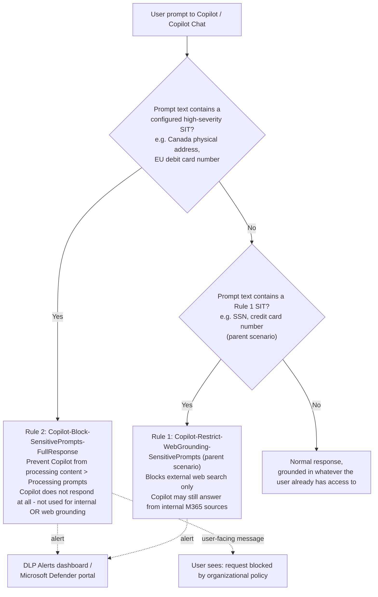

## The short version

Adds a third, stronger DLP rule to the Microsoft 365 Copilot and Copilot Chat DLP policy: when a
user's prompt itself contains a configured sensitive information type (SIT), Copilot **refuses to
respond at all** - not just to web-grounded searches, but to internal Microsoft 365 grounding too.
This extends *Copilot Sensitive Data Exposure Protection*, which already deploys a
policy with a label-exclusion rule and a web-grounding-restriction rule; this scenario adds the
missing third documented Copilot-location action, **"Prevent Copilot from processing content >
Processing prompts"**, which Microsoft's own use-case guidance frames as the control for the
highest-severity SIT categories an organization wants users simply unable to submit to Copilot at
all (not just prevented from triggering an external web search).

## Why this matters

Microsoft's own worked example for this action targets exactly this kind of policy choice: *"Contoso
encourages their employees to use Microsoft 365 Copilot to enhance productivity, but they don't want
their users placing Canada physical addresses or EU debit card numbers into prompts."* The action is
explicit that this is a stronger control than restricting web search alone: **"Copilot doesn't
respond to the prompt. Prompt isn't used for internal or web searches"** - a full stop, not a
narrower web-grounding restriction.

Regulatory/business drivers this scenario supports:
- **A stronger technical backstop for a narrow, high-severity SIT set** - where
  *Copilot Sensitive Data Exposure Protection*'s Rule 1 (`RestrictWebGrounding`) is deliberately a light-touch
  control (block external web search only, let Copilot still answer from internal sources), this
  scenario is the deliberately blunt instrument for SIT categories an organization has decided should never
  reach Copilot at all, regardless of grounding source.
- **Payment-card/regulated-identifier hygiene** - Microsoft's own example uses **EU debit card
  numbers**; a PCI-scoped or EU-regulated tenant can use this rule for card or national-identifier
  SITs it does not want summarized, referenced, or reasoned over by Copilot under any circumstance.
- **User-facing deterrence, not just detection** - unlike Rule 1 (silent web-grounding restriction,
  the user isn't necessarily told), this action returns a message to the user explaining the request
  was blocked by an organizational policy, which can support a "the control is
  visibly enforced" narrative for an audit or a regulator, at the cost of user friction.

**Scope note carried from the parent scenario:** this rule protects **prompt text** only. It does
not replace *Copilot Sensitive Data Exposure Protection*'s Rule 0 (labeled file/email exclusion) and has no
bearing on the unlabeled-oversharing problem that only the DSPM for AI data risk assessment finds -
see that scenario's why this matters and the known limitations for the full scope discussion, which applies unchanged
here.

## How the control works

This scenario adds **one rule** (`Copilot-Block-SensitivePrompts-FullResponse`, priority 2) to the
**same** DLP policy the parent scenario deploys (`Copilot DLP - Sensitive Data Exposure Protection`,
scoped to the Microsoft 365 Copilot Applications location, `EnforcementPlanes = CopilotExperiences`).
It does not create a new policy or duplicate the parent's Rule 0/Rule 1 - see the design notes for why
a shared policy (not a second policy) is the correct model. Same up-to-four-hour propagation window
as the parent scenario applies.

## What it takes

### Prerequisites

Full licensing detail and citations: [Licensing matrix](/docs/licensing-matrix/). This scenario adds to, and assumes,
*Copilot Sensitive Data Exposure Protection*'s prerequisites (section 3 of that scenario's this page). Delta for this
scenario specifically:

| Requirement | Minimum | Notes |
|---|---|---|
| ***Copilot Sensitive Data Exposure Protection* already deployed** | The named policy from that scenario must already exist | This scenario adds a rule to that policy by name (default `Copilot DLP - Sensitive Data Exposure Protection`); it does not create a new policy. Run that scenario's `deploy/New-CopilotSensitiveDataProtectionPolicy.ps1` first. |
| "Block sensitive information types in prompts" feature rollout | **Preview**, rolling out to all tenants with Microsoft 365 Copilot/Copilot Chat access as of this writing | Confirm the feature has reached your tenant before relying on this scenario - Microsoft's own guidance says to check rollout status, it is not universally available on a fixed date. Available in Microsoft 365 Copilot, Copilot Chat, and Copilot in Word/Excel/PowerPoint; during preview, the in-app messaging in Word/Excel/PowerPoint may not clearly say the block is policy-driven. |
| DLP to author the Copilot-location policy | Same Copilot-location-specific role list as the parent scenario (Purview Data Security AI Admin(s), Compliance Administrator, etc.) | See the parent scenario's prerequisites and [RBAC model, section 3](/docs/rbac-model/#3-microsoft-entra-roles-that-map-into-purview) - unchanged by this addition. |
| Sensitive information types for this rule | At least one built-in or custom SIT, distinct from the parent scenario's Rule 1 SITs if you want the two rules' severity levels to stay meaningfully different | Defaults to Microsoft's own worked-example pair, **Canada physical addresses** and **EU debit card numbers** - parameterize to your own highest-severity SIT set before production use. |

> Verify current entitlement names and the preview/GA status of this specific action against
> [Licensing matrix](/docs/licensing-matrix/) and current Microsoft Learn before a sales commitment - this is a
> newer, faster-moving Copilot-related capability than the parent scenario's other two rules.

### Cost and licensing

- **No incremental licensing cost beyond the parent scenario.** This rule is a third rule inside the
  same DLP policy and location the parent scenario already licenses for - see that scenario's
  the cost and licensing notes.
- **Confirm preview-to-GA licensing has not changed** before quoting - Microsoft's licensing
  reference for DLP-for-Copilot (the parent scenario's prerequisites, ref 4) does not yet break out this
  specific action separately from the other two; re-verify against [Licensing matrix](/docs/licensing-matrix/) before
  a sales commitment, since preview features occasionally ship with different entitlement rules than
  their GA successor.

## Proof it works

1. **Automated config check** - `./validate/Test-CopilotPromptFullBlockRule.ps1` confirms the rule
   exists with the expected priority, SIT condition, and `RestrictAccess` setting; exits non-zero on
   any hard failure. The `RestrictAccess` setting/value check is `[WARN]`, not `[FAIL]`, per the implementation steps
   VERIFY note - re-run it after creating the rule once through the portal to confirm the two match.
2. **Functional test** - from a test account, submit a Copilot prompt containing a documented test
   value for one of the configured SITs (e.g. a placeholder Canada physical address), phrased as a
   normal request (never a real person's data). Expect: Copilot does not respond, and the user sees a
   message indicating the request can't be completed because it contains information the organization
   has blocked Copilot from using - contrast with the parent scenario's Rule 1
   functional test, where the user still gets an answer (just not web-grounded).
3. **Negative test** - submit an equivalent prompt using a Rule 1 SIT (e.g. a test SSN) that is **not**
   in this rule's SIT list. Expect: Copilot still responds (using internal grounding only, per the
   parent scenario's Rule 1), confirming this rule's stronger action is scoped only to its own SIT set
   and hasn't inadvertently widened to cover Rule 1's SITs too.
4. **Evidence** - DLP Alerts dashboard or Microsoft Defender portal incidents queue, confirm the test
   event appears under rule name `Copilot-Block-SensitivePrompts-FullResponse`, distinguishable from
   Rule 1's alerts by name and by the higher `ReportSeverityLevel`.
5. **DSPM for AI Activity explorer** - Purview portal → DSPM for AI (classic) → Activity explorer →
   filter by **DLP rule match** to confirm ongoing match volume once live.

## Where it stops

- **The exact `-RestrictAccess` setting/value pair for this action is not independently confirmed**
  by a Microsoft-published worked example - see the detailed VERIFY in the implementation steps. This is the single most
  important caveat in this scenario; confirm via `Get-DlpComplianceRule` against a portal-created
  rule before production reliance.
- **Preview feature, tenant rollout not guaranteed on any fixed date.** Confirm the action is
  selectable in the portal for your tenant before assuming the script will succeed - if the feature
  hasn't rolled out yet, the underlying service will likely reject the `ExcludeContentProcessing`
  setting for a CCSI-conditioned rule (or silently no-op it) rather than the script failing loudly;
  always run the portal check in the implementation steps step 1 first.
- **Same SIT-evasion residual risk as every SIT-based DLP rule in this library.** A user who paraphrases,
  splits across multiple turns, or uses non-standard formatting for the sensitive data can defeat
  pattern-based detection - see the Red Team review and the parent scenario's equivalent, already-documented limitation.
- **Files uploaded directly into a prompt are not scanned.** Same Microsoft-documented limitation as
  the parent scenario's Rule 1 - DLP inspects only the typed prompt text, not uploaded file content.
- **No independent simulation mode for this one rule** - see section 8. Adding it to an already-enforcing
  policy means it enforces on first propagation, with no per-rule staging option Microsoft documents.
- **User-facing friction is real and higher than the parent scenario's other two rules.** Because the
  user is told their request was blocked (rather than the block being silent, as Rule 1's web-grounding
  restriction can appear), poor SIT tuning here produces visible help-desk load - budget for a tuning
  window before wide rollout.
- **During preview, Word/Excel/PowerPoint messaging may not clearly attribute the block to policy**
  - set user expectations accordingly if this rule is deployed before the feature
  reaches GA.
- **The user-visible block message is a probing oracle.** Unlike Rule 1 (a silent web-grounding
  restriction the user may not notice), this rule tells the user their request was blocked by an
  organizational policy. A user (or an insider deliberately testing boundaries) can use repeated,
  varied prompts against this visible signal to map out which specific SIT patterns and formats
  trigger a block, then craft a near-miss variant designed to evade detection - a faster feedback
  loop for evasion than the parent scenario's silent rules provide. There is no Microsoft-documented
  mitigation for this within the DLP-for-Copilot feature itself; treat repeated near-miss attempts
  from the same user as an Insider Risk Management signal (operations and tuning runbook), not just a tuning input.
- **Over-blocking risks pushing users to ungoverned tools.** Because this rule fully refuses a
  response (rather than degrading gracefully like Rule 1), a poorly tuned SIT set that blocks
  legitimate everyday requests can push frustrated users toward unmanaged, personal generative-AI
  tools outside this organization's Purview/DLP visibility entirely - the opposite of this
  scenario's intent. Pair deployment with user communications explaining why the control exists and
  a clear internal exception-request path, not just the technical rollout.