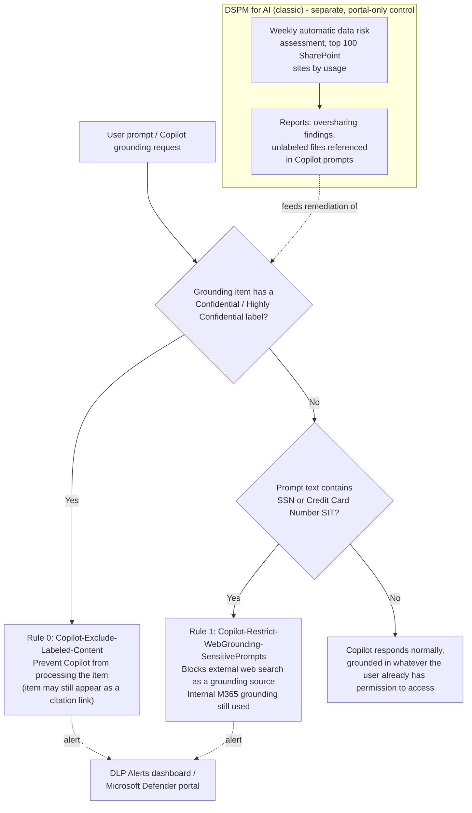

## The short version

Reduces the risk that Microsoft 365 Copilot and Copilot Chat surface sensitivity-labeled
confidential content, or leak prompt-embedded sensitive data to external web search, during and
after a Copilot rollout. Combines a Microsoft Purview Data Loss Prevention (DLP) policy scoped to
the **Microsoft 365 Copilot and Copilot Chat** location (blocking Copilot from processing
**Confidential**/**Highly Confidential**-labeled files and emails, and restricting web-search
grounding when a prompt contains SSNs or credit card numbers) with the **Data Security Posture
Management (DSPM) for AI** oversharing data risk assessment that identifies the broader, unlabeled
oversharing exposure this DLP policy does **not** cover.

## Why this matters

Microsoft 365 Copilot answers in the **security context of the querying user** - it does not grant
new access, but it makes *existing* access dramatically more discoverable: a user who could
technically reach an overshared file via a stale "Everyone except external users" SharePoint
permission previously had to know the file existed and find it manually; Copilot will now
summarize it for them from a single prompt. This is Microsoft's own documented pre-Copilot-rollout
risk, and Microsoft's own guidance is explicit that DSPM for AI's oversharing data risk assessment
and DLP for Copilot are the two controls that address it together, not either alone.

Regulatory/business drivers this scenario supports:
- **GDPR / data-minimization hygiene** - a labeled-PII file becoming instantly summarizable
  tenant-wide (to anyone with pre-existing, possibly stale, access) increases the practical
  exposure of that data even though no new grant occurred; excluding labeled confidential content
  from Copilot processing is a documented, low-friction mitigation.
- **Pre-deployment security review** - most enterprise Copilot rollouts now require a completed
  oversharing risk assessment and a documented technical control before broad licensing, per
  Microsoft's own secure-Copilot-foundation guidance.
- **Prompt-injection / data-exfiltration-via-web-search hygiene** - a prompt that echoes sensitive
  data (SSN, card number) can otherwise be used by Copilot as a grounding signal for an external
  web search, sending that fragment outside the tenant boundary as part of the search query.

**Critical scope note carried through this scenario:** the DLP policy
this scenario deploys protects **labeled** content and **prompt text matching a sensitive
information type (SIT)**. It does **not** by itself fix oversharing of **unlabeled** content - that
is a permissions problem, not a DLP problem, and the correct tool for finding it is the DSPM for AI
data risk assessment (the implementation steps and operations and tuning below), not this policy. Selling or deploying this scenario as "the"
fix for Copilot oversharing without also running the assessment and remediating what it finds is a
Microsoft Product Owner **Fix** finding from this scenario's own review - see the review notes.

## How the control works

One DLP policy (`Copilot DLP - Sensitive Data Exposure Protection`) scoped to the **Microsoft 365
Copilot and Copilot Chat** location, with two rules (label-based content exclusion, SIT-based
web-grounding restriction) - full rationale in the design notes - plus the DSPM for AI (classic)
oversharing data risk assessment, which is portal-only (no PowerShell/Graph authoring surface as of
this build) and is documented as a configuration reference and operational step, not deployed by
the script. Policy changes to the Copilot location can take **up to four hours** to reflect in the
Copilot experience - longer than the ~1 hour Teams DLP propagation this library's
other DLP scenarios cite.

## What it takes

### Prerequisites

Full licensing detail and citations: [Licensing matrix](/docs/licensing-matrix/). Summary for this scenario:

| Requirement | Minimum | Notes |
|---|---|---|
| Microsoft 365 Copilot license | Per-user add-on | Required for any user this scenario's controls apply to; DSPM for AI itself and the underlying Purview capabilities don't require a Copilot license, but they have no Copilot-specific data to act on without it |
| DLP to restrict Copilot from processing **files and emails** (label-based rule) | **Microsoft 365/Office 365 E5/A5**, **Microsoft Purview Suite/EDU/FLW**, or **Microsoft 365/A5/F5 Information Protection and Governance** | **Not available** on Microsoft 365 Business Basic/Standard/Premium or the E3/A3/A1/G3/F3/F1 tiers - this is an E5-tier capability |
| DLP to **safeguard prompts** (SIT-based web-grounding rule) | **All Microsoft 365 Copilot and Copilot Chat licenses**, any tier | Unlike the label-based rule, prompt-safeguard DLP is available regardless of the underlying Microsoft 365 license tier - do not over-quote E5 as a requirement for this half of the policy |
| Published sensitivity labels | At least one label (this scenario defaults to **Confidential** and **Highly Confidential**, parameterizable) | Reuses the label taxonomy from *Auto-Label Confidential PII in SharePoint & OneDrive* - label authoring is a separate prerequisite, not deployed by this scenario |
| Role to author/edit the Copilot-location DLP policy | One of: **Microsoft Entra AI Admin**, **Purview Data Security AI Admin(s)**, **Purview Compliance Administrator**, **Purview Compliance Data Administrator**, **Purview Information Protection (Admin)**, **Purview Security Administrator**, or **Microsoft Entra Global Admin** | This is a **narrower, Copilot-location-specific role list** than the generic "DLP Compliance Management" role used by every other DLP scenario in this library (Teams/Endpoint) - confirm the automation identity holds one of these specific roles, not just generic DLP authoring rights |
| DSPM for AI (classic) view/manage permissions | **Microsoft Entra Compliance Administrator**, **Microsoft Entra Global Administrator**, or **Microsoft Purview Compliance Administrator** role group | See [RBAC model, section 3](/docs/rbac-model/#3-microsoft-entra-roles-that-map-into-purview); view-only via **Microsoft Purview Security Reader** or **Purview Data Security AI Viewer** |
| Automation identity | App registration with **Exchange Online Protection → `Exchange.ManageAsApp`** application permission, granted one of the Copilot-DLP-authoring roles above | Certificate-based app-only auth - see [Automation surface, section 3](/docs/automation-surface/#3-authentication-patterns---interactive-vs-unattended) |
| Tenant-level | **Microsoft Purview Audit** turned on | Prerequisite for DSPM for AI's Copilot activity insights and Activity explorer events; on by default for new tenants |

> Verify current entitlement names against [Licensing matrix](/docs/licensing-matrix/) and the Product Terms before
> a sales commitment - SKU names and the Copilot-DLP-for-prompts preview/GA status change.

### Cost and licensing

- **No PAYG component for this scenario's DLP policy.** It is a per-user entitlement feature
  (E5-tier for the label-exclusion rule; any tier for the prompt-safeguard rule), not billed
  through Purview's Azure consumption model.
- **Copilot licensing is the dominant cost driver**, and is a prerequisite this scenario assumes is
  already funded - this scenario does not add incremental Copilot licensing cost, it protects an
  investment already being made.
- **Sizing note:** the label-exclusion rule (Rule 0) only requires E5-tier licensing for users
  whose Copilot interactions need this Purview DLP control - in practice this typically means every
  Copilot-licensed user, since Copilot licensing itself already implies significant per-user
  spend that E5-tier Purview add-ons are a comparatively small increment against, but confirm the
  organization's actual current tier before assuming zero incremental cost.
- **DSPM for AI (classic) itself carries no separate SKU** beyond the underlying Compliance
  Administrator-tier permissions and (for custom, non-default assessments) potential PAYG billing
  for advanced item-level scanning - see [Licensing matrix](/docs/licensing-matrix/) §"DSPM for AI" row and
  re-verify before quoting a custom-assessment engagement.

## Proof it works

1. **Automated config check** - `./validate/Test-CopilotSensitiveDataProtectionPolicy.ps1` confirms
   the policy and both rules exist with the expected settings, exits non-zero on any hard failure.
2. **Functional test (labeled content)** - apply the **Confidential** label to a test document in a
   SharePoint site a test user can access. Wait for the up-to-4-hour propagation window, then ask Copilot (in Copilot Chat or the SharePoint agent) a question that
   would normally surface that document. Expect: the document does not appear as a used/summarized
   source; it may still appear as a citation link the user can open directly.
3. **Functional test (sensitive prompt)** - from a test account, submit a Copilot prompt containing
   a documented test SSN or test card number (never a real one) phrased as a request that would
   normally trigger a web search (e.g., "search the web for guidance on reporting SSN
   012-34-5678"). Expect: Copilot does not perform an external web search for that prompt; it may
   still answer using internal Microsoft 365 sources.
4. **Evidence** - in the **DLP Alerts dashboard** (Purview portal → Data loss prevention → Alerts)
   or the Microsoft Defender portal incidents queue, confirm both test events appear with the
   correct rule name.
5. **DSPM for AI Activity explorer** - Purview portal → DSPM for AI (classic) → Activity explorer →
   filter by event type **DLP rule match** and **Sensitive info types** to confirm ongoing match
   volume once in `Enable` mode; filter by **AI interaction** to see general Copilot usage volume
   for context.
6. **Oversharing assessment evidence** - DSPM for AI (classic) → Reports → review the current
   top-100-SharePoint-sites oversharing assessment results as the baseline this scenario's
   remediation work (outside this script's scope) should measurably reduce over time.

## Where it stops

- **This scenario does not fix oversharing - it is a content-level backstop.** The single most
  important limitation, repeated because it is also this scenario's core selling point: Rule 0 only
  excludes content that already carries a sensitivity label. Unlabeled overshared content is
  invisible to this DLP policy and will be summarized by Copilot exactly as if this scenario did
  not exist. The DSPM for AI oversharing assessment is how an organization finds that exposure;
  fixing it means SharePoint/OneDrive permissions remediation and/or expanding auto-labeling
  coverage (*Auto-Label Confidential PII in SharePoint & OneDrive*), not more DLP
  rules.
- **Citations still leak existence and a clickable link.** A user who already has access to a
  labeled-excluded item can still see it referenced in Copilot's citations and open it directly -
  DLP for Copilot prevents Copilot from *summarizing* the content, not from a user with pre-existing
  access reaching the file through the citation link. This is documented, expected behavior, not a
  bug - but it means this control does not reduce raw access, only Copilot-mediated discoverability
  and effortless synthesis.
- **Rule 1 does not stop internal grounding.** `RestrictWebGrounding` only blocks *external* web
  search as a grounding source; it has no effect on Copilot's use of internal Microsoft 365
  content (files, email, Teams) to answer a sensitive-looking prompt. Do not present this rule as a
  general "block sensitive prompts" control - it solves a narrower, real problem (sensitive prompt
  fragments leaking to a web search provider), not the oversharing problem.
- **Full prompt-response blocking ("Processing prompts" action) is now scripted separately.** See
  the callout in the implementation steps and *Copilot Prompt Full-Response Block*, which adds it as a third
  rule on this same policy. It remains a preview feature without a published PowerShell worked
  example for this exact condition/action combination as of that scenario's build - see its own
  the implementation steps and the known limitations for the disclosed gap.
- **Files uploaded directly into a prompt are not scanned by DLP at all** - Microsoft's
  documentation is explicit that DLP only inspects the text typed into the prompt, not the content
  of an uploaded file. A user can bypass both rules entirely by uploading a
  labeled or sensitive file directly rather than referencing it by name/search.
- **Up to four hours propagation** for a policy change to reach the Copilot experience - longer
  than the ~1 hour this library's other DLP scenarios cite for Teams; do not test immediately after
  deploying or updating.
- **Word/Excel/PowerPoint enforcement is evaluated at file open**, not continuously - if a
  sensitivity label is applied to a file mid-session, the exclusion only takes effect the next time
  the file is opened.
- **No documented pilot-group scoping for this location.** Every worked Microsoft example for the
  Copilot location's `-Locations` JSON scopes `Inclusions` to `{"Type":"Tenant","Identity":"All"}`
  - this scenario's deploy script follows that pattern and applies tenant-wide once `Mode` is set
  to `Enable`. A `{"Type":"Group","Identity":"..."}` inclusion is documented for the same
  `Applications`-workload location shape on the *collection*-policy cmdlets
  (`New-/Set-FeatureConfiguration`), but no worked example confirms this also works for a
  `New-DlpCompliancePolicy` rule on the Copilot location specifically. **VERIFY** in a pilot tenant
  before promising a customer a group-scoped pilot rollout of this DLP policy; until confirmed,
  treat `TestWithNotifications` (simulation) as the only safe pre-enforcement pilot mechanism this
  scenario supports, and for the follow-up to close this gap.
- **VERIFY before go-live:** confirm in a pilot tenant that the JSON `Locations` string this
  scenario's deploy script constructs (`deploy/New-CopilotSensitiveDataProtectionPolicy.ps1`
  `.NOTES`) is byte-accurate to what the Purview portal itself generates when the **Microsoft 365
  Copilot and Copilot Chat** location is selected through the UI - Microsoft's own published
  `New-DlpCompliancePolicy` reference example for this location contains unquoted JSON object keys
  (`{Type:"Tenant", Identity:"All"}`) that would fail strict JSON parsing; this script's
  `.NOTES` documents the fully-quoted, standards-conformant JSON it uses instead and why.