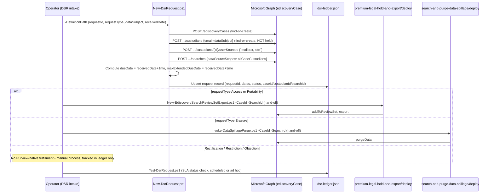

## The short version

Adds a request-tracking and SLA layer on top of this library's existing eDiscovery capability for
GDPR **Data Subject Requests**: intake a request, create a custodian-scoped eDiscovery case/search
covering exactly the named person's own mailbox and OneDrive/SharePoint site, compute the
Article 12(3) response deadline, and hand off to this library's already-built export/purge scripts for
Access/Portability/Erasure fulfillment. Rectification, Restriction, and Objection get a tracked
Discovery search and an honest statement that Purview has no technical fulfillment control for them.

## Why this matters

GDPR Articles 15-22 give data subjects rights - access, rectification, erasure ("right to be
forgotten"), restriction of processing, portability, and objection - that an organization must act
on. Article 12(3) sets the clock: a controller must respond **"without undue delay and in any event
within one month of receipt of the request,"** extendable by **"two further months where necessary,
taking into account the complexity and number of the requests,"** with the data subject informed of
any such extension, and the reasons, **within the original month**. Microsoft's own guidance frames a DSR as six activities -
**Discovery, Access, Rectification, Restriction, Export, Deletion** - and states directly that
Microsoft 365 content in scope for the Access/Export/Deletion activities lives in Exchange
mailboxes, Exchange public folders, SharePoint sites, and OneDrive accounts, all searchable via
eDiscovery. *EU GDPR Assessment* (operations and tuning and the known limitations) names the gap
this scenario closes: the closest prior technical building block had no request-tracking or SLA
timer at all - a real risk given Article 12(3)'s deadline is a compliance obligation with regulator
exposure, not a best-effort target.

> ⚠️ **This is not Microsoft Priva.** Priva Subject Rights Requests is a separate, purpose-built
> Microsoft product with its own case-management UI, SLA tracking, and Graph surface
> (`/security/subjectRightsRequests`). It is out of scope for this library by design
> (this library's standards; [Automation surface, section 4](/docs/automation-surface/#4-routing-table---which-surface-for-which-purview-task)). This scenario's ledger is a minimal,
> scenario-owned substitute for the SLA-tracking piece only - see the design notes.

## How the control works

Full rationale for custodian-scoped (not tenant-wide) search, why no hold is applied, and why
Access/Erasure fulfillment is a hand-off rather than new code: the design notes.

## What it takes

### Prerequisites

Full licensing detail: [Licensing matrix, section 2](/docs/licensing-matrix/#2-master-capability--license-matrix) (eDiscovery (Premium) row - a Graph-created
case is Premium-configured, the same finding *Search-and-Purge for Data Spillage* (the prerequisites) already
made). RBAC: [RBAC model, section 4](/docs/rbac-model/#4-purview-role-groups-by-module-representative-not-exhaustive). Automation surface: [Automation surface, section 3](/docs/automation-surface/#3-authentication-patterns---interactive-vs-unattended) (Microsoft
Graph - the supported app-only path for eDiscovery automation) and the architecture (routing table; also names
Priva's Graph surface as explicitly out of scope for this library). Summary:

| Requirement | Minimum | Notes |
|---|---|---|
| Licensing | **eDiscovery (Premium)**: M365/Office 365 **E5**, **Microsoft Purview Suite**, or **E5 eDiscovery & Audit** add-on | A Graph-created case is always Premium-configured regardless of query scope - [Licensing matrix, section 2](/docs/licensing-matrix/#2-master-capability--license-matrix); the design notes |
| Role to author case/custodian/search via Graph app-only | **eDiscovery Manager** (own cases) or **eDiscovery Administrator** (all cases) - the **Custodian** role (data-source management) is required and is only available to eDiscovery Manager members | [RBAC model, section 4](/docs/rbac-model/#4-purview-role-groups-by-module-representative-not-exhaustive) |
| Role to purge (Erasure requests only) | **Search And Purge** | Only needed when the request-type hand-off reaches *Search-and-Purge for Data Spillage*'s purge script - see that scenario's own the prerequisites |
| Graph permission | Application **`eDiscovery.ReadWrite.All`** (read-only validation: `eDiscovery.Read.All`) | [Automation surface, section 3](/docs/automation-surface/#3-authentication-patterns---interactive-vs-unattended); same permission this library's two eDiscovery siblings already use |
| Auth | Certificate-based app-only via `Connect-MgGraph` | [Automation surface, section 3](/docs/automation-surface/#3-authentication-patterns---interactive-vs-unattended) |
| PowerShell module | `Microsoft.Graph.Security` ≥ 2.25.0 | Same module/version floor as this scenario's siblings |
| Organizational | A documented intake process (how a DSR reaches whoever runs `New-DsrRequest.ps1`) and an identity-verification step **before** this scenario's scripts run | Out of scope for this scenario's code - see the known limitations |

### Cost and licensing

- **eDiscovery (Premium)** entitlement (E5/Suite/add-on) - no separate per-search or per-custodian
  meter, same as this scenario's siblings.
- **Access/Portability fulfillment inherits the Export API's PAYG data-volume billing** from
  *Legal Hold, Collection, Review, and Export* ([Licensing matrix, section 2](/docs/licensing-matrix/#2-master-capability--license-matrix)) - only the export step is metered,
  not the search/custodian setup this scenario's own script performs.
- **The real cost driver is DSR volume, not the Purview meter**: a high-volume DSR program (many
  requests per month) is better served by Microsoft Priva's purpose-built, licensed Subject Rights
  Requests workflow than by scaling this scenario's flat-file ledger - see why this matters's warning banner. This
  scenario is sized for an organization with a low-to-moderate DSR volume that doesn't yet justify a
  separate Priva deployment.

## Proof it works

1. **Automated (SLA + object-level)** - `./validate/Test-DsrRequest.ps1` reports every open
   request's SLA status ([PASS]/[WARN]/[FAIL] against the due/extended-due date), confirms the
   case/custodian/search still exist, and (best-effort, [WARN]-only) reports whether a review set
   (Access/Portability) or a `purgeData` operation (Erasure) has appeared in the case. Exits
   non-zero on any Overdue request - safe to run on a schedule as a breach alert.
2. **Idempotency proof** - re-run `New-DsrRequest.ps1` with the same definition file; the
   case/custodian/userSource/search all report "already exists," and the ledger entry is updated in
   place (same `requestId`), never duplicated.
3. **Fulfillment proof** - for Access/Portability, the hand-off sibling's own
   `validate/Test-EdiscoveryPremiumCaseSetup.ps1`; for Erasure, the hand-off sibling's own
   `validate/Test-DataSpillageSearchAndPurge.ps1` - both work unmodified against this scenario's
   `-CaseId`/`-SearchId`, since it's the same object model.
4. **Audit** - search the unified audit log for the eDiscovery case/custodian/search creation
   activity (RecordType `Discovery`); see *Legal Hold, Collection, Review, and Export*'s
   `Export-EdiscoveryAuditTrail.ps1` for the query pattern this library already uses.

## Where it stops

- **Not Priva. Not a replacement for legal/privacy judgment.** This scenario tracks a deadline and
  runs a search; it does not determine whether a request is valid, whether an exemption applies
  (e.g., data processed for legal claims, or a manifestly unfounded/excessive request under Article
  12(5)), or whether disclosing certain content would infringe a third party's rights. All of that
  remains a human decision before the implementation steps's fulfillment steps run.
- **Identity verification is not scripted.** A wrong-person custodian search is itself a
  data-protection problem - verify the requester's identity through your organization's own process
  before running `New-DsrRequest.ps1`.
- **The Article 12(3) extension notice is not sent by this scenario.** `-ApplyExtension` only
  records that the extension was invoked and why; emailing the data subject, with reasons, within
  the original month remains the operator's action.
- **Export format gap for Article 20 Portability - partially closed (2026-09-26).** eDiscovery
  review-set exports use PST (mail) and native file formats (documents) for the
  item content itself, which doesn't obviously clear Article 20's "structured, commonly used,
  machine-readable format" bar on its own. But every review-set export also
  automatically includes a CSV metadata report (`Export_load_file.csv`, a column for each metadata
  property, one row per exported item) - this ships with every export, it isn't
  an opt-in format choice - so the item-level metadata for a Portability request is already
  delivered in a structured, machine-readable form. The content itself (email bodies, attachments,
  documents) still isn't: PST and native files remain the content format, and whether that satisfies
  a given regulator's reading of Article 20 for content (as opposed to metadata) is still the
  operator's judgment call. Review the exported package against the specific request before
  delivering it; this scenario doesn't reformat the export.
- **The default (custodian-scoped) search only reaches the data subject's own mailbox and site -
  not messages *about* them stored in someone else's mailbox.** A colleague's email discussing the
  data subject, with the data subject only as a recipient/participant, lives in that colleague's
  mailbox and is invisible to `allCaseCustodians` scoping. Use `-IncludeParticipantSearch`
  for a request where Article 15 completeness matters - it trades the narrower blast radius for a
  tenant-wide sweep, the same tradeoff *Search-and-Purge for Data Spillage* already disclosed for its
  own `allTenantMailboxes` default. Even with it enabled, SharePoint/OneDrive content *about* the
  person (not authored/owned by them) has no equivalent participant-style KQL property this build
  confirmed - a residual gap, disclosed rather than silently left off the participant-search fix.
- **The ledger has no concurrent-write protection.** `New-DsrRequest.ps1` does a read-modify-write
  of `dsr-ledger.json` with no file lock - two operators (or two scheduled runs) writing to the same
  ledger file at the same moment can lose one's update. Fine for the low-to-moderate DSR volume this
  scenario is sized for; serialize execution (a single queue/job, not concurrent invocations)
  if volume grows, or migrate to Priva before it becomes a real risk.
- **Never commit a populated request-definition file or the ledger to source control.** Both
  contain a real person's name, email, and (once populated) live case/search IDs. `.gitignore` at
  the repo root excludes `dsr-ledger.json` and any non-`.sample.json` file under this scenario's
  `deploy/policy/` - verify that exclusion is in place before running this scenario inside a forked
  or cloned copy of this library.
- **Rectification/Restriction/Objection have zero technical fulfillment support.** Not an oversight
  - the design notes explains why no Purview API exists for any of the three. This scenario still logs
  and SLA-tracks them.
- **The ledger is a flat JSON file, not a database.** No concurrent-write protection, no access
  control of its own - store it on an access-controlled share/repo and back it up; it is the only
  record of every open request's due date once this scenario's scripts run.
- **`allCaseCustodians` scoping inherits *Legal Hold, Collection, Review, and Export*'s own open VERIFY**
  (pilot tenant): whether the `includedSources: 'mailbox, site'` combined string is accepted by the
  current v1.0 endpoint, or only a single value at a time - see that the sibling scenario's known limitations.
  Unresolved here for the same reason: no Microsoft Learn worked example was found confirming either
  way during this build's grounding pass.
- **`dataSourceScopes` is a single-value enum, not a combinable list - grounded 2026-09-28**
  (Microsoft Learn MCP): the `ediscoverySearch` resource type defines `dataSourceScopes` as
  `microsoft.graph.security.dataSourceScopes`, a scalar OData enum (`none`, `allTenantMailboxes`,
  `allTenantSites`, `allCaseCustodians`, `allCaseNoncustodialDataSources`), not a collection or
  flags-style type. The Create/Update `ediscoverySearch` reference pages both document the
  property the same way, and the Create-searches worked example's response shows it serialized as
  a single JSON string (`"dataSourceScopes": "none"`), never a comma-joined value. This contrasts
  with the custodian `userSource` `includedSources` parameter, which Microsoft explicitly documents
  as accepting a comma-separated string. This scenario's script already matches that behavior: it
  never attempts to combine scopes, issuing the primary search with `'allCaseCustodians'` and, when
  `-IncludeParticipantSearch` is used, a wholly separate search with `'allTenantMailboxes'` - no
  code change required.
- **Illustrative values.** The request ID, data subject, and dates in the sample definition are
  placeholders - replace with the real, confirmed request details before use, and treat the
  populated file (and the ledger it produces) as containing personal data.