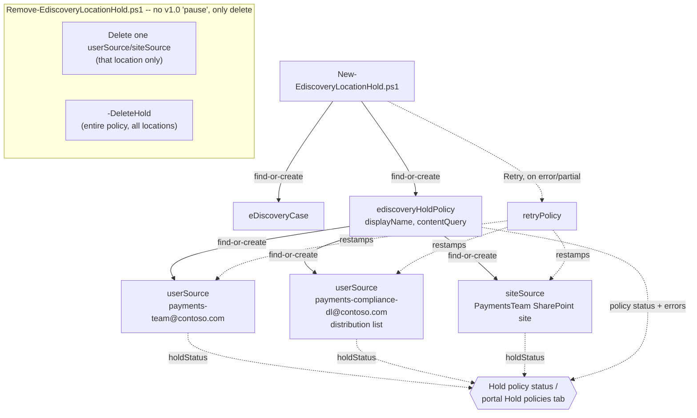

## The short version

Builds a Microsoft Purview eDiscovery (Premium) location-scoped legal hold - a
`microsoft.graph.security.ediscoveryHoldPolicy` covering one or more mailboxes, distribution
lists, and SharePoint sites - via app-only Microsoft Graph automation, for matters where the
preservation obligation attaches to a **location**, not a **named custodian**.

## Why this matters

The preservation duty described in *Legal Hold, Collection, Review, and Export* (FRCP Rule 37(e), common-law preservation duty, regulatory civil investigative demands) applies
identically here - what differs is the *shape* of what needs preserving. A regulator's CID or an
internal investigation frequently names a function, a distribution list, or a shared resource
("preserve the Payments team's shared inbox and site, and everyone on the
`payments-compliance-dl` list") rather than a roster of named individuals. Forcing that into the
custodian model means either resolving list membership into named custodians one by one - losing
the "membership changes, the hold should track it" property a location-scoped hold naturally has
- or leaving the shared/functional mailbox uncovered because it has no single owning person to
name as a custodian. This scenario is the technical control for that second, genuinely common
shape of preservation obligation.

## How the control works

All authoring goes through Microsoft Graph, `microsoft.graph.security` namespace, v1.0 - the same
supported app-only path the sibling custodian scenario uses, for the same reason
([Automation surface, section 3](/docs/automation-surface/#3-authentication-patterns---interactive-vs-unattended)). Unlike the custodian scenario, **no v1.0 typed PowerShell
cmdlet exists** for `ediscoveryHoldPolicy` or its `siteSources`/`userSources` collections (only
the Beta SDK module has one) - this scenario's scripts call the v1.0 REST endpoints directly via
`Invoke-MgGraphRequest`, per the design notes.

## What it takes

### Prerequisites

Full licensing and role detail: [Licensing matrix](/docs/licensing-matrix/) and [RBAC model](/docs/rbac-model/). This
scenario's requirements are identical to the sibling custodian scenario's - see
*Legal Hold, Collection, Review, and Export* (the prerequisites) for the full table (eDiscovery
Premium licensing on every held mailbox, tenant/case Premium toggles, eDiscovery Manager/
Administrator RBAC, and the Graph app-only auth requirement). Two differences specific to this
scenario:

| Requirement | Minimum | Notes |
|---|---|---|
| Licensing on a **shared/functional mailbox** | The mailbox itself needs eDiscovery Premium-tier licensing/entitlement the same as a person's mailbox would - a shared mailbox has no independent license by default in many tenants | Confirm the shared mailbox has the Exchange Online Plan 2 (or Plan 1 + Archiving add-on) entitlement this scenario's parent doc already requires for shared-mailbox custodians, before adding it as a userSource |
| **Gating prerequisite for `-DeleteHold` or removing a userSource/siteSource (`Remove-EdiscoveryLocationHold.ps1`)** | Written confirmation from counsel that the preservation duty for the affected location(s) has actually lapsed | Both removal paths on this object carry Microsoft's own documented risk of **permanent deletion of content currently being preserved** - a materially higher-stakes rollback than the custodian scenario's reversible release |

> Verify current entitlement names against [Licensing matrix](/docs/licensing-matrix/) and the Product Terms
> before a sales commitment - SKU names change.

### Cost and licensing

Identical to *Legal Hold, Collection, Review, and Export* (the cost and licensing notes) - no PAYG
component for hold creation/management; licensing is per-mailbox, not per-case, and (per the prerequisites
above) a shared/functional mailbox included in this hold needs the same Exchange Online
entitlement a person's mailbox would. A distribution list itself has no license requirement, but
every mailbox it expands to at hold time needs the qualifying entitlement.

## Proof it works

1. **Automated check** - `./validate/Test-EdiscoveryLocationHold.ps1 -DefinitionPath ...
   -CaseId $caseId -HoldId $holdId ...` confirms the case, hold policy, every declared
   userSource/siteSource, and the policy's own error collection; exits non-zero on any hard
   failure (safe for a CI-style pre-flight or a scheduled drift check).
2. **Propagation timing** - a freshly added source can show `applying` before settling to
   `applied`; the validate script reports `applying` as `WARN`, not `FAIL`. Microsoft doesn't
   publish an exact propagation SLA for this object the way it does for custodian holds (up to 24
   hours) - treat a source still `applying` after a comparable window as worth investigating with
   **Retry policy**, not immediately re-run as a fresh add.
3. **Functional proof (portal)** - open the case's **Hold policies** tab and confirm the policy
   shows **On** with every location's status green/no errors.
4. **Error-driven proof** - Microsoft's own hold-error reference maps each error string to a
   specific, actionable cause (invalid email/URL, inaccessible site, distribution-group size cap,
   identity change since the hold was applied). Treat any non-empty `errors` collection the
   validate script reports as a specific remediation task, not generic "flakiness."

## Where it stops

- **No v1.0 "turn off and keep for later."** `enablePolicy`/`disablePolicy` exist only in the
  beta Graph namespace - **re-verified 2026-09-04, still beta-only**; no
  promotion has occurred, and the v1.0 Update operation still exposes only `contentQuery`/
  `description` (`isEnabled` is not PATCH-settable either). This scenario's
  `Remove-EdiscoveryLocationHold.ps1` can only release individual locations or delete the whole
  policy - both are Microsoft-documented as potentially causing **permanent deletion of content
  currently being preserved**, not a reversible pause.
- **VERIFY (pilot tenant, before pointing this at a distribution list you haven't already
  tested):** whether a distribution list's own SMTP address is accepted as a `userSource.email`
  value on the v1.0 `ediscoveryHoldPolicy` endpoint and expanded server-side to member mailboxes.
  Corroborated by Microsoft's beta custodian-context userSource reference ("or the SMTP address
  of the group mailbox") and by the "Distribution group has too many members" (>1,000) error
  reference, but the v1.0, non-beta endpoint this scenario actually calls does not itself
  document group-mailbox support. If unconfirmed for your tenant, resolve and
  list individual member mailboxes instead.
- **Two different, current Microsoft Learn pages document two different group-expansion member
  caps, and neither is confirmed to govern this scenario's own REST-API code path (the design notes, re-grounded 2026-09-04):** "Create holds in eDiscovery" documents the **portal's own
  interactive data-source picker** as limited to **100 members**, for "every supported group
  type" (distribution list, mail-enabled security group, Microsoft 365 group, Microsoft Teams
  group, Viva Engage group); "Manage holds in eDiscovery" documents a
  **"Distribution group has too many members" hold-application error** at **more than 1,000
  email addresses**, specific to distribution groups. Both pages are current
  (not legacy/superseded - re-fetched directly, not stale). Microsoft does not state whether
  these describe the same limit surfaced at two different moments (portal member-picker vs.
  post-apply error) or two genuinely independent limits on two different code paths, and this
  scenario's script uses neither the portal picker nor is confirmed to hit the same expansion
  logic the >1,000 error describes - it calls the `ediscoveryHoldPolicy` REST `userSources`
  endpoint directly. Treat **100 members** as the conservative planning threshold; watch for
  the **"Distribution group has too many members"** string specifically in the policy's `errors`
  collection as the one hard failure mode Microsoft documents by name. VERIFY against a pilot
  tenant, at both thresholds, which (if either) applies to this REST-driven path before relying
  on server-side DL expansion for a list near either size.
- **`siteSource` find-or-create/validate matching is by parsed URL slug vs. returned site title,
  not a direct URL comparison** - neither the `List siteSources` nor `Create siteSource` v1.0
  reference exposes the source's `webUrl` on the response object. This is a real, disclosed weak
  point, not a robust match; a site whose title diverges from its URL slug can
  produce a false "not found."
- **A SharePoint site without a title cannot be placed on hold at all** - Microsoft's own guidance
  states this as a hard requirement.
- **This scenario does not resolve Teams/Microsoft 365 Group membership into a hold.** Holding a
  Team or group means adding its own mailbox and SharePoint site (resolved via
  `Get-UnifiedGroup`/`Get-UnifiedGroupLinks` in Exchange Online PowerShell) as a userSource/
  siteSource pair - mechanically supported by this scenario's scripts, but the lookup itself is
  out of scope here.
- **Deleting the case turns off every hold in it, including this location-scoped one** - the same
  fact the sibling scenario documents for custodian holds applies identically here; the two hold
  types share the same case lifecycle.
- **Condition filters and KeyQL filters beyond `contentQuery`** are a richer portal capability
  this scenario's single-`contentQuery` model doesn't cover - a portal edit that
  adds those filters directly won't be reflected in, or reconciled by, this scenario's definition
  file.