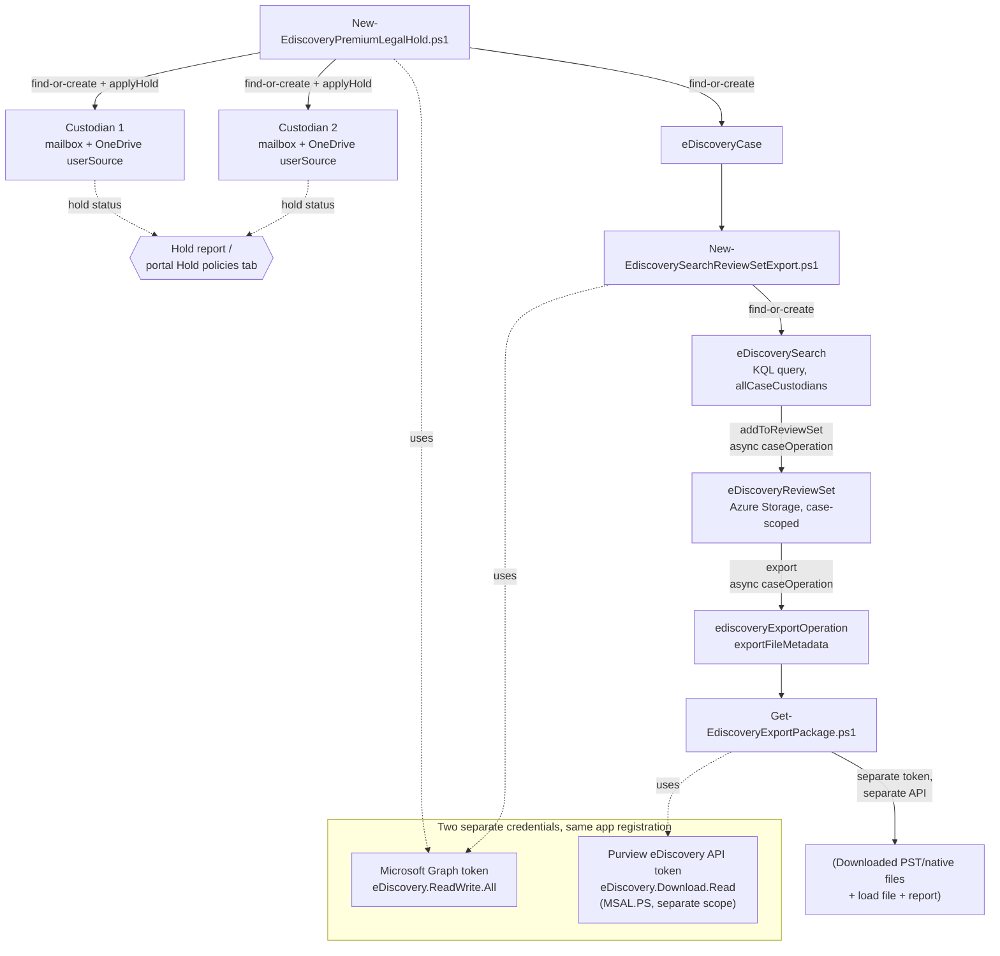

## The short version

Builds a Microsoft Purview eDiscovery (Premium) case end to end: create the case, add custodians
and place a legal hold on their Exchange mailboxes and OneDrive sites, run a scoped search,
commit the results to a review set, and export a production package for outside counsel - all
via app-only Microsoft Graph automation, with a portal walkthrough alongside each scripted step.

## Why this matters

A legal hold obligation arises the moment litigation is reasonably anticipated - under the
U.S. Federal Rules of Civil Procedure (FRCP Rule 37(e)) and the common-law duty to preserve
recognized across most jurisdictions, failing to suspend routine deletion of potentially relevant
electronically stored information (ESI) once that duty attaches can result in spoliation
sanctions, adverse-inference instructions, or an adverse judgment. Regulatory investigations
(SEC, FTC, DOJ civil investigative demands) and internal investigations (HR, whistleblower,
audit-committee referrals) carry the same preservation obligation even before a lawsuit is filed.

eDiscovery (Premium) is Microsoft's purpose-built control for this obligation inside Microsoft
365: it lets a legal team place a preservation hold on specific custodians' content the moment a
matter opens, independent of whatever retention/deletion policies would otherwise apply to that
content, and produces a documented chain from hold → collection → review →
export that supports a defensible preservation and production narrative. This scenario is the
technical control a legal/compliance team stands up the moment a matter is opened - not a
one-time configuration, but a repeatable pattern run once per matter.

## How the control works

All authoring (case, custodian, userSource, hold, search, review set, export *request*) goes
through Microsoft Graph, `microsoft.graph.security` namespace - the only supported app-only path
for eDiscovery (Premium) automation. Downloading the resulting export **package** goes through a
second, separate Microsoft Purview eDiscovery API with its own token, per Microsoft's documented
two-API design (the implementation steps, `deploy/Get-EdiscoveryExportPackage.ps1`). `addToReviewSet` and `export` are
both long-running, asynchronous `caseOperation`s - the deploy scripts poll them rather than
assuming synchronous completion, per [Automation surface, section 5](/docs/automation-surface/#5-throttling-scale-and-resilience-patterns).

## What it takes

### Prerequisites

Full licensing and role detail: [Licensing matrix](/docs/licensing-matrix/) and [RBAC model](/docs/rbac-model/). Summary for
this scenario:

| Requirement | Minimum | Notes |
|---|---|---|
| eDiscovery (Premium) features | **Microsoft 365 / Office 365 E5**, **Microsoft Purview Suite**, or the **Microsoft 365 E5 eDiscovery and Audit** add-on, for both the custodians being held **and** the administrator running searches/review sets/analytics | E3 alone gives eDiscovery (Standard) - cases, holds, search, export - but not custodian management, review sets, tagging, or analytics |
| Premium features enabled for new cases | Tenant-level **eDiscovery (Premium)** toggle under **Settings → eDiscovery → General**, and confirm it's on for this specific case under **Case settings** | Enabled by default for tenants with premium access, but can be turned off per case after creation - verify before running the deploy scripts against a case created by someone else |
| Role to author cases/custodians/holds via Graph app-only | **eDiscovery Manager** role group (least-privileged; scoped to cases the app-registration service principal is a member of) or **eDiscovery Administrator** (org-wide case visibility) | See [RBAC model, section 4](/docs/rbac-model/#4-purview-role-groups-by-module-representative-not-exhaustive). The **Custodian** role (data-source management) is only available to eDiscovery Manager members |
| Automation identity (case/custodian/search/review-set/export authoring) | Entra app registration, certificate-based app-only auth, granted **`eDiscovery.ReadWrite.All`** application permission and registered as an eDiscovery Manager (or Administrator) service principal | **App-only auth for eDiscovery cmdlets in Security & Compliance PowerShell is explicitly unsupported by Microsoft** - this is the one Purview module where Graph, not S&C PowerShell, is the only supported app-only path. See the implementation steps and [Automation surface, section 3](/docs/automation-surface/#3-authentication-patterns---interactive-vs-unattended) |
| Automation identity (export **package download**) | The same app registration additionally granted **`eDiscovery.Download.Read`** application permission against the first-party **MicrosoftPurviewEDiscovery** service principal | A *separate* API from Graph, with its own token and its own permission grant - see the implementation steps step 6 and `deploy/Get-EdiscoveryExportPackage.ps1` |
| Licensing on every held custodian | E3/E5 (Standard hold rights) plus, for the hold capabilities this scenario uses (custodian-scoped hold via Graph), E5-tier or the eDiscovery & Audit add-on. **Frontline (F1/F3) users cannot be the target of a hold.** | Confirm before adding a custodian - an unlicensed target isn't a supported configuration, not merely a soft warning |
| Shared mailbox custodians (if any) | **Exchange Online Plan 2**, or **Plan 1 + Exchange Online Archiving add-on** | Same licensing rule as placing a hold directly in Exchange |
| Dependency (not deployed by this scenario) | The matter's outside-counsel engagement, a defined preservation date range, and a keyword/date scope agreed with counsel | Drives `deploy/policy/ediscovery-case-definition.json`'s `search.contentQuery` - this scenario doesn't decide what to preserve/collect, it executes what legal has already scoped |
| **Gating prerequisite for any hold release (`Remove-EdiscoveryPremiumLegalHold.ps1`)** | Written confirmation from counsel that the preservation duty for the affected custodian(s)/matter has actually lapsed | Releasing a hold before the duty ends can itself be a spoliation event - this is a legal determination no script in this scenario can make; see the rollback runbook |

> Verify current entitlement names against [Licensing matrix](/docs/licensing-matrix/) and the Product Terms
> before a sales commitment - SKU names change.

### Cost and licensing

- **No PAYG component for hold/search/case management.** Creating cases, custodians, holds, and
  searches - and running `estimateStatistics` - is included in the qualifying E5/Suite/add-on
  license; only the **Export API's data volume** is metered under Purview's pay-as-you-go billing
  model, if activated.
- **Licensing is per-custodian, not per-case.** A custodian who is a member of five concurrent
  matters needs the qualifying license once, not five times - but every distinct individual
  placed on hold anywhere in the tenant needs it.
- **Sizing note:** unlike the DLP/DSPM scenarios in this library (which typically license a broad
  population), eDiscovery (Premium) licensing tracks *litigation exposure*, not headcount - budget
  for the population of employees realistically likely to become custodians (executives, the
  function most often named in disputes, departing-employee cohorts), not the whole org.

## Proof it works

1. **Automated check** - `./validate/Test-EdiscoveryPremiumCaseSetup.ps1 -DefinitionPath ...
   -CaseId $caseId ...` confirms the case, every custodian's hold status, userSources, the
   search, and the review set; exits non-zero on any hard failure (safe for a CI-style
   pre-flight or a scheduled drift check).
2. **Hold propagation** - a freshly applied hold can take up to 24 hours to take effect; the validate script reports a not-yet-`success` `HoldStatus` as `WARN`,
   not `FAIL`, in that window. Re-run after 24 hours and expect `PASS`.
3. **Functional proof (portal)** - open the case's **Hold policies** (or, if the tenant has the
   preview **hold report** enabled, **Settings → eDiscovery → Hold report**) and confirm the
   custodian's mailbox and OneDrive site show as **On** with no location errors.
4. **Search accuracy** - before collecting into a review set, run **View estimated statistics**
   on the search (portal, or the `estimateStatistics` operation) and sanity-check the hit count
   against what counsel expects for the date range/keywords - an estimate near zero usually means
   a scoping mistake (wrong custodian, wrong date syntax), not an empty mailbox.
5. **Export completeness** - after `Get-EdiscoveryExportPackage.ps1` finishes, confirm the
   downloaded file count and combined size match the `exportFileMetadata` entries the operation
   reported, and open the summary/load file the export always includes alongside the content
   files.

## Where it stops

- **This scenario's Graph app-only path cannot author `eDiscoveryHoldPolicy` (the case-level
  "legal hold" object with `siteSources`/`userSources` and an optional `contentQuery`) - only
  custodian-scoped holds via `applyHold`.** Both mechanisms exist in the v1.0 API and both are
  called "legal hold" in Microsoft's own documentation, which can be confusing when reading
  Microsoft Learn: `ediscoveryHoldPolicy` (`POST .../legalHolds`) is better suited to a
  location-scoped hold not necessarily tied to a named "custodian" (for example, holding a
  distribution-list-derived set of mailboxes for a regulatory sweep), while this scenario's
  custodian+`applyHold` pattern is the natural fit when the matter is organized around named
  individuals - the more common litigation-hold shape. A future companion scenario could cover
  the `ediscoveryHoldPolicy` path for the location-scoped case (tracked in the project backlog).
- **Hold propagation can take up to 24 hours** - don't treat a non-`success` `HoldStatus`
  immediately after `applyHold` as a failure.
- **Export packages must be downloaded within 30 days of the export completing**, even though the
  export *operation record* is retained for the life of the case. There is no
  documented way to extend this window - re-run the export if it lapses.
- **The `addToReviewSet`/export idempotency checks in `New-EdiscoverySearchReviewSetExport.ps1`
  match on operation type + `outputName`/"any succeeded addToReviewSet in this case," not an
  exact per-search/per-review-set key** - Microsoft's API doesn't expose a documented "does an
  equivalent operation already exist" filter. Keep definition-file display names stable across
  re-runs of the same matter's collection; see the script's own `.NOTES`.
- **VERIFY (pilot tenant, before production reliance):** whether a custodian's `userSource`
  `includedSources` value must be the exact string `"mailbox, site"` (as shown in Microsoft's own
  worked beta example) or whether the v1.0 endpoint expects a JSON array / different delimiter -
  the v1.0 REST reference for this specific endpoint documents the *possible values* (`mailbox`,
  `site`) but its own worked example for `POST .../custodians/{id}/userSources` only shows a
  single value (`"mailbox"`), not the combined form. `New-EdiscoveryPremiumLegalHold.ps1` uses the
  combined-string form by analogy with the (deprecated, beta-namespace) sibling endpoint's worked
  example rather than fabricating a JSON-array shape neither reference confirms.
- **A custodian's `userSource` (mailbox + OneDrive) does not automatically cover Microsoft Teams
  *channel* messages.** Teams 1:1/group chat is stored in the custodian's own mailbox and is
  covered by the mailbox `userSource`, but channel messages live in the team's own mailbox/site,
  not the individual custodian's - a matter where team/channel conversations are in scope needs
  the relevant team added as a **non-custodial data source**
  (`New-MgSecurityCaseEdiscoveryCaseNoncustodialDataSource`, out of scope for this fragment) in
  addition to the custodians this scenario holds, not instead of them.
- **Legal hold custodian communications (the Premium "Communications" tab - initial notice,
  reminders, escalations, acknowledgment tracking) was permanently retired by Microsoft on
  August 31, 2025 and is not available in the current eDiscovery experience** - confirmed directly
  against Microsoft's own current (non-legacy) "Manage hold notifications" page, which states this
  in an `Important` callout rather than the classic-experience/21Vianet-China-only caution banner
  this build initially expected to find. A prior pass tracked "add a
  legal-hold-notifications companion scenario" as a follow-up in the project backlog, assuming the gap
  was simply "no Graph write API for an otherwise-current portal feature" (the same shape as
  several other no-write-API Purview surfaces this library documents). It wasn't that: the feature
  itself no longer exists to automate or walk through, in either direction. Two consequences worth
  being explicit about, since a defensible preservation narrative in many jurisdictions still
  expects a documented custodian notification alongside the technical hold:
  - **There is currently no in-product way to formally notify a custodian of a hold, or to track
    their acknowledgment, inside Microsoft Purview eDiscovery (Premium).** Do not point a customer
    at the "Create a legal hold notice" / "Work with communications" Microsoft Learn articles as
    current guidance - both carry the classic-experience/21Vianet-China-only banner and describe a
    retired workflow. Treat legal hold notice delivery and acknowledgment tracking as an
    **external, non-Purview process** (e.g., a counsel-managed email + read-receipt or e-signature
    tool, tracked in a matter-management or case-file system) until Microsoft ships a
    current-experience replacement - the Microsoft 365 Roadmap is the place to watch for one, not
    a promise this scenario can make.
  - **The `ediscoveryCustodian` object's `acknowledgedDateTime` and `releasedDateTime` properties
    (Graph v1.0, `microsoft.graph.security` namespace - still a live, current-experience surface,
    unrelated to the retired Communications tab) are worth monitoring only as a residual signal,
    not relied on as primary evidence.** With no in-product way left to send a notice, there is no
    confirmed mechanism populating `acknowledgedDateTime` for a custodian in a current-experience
    case - a persistently-null value across every custodian in a tenant is the expected state now,
    not a sign of an unacknowledged hold. `validate/Test-EdiscoveryPremiumCaseSetup.ps1` does not
    check this field for exactly this reason.
- **Attorney-client privilege detection, near-duplicate/theme analytics, and predictive coding**
  are Premium review-set capabilities this scenario doesn't configure or exercise - it stops at
  "collect, commit to review set, export," which is sufficient for many straightforward matters
  but not a substitute for the analytics workflow a large-scale review would use.
- **Closing or deleting a case turns off every hold in it**, including custodians this scenario
  didn't add - `Remove-EdiscoveryPremiumLegalHold.ps1` warns before `-CloseCase`/`-DeleteCase`,
  but the responsibility to confirm every custodian's hold should actually end is the operator's,
  not the script's.