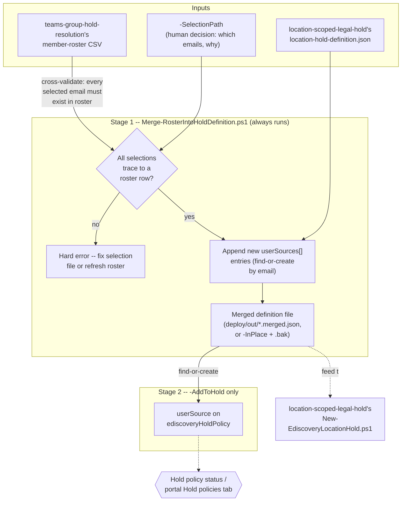

## The short version

Merges a human-selected subset of a Microsoft Teams / Microsoft 365 Group member roster -
produced by *Microsoft Teams / Microsoft 365 Group Hold-Location Resolution*'s `-ResolveMembers` roster CSV -
into *Location-Scoped Legal Hold (Regulatory Sweep / Shared Mailbox)*'s `location-hold-definition.json` shape as
new `userSources[]` entries, and optionally reconciles them directly onto an existing hold policy.

## Why this matters

Identical underlying preservation duty to *Location-Scoped Legal Hold (Regulatory Sweep / Shared Mailbox)* (why this matters) and
*Microsoft Teams / Microsoft 365 Group Hold-Location Resolution* (why this matters). What's specific here is a common refinement in a
regulatory inquiry or internal sweep: a matter starts out scoped to a Team ("preserve the Payments
Team"), and then narrows - outside counsel or an internal investigator identifies specific
individuals within that group as direct subjects, requiring their mailboxes preserved
*individually*, not just as part of the group mailbox's aggregate content. Doing this by hand means
someone copy-pastes SMTP addresses out of a roster export into a JSON file under time pressure - a
manual step with real spoliation exposure if an address is mistyped or a selected person is quietly
dropped. This fragment makes that translation a single auditable script run instead.

## How the control works

Stage 1 is pure file manipulation - no Exchange Online or Graph connection required. Stage 2
(`-AddToHold` only) reuses *Location-Scoped Legal Hold (Regulatory Sweep / Shared Mailbox)*'s and *Microsoft Teams / Microsoft 365 Group Hold-Location Resolution*'s own
Graph v1.0 `ediscoveryHoldPolicy` `userSources` REST calls (surface 3), duplicated rather than
dot-sourced per this library's self-contained-deploy-tree convention.

## What it takes

### Prerequisites

Full licensing and role detail: [Licensing matrix](/docs/licensing-matrix/) and [RBAC model](/docs/rbac-model/). This
scenario's requirements are the union of its two inputs' own prerequisites - it introduces no new
licensing or role beyond what building the roster and the hold definition already require.

| Requirement | Minimum | Notes |
|---|---|---|
| A roster CSV already produced | `teams-group-hold-resolution/deploy/Resolve-TeamsGroupHoldLocations.ps1 -ResolveMembers` run beforehand | This scenario never calls `Get-UnifiedGroup`/`Get-UnifiedGroupLinks` itself - it only reads that script's CSV output. No Exchange Online PowerShell connection is required to run this scenario's own scripts. |
| A definition file to merge into | Any file matching `location-scoped-legal-hold/deploy/policy/location-hold-definition.json`'s shape | Typically that scenario's own tracked sample, or a matter-specific copy of it |
| eDiscovery Premium licensing + eDiscovery Manager/Administrator RBAC | Only for the optional `-AddToHold` path | Identical requirement to both sibling scenarios' own `-AddToHold`/deploy paths - see *Location-Scoped Legal Hold (Regulatory Sweep / Shared Mailbox)* (the prerequisites) |
| Microsoft Graph app-only auth (surface 3) | Only for `-AddToHold` | Same shape as both sibling scenarios: `-AppId`/`-TenantId`/`-CertificateThumbprint` or `-Certificate` |

> Verify current entitlement names against [Licensing matrix](/docs/licensing-matrix/) and the Product Terms before
> a sales commitment - SKU names change.

### Cost and licensing

No incremental licensing beyond *Location-Scoped Legal Hold (Regulatory Sweep / Shared Mailbox)* (the cost and licensing notes) - this scenario doesn't
create any new billable object; it only prepares and, optionally, applies `userSources[]` entries
that scenario's own hold policy already accepts. File-merge operations have no cost; `-AddToHold`'s
Graph calls are the same no-PAYG/metered-cost reads/writes both sibling scenarios already document.

## Proof it works

1. **Automated check** - `./validate/Test-RosterHoldDefinitionMerge.ps1` confirms every selected
   email still traces to a roster row, appears exactly once in the merged definition file with a
   non-empty audit-trail note, and - with `-CaseId`/`-HoldId` - is present and `applied` on the
   named hold policy. Exits non-zero on any hard failure.
2. **Functional proof (portal)** - after `-AddToHold`, open the case's **Hold policies** tab and
   confirm each newly added individual's mailbox appears as a location with no errors, the same
   proof both sibling scenarios' own the validation steps describe.
3. **Audit-trail sanity check** - open the merged definition file directly and confirm each new
   entry's `note` field names the correct source group and reflects the selection file's `reason` -
   this is the artifact a compliance reviewer or outside counsel would actually read to confirm
   *why* a given mailbox was individually preserved.

## Where it stops

- **This script never decides who to select - and never re-validates current membership.** See
  the design notes and section 6. A stale roster or a mistaken selection is a human-process risk this script
  cannot detect on its own; its only defense is the hard-error check that every selected email
  traces to *some* roster row, not that the roster itself is current.
- **`-InPlace`'s `.bak-*` backup is local-only.** It protects against this script's own overwrite
  mistake, not against the original tracked file being lost some other way (a bad `git` operation,
  a wiped working directory). Prefer the default `-OutputPath` behavior (never touches
  `-DefinitionPath`) unless there's a specific reason to overwrite in place.
- **Only adds `userSources[]` (mailboxes) - never `siteSources[]` or OneDrive.** See the design notes. A matter that also needs an individually named person's OneDrive preserved needs a different,
  not-yet-built mechanism (OneDrive is a distinct Purview eDiscovery location type from both
  `userSource` and `siteSource`).
- **Does not create or modify the hold policy or case itself.** `-AddToHold` requires an existing
  `-CaseId`/`-HoldId` from `location-scoped-legal-hold/deploy/New-EdiscoveryLocationHold.ps1` (or
  the portal); this scenario is purely the roster-to-definition-file translation step, optionally
  followed by reconciliation onto an already-existing hold.
- **Inherits both sibling scenarios' own open VERIFYs unchanged** - the 100-vs->1,000-member
  group-expansion-cap discrepancy (relevant only to how large a roster this scenario might be asked
  to select from) and the `siteSource` title-matching weak point (not applicable here, since this
  scenario never touches `siteSources[]`) - see *Location-Scoped Legal Hold (Regulatory Sweep / Shared Mailbox)* (the known limitations) and
  *Microsoft Teams / Microsoft 365 Group Hold-Location Resolution* (the known limitations) for the full analysis; not re-derived here.