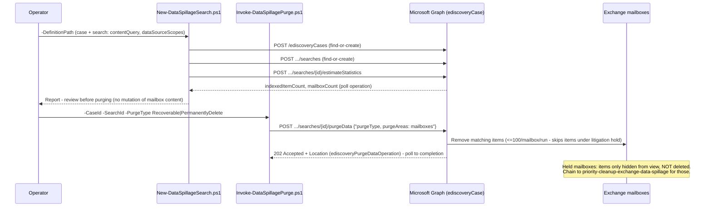

## The short version

Scripts Microsoft Purview eDiscovery's **search-and-purge** capability - create a search, validate
what it found, then remove matching items from Exchange mailboxes - as code, via Microsoft Graph's
`ediscoveryCase`/`ediscoverySearch` resources. Soft-delete (`Recoverable`) by default; hard-delete
(`PermanentlyDelete`) only as an explicit, separately-confirmed choice.

## Why this matters

Data spillage - sensitive content emailed to the wrong recipients - is the exact use case Microsoft
documents this capability for: "quickly assess the size and locations of the spillage... and then
permanently purge the spilled data from the system". Most spillage incidents don't
involve a litigation hold or a multi-year retention policy; they need immediate containment with an
auditable record, not this library's *Priority Cleanup for Exchange Data Spillage* sibling's slower,
three-approver, hold-overriding permanent deletion. This scenario is that faster, narrower tool -
and it explicitly hands off to the priority-cleanup sibling for the minority of cases where a hold
*is* in the way.

> ⚠️ **Purge does not override a hold.** On a mailbox with an active litigation hold, purge removes
> matching items from the user's *view* only - they are **not** permanently deleted
>. If that's the outcome you need, see the implementation steps's hand-off to
> *Priority Cleanup for Exchange Data Spillage*. Hard-delete
> (`-PurgeType PermanentlyDelete`) is irreversible on a mailbox **without** a hold - validate the
> search estimate carefully before purging.

## How the control works

Full rationale, including why this is built on Graph rather than the S&C PowerShell
`New-ComplianceSearchAction -Purge` path Microsoft's own current docs still show for interactive use:
the design notes.

## What it takes

### Prerequisites

Full licensing detail: [Licensing matrix, section 2](/docs/licensing-matrix/#2-master-capability--license-matrix) (eDiscovery (Premium) row - a Graph-created case
is Premium-configured; see the design notes). RBAC: [RBAC model, section 4](/docs/rbac-model/#4-purview-role-groups-by-module-representative-not-exhaustive). Automation surface:
[Automation surface, section 3](/docs/automation-surface/#3-authentication-patterns---interactive-vs-unattended) (Microsoft Graph - the supported app-only path for eDiscovery
automation) and the validation steps. Summary:

| Requirement | Minimum | Notes |
|---|---|---|
| Licensing | **eDiscovery (Premium)**: M365/Office 365 **E5**, **Microsoft Purview Suite**, or **E5 eDiscovery & Audit** add-on | [Licensing matrix, section 2](/docs/licensing-matrix/#2-master-capability--license-matrix); the design notes explains why a Graph-based case is Premium-tier |
| Role to create/run a search | **eDiscovery Manager** (own cases) or **eDiscovery Administrator** (all cases) - includes the **Compliance Search** role | [RBAC model, section 4](/docs/rbac-model/#4-purview-role-groups-by-module-representative-not-exhaustive) |
| Role to purge | **Search And Purge** - "the least privileged option for purging data," available by default only to **Organization Management** members | Grant the automation's service principal a **custom role group** with just Compliance Search + Search And Purge (+ Case Management, to create the case/search) rather than full Organization Management - least privilege |
| Graph permission | Application **`eDiscovery.ReadWrite.All`** | [Automation surface, section 3](/docs/automation-surface/#3-authentication-patterns---interactive-vs-unattended); confirmed against the `purgeData`/`searches` Graph reference pages |
| Auth | Certificate-based app-only via `Connect-MgGraph` | [Automation surface, section 3](/docs/automation-surface/#3-authentication-patterns---interactive-vs-unattended) |
| PowerShell module | `Microsoft.Graph.Security` ≥ 2.25.0 | Same module/version floor as *Legal Hold, Collection, Review, and Export* |

### Cost and licensing

- **eDiscovery (Premium)** entitlement (E5/Suite/add-on) - no separate per-search or per-purge meter.
- **The real cost is process, not the meter**: a documented incident record (one case per spillage
  event), a reviewed estimate before every purge, and - for `PermanentlyDelete` - a second,
  deliberate confirmation.
- Compare against *Priority Cleanup for Exchange Data Spillage* before choosing a tool: this scenario is
  faster and narrower (no multi-approver workflow) but **cannot** override a hold; that sibling is
  slower (up to 7 days to match, multi-stage approval) but can.

## Proof it works

1. **Automated (object-level)** - `./validate/Test-DataSpillageSearchAndPurge.ps1` confirms the case
   and search exist, reports the latest `estimateStatistics` result, lists every `purgeData`
   operation against the search with its status, and warns if the most recent purge operation is
   still `running`/`notStarted`. Exits non-zero on a `failed`/`submissionFailed` purge operation.
2. **Re-run the search's estimate** - a falling `indexedItemCount` across successive
   `New-DataSpillageSearch.ps1` runs after a purge is the direct evidence content was actually
   removed (mirrors the retired walkthrough's own Step 8 verification pattern of re-running the same
   query and confirming no results).
3. **Audit** - search the unified audit log for the eDiscovery search/purge activity; see
   [RBAC model, section 4](/docs/rbac-model/#4-purview-role-groups-by-module-representative-not-exhaustive) and *Legal Hold, Collection, Review, and Export*'s own
   `Export-EdiscoveryAuditTrail.ps1` for the audit-log query pattern this library already uses for
   eDiscovery case-lifecycle events (RecordType `Discovery`).
4. **Idempotency proof** - re-run `New-DataSpillageSearch.ps1`; the case/search report `exists`, not
   `created`.

## Where it stops

- **Does not override litigation holds or retention policies.** See section 2's warning and the design notes.
  Chain to *Priority Cleanup for Exchange Data Spillage* for held content.
- **100 items per mailbox per run.** Repeat the purge to clear more; this is a documented Microsoft
  limit, not a bug in this scenario's scripts.
- **Doesn't purge Microsoft Teams messages**, even though `purgeAreas: teamsMessages` exists on the
  same Graph action - deliberately out of scope; see *Search-and-Purge for Microsoft Teams Messages* for that sibling scenario. **Correction (superseding this
  scenario's own earlier text):** Teams purge is not "compliance-copy-only" as previously stated
  here - Microsoft's `purgeData` reference states that either `purgeType` value permanently deletes
  the Teams user-visible message immediately when `purgeAreas` is `teamsMessages`, a *more*
  consequential guarantee than this scenario's own `Recoverable` mailbox purge, not a lesser one.
  See that sibling's the design notes for the full re-grounding.
- **`PermanentlyDelete` is irreversible** for a mailbox not on hold. Always review the
  `estimateStatistics` output first; there is no "undo."
- **VERIFY (pilot tenant):** whether a mailbox on litigation hold behaves identically for the Graph
  `purgeData` action as Microsoft's FAQ documents for the PowerShell `New-ComplianceSearchAction
  -Purge` path (items only hidden from view, not deleted, regardless of `purgeType`) - both paths
  share the same underlying eDiscovery search/purge engine, but no Microsoft Learn page independently
  confirms the hold behavior specifically for the Graph `purgeData` action. the design notes goal 5 and
  `deploy/Invoke-DataSpillagePurge.ps1`'s `.NOTES` flag this rather than assuming it by analogy.
- **The `contentQuery` itself can carry the spilled data** (a distinctive phrase, attachment name, or
  keyword drawn from the leaked content) and persists on the search object for the life of the case -
  a second, smaller exposure surface visible to anyone with read access to the case. the rollback runbook
  Stage 2 (delete the search once the incident is closed) and the sample config's own `_comment` flag
  this; treat the definition file and the live search object as sensitive for the incident's duration.
- **`purgeData`'s prior-operations listing is case-wide, not search-specific.** Neither
  `Invoke-DataSpillagePurge.ps1 -ListOnly` nor `validate/Test-DataSpillageSearchAndPurge.ps1` can
  confirm which search a given `purgeData` operation targeted - `caseOperation` doesn't expose that
  link without a further, undocumented expand. In a case with more than one active search, cross-check
  timing/context manually before assuming a listed purge operation belongs to the search you're
  reviewing.
- **VERIFY:** how long a purge job report's `reportFileMetadata.downloadUrl`
  (`Invoke-DataSpillagePurge.ps1`'s printed proof-of-purge link) remains valid before expiring - not
  stated on the `ediscoveryPurgeDataOperation` reference page, nor on the `reportFileMetadata`
  resource type page itself, which documents only `downloadUrl`/`fileName`/
  `size` with no TTL. Re-grounded 2026-09-27: Microsoft Learn *does* document expiry for the
  differently-typed, differently-named **export** download links - search exports expire 14 days
  after creation, review set exports must be downloaded within 30 days, and a separate
  pre-authorized-link feature offers 1-168 hour windows - but all three apply to
  `ediscoveryExportOperation`/`exportFileMetadata` (the `contentExport` action), a distinct resource
  type and action from this scenario's `ediscoveryPurgeDataOperation`/`reportFileMetadata`
  (the `purgeData` action). No Microsoft Learn page states or implies the purge job report's
  `downloadUrl` shares either expiry window, so assuming parity would be a guess, not a grounded
  fact. Treated as still-undocumented; download and archive the report promptly with the case
  record rather than relying on it staying reachable indefinitely. Re-open only if Microsoft
  publishes an expiry statement specific to `ediscoveryPurgeDataOperation`/`reportFileMetadata`.
- **The classic "Data spillage scenario: Search and purge" walkthrough is retired** (2025-08-31,
  21Vianet-only now) - this scenario's workflow shape (search → validate → purge →
  verify) is re-derived from it for concept only; every cmdlet/API call is grounded in current,
  non-retired references.
- **Illustrative values.** The case name, query, and mailbox scope in the sample config are
  placeholders - replace with the real, confirmed spillage details before use.