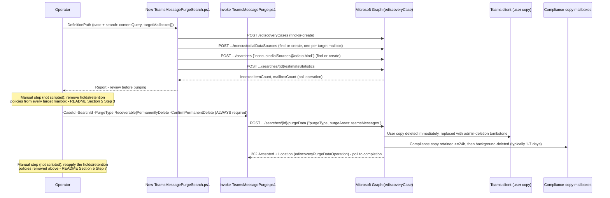

## The short version

Scripts Microsoft Purview eDiscovery's search-and-purge capability for **Microsoft Teams chat
messages** - the Teams-specific half of Microsoft Graph's `purgeData` action
(`purgeAreas: teamsMessages`) that this library's *Search-and-Purge for Data Spillage* sibling scoped out.
Unlike that sibling's mailbox purge, **there is no reversible mode for Teams**: any successful purge
permanently deletes the user-visible message immediately, regardless of which `purgeType` is chosen.

## Why this matters

Teams chat is now a first-class channel for the same data-spillage and inappropriate-content
incidents email has always presented - a confidential file summary pasted into a group chat, a
harassment message in a channel, a wrong-recipient 1:1 share. Microsoft's own eDiscovery search-and-purge workflow documents Teams messages as a directly supported target for exactly this response. This scenario builds that workflow as code, on the same idempotent-search /
explicit-purge pattern this library already established for mailboxes.

> ⚠️ **There is no "soft delete" for a Teams purge.** Microsoft's own Graph reference states plainly:
> "When purgeType is set to either `recoverable` or `permanentlyDelete` and purgeAreas is set to
> `teamsMessages`, the Teams messages are permanently deleted". The user-visible
> message is removed **immediately** and replaced with an admin-deletion tombstone; it "can't be
> recovered by the user". Review the search estimate carefully - there is no
> analog to the mailbox sibling's Recoverable-Items recovery window here. See the design notes for
> why this corrects an assumption an earlier build of this library's mailbox sibling scenario carried.

## How the control works

Full rationale - including the correction to this library's own mailbox sibling's prior "compliance-copy-only" assumption - is in the design notes.

## What it takes

### Prerequisites

Full licensing detail: [Licensing matrix, section 2](/docs/licensing-matrix/#2-master-capability--license-matrix) (eDiscovery (Premium) - a Graph-created case is
Premium-configured, same as the mailbox sibling; the design notes of that scenario). RBAC:
[RBAC model, section 4](/docs/rbac-model/#4-purview-role-groups-by-module-representative-not-exhaustive). Automation surface: [Automation surface, section 3](/docs/automation-surface/#3-authentication-patterns---interactive-vs-unattended).

| Requirement | Minimum | Notes |
|---|---|---|
| Licensing | **eDiscovery (Premium)**: M365/Office 365 **E5**, **Microsoft Purview Suite**, or **E5 eDiscovery & Audit** add-on | Same tier as *Search-and-Purge for Data Spillage* - a Graph-created case is Premium-configured |
| Role to create/run a search | **eDiscovery Manager** (own cases) or **eDiscovery Administrator** (all cases) | [RBAC model, section 4](/docs/rbac-model/#4-purview-role-groups-by-module-representative-not-exhaustive) |
| Role to purge | **Search And Purge** | For this Teams-specific workflow, Microsoft states the role "is assigned to the **Data Investigator** and **Organization Management** role groups by default" - note this is a broader default than the mailbox sibling's own citation ("available by default only to Organization Management members"); grant a **custom role group** with just the needed roles rather than relying on either default, least privilege |
| Graph permission | Application **`eDiscovery.ReadWrite.All`** | Same as the mailbox sibling; confirmed against the `purgeData`/`searches`/`noncustodialDataSources` Graph reference pages |
| Auth | Certificate-based app-only via `Connect-MgGraph` | [Automation surface, section 3](/docs/automation-surface/#3-authentication-patterns---interactive-vs-unattended) |
| PowerShell module | `Microsoft.Graph.Security` ≥ 2.25.0 | Same module/version floor as the mailbox sibling |
| Pre-resolved target mailboxes | Parent-team mailbox (*Microsoft Teams / Microsoft 365 Group Hold-Location Resolution*), or known participant/private-channel addresses | See the design notes - this scenario does not re-derive Teams/group mailbox resolution |

### Cost and licensing

- **eDiscovery (Premium)** entitlement (E5/Suite/add-on) - same as the mailbox sibling, no separate
  per-search or per-purge meter for this action.
- **The real cost is the hold-removal/reapplication process**, not a licensing meter: every purge
  requires a human to identify, remove, and later reapply holds on each target mailbox - a
  heavier operational sequence than the mailbox sibling's "purge, held mailboxes are just skipped"
  model.

## Proof it works

1. **Automated (object-level)** - `./validate/Test-TeamsMessagePurgeSearchAndPurge.ps1` confirms the
   case and search exist, lists the search's bound non-custodial (mailbox) sources, reports the
   latest `estimateStatistics` result, and lists every `purgeData` operation against the case with
   its status. Exits non-zero on a `failed`/`submissionFailed` purge operation.
2. **Teams client tombstone** - the fastest direct confirmation: the purged message is replaced in
   the Teams client with **"This message was deleted by an admin"** immediately on a successful purge
   - a client-visible signal the mailbox sibling has no equivalent for.
3. **Re-run the search's estimate** - a falling `indexedItemCount` across successive
   `New-TeamsMessagePurgeSearch.ps1` runs after a purge is the same secondary evidence pattern the
   mailbox sibling uses.
4. **Audit** - search the unified audit log for the eDiscovery search/purge activity, the same
   `RecordType Discovery` pattern this library's *Legal Hold, Collection, Review, and Export* and
   *Search-and-Purge for Data Spillage* scenarios already use.
5. **Idempotency proof** - re-run `New-TeamsMessagePurgeSearch.ps1`; the case/search/noncustodial
   sources all report `exists`, not `created`.

## Where it stops

- **No reversible purge mode.** Both `-PurgeType` values permanently delete the Teams user-visible
  message on success. See why this matters's warning and the design notes. This is the single most important
  fact about this scenario, and the reason `-ConfirmPermanentDelete` is required unconditionally.
- **A hold or retention policy on a target mailbox blocks the purge entirely** rather than just
  hiding the item from view (the mailbox sibling's behavior). Remove it first, purge, then reapply -
  the implementation steps steps 3/6. This scenario does not automate either step.
- **100 items per mailbox/location per run.** Same documented ceiling as the mailbox sibling; repeat
  the purge to clear more.
- **Not supported for Teams Connect Chat (external access/federation) conversations, or for chats
  with yourself** - Microsoft states both plainly; not scriptable around.
- **Private-channel compliance-copy storage - reconciled 2026-09-27, not left as a VERIFY.** One
  Microsoft Learn page's data-source table says "a dedicated mailbox for each private channel"; a separate page's older section says storage is "in the Exchange Online
  mailboxes of all members of the private channel". This is a documented
  **migration**, not an unreconciled contradiction: Microsoft's Teams private-channels reference
  confirms compliance copies "are now delivered to the group mailbox (instead of mailbox of all
  private channel members)", and its retention reference ties the same split to
  `RecipientTypeDetails` - `GroupMailbox` post-migration, `UserMailbox` before it.
  The dedicated-mailbox model is current; the per-member model is legacy. What is **not** a
  documentation fact and stays tenant-specific: whether a given private channel has completed the
  migration. Confirm with `Get-TenantPrivateChannelMigrationStatus` before
  targeting a private channel as a single dedicated mailbox - an unmigrated channel still needs the
  per-member `Get-TeamChannelUser` lookup. See the design notes.
- **Closed 2026-09-27** (Microsoft Learn MCP, module reference page): no typed PowerShell cmdlet
  exists for binding an existing `noncustodialDataSource` onto a search via the `$ref` endpoint.
  The `Microsoft.Graph.Security` v1.0 module's full cmdlet index for the
  `EdiscoveryCaseSearchNoncustodialSource` noun lists only `Get-` cmdlets (list/count); the module's
  only `New-`-verb cmdlet for a noncustodial source is `New-MgSecurityCaseEdiscoveryCaseNoncustodialDataSource`,
  a different, case-level operation (creates the source object itself, not the search-level `$ref`
  bind). `deploy/New-TeamsMessagePurgeSearch.ps1` correctly calls the confirmed
  raw HTTP shape via `Invoke-MgGraphRequest` for this step - not a workaround for an unconfirmed
  cmdlet, but the only way to perform this specific action. the design notes.
- **VERIFY (pilot tenant):** how a case-level `ediscoveryNoncustodialDataSource`'s `DisplayName` is
  populated for a mailbox (`userSource`) - this scenario's idempotency check matches on `DisplayName`
  as a best-effort heuristic; `validate/Test-TeamsMessagePurgeSearchAndPurge.ps1` reports this as
  `[WARN]`, not `[PASS]`. the design notes.
- **Grounded 2026-09-28 (Microsoft Learn MCP), not a VERIFY:** `-PurgeType` does **not** meaningfully
  affect the compliance copy's retention or hold-interaction timeline for Teams. The `ediscoverySearch:
  purgeData` Graph reference - the authoritative source for the `purgeType` parameter itself - states
  plainly that "when `purgeType` is set to either `recoverable` or `permanentlyDelete` and `purgeAreas`
  is set to `teamsMessages`, the Teams messages are permanently deleted": both
  values are documented to produce the identical outcome. The compliance-copy retention mechanics
  Step 6 of describes (retained >=24h, background-deleted typically within 1-7
  days, preserved if a hold is reapplied within that 24h window) are stated once, with no
  `purgeType`-conditioned branch - unlike the mailbox sibling, where `recoverable`/`permanentlyDelete`
  map to genuinely different soft-delete/hard-delete mechanics, Teams has no such split. the design notes updated in place.
- **This scenario purges Teams messages only** (`purgeAreas: teamsMessages`) - it never touches
  Exchange mailbox content; use the *Search-and-Purge for Data Spillage* sibling for that.
- **This build corrected a factual error in the *Search-and-Purge for Data Spillage* sibling's own
  docs** (it previously described Teams purge as compliance-copy-only, the opposite of current
  Microsoft Learn guidance for the Graph-based mechanism) - see the design notes. Both scenarios' texts
  now agree.
- **Illustrative values.** The case name, query, and mailbox list in the sample config are
  placeholders - replace with the real, confirmed incident details before use.