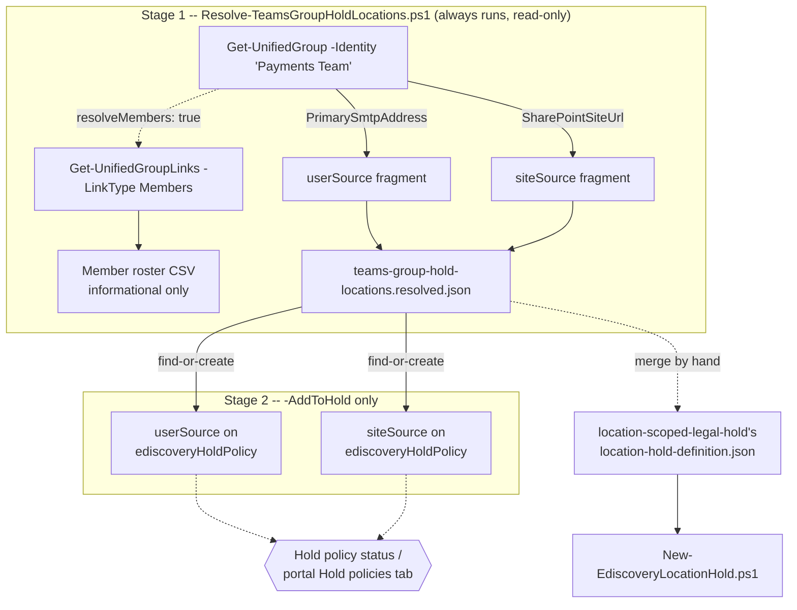

## The short version

Resolves a Microsoft Teams team or Microsoft 365 Group's own preservable content locations - its
group mailbox and its SharePoint site - into the `userSource`/`siteSource` pair that
*Location-Scoped Legal Hold (Regulatory Sweep / Shared Mailbox)*'s hold scripts already accept, and optionally
reconciles those locations directly onto an existing hold policy.

## Why this matters

Identical to *Location-Scoped Legal Hold (Regulatory Sweep / Shared Mailbox)* (why this matters) - the preservation duty
this control implements doesn't change based on which object type names the in-scope location.
What's specific to this scenario is a genuinely common naming pattern in a regulatory inquiry or
internal sweep: a matter names a **Team**, not a mailbox address or a SharePoint URL. A Team's
preservable content spans two Purview-hold-relevant locations that aren't visible from the Team
name alone (its group mailbox and SharePoint site - the architecture), and Microsoft's own guidance is explicit
that placing a Team/group on hold **only** covers those two locations, not the mailboxes/OneDrive
accounts of the people who are members of it - a distinction with real spoliation exposure if
a legal team assumes "the Team is on hold" covers more than it actually does.

## How the control works

Stage 1 uses Exchange Online PowerShell (`Get-UnifiedGroup`/`Get-UnifiedGroupLinks`, automation
surface 1 per [Automation surface, section 1](/docs/automation-surface/#1-five-automation-surfaces-not-one-read-this-first)) - the only surface that exposes a Team/Microsoft 365
Group's `SharePointSiteUrl` directly, per Microsoft's own worked example. Stage 2 (`-AddToHold`
only) reuses *Location-Scoped Legal Hold (Regulatory Sweep / Shared Mailbox)*'s Graph v1.0 `ediscoveryHoldPolicy` REST calls (surface
3), duplicated rather than dot-sourced per this library's self-contained-deploy-tree convention.

## What it takes

### Prerequisites

Full licensing and role detail: [Licensing matrix](/docs/licensing-matrix/) and [RBAC model](/docs/rbac-model/). This
scenario's core requirements are identical to *Location-Scoped Legal Hold (Regulatory Sweep / Shared Mailbox)* (eDiscovery
Premium licensing on the group's mailbox, tenant/case Premium toggles, eDiscovery Manager/
Administrator RBAC, Graph app-only auth for the `-AddToHold` path). Two differences specific to
this scenario:

| Requirement | Minimum | Notes |
|---|---|---|
| **View-Only Recipients** role in Exchange Online (or membership in a role group assigned it) | Required to run `Get-UnifiedGroup`/`Get-UnifiedGroupLinks` - Microsoft states this explicitly on both cmdlets' own reference pages | Separate from the Graph eDiscovery RBAC the `-AddToHold` path needs; an operator with only eDiscovery Manager/Administrator cannot run the resolve stage without this Exchange role too |
| Exchange Online PowerShell connection (surface 1) already established | `Connect-ExchangeOnline` run by the caller before invoking either script | Unlike the sibling scenario's Graph-only scripts, this scenario's deploy/validate scripts do not self-connect to Exchange Online - see the design notes for why |

> Verify current entitlement names against [Licensing matrix](/docs/licensing-matrix/) and the Product Terms before
> a sales commitment - SKU names change.

### Cost and licensing

No incremental licensing beyond *Location-Scoped Legal Hold (Regulatory Sweep / Shared Mailbox)* (the cost and licensing notes) - this scenario doesn't
create any new billable object; it only resolves values that scenario's own hold policy consumes.
`Get-UnifiedGroup`/`Get-UnifiedGroupLinks` calls are Exchange Online PowerShell reads with no PAYG
or metered cost.

## Proof it works

1. **Automated check** - `./validate/Test-TeamsGroupHoldLocations.ps1 -DefinitionPath ...` confirms
   every declared group still resolves to the mailbox/site address recorded in the last resolved
   fragment (drift detection); add `-CaseId`/`-HoldId` to also confirm those locations are actually
   present and `applied` on a named hold policy. Exits non-zero on any hard failure.
2. **Functional proof (portal)** - after `-AddToHold`, open the case's **Hold policies** tab and
   confirm the group's mailbox and site both appear as locations with no errors, exactly as the
   sibling scenario's own the validation steps describes.
3. **Member-roster sanity check** - if `resolveMembers: true` was used, the emitted CSV's row count
   should match what **Groups** in the Microsoft 365 admin center reports for that group's current
   membership - a mismatch suggests a stale cached result rather than a script
   bug, since both this script and the admin center read live directory state at call time.

## Where it stops

- **Placing a group's mailbox/site on hold does not cover its members' 1:1/1:N chats or personal
  OneDrive files.** Microsoft's own guidance states this explicitly: "the mailboxes and OneDrive
  sites of group members aren't placed on hold unless you explicitly add them to the eDiscovery
  hold". This scenario's `-ResolveMembers` output is a
  reporting aid for that separate decision - it never adds a member's own mailbox to a hold.
- **Group membership is captured as a point-in-time snapshot, and only if a portal or automation
  path explicitly expands it** - not applicable to this scenario's own default output (one
  userSource per group, its own mailbox, regardless of member count), but directly relevant if the
  `-ResolveMembers` roster is later used to add individual members by hand: members added to the
  group after that point wouldn't be covered without re-resolving and re-adding.
- **Re-grounded (2026-09-04), not reconciled - cross-referenced against
  *Location-Scoped Legal Hold (Regulatory Sweep / Shared Mailbox)*'s own VERIFY:** Microsoft's current "Create holds in eDiscovery"
  page states that expanding **any** supported group type as a hold data source (distribution
  list, mail-enabled security group, Microsoft 365 group, Microsoft Teams group, Viva Engage
  group) in the portal's own interactive data-source picker is "limited to a maximum of 100
  members" - a smaller, more specific figure than the ">1,000 email addresses"
  **"Distribution group has too many members"** hold-application error the current "Manage holds
  in eDiscovery" page documents. Re-fetching both pages directly confirmed
  neither is a stale/superseded reference - both are current, non-legacy articles, and the
  >1,000 figure lives in a still-current table on the second page, not an older separate page as
  originally suspected. Microsoft's text does not state whether the two figures describe the same
  limit surfaced at two different UI moments (the portal member-picker vs. a post-apply error) or
  two independent limits on two different code paths, so this remains an open VERIFY rather than a
  guess at which is authoritative (full analysis: *Location-Scoped Legal Hold (Regulatory Sweep / Shared Mailbox)* (the prerequisites)). This
  scenario's own default output is not itself subject to either cap (one userSource per group -
  its own mailbox, never a per-member expansion); the discrepancy would only matter to a human
  choosing to add this script's `-ResolveMembers` roster entries as individual userSources, where
  **100 members** is the conservative planning threshold to apply.
- **VERIFY:** no canonical Microsoft Learn page states an exact SLA for `SharePointSiteUrl`
  appearing on `Get-UnifiedGroup` after a Microsoft 365 group/Team is created - see the deploy
  script's `.NOTES` for the (non-canonical) community-reported range and the confirmed
  `ProvisionSiteOnDemand` provisioning-deferral option that can make a blank result persistent by
  design, not just transient.
- **A SharePoint site without a title cannot be placed on hold at all** - the same Microsoft-documented hard requirement *Location-Scoped Legal Hold (Regulatory Sweep / Shared Mailbox)* (the known limitations) already carries, inherited
  unchanged since this scenario feeds that scenario's own `siteSource` object.
- **This scenario does not resolve a Team channel down to individual private channels.** Private
  channel chats live in their own dedicated mailbox, separate from the parent Team's group mailbox
  - out of scope here; see the design notes.
- **Does not create or modify the hold policy or case itself** - `-AddToHold` requires an existing
  `-CaseId`/`-HoldId` from `location-scoped-legal-hold/deploy/New-EdiscoveryLocationHold.ps1` (or
  the portal); this scenario is purely the resolve-and-attach step.