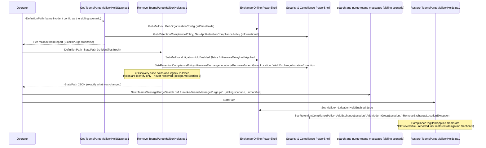

## The short version

Scripts the hold-identification, hold-removal, and hold-reapplication sequence that
*Search-and-Purge for Microsoft Teams Messages* deliberately left manual: before a Teams
message purge can remove anything, every hold and retention policy on each target mailbox must be
removed, and Microsoft states plainly that skipping this step means **the content is silently
retained, not deleted**. This companion scenario identifies every documented hold
type on a mailbox list, removes the genuinely scriptable subset, records exactly what it changed, and
restores it afterward - while being explicit about the hold types it cannot safely or completely
automate.

## Why this matters

A Teams purge that silently no-ops because a hold was never removed is worse than no purge at all - it
gives the responder false confidence that inappropriate or spillage content is gone, when Microsoft's
own documented behavior for this exact workflow is that it was never touched. Conversely, forgetting to **reapply** a removed hold is a preservation-duty gap:
the mailbox's other content loses its litigation, retention, or organizational hold coverage until
someone remembers to put it back. Both failure modes are process gaps, not tooling gaps - this
scenario turns the process into a script with a recorded, auditable state trail.

## How the control works

Full rationale, including the hold-type scope table and why two hold types are identify-only by
design, is in the design notes.

## What it takes

### Prerequisites

Full licensing detail: [Licensing matrix, section 2](/docs/licensing-matrix/#2-master-capability--license-matrix) (eDiscovery - the parent scenario's own
entitlement covers this companion; no separate license is required for the Exchange Online/Security &
Compliance PowerShell surfaces this scenario uses). RBAC: [RBAC model, section 4](/docs/rbac-model/#4-purview-role-groups-by-module-representative-not-exhaustive) (eDiscovery role
groups), the configuration reference (Exchange Online RBAC dependency - directly applicable here, since Litigation Hold and
delay-hold removal are pure Exchange Online RBAC actions, not Purview RBAC). Automation surface:
[Automation surface, section 3](/docs/automation-surface/#3-authentication-patterns---interactive-vs-unattended).

| Requirement | Minimum | Notes |
|---|---|---|
| Licensing | Same as *Search-and-Purge for Microsoft Teams Messages* - eDiscovery (Premium): M365/Office 365 **E5**, **Microsoft Purview Suite**, or **E5 eDiscovery & Audit** add-on | No separate meter for the hold-management cmdlets themselves |
| Role - identify (read-only) | Exchange Online **View-Only Recipients** (or broader) for `Get-Mailbox`/`Get-OrganizationConfig`; Purview **View-Only Retention Management** (or broader) for `Get-RetentionCompliancePolicy`/`Get-AppRetentionCompliancePolicy` | Read-only credentials are sufficient for `Get-TeamsPurgeMailboxHoldState.ps1` |
| Role - remove/restore Litigation Hold and delay holds | Exchange Online **Legal Hold** role (assigned via **Organization Management** or **Discovery Management** by default) | A pure Exchange Online RBAC role, not a Purview role group - [RBAC model, section 6](/docs/rbac-model/#6-exchange-online-dependency-the-most-common-permissions-gap) |
| Role - remove/restore retention-policy membership | Purview **Retention Management** role, part of the **Records Management** role group | [RBAC model, section 4](/docs/rbac-model/#4-purview-role-groups-by-module-representative-not-exhaustive) already documents this role group for Records Management/Data Lifecycle Management |
| Graph/eDiscovery-hold resolution | **Not attempted by this scenario** - `Get-CaseHoldPolicy`/`Get-ComplianceCase` are eDiscovery cmdlets, the one documented app-only-unsupported exception ([Automation surface, section 3](/docs/automation-surface/#3-authentication-patterns---interactive-vs-unattended)) | the design notes |
| Auth | Certificate-based app-only via **both** `Connect-ExchangeOnline` and `Connect-IPPSSession` | [Automation surface, section 3](/docs/automation-surface/#3-authentication-patterns---interactive-vs-unattended), surfaces 1 and 2 |
| PowerShell module | `ExchangeOnlineManagement` ≥ 3.2.0 | Same module/version floor as this library's other Exchange Online/S&CC-based scenarios |
| Pre-resolved target mailboxes | Same `-DefinitionPath` JSON schema as the parent scenario's `New-TeamsMessagePurgeSearch.ps1`, or `-Mailbox` directly | the design notes goal 1 |

### Cost and licensing

- No separate licensing meter - this scenario's cmdlets are Exchange Online/Security & Compliance
  PowerShell surfaces already covered by the same entitlement (eDiscovery Premium, per the sibling
  scenario) plus standard Exchange Online licensing.
- **The real cost is operational, not licensing**: correctly identifying, removing, and - critically -
  restoring holds across every target mailbox for every incident is a heavier ask than the mailbox-purge
  sibling's own "held mailboxes are just skipped" model. This scenario turns that cost into a scripted,
  auditable sequence rather than eliminating it.

## Proof it works

1. **Pre-purge readiness (Mode 1)** - `./validate/Test-TeamsPurgeMailboxHoldLifecycle.ps1
   -DefinitionPath ...` re-identifies every target mailbox and `[FAIL]`s any that still has a blocking
   hold, scriptable or not. A clean run here is a precondition for the sibling scenario's purge to
   actually remove anything (per the short version's citation), not a guarantee by itself - a newer-location policy
   (the configuration reference "Never touched") could still be silently in effect.
2. **Post-restore validation (Mode 2)** - `./validate/Test-TeamsPurgeMailboxHoldLifecycle.ps1
   -StatePath ...` re-checks every field the Remove script recorded as changed against current state,
   `[FAIL]`ing anything not actually restored.
3. **Idempotency** - re-running `Get-TeamsPurgeMailboxHoldState.ps1` at any point is always safe
   (read-only); re-running `Remove-TeamsPurgeMailboxHolds.ps1` on an already-clean mailbox correctly
   reports nothing to remove; re-running `Restore-TeamsPurgeMailboxHolds.ps1` skips any field already
   in its target state rather than issuing a redundant `Set-RetentionCompliancePolicy` call (which
   Microsoft documents as triggering "a full synchronization across your organization" - a cost worth
   avoiding when unnecessary).
4. **Audit** - search the unified audit log for the underlying `Set-Mailbox`/`Set-RetentionCompliancePolicy`
   operations, the same pattern this library's other DLM/Exchange-RBAC scenarios use.

## Where it stops

- **Org-wide "Group" (`grp`-prefixed) policy exceptions cannot be verified from `InPlaceHolds` after
  the fact.** No confirmed notation for a Group-location exclusion (the `grp`-prefixed equivalent of
  `-mbx<guid>` for Exchange-location exclusions) was found during this build's grounding pass.
  `Restore-TeamsPurgeMailboxHolds.ps1` always issues the restore call for a recorded Group-kind
  exception rather than pre-checking state first, and `validate/
  Test-TeamsPurgeMailboxHoldLifecycle.ps1` reports it as `[WARN]` ("cannot verify"), never
  `[PASS]`/`[FAIL]`. the design notes.
- **FIXED (this round): a mailbox-scoped `grp`-prefixed retention policy is now correctly routed
  through `-RemoveModernGroupLocation`/`-AddModernGroupLocation`, not `-RemoveExchangeLocation`/
  `-AddExchangeLocation`.** Microsoft's retention-settings reference confirms the Exchange-mailboxes
  location - org-wide or specific-location - never covers a Microsoft 365 Group mailbox at all (a
  static-scope save attempt errors "RemoteGroupMailbox isn't a valid selection"), and its "Identify
  Exchange mailbox hold types" reference documents `mbx`/`skp` as the only prefixes for a
  `Get-Mailbox`-visible specific-location stamp. The initial draft's `mailboxScoped` handling had not
  carried the Exchange-vs-Group distinction across from the (already-correct) org-wide case - a real
  remediation-accuracy bug for any target that is a group/team mailbox, now fixed across all four
  scripts. the design notes.1.
- **VERIFY (pilot tenant or a future Microsoft Learn pass): the exact `InPlaceHolds` notation a
  mailbox-scoped Group-location retention policy stamps on a group/team mailbox is not explicitly
  confirmed by Microsoft.** `-AddModernGroupLocation`/`-RemoveModernGroupLocation` are confirmed real
  `Set-RetentionCompliancePolicy` parameters, but no Microsoft Learn page states what, if anything,
  shows up in `InPlaceHolds` for this specific (non-org-wide) case. This scenario's scripts treat a
  `grp`-prefixed, non-org-wide entry on a confirmed group/team mailbox as exactly that case - the only
  mechanism that could plausibly have produced it - and act on it, but the notation itself is disclosed
  as unconfirmed rather than asserted. the design notes.1. **Re-grounded 2026-09-28** (Microsoft Learn MCP,
  full fetch of the "Identify Exchange mailbox hold types in eDiscovery" reference): still genuinely
  undocumented - the `Get-Mailbox` specific-location table names only the `mbx`/`skp` prefixes, and
  `grp` appears solely in the separate `Get-OrganizationConfig` (org-wide) table on the same page. No
  other Microsoft Learn page checked this pass (the `Set-RetentionCompliancePolicy`/
  `Set-AppRetentionCompliancePolicy` references, `edisc-hold-manage`, `edisc-hold-delete-recoverable-items`) states or contradicts this. Re-open only once a page documents the mailbox-scoped
  Group-location notation explicitly or a pilot-tenant check confirms it directly.
- **A `grp`-prefixed, non-org-wide `InPlaceHolds` entry on a mailbox that is NOT a group/team mailbox
  is reported as `UnrecognizedPolicyGuids`/`unrecognizedPolicyGuidsNotRemoved` and never acted on.** No
  Microsoft Learn citation this scenario carries explains that combination - treated as a disclosed
  anomaly, not silently merged into either removal path. the design notes.1.
- **eDiscovery case holds are identify-only.** Resolving/removing a `UniH`-prefixed hold needs
  `Get-CaseHoldPolicy`/`Get-ComplianceCase`, both eDiscovery cmdlets unsupported for app-only auth in
  Security & Compliance PowerShell - the one documented exception this library's [Automation surface, section 3](/docs/automation-surface/#3-authentication-patterns---interactive-vs-unattended) already carries. the design notes.
- **Legacy In-Place Holds are identify-only.** Microsoft's own retirement guidance: not removable for
  an active mailbox. the design notes.
- **Newer-location retention policies (`*-AppRetentionCompliancePolicy`) are invisible to this
  scenario's detection mechanism.** No documented per-mailbox applicability check exists; Microsoft's
  own recommended check is Policy Lookup, a portal-only feature. A `[PASS]`/no-blockers result from
  this scenario's scripts is **not** a guarantee against this policy class. the design notes.
- **Clearing a retention-label hold (`ComplianceTagHoldApplied`) is irreversible.** No documented
  cmdlet sets it back to `True`; it only re-sets itself when a *new* labeled item triggers it. Opt-in
  only, via `-IncludeComplianceTagHold`. the design notes.
- **Removing a hold triggers a 30-day delay hold on the Managed Folder Assistant's own schedule, not
  instantly.** This scenario cannot force that schedule, so a hold removal reported as successful by
  `Remove-TeamsPurgeMailboxHolds.ps1` does not guarantee the purge will succeed on the very next
  attempt. the design notes.
- **`Set-RetentionCompliancePolicy` triggers a full tenant-wide synchronization per call** (Microsoft's
  own documented note) - `Restore-TeamsPurgeMailboxHolds.ps1` checks current state first to avoid a
  redundant call, but a large target-mailbox list against the same policy will still be the slowest
  part of a run.
- **VERIFY (pilot tenant):** whether `-RemoveDelayHoldApplied`/`-RemoveDelayReleaseHoldApplied` behave
  identically when the underlying hold this scenario itself just removed hasn't yet triggered a delay
  hold (i.e. calling it defensively/pre-emptively) versus the documented case of an already-present
  delay hold from a prior cycle - this scenario only calls it in the latter case (state already
  observed as `True`), matching the documented usage, but the former was not independently tested.
- **VERIFY (pilot tenant or a future Microsoft Learn pass):** whether a mailbox-scoped retention
  policy's `Set-RetentionCompliancePolicy -RemoveExchangeLocation`/`-AddExchangeLocation` (or, for a
  group/team mailbox, `-RemoveModernGroupLocation`/`-AddModernGroupLocation`) distribution (like the
  org-wide `-AddExchangeLocationException` path) takes up to 24 hours to synchronize - Microsoft's own
  guidance states this delay explicitly for the org-wide exclusion path but this
  build found no equivalent explicit statement for either mailbox-scoped add/remove-location path.
  `Restore-TeamsPurgeMailboxHolds.ps1`'s pre-check may therefore observe a stale (not-yet-synchronized)
  state shortly after a change.
- **Illustrative values.** The mailbox list, case name, and file paths in the sample config are
  placeholders - replace with the real, confirmed incident details before use.