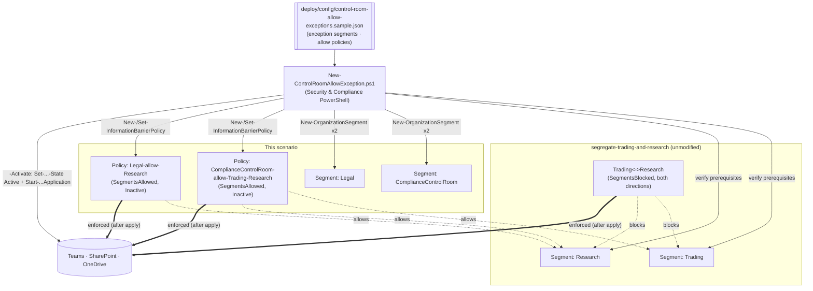

## The short version

A companion to *Segregate Trading and Research (Ethical Wall)*: models **Allow**-type (`-SegmentsAllowed`)
information-barrier topologies that give a compliance/control-room function visibility into **both**
sides of an existing Trading/Research wall, plus a narrower, one-sided allow-list example (Legal, who
may reach Research but not Trading). Segments and policies are created **inactive** and reconciled
against config on every run, so a changing exception membership (a new control-room analyst) is a
config edit, not a manual portal click.

## Why this matters

The same conflict-of-interest regime that requires the Trading/Research wall (**FINRA Rule 2241**,
**SEC Regulation AC**, **MiFID II** Art. 37, market-abuse rules) also expects firms to run a
**control room / compliance monitoring function** that can see across information barriers to
supervise them - a wall that is *not* independently supervisable is itself a control gap. Legal and
compliance functions also routinely need bounded, asymmetric access (e.g. counsel consulted by
Research on a specific matter, without a blanket exemption from the wall). Modeling both as
explicit, named Allow policies - rather than simply leaving the control room's segment unassigned to
any policy - gives an examiner a reviewable artifact for exactly who can cross the wall and why.

> ⚠️ **This changes live communication for the exception segments.** Activation restricts
> `ComplianceControlRoom`/`Legal` members to communicating *only* within their allowed segments (plus
> people outside IB entirely, per the known limitations) - it does not touch the `Trading`/`Research` wall itself. Stage
> inactive, review with `-DryRun`, and get Compliance/Legal sign-off before `-Activate`. See the known limitations.

## How the control works

`ComplianceControlRoom` is the classic "sees both sides" exception; `Legal` is a narrower, asymmetric
example (Research only). Both are Allow-type, so each is default-deny to everything **except** what's
listed - the `Trading`/`Research` Block wall itself is untouched. Full rationale: the design notes.

## What it takes

### Prerequisites

Full licensing detail: [Licensing matrix](/docs/licensing-matrix/). RBAC: [RBAC model](/docs/rbac-model/). Automation surface:
[Automation surface](/docs/automation-surface/) (surface 1 - Security & Compliance PowerShell). Summary:

| Requirement | Minimum | Notes |
|---|---|---|
| **Base scenario deployed** | *Segregate Trading and Research (Ethical Wall)* | This scenario hard-fails if the `Trading`/`Research` segments don't already exist |
| Licensing | **M365 E5 / E5 Compliance / Insider Risk Management** or the **IB add-on** | Same entitlement as the base scenario |
| Role | **Information Barriers** roles / **Compliance Administrator** / **Organization Management** | To create segments, policies, and run application |
| Auth | `Connect-IPPSSession` (certificate app-only preferred) | Security & Compliance PowerShell - [Automation surface, section 3](/docs/automation-surface/#3-authentication-patterns---interactive-vs-unattended) |
| Directory data | A populated Entra attribute cleanly identifying each exception group | e.g. `Department -eq 'ComplianceControlRoom'` |
| IB mode | **SingleSegment** - not Legacy, not MultiSegment | Legacy mode + an Allow policy hides ALL non-IB users/groups from the assigned segment's members (a severe collateral impact); MultiSegment requires every tenant policy to be Allow-type, incompatible with the base scenario's Block policies. `Get-PolicyConfig` reports current mode; the deploy/validate scripts check and warn - see the known limitations |
| Groups | IB supports **Microsoft 365 Groups** only; DLs/Security Groups are non-IB | |

> Verify current entitlement names against [Licensing matrix](/docs/licensing-matrix/) before a sales commitment - SKU
> names change.

### Cost and licensing

- **No incremental licensing** beyond the base scenario's E5 / E5 Compliance / IRM / IB add-on
  entitlement - exception segments/policies are additional objects under the same
  entitlement, not a separately metered capability.
- **Cost is operational discipline, not $.** The real cost is keeping exception-segment membership
  narrow and current - an over-broad or stale allow-list is a bigger risk to the wall's credibility
  than any licensing spend.
- **Reconciliation reduces portal drift risk.** Scripting the allow-list edit (vs. a manual portal
  change) keeps the config file as the single source of truth for who has cross-wall access.

## Proof it works

1. **Automated (staged)** - `./validate/Test-ControlRoomAllowException.ps1` confirms both prerequisite
   segments exist, both exception segments exist, both allow policies exist with the right assigned
   segment, and that each policy's live `SegmentsAllowed` set exactly matches config.
2. **Automated (enforced)** - after `-Activate`, re-run with `-RequireActive`; policies must be
   **Active** and an application run must have occurred.
3. **Real-world allow test** - after application completes, confirm a `ComplianceControlRoom` user
   **can** communicate with both a `Trading` and a `Research` user, and a `Legal` user **can**
   communicate with a `Research` user.
4. **Real-world scope test** - confirm a `Legal` user **cannot** communicate with a `Trading` user
   (the asymmetric allow-list is enforced, not just the union of everyone's access).
5. **No-collateral test** - confirm the `Trading`/`Research` wall itself still blocks as before (this
   scenario didn't weaken it), and that users outside IB entirely are unaffected.
6. **Reconciliation proof** - edit an `allows` list in config, re-run the deploy, and confirm the
   validate script's live-vs-desired check now passes for the new list (and that an initially-Active
   policy was left Inactive pending a fresh `-Activate`).
7. **Idempotency proof** - re-run the deploy with no config changes; segments/policies report
   `exists`/`already matches config` and nothing is duplicated or re-mutated.

## Where it stops

- **Additive only - does not create the wall.** This scenario hard-fails if `Trading`/`Research`
  don't already exist; it never creates or edits the base scenario's Block policies.
- **Activation affects live communication for the exception segments.** Restricts
  `ComplianceControlRoom`/`Legal` to their allow-lists once application completes - stage inactive,
  `-DryRun`, get sign-off first.
- **Editing an Active Allow policy requires deactivation first.** The deploy script does this
  automatically for a detected `SegmentsAllowed` drift and leaves the policy **Inactive** - you must
  re-run with `-Activate` to reactivate and re-apply; it never silently reactivates an edited policy.
- **Can't convert Allow<->Block on the same policy.** Changing a policy's *type* requires deactivating
  it and creating a new policy of the other type - not scripted here since this scenario only ever
  creates Allow-type policies.
- **Legacy IB mode + an Allow policy hides non-IB users/groups from that segment's members - grounded,
  not a guess.** This is the single biggest gotcha in this scenario: in **Legacy** mode specifically
  (not SingleSegment, not MultiSegment), assigning an Allow policy to `ComplianceControlRoom`/`Legal`
  would hide **every** non-segmented user/group from that segment's members once applied - not just
  the segments left off the allow list. A control-room analyst could lose the ability to reach their
  own manager or IT helpdesk. `New-ControlRoomAllowException.ps1` and
  `validate/Test-ControlRoomAllowException.ps1` both check `Get-PolicyConfig` and warn (non-fatally)
  if the tenant is in Legacy mode - confirm/move to **SingleSegment** mode
  (`Set-PolicyConfig -InformationBarrierMode SingleSegment`) before activating this scenario.
- **VERIFY (pilot tenant):** whether `Set-InformationBarrierPolicy -SegmentsAllowed` fully **replaces**
  the allowed-segment list or **merges** with the existing one. Microsoft's own worked example shows
  setting a single new value but doesn't state replace-vs-merge semantics explicitly.
  `deploy/New-ControlRoomAllowException.ps1` always sends the complete desired list (assumes replace)
  rather than guessing merge behavior - confirm before relying on this for partial/incremental
  updates in a pilot tenant.
- **MultiSegment mode is incompatible with this composition as designed.** MultiSegment mode requires
  **every** policy in the tenant to be Allow-type - configuring even one Block policy (as
  `Trading`/`Research` does) breaks it. This scenario deliberately requires SingleSegment mode
  (one segment per user); it does **not** support a person belonging to both `Trading` and
  `ComplianceControlRoom` simultaneously. A future migration to an all-Allow-policy model would be a
  rebuild of the base scenario, not an extension of it - see the design notes.
- **Mixing Allow-type and Block-type policies across different segments is grounded in Microsoft's own
  worked example (a third "compatible" segment alongside two mutually-blocked segments,
 ), not independently confirmed against a live tenant in this build.** The
  mechanics (each policy type only restricts its own assigned segment; an unlisted segment is
  unaffected by a policy that doesn't name it) are documented per-cmdlet, but this exact 3-segment
  composition (two Block-walled segments plus a third Allow-type segment reaching both) has not been
  pilot-tested here - validate in a pilot tenant before a customer-facing deployment.
- **`-WhatIf` is non-functional in S&C PowerShell** - the scripts ship a `-DryRun` instead.
- **Application is async and delayed.** ~30 min to start, ~5,000 users/hour; SharePoint/OneDrive
  enforcement up to 24 hours after activation.
- **Groups: M365 Groups only.** DLs and Security Groups are treated as non-IB.
- **Illustrative values.** Segment attributes, filters, and names are placeholders - set them to your
  real directory data, validated by Compliance, before activating.