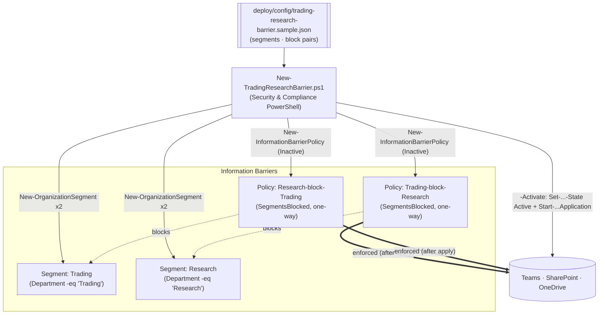

## The short version

Builds a Microsoft Purview **Information Barriers** "ethical wall" that blocks communication and
collaboration between the **Trading** desk and **Research** - as code, via Security & Compliance
PowerShell. It defines an organization **segment** per side (from a Microsoft Entra attribute) and the
**two one-way block policies** that fully wall them off, then (only on an explicit `-Activate`)
activates and applies them across Teams, SharePoint, and OneDrive. Segments and policies are created
**inactive** by default so they can be reviewed before anyone's communication is affected.

## Why this matters

An **ethical wall** (historically "Chinese wall") between research and trading/sales is a core
conflict-of-interest control in financial services. **FINRA Rule 2241** (research analysts and
conflicts) and **SEC Regulation AC**, the **Global Research Analyst Settlement**, **MiFID II** (Art.
37 organizational requirements / conflicts of interest), and **market-abuse rules (MAR)** all require
firms to prevent inappropriate information flow between people who produce research and people who
trade or sell. Purview Information Barriers enforce this in the collaboration layer: once applied,
users in incompatible segments **can't chat/call in Teams, can't be added to the same 1:1/group
conversations, and can't access each other's SharePoint/OneDrive content**. Managing the wall as code
makes the segmentation and policy set reproducible, reviewable, and auditable - which is exactly what
a compliance examiner or internal audit will probe.

> ⚠️ **Applying an ethical wall changes live communication.** Activation blocks Teams chat/calls and
> SharePoint/OneDrive collaboration between the two sides and can remove users from existing chats.
> Stage the segments/policies **inactive**, review with `-DryRun`, and get Compliance/Legal sign-off
> before `-Activate`. See the known limitations.

## How the control works

Two segments (one per side) and **two one-way block policies** - a full wall needs both directions,
because a single policy blocks one way only. Objects are created inactive; a separate, explicit
activation + tenant-wide application step enforces them. Full rationale: the design notes.

## What it takes

### Prerequisites

Full licensing detail: [Licensing matrix](/docs/licensing-matrix/). RBAC: [RBAC model](/docs/rbac-model/). Automation surface:
[Automation surface](/docs/automation-surface/) (surface 1 - Security & Compliance PowerShell). Summary:

| Requirement | Minimum | Notes |
|---|---|---|
| Licensing | **M365 E5 / E5 Compliance / Insider Risk Management** or the **IB add-on** | Information Barriers is an E5-tier capability |
| Role | **Information Barriers** roles / **Compliance Administrator** / **Organization Management** | To create segments, policies, and run application |
| Auth | `Connect-IPPSSession` (certificate app-only preferred) | Security & Compliance PowerShell - [Automation surface, section 3](/docs/automation-surface/#3-authentication-patterns---interactive-vs-unattended) |
| Directory data | A populated **Entra attribute** (e.g. `Department`) that cleanly separates the two sides | Segments are attribute-driven; no user may be in both sides |
| Groups | IB supports **Microsoft 365 Groups** only; DLs/Security Groups are non-IB | |
| Scoping directory sync | Address book policy / directory segmentation may be needed for full GAL separation | Beyond this scenario's core; see IB docs |

> Verify current entitlement names against [Licensing matrix](/docs/licensing-matrix/) (dated 2026-09-02) before a
> sales commitment - SKU names change.

### Cost and licensing

- **Per-user E5 entitlement**, no Azure consumption meter. Information Barriers is E5 / E5 Compliance /
  IRM / IB add-on.
- **Cost is licensing + operational care.** The real operating cost is keeping the segmentation
  attribute accurate and handling exceptions (e.g. a compliance officer who must see both sides) -
  model those as their own segments/policies rather than ad-hoc bypasses.
- **Collateral-impact risk, not $ risk, is the thing to manage** - an over-broad or mis-attributed
  segment blocks people who shouldn't be blocked.

## Proof it works

1. **Automated (staged)** - `./validate/Test-TradingResearchBarrier.ps1` confirms both segments exist,
   both block policies exist and are assigned to the right segment, and reports application status.
2. **Automated (enforced)** - after `-Activate`, re-run with `-RequireActive`; policies must be
   **Active** and an application run must have occurred.
3. **Real-world block test** - after application completes (~30 min; up to 24h for SharePoint), confirm
   a **Trading** user and a **Research** user **cannot** start a Teams chat/call, can't be added to the
   same conversation, and can't access each other's OneDrive/associated SharePoint content.
4. **No-collateral test** - confirm users **within** each segment, and users **outside** IB entirely,
   still communicate as expected (the wall is between the two sides, not a blanket block).
5. **Idempotency proof** - re-run the deploy; segments/policies report `exists` and nothing is
   duplicated.

## Where it stops

- **Activation affects live communication.** Enforcing the wall blocks Teams chat/calls and SharePoint/
  OneDrive collaboration between the sides and can remove users from existing chats. Stage inactive,
  `-DryRun`, get sign-off, communicate to users, then `-Activate`.
- **Two policies for a full wall.** One `-SegmentsBlocked` policy blocks a single direction; both
  directions are required to fully segregate - the scenario's `blockPairs` encodes both.
- **One policy per segment.** Never assign more than one IB policy to the same segment.
- **Mutually-exclusive segments.** A user in both Trading and Research defeats the wall - segments must
  be exclusive; audit the source attribute.
- **`-WhatIf` is non-functional in S&C PowerShell** - the scripts ship a `-DryRun` instead.
- **Application is async and delayed.** ~30 min to start, ~5,000 users/hour; SharePoint/OneDrive
  enforcement up to 24 hours after activation - don't expect instant blocking.
- **Groups: M365 Groups only.** DLs and Security Groups are treated as non-IB.
- **Modes matter.** Legacy vs. SingleSegment vs. MultiSegment mode changes segment limits (250 vs.
  5,000), whether a user can be in multiple segments, and how non-IB users are treated for allow
  policies - this scenario uses block policies (recommended) and two exclusive segments, which behaves
  consistently, but confirm your tenant's IB mode.
- **SharePoint/OneDrive needs enabling.** IB for SharePoint/OneDrive is a separate enablement step
  beyond the Teams wall - see the SharePoint IB guidance if file-level segregation is required.
- **Idempotency is create-or-report.** The deploy locates objects by name and does not silently mutate
  an existing segment/policy - edit deliberately.
- **Illustrative values.** Segment attributes, filters, and names are placeholders - set them to your
  real directory data and desegregation obligation, validated by Compliance, before activating.