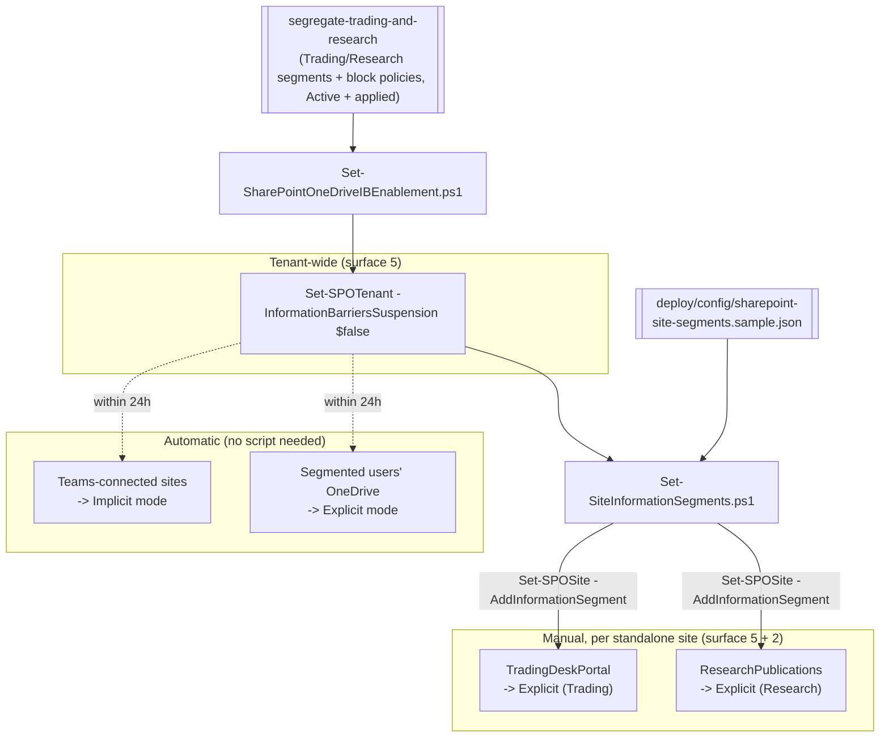

## The short version

Extends an existing Microsoft Purview **Information Barriers** ethical wall - built by
`../segregate-trading-and-research/` - from Teams-only enforcement to **SharePoint and OneDrive**
file access and sharing. Enables the single tenant-wide switch that turns on IB for SharePoint/
OneDrive, then associates the wall's segments with the specific standalone SharePoint sites that
need Explicit-mode protection. Teams-connected sites and segmented users' own OneDrive protect
themselves automatically once the switch is on - this scenario scripts what's genuinely manual.

## Why this matters

Same drivers as the parent scenario - **FINRA Rule 2241**, **SEC Regulation AC**, the **Global
Research Analyst Settlement**, **MiFID II** Art. 37, and market-abuse rules (MAR) - extended to the
collaboration surface where the actual work product (research notes, trade blotters, pitch decks)
lives: SharePoint and OneDrive. A wall that blocks Teams chat but leaves SharePoint sites and
OneDrive shares open is not a wall an examiner would accept; Microsoft documents SharePoint/
OneDrive coverage as a distinct, required configuration step for exactly this reason.

> ⚠️ **Enabling this switch changes live SharePoint/OneDrive access and sharing behavior**, and
> associating a segment with a site immediately narrows who can access or be added to it. Confirm
> the parent scenario's IB policies are Active and applied (24h propagated) first, and review the
> configured site list with the same Compliance/Legal sign-off used for the parent scenario's
> `-Activate` step. See the known limitations.

## How the control works

Enablement is one tenant-wide switch; from there, Teams-connected sites and OneDrive protect
themselves automatically, while standalone SharePoint sites need an explicit segment association.
Full rationale: the design notes.

## What it takes

### Prerequisites

Full licensing detail: [Licensing matrix](/docs/licensing-matrix/). RBAC: [RBAC model](/docs/rbac-model/). Automation surface:
[Automation surface](/docs/automation-surface/) (surfaces 2 and 5 - see section 5 below). Summary:

| Requirement | Minimum | Notes |
|---|---|---|
| Parent scenario | `../segregate-trading-and-research/` deployed, `-Activate`d, and 24h propagated | Microsoft requires IB policies to be Active and applied *before* enabling SharePoint/OneDrive IB |
| Licensing | **M365 E5 / E5 Compliance / Insider Risk Management** or the **IB add-on** | Same entitlement as the parent scenario - no separate SKU for SharePoint/OneDrive coverage |
| Role | **SharePoint Administrator** or **Global Administrator** | Required for both tenant enablement and per-site segment management |
| Auth (surface 5) | `Connect-SPOService` (certificate app-only preferred) | SharePoint Online Management Shell - [Automation surface, section 3](/docs/automation-surface/#3-authentication-patterns---interactive-vs-unattended). **Windows-only**: no documented cross-platform path for this surface - section 6 |
| Auth (surface 2) | `Connect-IPPSSession` (certificate app-only preferred) | To resolve segment names to GUIDs via `Get-OrganizationSegment` - [Automation surface, section 3](/docs/automation-surface/#3-authentication-patterns---interactive-vs-unattended) |
| Module | `Microsoft.Online.SharePoint.PowerShell` | Windows PowerShell 5.1-native; PowerShell 7 needs `-UseWindowsPowerShell` - [Automation surface, section 2](/docs/automation-surface/#2-module-install) |

> Verify current entitlement names against [Licensing matrix](/docs/licensing-matrix/) (dated 2026-09-02) before a
> sales commitment - SKU names change.

### Cost and licensing

- **No separate meter or SKU.** SharePoint/OneDrive IB coverage is part of the same E5 / E5
  Compliance / IRM / IB add-on entitlement as the parent scenario - enabling it doesn't add cost.
- **Operating cost is curation, not licensing.** The real ongoing cost is keeping the standalone-site list current as new sites are provisioned - Teams-connected sites and OneDrive need no
  ongoing attention once enabled.

## Proof it works

1. **Automated** - `./validate/Test-SharePointOneDriveInformationBarrierSetup.ps1` confirms tenant
   enablement (where `Get-SPOTenant` exposes the property - the known limitations) and that each configured site is
   Explicit-mode with the right segments associated.
2. **Real-world block test** - after propagation (~1 hour tenant-wide; allow up to 24h for a given
   site/OneDrive), confirm a Trading user cannot access or be shared into `ResearchPublications`
   and vice versa, and that neither can access the other's OneDrive content.
3. **Teams/OneDrive auto-coverage spot check** - confirm a Teams-connected site tied to the
   Trading or Research group shows `InformationBarriersMode = Implicit` and a segmented user's
   OneDrive shows `Explicit` within 24h of enablement, with no manual script run against either.
4. **No-collateral test** - confirm a non-segmented site/user, and a site associated with a
   segment compatible with both sides (e.g. a hypothetical HR segment), still work as expected.
5. **Idempotency proof** - re-run both deploy scripts; already-enabled/already-associated state is
   reported, not re-applied.

## Where it stops

- **Single switch for both services.** SharePoint and OneDrive IB are enabled/suspended together -
  you cannot turn on one without the other.
- **Prerequisite ordering matters.** Enable this only after the parent scenario's segments/
  policies are Active, applied, and given 24h to propagate - enabling first has nothing to enforce.
- **Suspending is tenant-wide.** `-Suspend` drops IB enforcement for **every** SharePoint site and
  **every** OneDrive account, including the Teams-Implicit sites the parent scenario's wall
  already covers - prefer `-RemoveConfigured` for anything short of a full decommission (the rollback plan,
  the Red Team review, finding 2).
- **Surface 5 is Windows-only.** `Microsoft.Online.SharePoint.PowerShell` has no documented
  cross-platform path; a CI/CD pipeline needs a Windows runner for this scenario's steps
  ([Automation surface, section 6](/docs/automation-surface/#6-cicd-and-unattended-execution-guidance)).
- **Two automation surfaces in one workflow.** `Set-SiteInformationSegments.ps1` needs both
  `Connect-SPOService` (surface 5) and `Connect-IPPSSession` (surface 2) connected - the first
  scenario in this library to require both together.
- **`-WhatIf` is non-functional** in the SharePoint Online Management Shell - both scripts ship a
  `-DryRun` instead.
- **VERIFY (pilot tenant):** whether `Get-SPOTenant`'s returned object exposes
  `InformationBarriersSuspension` - its own Microsoft Learn reference documents no output
  properties beyond storage/site-creation settings, unlike `Set-SPOTenant`'s explicit parameter
  documentation. The enablement script degrades to "unknown, set explicitly" rather than assuming
  the property is present.
- **VERIFY (pilot tenant):** which property name `Get-OrganizationSegment` actually exposes for a
  segment's GUID in this context - Microsoft's SharePoint-association worked example uses
  `EXOSegmentId`; *Segregate Trading and Research (Ethical Wall)*'s own scripts use `.Guid` for the same cmdlet's
  output. Both scripts here try `EXOSegmentId` first and fall back to `.Guid`.
- **VERIFY (pilot tenant or a future Microsoft Learn pass):** `Set-SPOTenant
  -DefaultOneDriveInformationBarrierMode`'s accepted values and exact effect - the fetched
  reference documents the parameter (type `String`) but not its value set; not scripted here.
- **Teams-connected sites aren't directly manageable.** A SharePoint Administrator can't set
  segments on an Implicit-mode site; out-of-compliance Teams sites are fixed by correcting the
  Team's membership instead.
- **Illustrative values.** Site URLs and segment assignments in the sample config are placeholders
  - set them to your real site inventory, validated by Compliance, before running against a
  tenant.