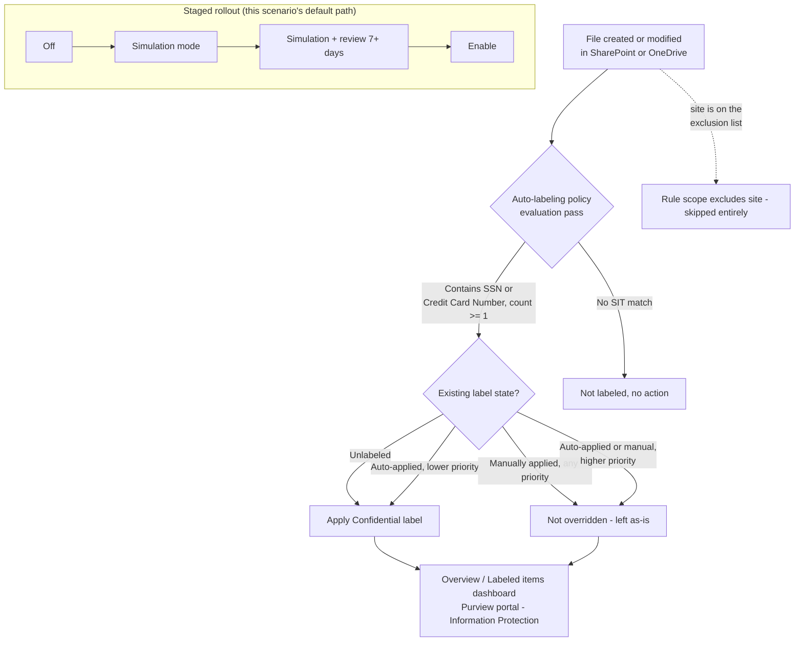

## The short version

Automatically applies an existing **"Confidential"** sensitivity label to SharePoint and OneDrive
files that contain personal data (U.S. Social Security Numbers and credit card numbers, as the
representative PII/financial sensitive information types) - without waiting on end users to label
anything themselves. Deployed as a single Microsoft Purview **auto-labeling policy** with one rule
per workload, staged simulation-first, and scoped to exclude a nominated legal-hold/eDiscovery
site so an active hold's content isn't relabeled mid-matter.

## Why this matters

**GDPR Article 32** ("appropriate technical and organisational measures" for the security of
personal data processing) and the parallel intent of **CCPA/CPRA** and **ISO/IEC 27001:2022
Annex A.5.12 / A.8.2** (information classification) all converge on the same practical
requirement: an organization must be able to show *where* regulated personal data lives and that
it is *marked and protected accordingly* - not rely on staff remembering to classify it by hand.
Manual-only labeling programs consistently under-cover: Microsoft's own guidance frames
auto-labeling for SharePoint/OneDrive/Exchange as the mechanism for closing that gap at scale.

This scenario is the **classification and marking control**, distinct from (and a prerequisite
signal for) the **movement-blocking control** already in this library
(*PCI Teams Card-Data Exfiltration Block*): a DLP rule that conditions on "sensitivity label is
Confidential" needs files to actually carry that label first. Auto-labeling is what makes that
condition reliably true across the tenant's existing and newly created content, not just the
subset a user happened to label.

**Scope note:** the two built-in sensitive information types this scenario ships with - U.S.
Social Security Number and Credit Card Number - are a representative **starter set**, not a
jurisdiction-complete catalog of "personal data" under GDPR/CCPA (which is far broader: names,
emails, health data, national IDs outside the U.S., etc.). SSN in particular is a U.S.-specific
identifier; a tenant whose regulated population is EU/UK-only should swap in the relevant
EU national-ID and equivalent built-in SITs (the configuration reference shows exactly where in the rule definition to
change this) rather than treating this scenario's default condition set as regulatory coverage
by itself - or deploy *Auto-Label EU/UK Personal Data in SharePoint & OneDrive*
directly, the built EU/UK-region sibling of this scenario, which ships that swap already made
(EU national identification number, EU Social Security Number (SSN) or Equivalent ID, EU debit
card number) plus a `-SensitiveInfoTypeName` parameter for narrowing to specific member states.
ISO/IEC 27001 Annex A.5.12/A.8.2 (information classification generally) is the driver
this default configuration most directly satisfies as shipped; treat the GDPR/CCPA framing above
as the reason the *capability* matters, not a claim that two SITs alone achieve GDPR-complete
personal-data coverage.

## How the control works

One auto-labeling policy (`Confidentiality - Auto-Label PII in SharePoint and OneDrive`) with two
rules - one per workload, because `New-AutoSensitivityLabelRule -Workload` accepts a single
workload per rule. Both rules share the same sensitive-information-type
conditions and target label. Full rationale in the design notes.

## What it takes

### Prerequisites

Full licensing detail and citations: [Licensing matrix](/docs/licensing-matrix/). Summary for this scenario:

| Requirement | Minimum | Notes |
|---|---|---|
| Automatic / policy-based labeling | **Microsoft 365 E5 / A5 / G5**, **Microsoft Purview Suite** (ex-E5 Compliance), or the **Information Protection & Governance (IP&G)** add-on | Per-user for every account whose SharePoint/OneDrive content is in scope - see [Licensing matrix, section 2](/docs/licensing-matrix/#2-master-capability--license-matrix), Information Protection row |
| Role to author/edit auto-labeling policies | **Information Protection Admin** role group (create/edit/delete labels, DLP policies, classifiers; manage auto-labeling simulation) | [RBAC model, section 3](/docs/rbac-model/#3-microsoft-entra-roles-that-map-into-purview). This role can create the policy and run it in simulation. |
| Role to turn the policy on after simulation | **Compliance Administrator** or **Compliance Data Administrator** | Distinct from the authoring role above - without one of these, the **Turn on policy** action is greyed out in the portal even after a successful simulation. Not called out in this scenario's prerequisites when it was first built; backported from the sibling Exchange scenario, which surfaced it - see *Auto-Label Confidential PII in Exchange Email* (the prerequisites). |
| Automation identity | App registration with **Exchange.ManageAsApp**, granted the Information Protection Admin role group (plus Compliance Administrator/Compliance Data Administrator if the same identity also enforces) | Certificate-based app-only auth - [Automation surface, section 3](/docs/automation-surface/#3-authentication-patterns---interactive-vs-unattended) |
| Dependency (not deployed by this scenario) | A published sensitivity label named **Confidential** (parameterizable), with label scope including **Files & other data assets**, and **not** a parent label (parent labels - those with sublabels - cannot be applied to content and the policy will silently label nothing if one is selected) | Label authoring is a separate scenario/prerequisite; see [RBAC model](/docs/rbac-model/) for the label-creation permission and Known Limitations the known limitations below |
| Tenant configuration: sensitivity labels enabled for Office files in SharePoint/OneDrive | `Set-SPOTenant -EnableAIPIntegration $true` (or the Purview portal one-click banner) | **Requires the SharePoint Online Management Shell** (`Connect-SPOService`) - automation surface 5, [Automation surface, sections 1 and 3](/docs/automation-surface/#1-five-automation-surfaces-not-one-read-this-first); see the known limitations below. Without this, files can be scanned but never actually labeled, with no error surfaced in the portal |
| Tenant configuration: unified audit logging on | Audit log search enabled | Required for the auto-labeling policy's **simulation mode** to have results to show |
| Tenant configuration (recommended): PDF support | `Set-SPOTenant -EnableSensitivityLabelforPDF $true` | **Off by default.** Without it, PDFs are not labeled by this (or any) auto-labeling policy even if they match a rule's conditions - a common source of "why wasn't this PDF labeled" confusion. Turning it on can materially increase daily labeled-file volume against the 100,000-files/day limit in the known limitations |
| Region availability | Auto-labeling available in tenant's region | If **Auto-labeling policies** isn't visible under Information Protection > Policies, the tenant is in a region blocked by an Azure backend dependency |
| Scoping nuance | At least one **non-EDM** sensitive information type per rule | A rule built only from Exact Data Match SITs silently disables auto-labeling for that label |

> Verify current entitlement names against [Licensing matrix](/docs/licensing-matrix/) (dated 2026-09-02) and the
> Product Terms before a sales commitment - SKU names change.

### Cost and licensing

- **No PAYG component for M365 content.** SharePoint/OneDrive auto-labeling is a per-user
  entitlement feature (E5-tier or the IP&G add-on) - see [Licensing matrix, sections 1 and 2](/docs/licensing-matrix/#1-the-two-billing-models-read-this-first). PAYG
  applies only if the same auto-labeling capability is later extended to non-M365 sources (AWS S3,
  Box, Google Drive, etc.), which this scenario does not cover.
- **No additional Azure subscription required** for this control specifically.
- **Sizing note:** license the users whose SharePoint/OneDrive content is in scope - for a
  tenant-wide "All" location scope like this scenario's default, that's effectively every licensed
  user with SharePoint/OneDrive content, which is the common state for an enterprise already on E5
  for other Purview controls in this library.

## Proof it works

1. **Automated config check** - `./validate/Test-ConfidentialAutoLabelPolicy.ps1 -LabelName
   'Confidential'` confirms the policy and both rules exist with the expected locations, SIT
   conditions, and target label; exits non-zero on any hard failure.
2. **Simulation results** - Purview portal → Information Protection → Auto-labeling policies →
   select the policy → review the **Labeled items** tab (sample of would-be-labeled files) and the
   **Labeling failures** card (top failure reasons). If expected files don't
   appear, re-run simulation - a file updated after the last simulation pass won't show until the
   next one.
3. **Functional test** - upload a test document containing a documented test SSN or card-brand
   test number (never real PII) to an in-scope SharePoint library. After the next policy pass,
   confirm the file shows the Confidential label in **File info** / the SharePoint column, and
   that `Get-AutoSensitivityLabelPolicy` failure counts didn't increase for that item.
4. **Exclusion test** - upload the same test document to the excluded legal-hold site. Confirm it
   is **not** labeled.
5. **Override-safety test** - manually apply a *different* sensitivity label to a test file, then
   confirm a subsequent policy pass does **not** replace the manual label (expected: manual labels
   are never overridden, regardless of priority).
6. **Enforcement confirmation** - after moving to `-Mode Enable`, re-run the automated config check
   and confirm it reports `Mode: Enable` rather than a `Test*` value.

## Where it stops

- **SharePoint Online Management Shell (automation surface 5) is now cataloged in
  [Automation surface, sections 1 and 7](/docs/automation-surface/#1-five-automation-surfaces-not-one-read-this-first)** (closed 2026-09-04; this scenario's original build had
  flagged it as an uncataloged fifth surface). `Set-SPOTenant -EnableAIPIntegration` and the
  `EnableSensitivityLabelforPDF` / `EnableSensitivityLabelForVideoFiles` toggles run over
  `Connect-SPOService` (the `Microsoft.Online.SharePoint.PowerShell` module) - a Windows
  PowerShell 5.1-native module with no documented cross-platform path ([Automation surface, sections 2 and 6](/docs/automation-surface/#2-module-install)). This scenario's deploy script still does **not** automate that one-time tenant
  toggle - it remains a manual/portal prerequisite step run once per tenant, not a
  repeatable per-scenario action, and app-only certificate/managed-identity automation of it (per
  the now-documented surface 5 pattern) is a candidate follow-up if an organization wants it scripted
  rather than run by hand.
- **Auto-labeling is not instantaneous.** Content is evaluated on an ongoing scan cadence, not the
  instant a file is saved; budget for a delay between upload and label appearing, and don't test
  immediately after a deploy or policy change.
- **New/modified sensitive information types only apply going forward.** If the Credit Card Number
  or SSN built-in SIT definitions are ever customized, that change only affects content created or
  modified after the SIT change - not a retroactive rescan.
- **Auto-labeling policies support a maximum of 100,000 files a day** per Microsoft's documented
  PDF-support guidance - for a very large SharePoint/OneDrive estate, the initial backlog pass can
  take multiple days to fully catch up; this is expected, not a stalled policy.
- **A parent label silently labels nothing.** If `-LabelName` is pointed at a label that has
  sublabels (a parent in the label taxonomy), the policy runs without error but never actually
  applies a label to any file. This scenario's validation script cannot
  reliably detect "is this a parent label" from `Get-Label` output alone - confirm manually in the
  Purview portal label list before deploying (**VERIFY**: if a reliable PowerShell property for
  parent-label detection is confirmed in a future revision, add it to `validate/`).
- **This scenario does not configure encryption.** Whether the `Confidential` label also applies
  encryption/access restriction is a property of the label itself (a separate authoring decision,
  out of this scenario's scope - same "dependency, not deployed here" pattern as the label's
  existence). If the label does apply encryption, note that auto-labeling requires the label to
  use **Assign permissions now**, not user-defined permissions - there's no interactive user
  present when a policy (rather than a person) applies the label.
- **This scenario does not cover Exchange (email).** `New-AutoSensitivityLabelPolicy` supports an
  Exchange location and rule in the same policy family, but this scenario is scoped to
  SharePoint/OneDrive at-rest content per its title. The Exchange companion is now built as
  *Auto-Label Confidential PII in Exchange Email* (closed 2026-09-04) - a
  separate policy object, not an additional rule on this scenario's own policy, because Exchange
  auto-labeling has materially different location, exclusion, and encryption semantics (see that
  scenario's the design notes).
- **Two rules, one per workload, is a scripting necessity, not a design choice.**
  `New-AutoSensitivityLabelRule -Workload` accepts exactly one workload value per call; the portal's "Common rules" experience creates the equivalent multi-workload
  rule set behind the scenes. Keep both rules' SIT conditions in sync manually (or via this
  script, which is the point of using it) if either changes.
- **A manual label applied before the file ever contained sensitive content permanently defeats
  this control.** Because manual labels are never overridden regardless of priority, a file
  manually labeled e.g. "Public" and *then* edited to add an SSN or card number keeps the manual
  label indefinitely - this policy will never touch it. This is documented, intended behavior (a
  human's classification decision is authoritative - the design notes goal 2), but it is also the
  most direct way to defeat the control, whether by accident (a template file pre-labeled early in
  its life) or deliberately. There is no auto-labeling-side mitigation for this; it's a case for
  pairing this control with content-based DLP conditions that key directly off the sensitive
  information type rather than the label alone (as *PCI Teams Card-Data Exfiltration Block* already
  does), so a mislabeled file with sensitive content is still caught by a control that doesn't
  depend on the label being correct.
- **The exclusion list is a permanent blind spot, not just a legal-hold accommodation.** Any site
  added to `-ExcludedSharePointSiteUrl` is invisible to this control entirely - content moved into
  an excluded site is never evaluated, whether or not it's genuinely under legal hold at the time.
  Treat the exclusion list itself as a monitored asset: review its membership periodically, and
  consider a periodic audit-log query for files moved into an excluded site as a compensating
  control, since this scenario does not build one.
- **The scan-cadence lag (the known limitations, "not instantaneous") is a real detection gap, not just a testing
  inconvenience.** Any control elsewhere in this library that conditions on "sensitivity label is
  Confidential" (e.g., a DLP rule) provides no protection for a file during the window between
  upload and the next auto-labeling pass. This scenario's residual risk here is the same
  single-message/single-pass class of gap flagged in *PCI Teams Card-Data Exfiltration Block* (the known limitations) for split-PAN evasion: pattern-based, point-in-time controls have an inherent window they
  don't cover. Content-based DLP conditions (matching the SIT directly, not the label) close this
  gap for movement-blocking use cases; this scenario's job is durable classification, not
  real-time interdiction.
- **Config validation is not match validation.** `validate/Test-ConfidentialAutoLabelPolicy.ps1`
  confirms the policy and rules are *shaped* correctly - it cannot confirm the policy is actually
  labeling any files (zero real-world matches looks identical to a correctly-configured-but-idle
  policy from the script's point of view). Always cross-check the Overview/Labeled items dashboard
 for non-zero match volume before treating a green validation run as proof the
  control works end-to-end.