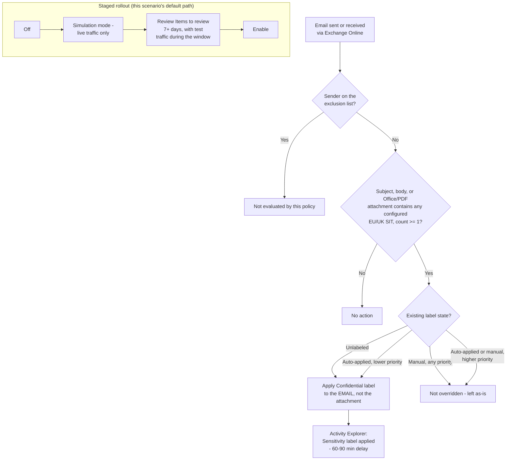

## The short version

Automatically applies an existing **"Confidential"** sensitivity label to Exchange Online email
(subject, body, and Office/PDF attachments) that contains EU/UK personal identifiers - national ID
numbers, the EU Social-Security-or-equivalent family, and EU-format debit card numbers - as
messages are sent and received, without waiting on end users to label anything themselves.
Deployed as a single Microsoft Purview auto-labeling policy with one rule, staged
simulation-first, with an optional sender-based exclusion for a nominated legal/eDiscovery
mailbox and a localizable sensitive-information-type (SIT) list.

## Why this matters

**GDPR Article 32** ("appropriate technical and organisational measures" for the security of
personal data processing) and the parallel intent of **ISO/IEC 27001:2022 Annex A.5.12 / A.8.2**
(information classification). This scenario's GDPR framing is the most directly load-bearing of
this library's three related auto-labeling scenarios, not just an equally-applicable one: it pairs
the SIT set that actually matches EU/UK personal-data formats with the channel - email - where
data most often actually leaves an organization. A real incident here (an employee forwarding an
unredacted spreadsheet of EU national ID numbers, a support reply pasting an EU debit card number
back to a customer, a departing employee mailing records externally) is exactly the kind of event
that triggers **GDPR Article 33/34 breach-notification** obligations, and - as section 11 makes explicit
- this control's *default* configuration does not encrypt that exact external-bound case
automatically. Read the known limitations before assuming "GDPR driver" means "GDPR-safe by default."

**Scope note:** the same starter-set caveat from both sibling scenarios applies here - the
three-SIT default (EU national identification number, EU Social Security Number (SSN) or
Equivalent ID, EU debit card number) is a representative identity+financial pair, not a
jurisdiction-complete catalog of "personal data" under GDPR Article 4(1) (which is far broader:
names, physical addresses, health data, biometric data). See
*Auto-Label EU/UK Personal Data in SharePoint & OneDrive* (why this matters) for the full discussion; not repeated here to
avoid drift between three copies of the same caveat.

## How the control works

One auto-labeling policy (`Confidentiality - Auto-Label EU Personal Data in Exchange Email`) with
one rule (`-Workload Exchange` is single-valued and this scenario targets exactly one workload).
Location/exclusion mechanics borrowed unchanged from *Auto-Label Confidential PII in Exchange Email*; SIT set
and localization mechanics borrowed unchanged from *Auto-Label EU/UK Personal Data in SharePoint & OneDrive*. Full
rationale: the design notes.

## What it takes

### Prerequisites

Full licensing detail and citations: [Licensing matrix](/docs/licensing-matrix/). Identical to
*Auto-Label Confidential PII in Exchange Email*'s prerequisite set (same deploy surface, same location type),
with the EU/UK sibling's SIT-name-resolution caveat added:

| Requirement | Minimum | Notes |
|---|---|---|
| Automatic / policy-based labeling | **Microsoft 365 E5 / A5 / G5**, **Microsoft Purview Suite** (ex-E5 Compliance), or the **Information Protection & Governance (IP&G)** add-on | [Licensing matrix, section 2](/docs/licensing-matrix/#2-master-capability--license-matrix), Information Protection row - same entitlement as both sibling scenarios |
| Role to author/edit the policy | **Information Protection Admin** role group | [RBAC model, section 3](/docs/rbac-model/#3-microsoft-entra-roles-that-map-into-purview) |
| Role to turn the policy on after simulation | **Compliance Administrator** or **Compliance Data Administrator** | Distinct from the authoring role - the **Turn on policy** action is greyed out in the portal even after a successful simulation |
| Automation identity | App registration with **Exchange.ManageAsApp**, granted the Information Protection Admin role group (plus Compliance Administrator/Compliance Data Administrator if the same identity also enforces) | Certificate-based app-only auth - [Automation surface, section 3](/docs/automation-surface/#3-authentication-patterns---interactive-vs-unattended) |
| Dependency (not deployed by this scenario) | A published sensitivity label named **Confidential** (parameterizable), with label scope including **Emails**, and **not** a parent label | Same scope requirement as *Auto-Label Confidential PII in Exchange Email* - **different** from the SharePoint/OneDrive EU sibling's "Files & other data assets" requirement. If the label was published only for one of the file-scoped scenarios, confirm (or extend) its scope to include Emails first |
| Tenant configuration: unified audit logging on | Audit log search enabled | Required for simulation results and Activity Explorer, this scenario's primary validation surface |
| Tenant configuration: sensitivity labels enabled for SharePoint/OneDrive (`EnableAIPIntegration`) | **Not required for this scenario** | That toggle is SharePoint/OneDrive-specific and has no Exchange equivalent - same simplification *Auto-Label Confidential PII in Exchange Email* (the prerequisites) already documents |
| Region availability | Auto-labeling available in tenant's region | Same regional-availability caveat as all three scenarios |
| Scoping nuance | At least one **non-EDM** sensitive information type per rule | Same rule as all three scenarios |
| SIT-name resolution risk | Byte-exact casing of the EU-wide bundle SIT names is unconfirmed against a live tenant | Same open item as the SharePoint/OneDrive EU sibling - see the known limitations. The deploy script defends against it at runtime; this table flags it as a pre-flight awareness item, not a blocker |

> Verify current entitlement names against [Licensing matrix](/docs/licensing-matrix/) (dated 2026-09-02) and the
> Product Terms before a sales commitment - SKU names change.

### Cost and licensing

- **No PAYG component for M365 mail.** Covered by the same per-user E5-tier/IP&G entitlement as
  both sibling scenarios - see [Licensing matrix, sections 1 and 2](/docs/licensing-matrix/#1-the-two-billing-models-read-this-first). No separate licensing line for this
  scenario if either sibling is already deployed; all three draw from the same entitlement.
- **No additional Azure subscription required.**
- **Sizing note:** identical to *Auto-Label Confidential PII in Exchange Email* - `ExchangeLocation = All` means
  every licensed mailbox is effectively in scope, with no incremental licensing decision beyond
  what any sibling already requires for the same user population.

## Proof it works

**Read this section before assuming a passing check proves the control works - Exchange's
observability surface is genuinely thinner than the SharePoint/OneDrive siblings', not just
smaller.**

1. **Automated config check** - `./validate/Test-EuPersonalDataAutoLabelExchangePolicy.ps1
   -LabelName 'Confidential'` confirms the policy and rule exist with the expected location, SIT
   conditions (checked individually against `-SensitiveInfoTypeName`, not just "at least one"), and
   target label; exits non-zero on any hard failure. This proves the policy is *shaped* correctly,
   not that it is *labeling anything*.
2. **Simulation results** - Purview portal → Information Protection → Auto-labeling policies →
   select the policy → **Items to review** tab. This only shows messages sent/received **while the
   simulation was actively running** - re-running simulation with no test
   traffic shows nothing, which is expected behavior, not a failure.
3. **Functional test** - send a test email containing a documented test national-ID or card-brand
   test number for one of the configured EU/UK countries (never real personal data) from an
   in-scope mailbox to another in-scope mailbox, while the policy is in simulation or enabled.
   Confirm the match appears on **Items to review** (simulation) or, once enforced, in **Activity
   Explorer** (step 4).
4. **Post-enforcement confirmation - Activity Explorer, not Labeled items.** After moving to
   `-Mode Enable`, Purview portal → **Data classification** → **Activity Explorer** → filter
   **Activity type = Sensitivity label applied**, narrow by label/date/location. Allow **60-90
   minutes** for the activity to appear. Activity Explorer confirms the
   resulting label and **How applied** (automatic vs. manual), but does **not** identify which
   specific auto-labeling policy or rule applied it - if more than one auto-labeling policy targets
   Exchange in the tenant (plausible once both this scenario and *Auto-Label Confidential PII in Exchange Email*
   are deployed against the same label), corroborate with the single-policy **Items to review**
   history instead of assuming Activity Explorer disambiguates for you.
5. **Exclusion test** - send a test message *from* the excluded mailbox. Confirm it is **not**
   labeled. Then send a test message *to* the excluded mailbox from an unrelated in-scope sender.
   Confirm it **is** labeled - the exclusion is sender-scoped, not mailbox-scoped, and this
   asymmetry is exactly what this test is meant to catch.
6. **Override-safety test** - manually apply a different label to a test message before sending,
   then confirm the policy does not replace it.
7. **Localization test (if `-SensitiveInfoTypeName` was overridden)** - send a test message
   matching a *removed* country's format (e.g. an Italy Fiscal Code, if the deployment was narrowed
   to Germany + France only). Confirm it is **not** labeled, proving the narrower condition set is
   actually enforced and not silently falling back to the full bundle.
8. **Enforcement confirmation** - after moving to `-Mode Enable`, re-run the automated config check
   and confirm it reports `Mode: Enable` rather than a `Test*` value.
9. **Opt-in bundle test (if `-IncludeTravelDocumentSits` was used)** - run
   `./validate/Test-EuPersonalDataAutoLabelExchangePolicy.ps1 -LabelName 'Confidential'
   -IncludeTravelDocumentSits` to confirm the rule's condition list includes `EU passport number`
   and `EU driver's license number` in addition to the base SIT set. Send a test email containing a
   test U.S. or U.K. passport-number value (never a real one, and only while in simulation or
   enabled) to confirm the combined-entity gotcha in the known limitations in practice - both should match on
   **Items to review** or Activity Explorer, since this bundle has no way to select one without the
   other.

## Where it stops

- **In-transit only - no backlog coverage.** Inherited unchanged from *Auto-Label Confidential PII in Exchange Email*: mail delivered before this policy existed, or before it
  was turned on, is never retroactively labeled. There is no on-demand-classification equivalent for
  Exchange.
- **No "Labeled items" dashboard or policy-level Insights enforcement metrics for Exchange** - both
  report only SharePoint/OneDrive files. Use Activity Explorer instead, and
  budget for its 60-90 minute delay and its inability to name which specific policy/rule applied a
  given label.
- **Exchange match counts shown during simulation Insights are estimates from sampled data, not
  exact counts** - do not report a simulation match count to a compliance
  stakeholder as an exact figure.
- **The exclusion mechanism is sender-scoped, not mailbox-scoped, and asymmetric - and that
  asymmetry is also a standing exfiltration path, not just an under-protection gap.**
  `-ExchangeSenderException` protects a nominated mailbox's outbound mail only; mail *sent to* that
  mailbox by anyone else is still evaluated and can still be labeled/encrypted. Read the other
  direction: **any mail this excluded mailbox sends - including EU/UK personal data - leaves
  completely unlabeled and unencrypted by this control, by design.** If the excluded mailbox is
  ever compromised, shared more broadly than intended, or simply repurposed, it is a standing,
  control-free channel for exactly the data class this scenario protects, and - because this
  scenario's regulatory driver is GDPR specifically, not the CCPA/GDPR pairing the U.S.-SIT sibling
  cites - a breach through that channel is a direct GDPR Article 33/34 exposure, not a secondary
  one. Treat the exclusion list as a monitored asset, reviewed periodically, not a "set once and
  forget" configuration value. Inherited from *Auto-Label Confidential PII in Exchange Email* (the known limitations) and
  sharpened here for the GDPR-specific stakes.
- **Encryption side effects are workload-specific, and the default is weaker for the more dangerous
  direction of travel - the single most consequential finding for this scenario specifically.** If
  `Confidential` applies encryption: internal senders are always encrypted once labeled; external
  senders are **not** encrypted by default unless `-ExternalMailRightsManagementOwner` is configured. Read plainly: **out of the box, a message containing an EU national ID number
  or EU debit card number sent to an external recipient is labeled Confidential but leaves the
  tenant in cleartext** - the exact direction of travel that determines GDPR Article 33/34
  breach-notification exposure. This risk is inherited mechanically from *Auto-Label Confidential PII in Exchange Email* (the known limitations), but it lands harder here: that sibling's regulatory framing treats
  GDPR/CCPA as one of two adjacent drivers for a U.S.-format SIT pair, while this scenario's entire
  premise is GDPR-format personal data specifically. An organization deploying this scenario should treat
  `-ExternalMailRightsManagementOwner` configuration, or pairing this scenario with a content-based
  Exchange DLP rule for external send, as materially higher-priority than for the U.S.-SIT sibling -
  not an equally-optional extension.
- **EU checksums vary by country, unlike the U.S.-SIT sibling's fully-checksummed SIT pair.**
  Inherited unchanged from *Auto-Label EU/UK Personal Data in SharePoint & OneDrive* (the known limitations), now backed by a
  full 26-country table in that sibling's the design notes: **19 members are checksum-validated**
  (e.g. Belgium, Germany post-2010, Spain), **7 are pattern-only** (Austria, Croatia, Cyprus, France,
  Greece, Malta, U.K.) - expect a higher false-positive rate from the bundle overall, and treat this
  as one more reason a precision-conscious organization should consider the per-country localization path
  in the configuration reference, especially if the tenant's regulated population sits in one of the 7 pattern-only markets.
- **The `-SensitiveInfoTypeName` localization parameter is independent per scenario, and nothing
  keeps this scenario's list in sync with *Auto-Label EU/UK Personal Data in SharePoint & OneDrive*'s.** Both
  scripts accept the same-shaped parameter and default to the same three-SIT bundle, which invites
  an operator to assume "our EU personal-data program is configured consistently." If an organization later
  narrows the SharePoint/OneDrive sibling to, say, Germany + France only but leaves this Exchange
  scenario on the full 26-country default (or narrows this one and forgets the other), the two
  channels silently diverge - a message containing an Italy Fiscal Code could be caught in email
  but not in a SharePoint upload, or vice versa, with no error or warning from either script. There
  is no shared configuration store between the two independent scenario folders (the design notes
  explains why they are separate folders at all), so this is a genuine, disclosed operational gap,
  not a defect either script can fix alone: treat "confirm both scripts' `-SensitiveInfoTypeName`
  lists match" as a standing item in the review cadence above, not a one-time deployment check.
- **"EU" as used by Microsoft's SIT naming does not track EU membership exactly.** Inherited
  unchanged from the SharePoint/OneDrive EU sibling's the known limitations: the national ID bundle includes the U.K.
  (post-Brexit, no longer an EU member state) as one of its member entities -
  treat "EU national identification number" as "EU + UK," not strictly EU-27, when explaining
  coverage to an organization.
- **The opt-in `-IncludeTravelDocumentSits` bundle's U.K. passport coverage is merged with U.S.
  passport coverage** - same gotcha as the SharePoint/OneDrive EU sibling's own switch of the same
  name, ported here for email-channel parity. Microsoft's "EU passport number"
  bundle has no standalone U.K. passport entity - U.K. coverage exists only as a single combined
  "U.S./U.K. passport number" entity, per the bundle's own index page (re-fetched directly for this
  addition, 2026-09-09). Enabling this switch to add U.K. passport-number detection to email also
  enables U.S. passport-number detection with no way to select one without the other via this
  bundle SIT. An organization that needs U.K.-only passport detection without U.S. false positives would
  need a custom SIT (out of scope here). Per-country checksum/confidence detail for both opt-in
  bundles is now fully tabled in the SharePoint/OneDrive sibling's the design notes (not duplicated
  here): only **8% of the 26 passport-bundle entities** (Germany, Poland) and **11% of the 28
  driver's-license-bundle entities** (Germany, Spain, U.K.) are checksum-validated, versus 73% for
  the default national-ID bundle - expect a materially higher false-positive rate from email
  matches on either opt-in SIT than from the default condition set.
- **VERIFY (pilot tenant, before production reliance): byte-exact SIT name capitalization.**
  Inherited unchanged from the SharePoint/OneDrive EU sibling's own open item -
  Microsoft's Learn pages render the same SIT names with inconsistent casing across pages. Mitigated
  at runtime (the deploy script resolves every name against the tenant's live SIT catalog and fails
  clearly on a mismatch) but not resolved with certainty.
- **VERIFY (pilot tenant): `Get-AutoSensitivityLabelRule`'s read-back property casing for
  `ContentContainsSensitiveInformation`** (`name` vs. `Name`) - same open item as both sibling
  scenarios. `validate/Test-EuPersonalDataAutoLabelExchangePolicy.ps1` checks both defensively
  rather than assuming one.
- **VERIFY (pilot tenant): whether a PDF attachment on a message an auto-labeling policy encrypts
  ends up protected as part of the overall encrypted message envelope, or left effectively in the
  clear alongside a protected email body.** Inherited unchanged from *Auto-Label Confidential PII in Exchange Email* (the known limitations) - Microsoft's documentation confirms this behavior for unencrypted Office
  (Word/PowerPoint/Excel) attachments specifically but doesn't state the PDF case with the same
  confidence.
- **A rule-load failure has no item-level symptom.** Inherited unchanged from *Auto-Label Confidential PII in Exchange Email* (the known limitations) - see the runbook in operations and tuning, step 6.
- **Config validation is not match validation** - same caveat as both sibling scenarios.
  `validate/Test-EuPersonalDataAutoLabelExchangePolicy.ps1` confirms the policy and rule are shaped
  correctly; it cannot confirm any email has actually been labeled. Always cross-check Activity
  Explorer before treating a green validation run as end-to-end proof.
- **A manually applied label permanently defeats this control**, same bypass class already
  documented for both sibling scenarios. No auto-labeling-side mitigation exists; pair with a
  content-based Exchange DLP condition for movement-blocking use cases that must not depend on the
  label being correct.
- **This scenario does not cover mail already at rest in mailboxes.** Same as *Auto-Label Confidential PII in Exchange Email* - a historical-mail classification sweep is a separate eDiscovery/Content
  Search-based project, not an extension of this scenario.
- **Don't repurpose this policy for mass encrypted mailings.** Microsoft explicitly documents that
  auto-labeling policies aren't designed for bulk encrypted-distribution mailing and can cause
  delivery failures if used that way; Message Encryption's own "automatically
  send emails" label setting is the correct mechanism for that use case, not this scenario.