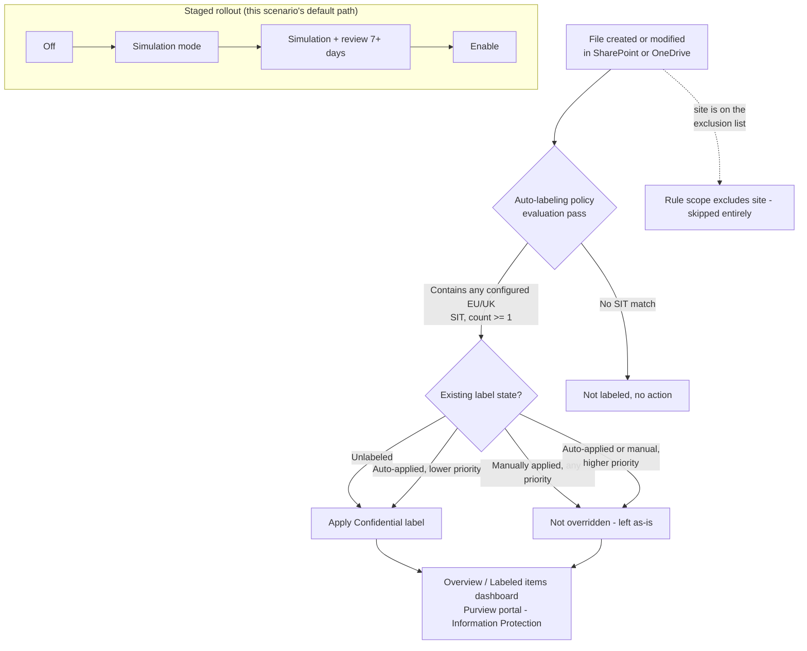

## The short version

Automatically applies an existing **"Confidential"** sensitivity label to SharePoint and OneDrive
files that contain EU/UK personal identifiers - national ID numbers, the EU Social-Security-or-equivalent family, and EU-format debit card numbers - without waiting on end users to label
anything themselves. Deployed as a single Microsoft Purview **auto-labeling policy** with one rule
per workload, staged simulation-first, and scoped to exclude a nominated legal-hold/eDiscovery
site so an active hold's content isn't relabeled mid-matter.

## Why this matters

**GDPR Article 32** ("appropriate technical and organisational measures" for the security of
personal data processing) and the parallel intent of **ISO/IEC 27001:2022 Annex A.5.12 / A.8.2**
(information classification) converge on the same practical requirement: an organization must be
able to show *where* regulated personal data lives and that it is *marked and protected
accordingly*. Because this scenario's default condition set actually matches EU/UK national
identifiers - not a U.S.-specific substitute - its GDPR framing is more directly defensible than
the sibling scenario's own (which explicitly disclaims jurisdiction-complete GDPR coverage from a
U.S. SSN condition).

This scenario is the **classification and marking control**, distinct from (and a prerequisite
signal for) any movement-blocking DLP control keyed off the same label - the same relationship the
sibling scenario has to *PCI Teams Card-Data Exfiltration Block*.

**Scope note:** the default condition set - EU national identification number, EU Social Security
Number (SSN) or Equivalent ID, EU debit card number - is a representative **starter set**, not a
jurisdiction-complete catalog of "personal data" under GDPR (which is far broader: names, physical
addresses, health data, biometric data - see the design notes). It is, however, a genuinely
EU/UK-scoped starter set, unlike the sibling scenario's U.S.-SIT default. the configuration reference and the design notes
show exactly how to narrow the condition set further to only the member states a specific tenant
actually operates in.

## How the control works

One auto-labeling policy (`Confidentiality - Auto-Label EU Personal Data in SharePoint and
OneDrive`) with two rules - one per workload, same `New-AutoSensitivityLabelRule -Workload`
single-value constraint as the sibling scenario. Full rationale in
the design notes.

## What it takes

### Prerequisites

Full licensing detail and citations: [Licensing matrix](/docs/licensing-matrix/). Identical prerequisite set to the
sibling scenario (same policy family, same deploy surface) - summarized here:

| Requirement | Minimum | Notes |
|---|---|---|
| Automatic / policy-based labeling | **Microsoft 365 E5 / A5 / G5**, **Microsoft Purview Suite** (ex-E5 Compliance), or the **Information Protection & Governance (IP&G)** add-on | Per-user for every account whose SharePoint/OneDrive content is in scope - see [Licensing matrix, section 2](/docs/licensing-matrix/#2-master-capability--license-matrix), Information Protection row |
| Role to author/edit auto-labeling policies | **Information Protection Admin** role group | [RBAC model, section 3](/docs/rbac-model/#3-microsoft-entra-roles-that-map-into-purview) |
| Role to turn the policy on after simulation | **Compliance Administrator** or **Compliance Data Administrator** | Distinct from the authoring role - the **Turn on policy** action is greyed out in the portal without one of these, even after a successful simulation |
| Automation identity | App registration with **Exchange.ManageAsApp**, granted the Information Protection Admin role group (plus Compliance Administrator/Compliance Data Administrator if the same identity also enforces) | Certificate-based app-only auth - [Automation surface, section 3](/docs/automation-surface/#3-authentication-patterns---interactive-vs-unattended) |
| Dependency (not deployed by this scenario) | A published sensitivity label named **Confidential** (parameterizable), with label scope including **Files & other data assets**, and **not** a parent label | Same requirement and failure mode as the sibling scenario - see the known limitations below |
| Tenant configuration: sensitivity labels enabled for Office files in SharePoint/OneDrive | `Set-SPOTenant -EnableAIPIntegration $true` (or the Purview portal one-click banner) | Requires the SharePoint Online Management Shell (`Connect-SPOService`) - automation surface 5, [Automation surface, sections 1 and 3](/docs/automation-surface/#1-five-automation-surfaces-not-one-read-this-first). Shared, tenant-wide setting - if the sibling scenario is already deployed, this is already satisfied |
| Tenant configuration: unified audit logging on | Audit log search enabled | Required for the auto-labeling policy's simulation mode to have results to show |
| Tenant configuration (recommended): PDF support | `Set-SPOTenant -EnableSensitivityLabelforPDF $true` | Off by default - see the known limitations |
| Region availability | Auto-labeling available in tenant's region | If **Auto-labeling policies** isn't visible under Information Protection > Policies, the tenant is in a region blocked by an Azure backend dependency |
| Scoping nuance | At least one **non-EDM** sensitive information type per rule | A rule built only from Exact Data Match SITs silently disables auto-labeling for that label |

> Verify current entitlement names against [Licensing matrix](/docs/licensing-matrix/) (dated 2026-09-05) and the
> Product Terms before a sales commitment - SKU names change.

### Cost and licensing

- **No PAYG component for M365 content.** Same per-user E5-tier/IP&G-add-on entitlement as the
  sibling scenario - see [Licensing matrix, sections 1 and 2](/docs/licensing-matrix/#1-the-two-billing-models-read-this-first). No incremental licensing cost for
  choosing EU-region SITs over U.S.-region SITs; both draw from the same built-in SIT catalog
  included with the same entitlement.
- **No additional Azure subscription required** for this control specifically.
- **Sizing note:** identical to the sibling scenario - license the users whose SharePoint/OneDrive
  content is in scope. If both this scenario and the sibling U.S.-SIT scenario are deployed in the
  same tenant against overlapping locations, they do not require separate or additional licensing
  - the entitlement covers auto-labeling generally, not per-policy.

## Proof it works

1. **Automated config check** - `./validate/Test-EuPersonalDataAutoLabelPolicy.ps1 -LabelName
   'Confidential'` confirms the policy and both rules exist with the expected locations, SIT
   conditions (checked individually against `-SensitiveInfoTypeName`, not just "at least one"),
   and target label; exits non-zero on any hard failure.
2. **Simulation results** - Purview portal → Information Protection → Auto-labeling policies →
   select the policy → review the **Labeled items** tab and **Labeling failures** card. A file updated after the last simulation pass won't show until the next
   one.
3. **Functional test** - upload a test document containing a documented test national-ID or
   card-brand test number for one of the configured EU/UK countries (never real personal data) to
   an in-scope SharePoint library. After the next policy pass, confirm the file shows the
   Confidential label.
4. **Exclusion test** - upload the same test document to the excluded legal-hold site. Confirm it
   is **not** labeled.
5. **Override-safety test** - manually apply a *different* sensitivity label to a test file, then
   confirm a subsequent policy pass does **not** replace the manual label.
6. **Localization test (if `-SensitiveInfoTypeName` was overridden)** - confirm a test file
   matching a *removed* country's format (e.g. an Italy Fiscal Code, if the deployment was
   narrowed to Germany + France only) is **not** labeled, proving the narrower condition set is
   actually enforced and not silently falling back to the full bundle.
7. **Enforcement confirmation** - after moving to `-Mode Enable`, re-run the automated config
   check and confirm it reports `Mode: Enable`.
8. **Opt-in bundle test (if `-IncludeTravelDocumentSits` was used)** - run
   `./validate/Test-EuPersonalDataAutoLabelPolicy.ps1 -LabelName 'Confidential'
   -IncludeTravelDocumentSits` to confirm both rules' condition lists include `EU passport number`
   and `EU driver's license number` in addition to the base SIT set. Upload a test U.S. or U.K.
   passport-number test value (never a real one) to confirm the combined-entity gotcha in the known limitations in
   practice - both should match, since this bundle has no way to select one without the other.

## Where it stops

- **This scenario shares every SharePoint/OneDrive-auto-labeling-mechanism limitation already
  documented for the sibling scenario** (*Auto-Label Confidential PII in SharePoint & OneDrive* (the known limitations)): not
  instantaneous (ongoing scan cadence, not upload-time), new/modified SIT definitions apply only
  going forward, the 100,000-files/day auto-labeling limit, a parent label silently labels
  nothing, this scenario does not configure encryption, two rules per policy is a scripting
  necessity (`-Workload` is single-valued), a manual label applied before sensitive content exists
  permanently defeats the control, the exclusion list is a permanent blind spot, the scan-cadence
  lag is a real detection gap for any label-conditioned downstream control, and config validation
  is not match validation. None of these are re-derived here; see that scenario's the known limitations for the full
  detail on each.
- **VERIFY (pilot tenant, before production reliance): byte-exact SIT name capitalization.**
  Microsoft's own Learn pages render the EU-wide bundle SIT names with inconsistent casing across
  pages - this build could not confirm the exact string the portal's SIT picker and
  `Get-DlpSensitiveInformationType` require with certainty. The deploy script mitigates this by
  resolving every configured name against the tenant's own live SIT catalog before deploying and
  failing clearly (with near-matches) rather than silently deploying a rule that matches nothing -
  but the *default* names in this scenario's parameters have not themselves been confirmed against
  a live tenant. See the design notes.
  - **Update (2026-09-27, grounded, no tenant access):** the narrower apostrophe question this
    VERIFY had absorbed - `"EU driver's license number"` (this scenario's spelling) vs. `"EU
    drivers license number"` (the bundle-index page's own URL-derived title) - is now resolved.
    Microsoft's "Create custom sensitive information types" page lists the non-copyable EU-wide
    SITs by their portal display name, not a URL slug, and spells this one `"EU driver's license
    number"` (apostrophe, lowercase) - matching this scenario's existing
    default exactly. Every per-country entity-definition page's own prose (as opposed to its
    page-title metadata, which strips the apostrophe for the URL) is consistent with this: e.g.
    "This entity is available in the EU Driver's License Number sensitive information type."
    Title-*casing* of the other bundle names (`EU national identification number`, `EU Social
    Security Number (SSN) or Equivalent ID`, `EU passport number`) remains unconfirmed against a
    live tenant, so the broader VERIFY above stays open for those - only the apostrophe question
    is closed.
- **VERIFY (pilot tenant): `Get-AutoSensitivityLabelRule`'s read-back property casing for
  `ContentContainsSensitiveInformation`.** Microsoft's documented *write* shape for this parameter
  family uses lowercase `name`/`mincount` keys (confirmed directly against `New-DlpComplianceRule`'s
  own reference examples), but no example in this build's grounding pass showed the exact property
  casing the corresponding `Get-*` cmdlet returns on read. `validate/
  Test-EuPersonalDataAutoLabelPolicy.ps1`'s per-SIT check handles both `name` and `Name`
  defensively rather than assuming one and silently reporting false failures.
- **The EU-wide bundle SITs cannot be copied or edited.** Microsoft's own documentation lists "EU
  national identification number," "EU Social Security Number or equivalent identification," "EU
  passport number," and "EU driver's license number" among SITs that cannot be used as a copy
  source for a custom SIT. If an organization needs a *modified* version of one of
  these (e.g. adding a keyword, adjusting confidence), the per-country entity SITs underneath the
  bundle can be individually customized instead, or a net-new custom SIT authored from scratch -
  the bundle itself is not a starting template.
- **EU checksums vary by country, unlike the sibling scenario's SITs.** Both U.S. SSN and Credit
  Card Number carry checksum validation; within the EU national ID bundle, checksum support is
  inconsistent per country. the design notes tables all 26 members: **19 are checksum-validated**
  (e.g. Belgium, Germany post-2010, Spain) and **7 are pattern-only** (Austria, Croatia, Cyprus,
  France, Greece, Malta, U.K.) - expect a higher false-positive rate from the bundle overall than
  from the sibling scenario's fully-checksummed U.S. SIT pair, and treat this as one more reason a
  precision-conscious organization should consider the per-country localization path in the configuration reference, especially if
  the tenant's regulated population sits in one of the 7 pattern-only markets.
- **"EU" as used by Microsoft's SIT naming does not track EU membership exactly.** The national ID
  bundle includes the U.K. (post-Brexit, no longer an EU member state) as one of its member
  entities - the bundle name is a Microsoft product-naming convention, not a
  legal EU-membership boundary. Treat "EU national identification number" as "EU + UK," not
  strictly EU-27, when explaining coverage to an organization.
- **The opt-in `-IncludeTravelDocumentSits` bundle's U.K. passport coverage is merged with U.S.
  passport coverage.** Microsoft's "EU passport number" bundle has no standalone U.K. passport
  entity - U.K. coverage exists only as a single combined "U.S./U.K. passport number" entity, per
  the bundle's own index page. Enabling this switch to add U.K. passport-number detection also
  enables U.S. passport-number detection with no way to select one without the other via this
  bundle SIT. If an organization needs U.K.-only passport detection without U.S. false positives, this
  scenario's bundle switch is the wrong tool - a custom SIT would be required instead (out of
  scope here). See the design notes.
- **The three EU-wide bundles this scenario can reference do not cover the same member states.**
  The default national-ID bundle (26 entities) has no Poland or Sweden entity; the opt-in passport
  bundle (26 entities) has no standalone Luxembourg or Netherlands entity (and merges U.K. into the
  U.S./U.K. entity above); the opt-in driver's-license bundle (28 entities) is the only one of the
  three covering all 27 EU member states plus a standalone U.K. entity. Don't assume "EU-wide"
  means identical coverage across these three SITs - see the design notes for the full
  per-bundle membership table.
- **The two opt-in travel-document bundles carry far weaker checksum validation than the default
  national-ID bundle.** the design notes now tables all 26 "EU passport number" members and all 28
  "EU driver's license number" members to the same depth as the default bundle's table: only **2 of
  26 passport entities (8%)** are checksum-validated (Germany, Poland) and only **3 of 28
  driver's-license entities (11%)** are (Germany, Spain, U.K.) - versus 73% for the default
  national-ID bundle. The driver's-license bundle additionally caps at Medium (75) confidence for 25
  of its 28 members (no High-confidence tier exists for the non-checksum countries in this SIT
  family). An organization that enables `-IncludeTravelDocumentSits` should expect a materially higher
  false-positive rate than the default condition set and should weigh the per-country
  `-SensitiveInfoTypeName` narrowing in the configuration reference more heavily than for the default bundle.
- **This scenario does not cover Exchange (email).** The Exchange companion is now built as
  *Auto-Label EU/UK Personal Data in Exchange Email* (closed 2026-09-08) - a
  separate policy object, not an additional rule on this scenario's own policy, because Exchange
  auto-labeling has a materially different exclusion mechanism (sender-based, not location-based)
  and observability model - see that scenario's the design notes and this scenario's own design notes.