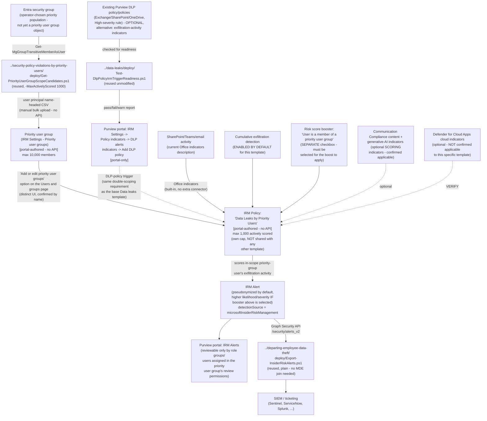

## The short version

Deploys Microsoft Purview Insider Risk Management's **Data leaks by priority users** policy
template - the third and last member of the **Data leaks…** template family (base `Data leaks`,
`…by risky users`, `…by priority users`) to be built in this library. It combines the base
`Data leaks` template's own triggering-event choice - **"User matches a DLP policy"** (up to 20
policies, Exchange Online/SharePoint Online/OneDrive for Business only) or **"User performs an
exfiltration activity"** (built-in indicators) - with the *Security Policy Violations by Priority Users* sibling's population mechanism: a formal, Microsoft-managed **priority user group**, required
for this template, which also increases scoring likelihood/severity and lets an operator restrict
who can review that population's data. This scenario reuses three already-built scripts from two
different siblings unmodified - no new `deploy/` script was needed.

## Why this matters

- **Elevated-scrutiny, DLP-correlated exfiltration monitoring for a formally designated
  population.** The base `Data leaks` template correlates exfiltration activity with content a DLP
  policy already flagged as sensitive, for any population the operator chooses
  (`../data-leaks/why this matters). This template does the identical correlation, but only for users
  in a named, auditable priority user group - and increases both the likelihood and severity of the
  resulting alerts for that specific population, a distinct scoring behavior neither the base
  template nor a plain Entra group can produce.
- **Reviewer-access minimization for a sensitive population.** Identical rationale to the
  *Security Policy Violations by Priority Users* sibling (`../security-policy-violations-by-priority-users/why this matters): a priority user group's own settings let an operator restrict
  review of that population's users, alerts, cases, and reports to a named subset of role groups or
  individuals - a genuine least-privilege control for populations where broad
  Insider Risk Management team visibility would itself be a governance concern.
- **SOC 2 / ISO 27001 exfiltration-monitoring evidence for a defined high-risk population, without
  an employment-stressor or message-count gate.** Unlike *Data Leaks by Risky Users*, this
  template's trigger has no HR-connector or Communication Compliance precursor to evade
  (`../data-leaks-by-risky-users/the known limitations's own Red Team finding on that gate does not apply
  here) - the same "no trigger-count gate" property the base template scenario documents, now
  applied to a formally-designated population rather than the general one.

No regulation names this specific control by requirement number - the same honest framing this
library's other Insider Risk Management scenarios use.

## How the control works

Full rule-by-rule rationale, including the corrected cap-sharing claim, is in the design notes.

## What it takes

### Prerequisites

Full licensing detail and citations: [Licensing matrix, section 2](/docs/licensing-matrix/#2-master-capability--license-matrix) (Insider Risk Management row).

| Requirement | Minimum | Notes |
|---|---|---|
| Insider Risk Management (all policies) | **Microsoft 365 E5/A5/G5**, **Microsoft Purview Suite**, or the **Microsoft 365 E5 Insider Risk Management** add-on | Same base entitlement as every IRM scenario in this library |
| At least one existing Purview DLP policy, scoped to Exchange Online/SharePoint Online/OneDrive for Business, with a High-severity rule - **OR** the exfiltration-activity trigger's built-in indicators | Either satisfies the triggering-event requirement; a DLP policy is documented as **optional** for this template, identical to the base `Data leaks` template | Checked by `../data-leaks/deploy/Test-DlpPolicyIrmTriggerReadiness.ps1` if using the DLP-policy path; step 2 of the implementation steps |
| **Priority user group** - created and populated | Purview portal → Insider Risk Management → Settings → Priority user groups → **Create priority user group**; up to **10,000** members | **Required** for this template (not optional, unlike the DLP policy above); step 3 of the implementation steps/4 |
| Role to configure policies/settings/priority user groups | **Insider Risk Management** or **Insider Risk Management Admins** role group | [RBAC model, section 4](/docs/rbac-model/#4-purview-role-groups-by-module-representative-not-exhaustive) |
| Role to read/manage DLP policies (readiness check only, no create/modify) | **View-Only DLP Compliance Management** or broader | [RBAC model, section 4](/docs/rbac-model/#4-purview-role-groups-by-module-representative-not-exhaustive); only needed if using the DLP-policy trigger path |
| Automation identity for DLP-policy readiness check (reused) | App registration/role assignment enabling `Connect-IPPSSession` with at least read access to DLP policies | Reused unmodified from the base `Data leaks` scenario's own pattern - step 2 of the implementation steps |
| Automation identity for priority-group candidate resolution (reused) | App registration with the Microsoft Graph **`GroupMember.Read.All`** application permission, certificate-based | Reused unmodified from *Security Policy Violations by Priority Users* - step 3 of the implementation steps |
| Automation identity for alert export (optional, reused) | App registration with the Microsoft Graph **`SecurityAlert.Read.All`** application permission, certificate-based | Only needed if reusing `../departing-employee-data-theft/deploy/Export-InsiderRiskAlerts.ps1` per step 7 of the implementation steps |
| **NOT required for this template** | Microsoft 365 HR connector, Communication Compliance trigger integration, Microsoft Defender for Endpoint | Same defining simplification as the base `Data leaks` template - the short version and why this matters |
| (Optional) Microsoft Defender for Cloud Apps connections | Box, Dropbox, Google Drive / Amazon S3, Azure | **Not confirmed applicable to this specific template** - sections 6 and 11 open VERIFY; requires pay-as-you-go billing if used |
| Restriction: admin units | Priority-user-group-based policies **cannot** be scoped to an admin unit; only an **unrestricted administrator** can create a policy from this template | Directly confirmed - a restricted/scoped administrator cannot create this policy at all, not merely a narrower scope |

> Verify current entitlement names against [Licensing matrix](/docs/licensing-matrix/) and the Product Terms before
> a sales commitment, and re-check this template's GA/preview status against the live portal -
> this build's grounding did not find it explicitly labeled preview (consistent with the base
> `Data leaks` template's own finding).

### Cost and licensing

- **No incremental license cost beyond the base Insider Risk Management entitlement** if the
  tenant already has E5/A5/G5, Purview Suite, or the E5 IRM add-on - [Licensing matrix, section 2](/docs/licensing-matrix/#2-master-capability--license-matrix).
- **No Microsoft Defender for Endpoint, HR connector, or Communication Compliance entitlement
  required for this template's trigger mechanism.**
- **No additional DLP license required** if using the DLP-policy trigger - this scenario assumes
  the parent DLP policy already exists under its own, independently-licensed deployment.
- **Pay-as-you-go billing, only if the (unconfirmed-applicable) cloud storage/cloud service
  indicator category is used** - [Licensing matrix, section 2](/docs/licensing-matrix/#2-master-capability--license-matrix)'s PAYG note applies if this category
  turns out to be offered for this template at deploy time.
- **Sizing note specific to this template:** the 1,000-actively-scored-user cap is its own,
  independently-tracked pool - do **not** assume headroom is reduced by an existing
  `Security policy violations by priority users` policy's own usage, and do not assume a priority
  user group anywhere near 1,000 members has confirmed full-coverage behavior.
- **No additional cost for the readiness check, candidate resolution, or alert-export
  automation** - all reused scripts use application permissions already covered by the base
  Microsoft Graph SDK, Security & Compliance PowerShell, or no metered API.

## Proof it works

1. **Automated checks (DLP side, if used)** - `../data-leaks/deploy/
   Test-DlpPolicyIrmTriggerReadiness.ps1` confirms each candidate DLP policy's workload scope,
   High-severity rule presence, `Mode`, and the 20-policy ceiling.
2. **Automated checks (Graph side)** - `validate/Test-DataLeaksPriorityUsersIrmSetup.ps1` confirms
   the Graph session and `GroupMember.Read.All` permission actually work, and reports the resolved
   candidate count against both the 10,000-member and 1,000-actively-scored caps. Exits non-zero on
   a hard failure.
3. **Manual checklist** - the same validation script prints a checklist for the portal-only
   configuration (priority user group existence/membership/reviewer-permission scoping, the
   **"Add or edit priority user groups"** scope step, the **risk score booster** checkbox, policy
   existence/template/state, the DLP double-scoping cross-check if applicable) - see the design notes for why these can't be automated.
4. **End-to-end functional test (non-production names only, pilot tenant)** - from a disposable
   test account added to the priority user group (and, if using the DLP trigger, also in scope of
   the parent DLP policy), perform an action matching the trigger - a High-severity DLP match, or a
   built-in exfiltration-activity indicator's threshold. Confirm an alert appears in **Insider Risk
   Management** → **Alerts** with a severity/likelihood consistent with priority-group membership
   (only if the risk score booster was selected per Step 5), and that the reused export script
 retrieves it.
5. **Evidence trail** - the alert's **Activity explorer** tab shows the specific activity that
   contributed to the score.

## Where it stops

- **The priority-group scoring boost requires a separate, explicitly-selected "Risk score
  booster" checkbox** - not an automatic consequence of assigning a priority user group to the
  policy's scope. the design notes goal 4 treats this as this fragment's most operationally
  significant finding; a deployment that skips this step gets the population-restriction and
  reviewer-scoping benefits of a priority user group without the scoring differentiation that is
  this template family's other headline benefit.
- **What happens when a priority user group larger than 1,000 members is assigned to a policy
  built from this specific template is not documented by Microsoft** - same class of open question
  the *Security Policy Violations by Priority Users* sibling carries for itself, independently
  re-confirmed as unresolved for this template rather than assumed identical.
  **VERIFY (pilot tenant).**
- **No documented Graph/PowerShell write API for priority user groups, DLP-alerts indicator
  wiring, or IRM policy authoring** - every one of these is portal-only, consistent with every
  other Insider Risk Management scenario in this library.
- **Whether the optional cloud storage/cloud service indicator category is offered for this
  specific template is unconfirmed** - Microsoft's per-template description text does not name
  "cloud indicators" for this template the way it does for the base `Data leaks` template, the
  same open question *Data Leaks by Risky Users* already carries for itself. step 5 of the implementation steps/the configuration reference flag
  this as a VERIFY rather than assuming either way.
- **This scenario does not build a full worked example for the exfiltration-activity triggering
  event** - documented as a valid, Microsoft-supported alternative in step 5 of the implementation steps/the configuration reference, not
  implemented end-to-end, matching the base `Data leaks` scenario's own scope (`../data-leaks/
  the design notes).
- **Admin units are not supported for this template, and only an unrestricted administrator can
  create this policy at all** - a restricted/scoped administrator cannot create a policy from this
  template even with a narrower intended scope; confirm the operator's administrator status before
  attempting deployment.
- **This scenario's DLP-workload-exclusion list is more complete than the base `Data leaks`
  scenario's own list** (it additionally names Microsoft 365 Copilot), reflecting this build's
  direct Microsoft Learn fetch versus that scenario's earlier WebSearch-only grounding pass - a
  candidate follow-up (not made here, per fragment discipline) is to bring `../data-leaks/the configuration reference and the known limitations up to the same completeness.
- **Reviewer-permission scoping is shared across every policy that references the same priority
  user group** - a group is not owned by any one policy, so reusing an existing group across this
  template and `Security policy violations by priority users` (or any future policy) gives both
  policies' alerts identical reviewer visibility with no per-policy override. operations and tuning/step 4 of the implementation steps.
- ***Security Policy Violations by Priority Users* (the cost and licensing notes)'s claim that its 1,000-user cap
  "is shared with the base template as well" appears to be an overstatement** - Microsoft's own
  Policy template limits section states a cap applies "across all policies using a given policy
  template" (i.e., per exact template), and the Limits table lists each template as its own row.
  This scenario states its own cap correctly rather than repeating that ambiguity; correcting
  the sibling scenario directly is a candidate follow-up, not made in this fragment.
- **The 1,000-actively-scored cap has no query API to check current cumulative usage against** -
  same disclosed gap as every sibling template; Microsoft documents only a portal-visible
  **Users in scope** column on the Policies tab.
- **`Get-PriorityUserGroupScopeCandidates.ps1` resolves group membership at the moment it runs - it
  is not a live sync**, and its output CSV is a snapshot - identical disclosed gap to the sibling
  scenario that owns this script.
- **Cannot disambiguate which "Data leaks…" or "Data theft…" family template produced a given
  exported alert if more than one is deployed in the same tenant** - same disclosed gap as every
  IRM scenario in this library.
- **This scenario does not configure Adaptive Protection** - same non-goal as every other Insider
  Risk Management scenario in this library that isn't itself an Adaptive Protection scenario.
- **This control is bounded by the specific DLP policies/indicators actually selected, not "all
  exfiltration"** - a channel no wired DLP policy or selected indicator covers is invisible to
  this control regardless of population or scoring boost.