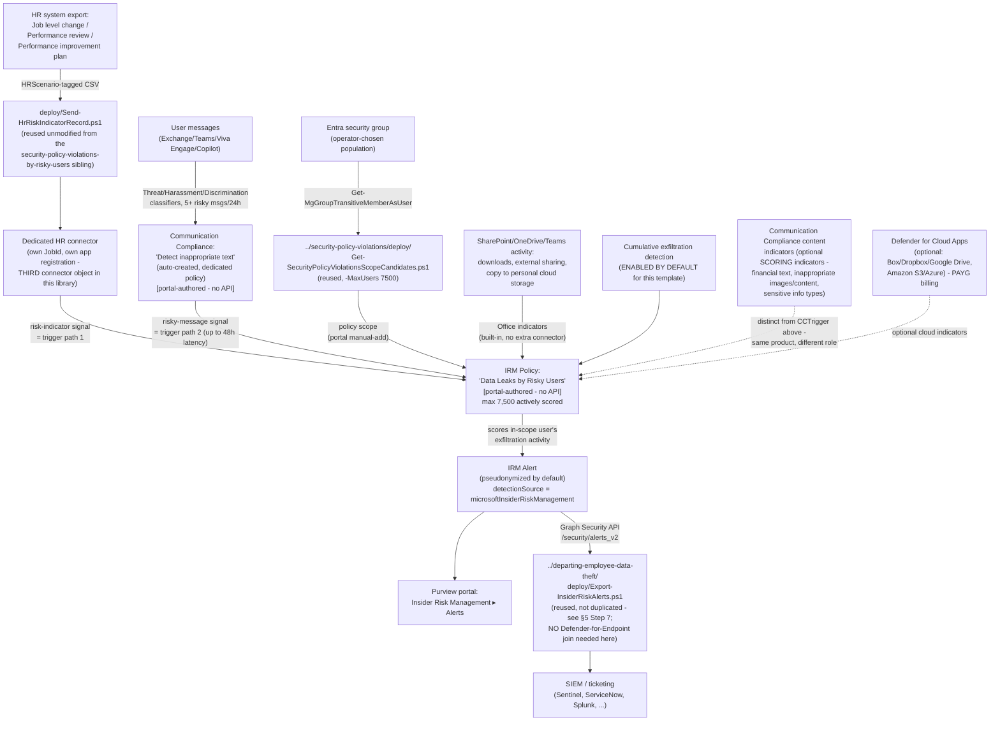

## The short version

Deploys Microsoft Purview Insider Risk Management's **Data leaks by risky users** policy
template - the "risky users" member of the **Data leaks…** template family (base `Data leaks`,
`…by priority users`, `…by risky users`), sharing its bring-into-scope mechanism with this
library's already-built *Security Policy Violations by Risky Users* scenario but scoring a
**materially different indicator set**. Users are brought into scope by an **HR-connector-sourced
employment-stressor signal** (a performance improvement plan, a poor performance review, or a job
level change) and/or a **Communication Compliance risk-signal integration** - at least one is
required, both together is supported - then scored against **built-in Office exfiltration
indicators** (SharePoint Online downloads, sharing files externally, copying data to personal
cloud storage/messaging services) with **cumulative exfiltration detection enabled by default**.
This scenario reuses this library's existing `Send-HrRiskIndicatorRecord.ps1` HR uploader unmodified
- it was already generalized in the sibling scenario to cover this exact template - and reuses the
base template's scope-candidate script and the departing-employee-data-theft scenario's
plain alert-export script.

## Why this matters

Microsoft's own scenario framing for the "risky users" family names the same employment-stressor
precursor - performance improvement plans, poor performance reviews, job-level changes/demotions -
as a documented behavioral signal for elevated insider-risk likelihood. This template correlates that signal with **data-exfiltration
activity** rather than a security-control violation, closing a different detection gap than its
Security-policy-violations-by-risky-users cousin:

- **Risk-weighted exfiltration triage** - a user downloading an unusual volume of SharePoint
  content or copying files to a personal cloud-storage account warrants faster, higher-priority
  triage if that same user was just placed on a performance improvement plan, versus the identical
  activity from a user with no such signal.
- **Coverage for tenants that haven't deployed Microsoft Defender for Endpoint.** Every other
  "risky users"-triggered scenario this library ships (*Security Policy Violations by Risky Users*)
  requires an active Defender for Endpoint subscription. This template's indicator set - SharePoint/
  OneDrive Office activity, optional Communication Compliance content signals, optional cloud-app
  and generative-AI signals - has no such dependency, making it the accessible entry point for a
  tenant licensed for Insider Risk Management but not (yet) for Defender for Endpoint.
- **SOC 2 / ISO 27001 data-exfiltration monitoring evidence for a behaviorally-flagged population**
  - the same audit-evidence rationale this library's other Insider Risk Management scenarios
  document (*Security Policy Violations (base template)* (why this matters)), applied here to exfiltration activity
  rather than endpoint security-control violations.

No regulation names this specific control by requirement number - the same honest framing this
library's other Insider Risk Management scenarios use.

**Governance note, carried over from the *Security Policy Violations by Risky Users* sibling:**
this scenario's HR-connector trigger path draws directly on **performance-management HR data**
(performance improvement plans, poor performance reviews, job-level changes/demotions). Feeding
that data into a security-monitoring trigger - even though a separate exfiltration-activity signal
is still independently required before anything is scored - carries the same retaliation-perception
and employment-law considerations as the sibling scenario. **Route this trigger path through HR and
Legal review before enabling it in a customer's tenant**, exactly as *Security Policy Violations by Risky Users* (why this matters) already establishes for the identical HR-connector mechanism. This is
a deployment-governance recommendation, not a technical limitation; operations and tuning restates it operationally.

## How the control works

Full rule-by-rule rationale is in the design notes.

## What it takes

### Prerequisites

Full licensing detail and citations: [Licensing matrix, section 2](/docs/licensing-matrix/#2-master-capability--license-matrix) (Insider Risk Management row,
including the "Cloud/GenAI indicators on non-M365 → PAYG" note relevant to the configuration reference's optional
indicators below).

| Requirement | Minimum | Notes |
|---|---|---|
| Insider Risk Management (all policies) | **Microsoft 365 E5/A5/G5**, **Microsoft Purview Suite**, or the **Microsoft 365 E5 Insider Risk Management** add-on | Same base entitlement as every IRM scenario in this library |
| **Microsoft 365 HR connector** - configured for disgruntlement/risk indicators, **OR** | Job level change, Performance review, and/or Performance improvement plan CSV data type(s) | At least one of this row or the Communication Compliance row below is required; both together is supported and recommended - step 4 of the implementation steps |
| **Communication Compliance risk-signal integration** - dedicated policy | Selected as an option in the IRM policy-creation workflow itself | Auto-creates a dedicated "Detect inappropriate text" Communication Compliance policy - portal-only, no PowerShell surface for Communication Compliance policy authoring exists; step 5 of the implementation steps |
| Role to configure policies/settings | **Insider Risk Management** or **Insider Risk Management Admins** role group | [RBAC model, section 4](/docs/rbac-model/#4-purview-role-groups-by-module-representative-not-exhaustive) |
| Role to create the HR connector | **Data Connector Admin** (or a role group that includes it) | [RBAC model, section 4](/docs/rbac-model/#4-purview-role-groups-by-module-representative-not-exhaustive); distinct from the IRM policy-configuration role above |
| Automation identity for scope-candidate resolution (reused) | App registration with the Microsoft Graph **`GroupMember.Read.All`** application permission, certificate-based | Reused unmodified from the base `Data leaks` template's scoping pattern - step 3 of the implementation steps |
| Automation identity for HR-connector upload (new, dedicated) | Microsoft Entra app registration created via `../security-policy-violations-by-departing-users/../departing-employee-data-theft/deploy/Register-HrConnectorApp.ps1` (reused unmodified, different `-DisplayName`) - no Graph API permission granted, single-purpose against the HR-connector webhook only | step 2 of the implementation steps; a **third**, dedicated app/connector distinct from both the departing-employee-data-theft sibling's Resignation-scoped connector and the security-policy-violations-by-risky-users sibling's own dedicated connector - see the design notes |
| Automation identity for alert export (optional, reused) | App registration with the Microsoft Graph **`SecurityAlert.Read.All`** application permission, certificate-based | Only needed if reusing `../departing-employee-data-theft/deploy/Export-InsiderRiskAlerts.ps1` per step 7 of the implementation steps |
| (Optional) Microsoft Defender for Cloud Apps connections | Box, Dropbox, Google Drive (cloud storage indicators) and/or Amazon S3, Azure (cloud service indicators), each connected in the Microsoft Defender portal | **Not required** - this template scores without them; enables the additional cloud-app indicator category if the tenant already has non-Microsoft cloud storage in scope. Requires **pay-as-you-go billing** enabled in Purview billing; section 6 |
| (Optional) Communication Compliance content + generative-AI indicators | No separate license beyond Communication Compliance's own entitlement | Selectable as **scoring** indicators for this template (not just the trigger integration) - the configuration reference explains the distinction from the CC trigger path |

> Verify current entitlement names against [Licensing matrix](/docs/licensing-matrix/) and the Product Terms before
> a sales commitment - SKU names change, and Microsoft has not labeled this specific template
> preview as of this writing (unlike its *Security Policy Violations by Risky Users* cousin, whose
> template family carries an explicit preview label).

### Cost and licensing

- **No incremental license cost beyond the base Insider Risk Management entitlement** if the
  tenant already has E5/A5/G5, Purview Suite, or the E5 IRM add-on - [Licensing matrix, section 2](/docs/licensing-matrix/#2-master-capability--license-matrix).
- **No Microsoft Defender for Endpoint entitlement required** - the deliberate licensing
  differentiator versus the security-policy-violations-by-risky-users sibling; confirm this is the
  reason a customer chooses this template over that one when both are otherwise viable.
- **Communication Compliance licensing, if that trigger and/or scoring path is used:**
  Communication Compliance requires the same class of entitlement as Insider Risk Management
  (E5/A5/G5, Purview Suite, or an E5 add-on) per [Licensing matrix, section 2](/docs/licensing-matrix/#2-master-capability--license-matrix) - confirm this
  entitlement independently if Communication Compliance was not otherwise already in use.
- **Pay-as-you-go billing, if cloud storage/cloud service indicators are used** -
  [Licensing matrix, section 2](/docs/licensing-matrix/#2-master-capability--license-matrix)'s "Cloud/GenAI indicators on non-M365 → PAYG (Data Security
  processing unit/day)" note applies directly to this template's optional Box/Dropbox/Google
  Drive/Amazon S3/Azure indicator category. This is **not**
  required for the template's core built-in Office indicators - only if the optional cloud-app
  category is enabled.
- **Sizing note specific to this template:** the 7,500-actively-scored-user cap applies
  cumulatively **across all policies built from this exact template** - confirm no other policy
  sharing this specific cap already exists before sizing a new population (manual portal check -
  no Graph/REST usage-count API exists, same disclosed gap as every sibling).
- **No additional cost for the scope-candidate resolution, HR-connector upload, or alert-export
  automation** - all reused scripts use application permissions already covered by the base
  Microsoft Graph SDK or the HR-connector's own OAuth flow, no metered API.

## Proof it works

1. **Automated checks** - `./validate/Test-DataLeaksRiskyUsersIrmSetup.ps1` confirms the Graph
   session and `GroupMember.Read.All` permission actually work (probed against the same group(s)
   used for scoping), and reports the resolved count against the 7,500-user cap. Exits non-zero on
   a hard failure.
2. **Manual checklist** - the same script prints a checklist for the portal-only configuration (HR
   connector existence/scenario mapping, Communication Compliance dedicated trigger policy
   existence, policy existence/template/state, Office/cumulative-exfiltration indicator selection,
   role groups) - see the design notes for why these can't be automated.
3. **End-to-end functional test (non-production names only, pilot tenant)** - upload a single
   disposable test record via `../security-policy-violations-by-risky-users/deploy/
   Send-HrRiskIndicatorRecord.ps1 -WhatIf:$false` (this scenario's own `-AppId`/`-JobId`) for a
   disposable test account, then perform a benign, disclosed exfiltration-style action already in
   your test plan (e.g., downloading a small number of test files from a disposable SharePoint
   site to a personal OneDrive/cloud-storage test account) rather than moving real data. Confirm an
   alert appears in **Insider Risk Management** → **Alerts**, and that the reused export script
 retrieves it. Repeat separately for the Communication Compliance trigger path if it
   is also enabled (send 5+ test messages matching a risky classifier within 24 hours from a
   disposable test account, per the configuration reference's documented threshold).
4. **Evidence trail** - the alert's **Activity explorer** tab shows the specific Office/exfiltration
   activity (and, if enabled, Communication Compliance content match) that contributed to the score.

## Where it stops

- **Whether the optional cloud-indicator category is actually offered for this specific template
  in the live policy-creation workflow is unconfirmed** - Microsoft's per-template description text
  names it explicitly for `Data theft by departing users` and the base `Data leaks` template, but
  not for `Data leaks by risky users` itself, even though the general cloud-indicators
  configuration article doesn't restrict by template. Flagged as a VERIFY in step 6 of the implementation steps/the configuration reference rather
  than assumed either way.
- **This scenario provisions a third, dedicated HR connector** (distinct from both the
  departing-employee-data-theft sibling's Resignation-scoped connector and the
  security-policy-violations-by-risky-users sibling's own dedicated risk-indicator connector) -
  **VERIFY whether the live portal actually supports adding new HR scenarios to an existing
  connector via Edit** before assuming a third connector is strictly required, identical open
  question the sibling scenario already carries for its own second connector.
- **The Communication Compliance auto-created policy naming inconsistency** - "Insider risk
  trigger - (date created)" vs. "Risky user in messages - (date created)" in the same Microsoft
  Learn article - is disclosed, not resolved by guessing; confirm the actual live name at deploy
  time.
- **No documented Graph/PowerShell write (or read) API for Communication Compliance policy
  configuration** - creation, editing, and reviewer-permission assignment are all portal-only.
- **`Send-HrRiskIndicatorRecord.ps1`'s re-ingestion/de-duplication behavior for an unchanged row
  re-uploaded on a later scheduled run is not documented by Microsoft** - same disclosed gap the
  sibling scenario's own the known limitations already carries for this reused script. **VERIFY (pilot
  tenant).**
- **This scenario's "at least one trigger required" prerequisite is a genuine AND/OR** - a policy
  created with neither the HR connector nor Communication Compliance integration actually producing
  signal is possible at creation time but does not satisfy Microsoft's own documented prerequisite;
  treat this as a configuration error to catch at deployment sign-off.
- **The Communication Compliance trigger path's fixed threshold (5+ risky messages within 24 hours)
  is a documented, Microsoft-controlled evasion vector** - identical structural limitation to the
  security-policy-violations-by-risky-users sibling's own the known limitations finding from its four-lens
  Red Team review: a disciplined insider staying at or under 4 qualifying messages per rolling
  24-hour window generates no Communication Compliance trigger signal, and if that same user also
  has no qualifying HR risk-indicator record, never enters this policy's scope through either
  trigger path regardless of underlying exfiltration risk. Pair with the base `Data leaks` template
  (no message-count trigger gate) for a population where this specific evasion is a live concern.
- **The 7,500-actively-scored cap has no query API to check current cumulative usage against** -
  same disclosed gap as every sibling; Microsoft documents only a portal-visible **Users in scope**
  column on the Policies tab.
- **Cannot disambiguate which Insider Risk Management policy produced a given exported alert if
  more than one policy is deployed in the same tenant** - same disclosed gap as every IRM scenario
  in this library.
- **This scenario does not configure the base `Data leaks` or `Data leaks by priority users`
  templates**, nor the `Security policy violations by risky users` cousin - each is (or would be)
  its own, separately-scoped fragment.
- **This scenario does not configure Adaptive Protection** - same non-goal as every other Insider
  Risk Management scenario in this library.
- **Cumulative exfiltration detection's peer-group accuracy depends on Microsoft Entra hierarchy/
  job-title data being maintained** - accuracy degrades, not fails outright, if the tenant doesn't
  keep this current.

- **Coverage is bounded by the specific indicators selected, not "all exfiltration."** Office
  indicators cover SharePoint/OneDrive/Teams activity and copying to personal cloud storage/
  messaging services - they do not cover printing, removable media/USB, or an attachment sent from
  a personal (non-Microsoft-365) email account, none of which this template's indicator set
  observes unless a separate, differently-scoped control (e.g. a device-control or endpoint DLP
  scenario elsewhere in this library) also covers that channel. A red-teamer aware of which
  indicators are actually selected on this specific policy can route around them.
- **Cumulative exfiltration detection's 30-day peer-group baseline has two disclosed evasion
  properties, not just the Microsoft Entra data-sharing dependency operations and tuning already covers:** (1) a
  recently hired user has no established 30-day personal baseline yet, so early activity is
  compared only against org/peer norms, not the user's own history; (2) an insider who paces
  exfiltration to stay under peer-group and organizational norms - the documented purpose of this
  indicator - generates no cumulative-exfiltration signal by design, the same class of
  threshold-aware evasion as the Communication Compliance message-count gate below. Neither is a
  configuration gap this scenario can close; both are structural properties of a norm-based
  detection model Microsoft controls.
- **Operator-error risk: three near-identical HR-connector-upload scripts/connectors now exist in
  this library** (*Departing Employee Data Theft*'s Resignation-scoped connector,
  *Security Policy Violations by Risky Users*'s dedicated connector, and this scenario's own) -
  all invoked with the visually similar `Send-Hr*Record.ps1 -AppId ... -JobId ...` calling
  convention. Pasting the wrong sibling's `-AppId`/`-JobId` silently uploads risk-indicator data
  into the wrong policy's trigger path with no error (the webhook has no scenario-awareness beyond
  the JobId itself). Before scheduling this scenario's upload script, confirm the `-JobId` in the
  scheduled task/script matches **this scenario's own** connector (recorded in the implementation steps Step
  2) - not copy-pasted from a sibling's runbook.