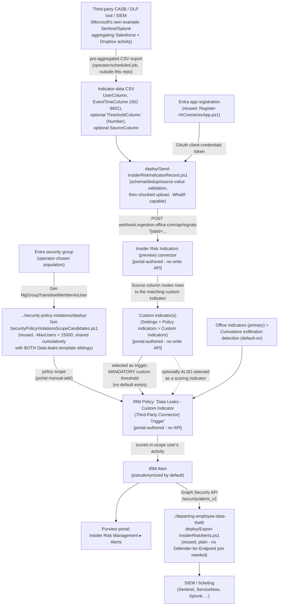

## The short version

Deploys Microsoft Purview Insider Risk Management's **Insider Risk Indicators (preview)** connector to
import pre-aggregated, non-Microsoft-workload detections - Microsoft's own worked example: Salesforce
and Dropbox activity aggregated by a SIEM such as Microsoft Sentinel or Splunk - as one or more **custom
indicators**, then uses those custom indicators as the triggering event (and optionally a scoring
indicator) on the base **Data leaks** Insider Risk Management policy template. Same policy template as
*Data Leaks (base template)* (DLP-policy trigger) and
*Data Leaks (exfiltration-activity trigger)* (built-in-indicator trigger) - this
is the **third** trigger mechanism this library builds for it, and the only one that brings in a
detection Microsoft's own built-in indicators and cloud-app connectors don't cover.

## Why this matters

Same general framing as both sibling scenarios (*Data Leaks (base template)* (why this matters),
*Data Leaks (exfiltration-activity trigger)* (why this matters)) - general-population exfiltration-monitoring
evidence for SOC 2/ISO 27001 audits, no single named regulatory requirement number. This trigger
mechanism's own specific value:

- **Coverage extension, not duplication.** A tenant already paying for a CASB or third-party DLP tool
  covering, say, Salesforce or a niche SaaS app gets that tool's detections correlated with Microsoft's
  own signal (SharePoint downloads, printing, personal-cloud copying) inside one Insider Risk Management
  case, instead of two separate, uncorrelated alert queues an analyst has to manually cross-reference.
- **A path for SaaS apps outside Microsoft's fixed cloud-indicator list.** Cloud storage/cloud service
  indicators cover exactly Box, Dropbox, Google Drive, Amazon S3, and Azure
  (*Data Leaks (base template)* (the configuration reference)) - any other SaaS app (Salesforce, a niche vertical SaaS tool, an internal
  system with its own audit log) has no native Insider Risk Management connector at all. This is the
  only mechanism in this library that closes that gap, provided the deploying organization already has (or builds) an
  upstream aggregation pipeline for it.
- **Consolidated investigation surface.** Once ingested, a custom-indicator-driven alert appears
  alongside every other Insider Risk Management alert in the same **Alerts dashboard**, **Activity
  explorer**, and **User timeline** - the same evidence trail and case workflow this library's other
  scenarios already document, not a bolt-on.

## How the control works

Full rationale for the flexible-schema handling, the two documented silent-failure modes this scenario
defends against, and the confirmed-identical ingestion webhook mechanics is in the design notes.

## What it takes

### Prerequisites

Full licensing detail and citations: [Licensing matrix, section 2](/docs/licensing-matrix/#2-master-capability--license-matrix) (Insider Risk Management row).

| Requirement | Minimum | Notes |
|---|---|---|
| Insider Risk Management (all policies) | **Microsoft 365 E5/A5/G5**, **Microsoft Purview Suite**, or the **Microsoft 365 E5 Insider Risk Management** add-on | Same base entitlement as every IRM scenario in this library |
| Role to configure policies/settings | **Insider Risk Management** or **Insider Risk Management Admins** role group | [RBAC model, section 4](/docs/rbac-model/#4-purview-role-groups-by-module-representative-not-exhaustive) |
| Role to create the Insider Risk Indicators connector | **Data Connector Admin** role | Included by default in the role groups above - same role the HR-connector sibling scenario already documents, [RBAC model, section 11](/docs/rbac-model/#11-microsoft-entra-app-registration-rbac---a-seventh-system-for-scenarios-that-create-their-own-app-registrations) |
| Entra app registration for the connector | App registration + client secret, **no Microsoft Graph API permission granted** | **Reused unmodified**: `../departing-employee-data-theft/deploy/Register-HrConnectorApp.ps1 -DisplayName '<this connector's app>'` - step 2 of the implementation steps |
| A pre-aggregated, per-user third-party detection source | Any CASB, DLP tool, or SIEM (Microsoft's own examples: Microsoft Sentinel, Splunk) that can export **already-aggregated** detections to CSV | Microsoft: "you can't import 'raw' detection signals... you can only import preprocessed aggregations as a file." This scenario does not perform the aggregation - see the design notes |
| Automation identity for scope-candidate resolution (reused) | App registration with the Microsoft Graph **`GroupMember.Read.All`** application permission, certificate-based | Reused unmodified from the base template's scoping pattern - step 8 of the implementation steps |
| Automation identity for alert export (optional, reused) | App registration with the Microsoft Graph **`SecurityAlert.Read.All`** application permission, certificate-based | Only needed if reusing `../departing-employee-data-theft/deploy/Export-InsiderRiskAlerts.ps1` per step 9 of the implementation steps |
| Firewall allowlist for the upload host | `webhook.ingestion.office.com` | Same requirement as the HR-connector sibling - step 5 of the implementation steps, `deploy/Send-InsiderRiskIndicatorRecord.ps1` |
| **NOT required for this trigger path** | A Purview DLP policy, any built-in-indicator trigger configuration, Microsoft Defender for Cloud Apps connections, pay-as-you-go billing | Cloud/GenAI-indicator PAYG billing is a **different, unrelated** mechanism from this connector - this connector has no PAYG requirement of its own |

> Verify current entitlement names against [Licensing matrix](/docs/licensing-matrix/) and the Product Terms before a
> sales commitment, and re-check this connector's preview/GA status against the live portal.

### Cost and licensing

- **No incremental Microsoft license cost beyond the base Insider Risk Management entitlement** if the
  tenant already has E5/A5/G5, Purview Suite, or the E5 IRM add-on - [Licensing matrix, section 2](/docs/licensing-matrix/#2-master-capability--license-matrix). This
  connector has **no pay-as-you-go billing requirement of its own** - a genuine difference from the
  cloud-storage/cloud-service built-in indicators either sibling scenario can optionally add.
- **The third-party CASB/DLP/SIEM tool supplying the source detections is a separate license and cost,
  entirely outside this scenario's scope** - do not present this scenario as license-neutral if the
  organization doesn't already own that tooling; it is the prerequisite this scenario assumes, not something it
  provisions.
- **Sizing note:** this template's actively-scored-user cap is 15,000, **shared cumulatively** across
  every policy built from this exact template - now a three-way pool if both sibling scenarios in this
  library are also deployed. No Graph/REST usage-count API exists to check current cumulative usage.
- **No additional Microsoft cost for the upload, scope-candidate resolution, alert-export, or validation
  automation** - all scripts use standard HTTPS/Graph SDK calls, no metered API on the Microsoft side.

## Proof it works

1. **Automated CSV validation (client-side, before any upload)** -
   `validate/Test-DataLeaksCustomIndicatorTriggerSetup.ps1 -CsvPath ...` re-runs the same schema, ISO
   8601, numeric-threshold, source-value, and duplicate-detection checks
   `deploy/Send-InsiderRiskIndicatorRecord.ps1` performs before an upload, so a candidate file can be
   checked without a Graph session or credentials.
2. **Automated Graph-side checks** - the same script, given `-GroupId`, confirms the Graph session and
   `GroupMember.Read.All` permission work and reports the resolved scope-candidate count against the
   15,000-user cap. Exits non-zero on a hard failure.
3. **Ingestion confirmation** - Purview portal → **Settings** → **Data connectors** → this connector →
   **Download log**: `RecordsSaved` for the most recent run should equal the row count of the CSV
   actually uploaded (accounting for any rows this scenario's own duplicate check already flagged and
   excluded, if `-AllowDuplicateRecords` wasn't used).
4. **Manual checklist** - the same validation script prints a checklist for the portal-only
   configuration: connector mapping, custom indicator creation and threshold-field selection, the
   policy's trigger/scoring selection and mandatory custom threshold, the 24-hour sync wait, the
   firewall allowlist, and role assignment - see the design notes for why these can't be automated.
5. **End-to-end functional test (non-production names only, pilot tenant)** - upload a small test CSV
   containing a disposable test account's UPN with a threshold-column value exceeding the configured
   custom threshold. Confirm the user is marked in-scope on the **Users dashboard** and that an alert
   eventually surfaces in **Insider Risk Management** → **Alerts**, citing the custom indicator by name
   in **Activity explorer**. This pipeline's exact end-to-end latency (upload → sync → scoring → alert)
   was not independently measured in this build - the known limitations.

## Where it stops

- **Which policy templates support custom indicators, confirmed 2026-09-28, this scenario
  deliberately still does not extend beyond the base `Data leaks` template.** One part of the
  documentation states custom indicators can be added to "any *Data theft* or *Data leaks* policies,"
  which alone did not clearly state whether this covers `Data leaks by priority users`/`Data leaks by
  risky users`, or only `Data theft by departing users` among the "Data theft" family. A more precise
  statement on the same "Configure policy indicators in Insider Risk Management" page's "Built-in
  indicators vs. custom indicators" section resolves it: "You can only modify triggering events for
  policies created from the *Data leaks* or *Data leaks by priority users* templates. Policies created
  from all other templates don't have customizable triggering indicators or events." So
  `Data leaks by priority users` **does** support a custom indicator as its trigger; `Data leaks by
  risky users` and `Data theft by departing users` **do not**. Extending this scenario's pattern to
  `Data leaks by priority users` is a valid future fragment (the design notes goal 7/section 6), not attempted
  here to keep this fragment's scope to one template.
- **No documented confirmation of whether the connector's Source-column value matching is
  case-sensitive.** `deploy/Send-InsiderRiskIndicatorRecord.ps1` treats it as case-sensitive (the
  stricter, fail-safer assumption) - **VERIFY (pilot tenant)** before relying on a specific casing
  convention in production.
- **Re-ingestion/de-duplication behavior for an unchanged CSV re-uploaded on a subsequent scheduled run
  is not documented by Microsoft** - the same open question the HR-connector sibling scenario already
  discloses for its own webhook. Re-running the upload script is always safe in the sense that it never
  deletes tenant state, but whether an unchanged row is re-scored, ignored, or duplicated server-side is
  unconfirmed. **VERIFY (pilot tenant)**.
- **This scenario does not perform the third-party detection or its aggregation.** It starts from an
  already-aggregated CSV; the deploying organization's own CASB/DLP/SIEM tooling and its own licensing, tuning, and
  false-positive/negative rate are all prerequisites this scenario assumes, not something it builds or
  can validate.
- **This pipeline validates the uploaded CSV's *shape*, not its *provenance* - it introduces a new
  trust boundary neither sibling scenario has.** `deploy/Send-InsiderRiskIndicatorRecord.ps1` checks
  that a record is well-formed (valid UPN, ISO 8601 timestamp, numeric threshold, matching source
  value); it has no way to confirm a record genuinely originated from the third-party tool it claims to,
  or that no record was altered or omitted between the tool's export and this script's read of the file.
  Anyone with write access to the export file or the host the scheduled script runs on could inject a
  fabricated record (to generate noise, or to implicate another user) or silently drop their own record
  before this script ever sees it - neither is detectable by anything in this scenario. Restrict write
  access to the CSV export path and the scheduled-task host at least as tightly as any other security-control input in your environment; this is a Red Team finding this scenario mitigates by disclosure,
  not by a code control, since no schema-level check can confirm data provenance.
- **A network failure partway through a multi-chunk upload leaves a partial, non-atomic ingestion with
  no automatic resume.** `deploy/Send-InsiderRiskIndicatorRecord.ps1` uploads chunks sequentially and
  throws on the first failed chunk; any chunks already uploaded successfully before the failure remain
  ingested (there is no all-or-nothing transaction, and no built-in retry/resume-from-last-chunk logic).
  Re-running the script after fixing the underlying network issue re-uploads the **entire** CSV,
  including the already-ingested chunks - the same documented UPN+timestamp uniqueness rule means
  those specific rows are silently dropped as duplicates on the re-run rather than double-counted, but
  confirm this reasoning holds for your data before relying on it, since Microsoft doesn't document
  partial-upload recovery as a supported scenario.
- **A failed scheduled upload produces no native Microsoft alert or notification** - unlike a portal-native connector failure, the only signals are the connector's own Download log (a manual pull) and
  whatever the operator's own task-scheduler infrastructure captures. See operations and tuning's operational reminder.
- **No default/recommended threshold exists for a custom indicator - a real, easy-to-miss
  operational gap versus either sibling scenario's built-in-indicator triggers**, where "Use default
  thresholds (Recommended)" is always an option even if the underlying numeric value is unpublished. Here
  there is no such fallback at all; an operator who doesn't deliberately choose a custom threshold cannot
  create a working trigger from a custom indicator.
- **This end-to-end pipeline's latency (third-party detection → CSV export → upload → 24-hour-or-less
  sync → scoring → alert) was not independently measured in this build** - no specific figure is
  asserted; **VERIFY (pilot tenant)** before a customer-facing latency commitment.
- **Cannot disambiguate which Insider Risk Management policy produced a given exported alert if more
  than one policy is deployed in the same tenant** - same disclosed gap as every IRM scenario in this
  library, sharper here with up to three Data-leaks-template siblings potentially coexisting.
- **This scenario does not configure Adaptive Protection** - an organization that wants this policy's alerts to
  drive DLP enforcement wires it into *Dynamic Risk-Based DLP Enforcement*
  separately.