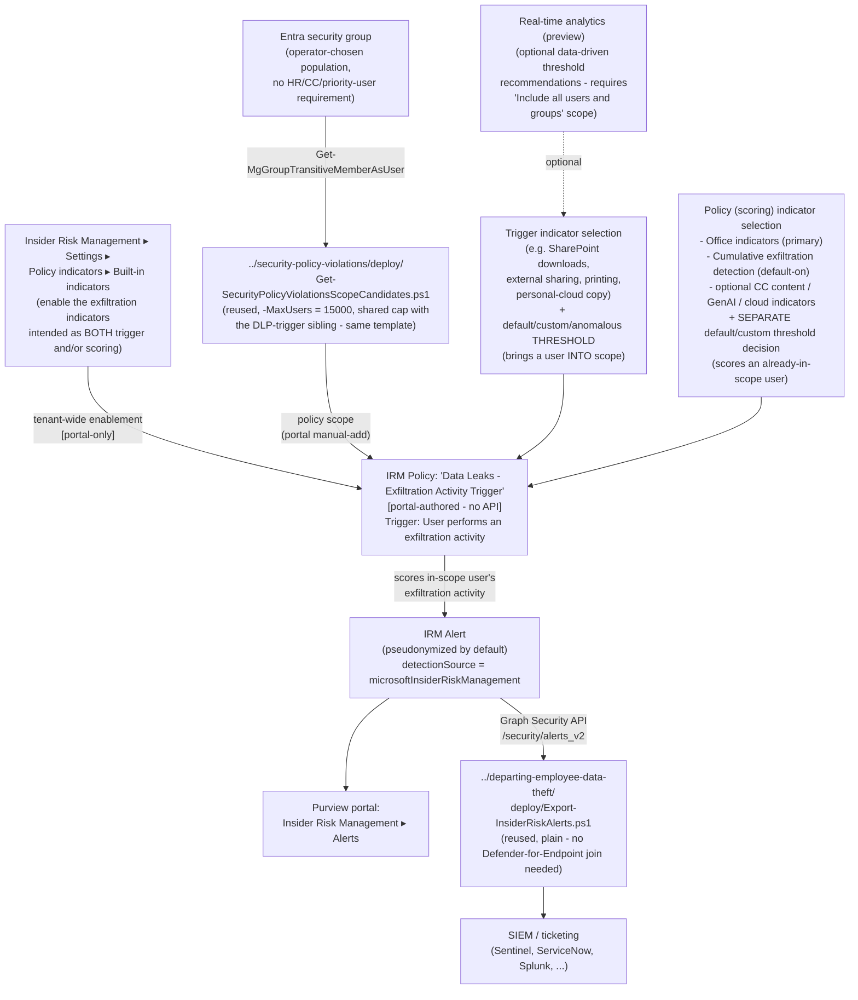

## The short version

Deploys Microsoft Purview Insider Risk Management's base **Data leaks** policy template - the same
template *Data Leaks (base template)* builds - using its **second** documented triggering-event option: **"User performs an exfiltration activity"** (one or more built-in indicators, with
default or custom thresholds), instead of that sibling scenario's DLP-policy trigger. Same policy
template, same 15,000-actively-scored-user cap, same population mechanism (a plain Entra group, no
HR-connector/priority-user/Communication-Compliance-trigger requirement) - different trigger
mechanics, worked end to end here for the first time in this library.

## Why this matters

Identical framing to *Data Leaks (base template)* (why this matters) - this is the same compensating control for the same
disclosed evasion gap (*Data Leaks by Risky Users* (the known limitations)'s Red Team finding: a user who
never triggers an HR-connector or Communication-Compliance gate never enters that sibling's scope
regardless of underlying exfiltration risk). This scenario is a second, equally valid path to the
same general-population, no-precursor-gate control, distinguished from the DLP-trigger sibling by
what determines when a user enters scope:

- **No DLP policy dependency.** A tenant licensed for Insider Risk Management but without a
  suitably-scoped, High-severity DLP policy already tuned for Exchange/SharePoint/OneDrive can
  still deploy this exact template today, using only Insider Risk Management's own built-in
  indicator thresholds as the gate.
- **Threshold-level control over the trigger itself**, not just the eventual scoring. Choosing
  which specific activities (SharePoint downloads, external sharing, printing, personal-cloud
  copying) and at what daily volume bring a user into scope is a materially different tuning lever
  than "any High-severity DLP rule match," useful where an organization wants the trigger threshold itself
  to reflect organization-specific exfiltration-volume norms rather than a DLP policy's own
  independently-tuned severity model.
- **SOC 2 / ISO 27001 exfiltration-monitoring evidence with no DLP-policy prerequisite** - the same
  audit-evidence rationale *Data Leaks (base template)* (why this matters) documents, available to a tenant mid-DLP-rollout or one that has deliberately chosen not to gate this control behind a separate product's
  policy configuration.

No regulation names this specific control by requirement number - the same honest framing every
Insider Risk Management scenario in this library uses. No HR/Legal governance review is needed for
this trigger mechanism - it draws on built-in Office-activity indicators, not HR performance-management data.

## How the control works

Full rationale for the two-independent-thresholds model and the trigger-vs-scoring indicator
distinction is in the design notes.

## What it takes

### Prerequisites

Full licensing detail and citations: [Licensing matrix, section 2](/docs/licensing-matrix/#2-master-capability--license-matrix) (Insider Risk Management row).

| Requirement | Minimum | Notes |
|---|---|---|
| Insider Risk Management (all policies) | **Microsoft 365 E5/A5/G5**, **Microsoft Purview Suite**, or the **Microsoft 365 E5 Insider Risk Management** add-on | Same base entitlement as every IRM scenario in this library |
| At least one built-in exfiltration indicator turned on (Settings → Policy indicators) | Required - the policy workflow can't select an indicator that isn't first enabled tenant-wide | step 2 of the implementation steps; the design notes |
| Role to configure policies/settings | **Insider Risk Management** or **Insider Risk Management Admins** role group | [RBAC model, section 4](/docs/rbac-model/#4-purview-role-groups-by-module-representative-not-exhaustive) |
| Automation identity for scope-candidate resolution (reused) | App registration with the Microsoft Graph **`GroupMember.Read.All`** application permission, certificate-based | Reused unmodified from the base template's scoping pattern - step 3 of the implementation steps |
| Automation identity for alert export (optional, reused) | App registration with the Microsoft Graph **`SecurityAlert.Read.All`** application permission, certificate-based | Only needed if reusing `../departing-employee-data-theft/deploy/Export-InsiderRiskAlerts.ps1` per step 5 of the implementation steps |
| (Optional) Insider risk analytics enabled, policy scoped to "Include all users and groups" | Only if using **real-time analytics (preview)** threshold recommendations | section 6; not required to use fixed/custom thresholds instead |
| (Optional) Microsoft Defender for Cloud Apps connections | Box, Dropbox, Google Drive (cloud storage indicators) and/or Amazon S3, Azure (cloud service indicators), each connected in the Microsoft Defender portal | **Not required** - this template scores without them. Requires **pay-as-you-go billing**; section 6 |
| **NOT required, unlike either data-leaks sibling** | Any Purview DLP policy at all, Microsoft 365 HR connector, Communication Compliance trigger integration, Microsoft Defender for Endpoint | The defining simplification of this specific trigger path - the short version and why this matters |

> Verify current entitlement names against [Licensing matrix](/docs/licensing-matrix/) and the Product Terms before
> a sales commitment, and re-check this template's GA/preview status against the live portal -
> same disclosed grounding caveat *Data Leaks (base template)* (the prerequisites) already carries for this template.

### Cost and licensing

- **No incremental license cost beyond the base Insider Risk Management entitlement** if the
  tenant already has E5/A5/G5, Purview Suite, or the E5 IRM add-on - [Licensing matrix, section 2](/docs/licensing-matrix/#2-master-capability--license-matrix).
- **No Microsoft Defender for Endpoint, HR connector, Communication Compliance, or DLP-policy
  entitlement or deployment required for this trigger mechanism** - the defining licensing/
  operational simplification versus every other Insider Risk Management scenario in this library,
  including its own DLP-trigger sibling.
- **Pay-as-you-go billing, if cloud storage/cloud service indicators are used** -
  [Licensing matrix, section 2](/docs/licensing-matrix/#2-master-capability--license-matrix)'s "Cloud/GenAI indicators on non-M365 → PAYG" note applies
  directly. **Not** required for this template's core built-in Office indicators.
- **Sizing note:** this template's actively-scored-user cap is 15,000, **shared cumulatively**
  with the DLP-trigger sibling and any other policy built from this exact template - confirm no
  other `Data leaks`-template policy already consumes part of it before sizing this deployment. No
  Graph/REST usage-count API exists to check current cumulative usage against that cap.
- **No additional cost for the scope-candidate resolution, alert-export, or validation
  automation** - all scripts use application permissions already covered by the base Microsoft
  Graph SDK, no metered API.

## Proof it works

1. **Automated checks (Graph side)** - `validate/Test-DataLeaksExfiltrationActivityTriggerSetup.ps1`
   confirms the Graph session and `GroupMember.Read.All` permission actually work, and (if
   `-GroupId` is supplied) reports the resolved scope-candidate count against the 15,000-user cap.
   Exits non-zero on a hard failure.
2. **Manual checklist** - the same validation script prints a checklist for the portal-only
   configuration: indicator(s) turned on in Settings, the **trigger** indicator selection and
   threshold mode, the **separate** scoring-indicator selection and threshold mode, Cumulative
   exfiltration detection, policy existence/template/state, and role groups - see the design notes
   for why these can't be automated.
3. **End-to-end functional test (non-production names only, pilot tenant)** - from a disposable
   test account in the scope group, perform an action matching one of the selected trigger
   indicators at a volume exceeding the configured threshold (e.g., if the SharePoint-download
   trigger indicator uses a low custom threshold of 10+/day per the configuration reference's worked example, download 11+
   distinct test files from a disposable SharePoint site in one day). Confirm the user is marked
   in-scope on the **Users dashboard**, and that a corresponding alert eventually surfaces in
   **Insider Risk Management** → **Alerts** once the same or another selected scoring indicator's
   activity also crosses its own threshold. This pipeline's exact end-to-end latency was not
   independently measured in this build - the known limitations.
4. **Evidence trail** - the alert's **Activity explorer** tab shows the specific trigger and
   scoring activity that contributed to the score.

## Where it stops

- **Microsoft does not publish the specific numeric default threshold values behind "Use default
  thresholds (Recommended)" for any indicator.** This scenario's `deploy/policy/
  data-leaks-exfiltration-activity-trigger-policy-manifest.json` and the implementation steps Step 4
  (trigger-threshold sub-step)/the configuration reference recommend using custom thresholds instead whenever the exact
  trigger sensitivity needs to be documented precisely for a customer commitment - **VERIFY
  (portal)** the live default values if they must be stated.
- **Resolved: the two triggering-event options (DLP-policy match and exfiltration activity)
  cannot be enabled simultaneously on one policy** - a policy has a single triggering-event
  configuration, set to one mechanism or the other. Confirmed via a direct Microsoft Learn fetch
  of "Create and manage Insider Risk Management policies" Policy health (singular, definite "the
  triggering event" in the either/or fix guidance) and "Learn about Insider Risk Management policy
  templates" Policy template prerequisites and triggering events ("OR" between the two
  mechanisms, unlike the risky/priority-users family's own "and/or" prerequisite). the design notes
  goal 6/section 6. This scenario's own step 4 of the implementation steps names its policy distinctly from the DLP-trigger
  sibling's so both can still coexist in the same tenant as two separate policies, each using one
  trigger mechanism.
- **The trigger-indicator threshold and the scoring-indicator threshold are two separate decisions
  in the same policy-creation workflow - a real and easy misconfiguration to make is assuming they
  are one setting.** the design notes goal 2/section 5; sections 6 and 8 above call this out explicitly because no
  Microsoft documentation page states this distinction as plainly as the step-by-step workflow
  itself implies it.
- **A user is never analyzed for an exfiltration channel this policy scores but did not select as a
  trigger indicator, no matter how much of that specific activity they generate.** Only the
  indicator(s) chosen on the Triggers page bring a user into scope in the first place; a scoring
  indicator selected on the separate Indicators page only evaluates activity for a user who is
  *already* in scope through some trigger indicator. A tenant that selects, say, only "Downloading
  content from SharePoint" as the trigger but also enables "Copying data to personal cloud storage"
  as a scoring indicator gets zero alerts for a user who exclusively copies to personal cloud
  storage and never downloads from SharePoint above the trigger threshold - that activity is scored
  only for users already brought into scope by a different behavior. Select trigger indicators
  broadly enough to cover every exfiltration channel this policy is meant to catch; do not assume
  scoring-indicator selection alone provides coverage. Flagged during this scenario's four-lens
  review (the Red Team review, finding 1) and reflected in operations and tuning's operational reminder above.
- **This scenario does not create, modify, or read back the trigger/scoring threshold selections
  via any script** - both are portal-only decisions with no Graph/PowerShell surface; `deploy/
  policy/data-leaks-exfiltration-activity-trigger-policy-manifest.json` is a manually-maintained
  reference, not a live query, same limitation every portal-only IRM scenario in this library
  discloses.
- **Real-time analytics (preview) threshold recommendations require the policy to be scoped to
  "Include all users and groups"** - not compatible with a narrowly-scoped group population if that
  specific feature is used; a tenant that wants both a narrow population and data-driven threshold
  guidance must choose custom thresholds set manually instead of real-time analytics for this
  policy. Not a limitation of this scenario specifically, but disclosed here because it directly
  affects the population-vs-analytics tradeoff for this particular trigger path.
- **Coverage is bounded by the specific trigger and scoring indicators actually selected, not "all
  exfiltration."** Office indicators cover SharePoint/OneDrive/printing and copying to personal
  cloud storage/messaging services - they do not cover Teams messages, removable media/USB, or
  content sent from a personal (non-Microsoft-365) email account unless a separately-scoped control
  elsewhere in this library also covers that channel.
- **A disciplined insider aware of the specific trigger indicator and threshold in use can pace
  activity to stay just under it** - the same threshold-aware evasion property every fixed-count
  trigger in this library's Insider Risk Management scenarios discloses (e.g.
  *Data Leaks by Risky Users* (the known limitations)'s Communication Compliance message-count gate). The
  anomalous-activity ("above user's usual activity for the day") option, where available, is
  Microsoft's own documented mitigation for a *static* threshold's predictability, but has its own
  disclosed evasion property: a user who paces activity to stay within their **own** historical
  norm generates no anomalous-activity signal by design.
- **Cumulative exfiltration detection's 30-day peer-group baseline has the same two disclosed
  evasion properties already documented for this template family** - a recently hired user has no
  established personal baseline yet, and a paced/slow-drip exfiltrator staying under peer-group
  norms is not detected by this indicator by design (*Data Leaks by Risky Users* (the known limitations)).
- **This scenario does not configure Adaptive Protection** - an organization that wants this policy's
  alerts to drive DLP enforcement wires it into
  *Dynamic Risk-Based DLP Enforcement* separately.
- **Cannot disambiguate which Insider Risk Management policy produced a given exported alert if
  more than one policy is deployed in the same tenant** - same disclosed gap as every IRM scenario
  in this library, and directly relevant if both this scenario and its DLP-trigger sibling are
  deployed together.
- **This end-to-end trigger-to-alert pipeline's latency was not independently measured in this
  build** - the validation steps Step 3 borrows no specific figure from elsewhere rather than asserting
  one; VERIFY against a pilot tenant before a customer-facing latency commitment.