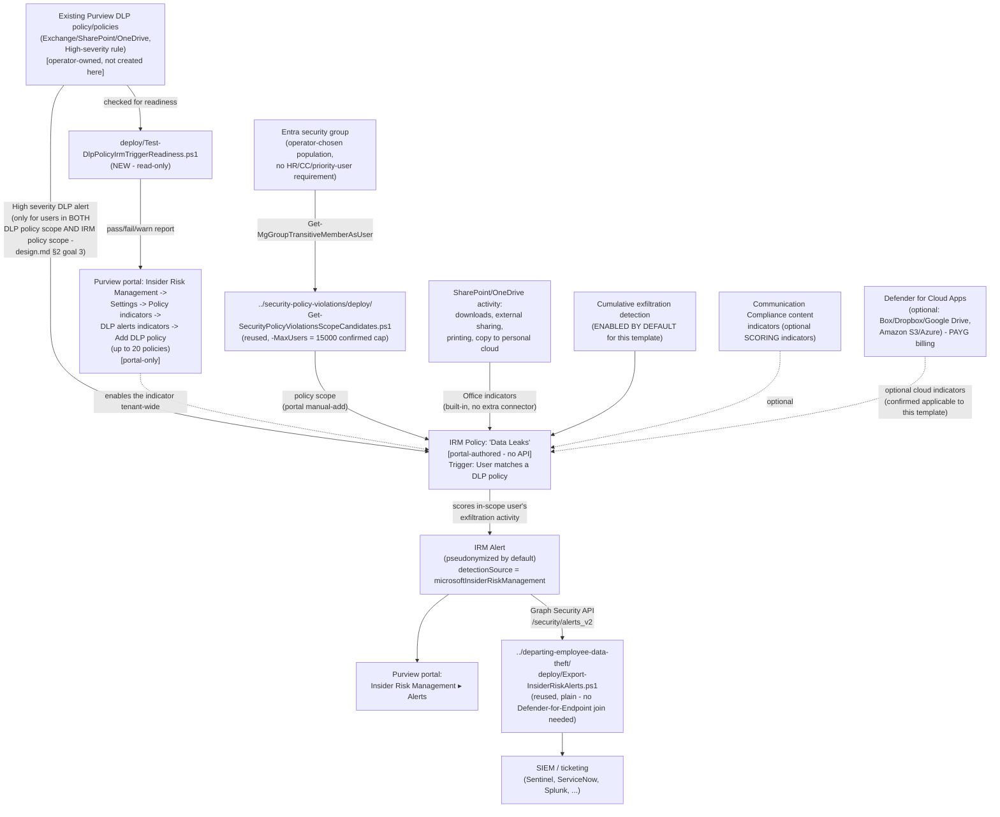

## The short version

Deploys Microsoft Purview Insider Risk Management's **Data leaks** policy template - the base
member of the "Data leaks…" template family (base `Data leaks`, `…by priority users`, `…by
risky users`). Unlike every other Insider Risk Management scenario in this library, this
template has **no HR-connector, Communication Compliance, or priority-user-group requirement at
all**: the population is an ordinary Entra group (or groups) the operator chooses, and the
triggering event is either an existing Purview DLP policy configured for High-severity alerts, or
the product's own built-in exfiltration-activity indicators. This scenario's worked example uses
the **DLP-policy trigger**, wired against one or more operator-supplied, already-existing DLP
policies - the general-purpose runbook this library's *Data Leaks by Risky Users* and two "part2"
DLP scenarios all separately reference as the "no employment-stressor or message-count gate"
control needed to close the specific evasion gaps their own four-lens reviews already disclosed.

## Why this matters

Every other trigger mechanism in this library's Insider Risk Management scenarios is a
Microsoft-controlled gate a disciplined insider can, by design, stay under: an HR-connector
employment-stressor record, or Communication Compliance's 5-messages-in-24-hours threshold. This
template removes that gate entirely - any user in the policy's scope who is also in scope of a
qualifying DLP policy's High-severity rule is analyzed, with no precursor signal required first.

- **Closes a named, disclosed evasion gap this library's own reviews already found.**
  *Data Leaks by Risky Users* (the known limitations)'s Red Team finding states plainly that a user who
  never triggers its HR/Communication-Compliance gates "never enters this policy's scope...
  regardless of underlying exfiltration risk," and names this exact template as the compensating
  control. This scenario is that control, built as a standalone, general-purpose runbook rather
  than a one-off attached to a single parent DLP policy.
- **Correlates exfiltration activity with content a DLP policy already flagged as sensitive.**
  Rather than scoring generic Office activity in isolation, the DLP-policy trigger means this
  template's alerts are specifically about users who already produced a High-severity DLP match -
  a materially higher-precision starting point than an unconditional group-wide indicator scan.
- **SOC 2 / ISO 27001 exfiltration-monitoring evidence with no population-selection judgment
  call.** The same audit-evidence rationale this library's other Insider Risk Management
  scenarios document (*Security Policy Violations (base template)* (why this matters)), applied here to a population
  that isn't first filtered by an HR event or a message-count threshold - useful specifically
  where a customer's compliance narrative needs to show monitoring isn't contingent on a
  behavioral precursor.

No regulation names this specific control by requirement number - the same honest framing this
library's other Insider Risk Management scenarios use. No HR/Legal governance review is needed
for this template's trigger mechanism specifically (unlike the HR-connector-triggered siblings) -
it draws on DLP alert data and built-in activity indicators, not performance-management HR data.

## How the control works

Full rationale for the DLP-policy trigger choice and the double-scoping requirement is in
the design notes.

## What it takes

### Prerequisites

Full licensing detail and citations: [Licensing matrix, section 2](/docs/licensing-matrix/#2-master-capability--license-matrix) (Insider Risk Management row).

| Requirement | Minimum | Notes |
|---|---|---|
| Insider Risk Management (all policies) | **Microsoft 365 E5/A5/G5**, **Microsoft Purview Suite**, or the **Microsoft 365 E5 Insider Risk Management** add-on | Same base entitlement as every IRM scenario in this library |
| At least one existing Purview DLP policy, scoped to Exchange Online/SharePoint Online/OneDrive for Business, with a High-severity rule | Required **only** if using the DLP-policy triggering event (this scenario's worked example) | Checked by `deploy/Test-DlpPolicyIrmTriggerReadiness.ps1` before wiring it up; step 2 of the implementation steps |
| Role to configure policies/settings | **Insider Risk Management** or **Insider Risk Management Admins** role group | [RBAC model, section 4](/docs/rbac-model/#4-purview-role-groups-by-module-representative-not-exhaustive) |
| Role to read/manage DLP policies (readiness check only, no create/modify) | **View-Only DLP Compliance Management** or broader (e.g. **Compliance Administrator**) | [RBAC model, section 4](/docs/rbac-model/#4-purview-role-groups-by-module-representative-not-exhaustive); least-privilege for a read-only check |
| Automation identity for DLP-policy readiness check (new) | App registration/role assignment enabling `Connect-IPPSSession` with at least read access to DLP policies | step 2 of the implementation steps |
| Automation identity for scope-candidate resolution (reused) | App registration with the Microsoft Graph **`GroupMember.Read.All`** application permission, certificate-based | Reused unmodified from the base `Security policy violations` template's scoping pattern - step 3 of the implementation steps |
| Automation identity for alert export (optional, reused) | App registration with the Microsoft Graph **`SecurityAlert.Read.All`** application permission, certificate-based | Only needed if reusing `../departing-employee-data-theft/deploy/Export-InsiderRiskAlerts.ps1` per step 6 of the implementation steps |
| (Optional) Microsoft Defender for Cloud Apps connections | Box, Dropbox, Google Drive (cloud storage indicators) and/or Amazon S3, Azure (cloud service indicators), each connected in the Microsoft Defender portal | **Not required** - this template scores without them. Requires **pay-as-you-go billing** enabled in Purview billing; section 6 |
| **NOT required, unlike this template's HR-triggered siblings** | Microsoft 365 HR connector, Communication Compliance trigger integration, Microsoft Defender for Endpoint | The defining simplification of this template - the short version and why this matters |

> Verify current entitlement names against [Licensing matrix](/docs/licensing-matrix/) and the Product Terms before
> a sales commitment, and re-check this template's GA/preview status against the live portal -
> this build's grounding did not find it explicitly labeled preview, but could not directly fetch
> `learn.microsoft.com` to confirm.

### Cost and licensing

- **No incremental license cost beyond the base Insider Risk Management entitlement** if the
  tenant already has E5/A5/G5, Purview Suite, or the E5 IRM add-on - [Licensing matrix, section 2](/docs/licensing-matrix/#2-master-capability--license-matrix).
- **No Microsoft Defender for Endpoint, HR connector, or Communication Compliance entitlement
  required for this template's trigger mechanism** - the defining licensing simplification versus
  every other IRM scenario in this library.
- **No additional DLP license required** - this scenario assumes the parent DLP policy/policies
  already exist under their own, independently-licensed deployment; this fragment adds no new DLP
  cost.
- **Pay-as-you-go billing, if cloud storage/cloud service indicators are used** -
  [Licensing matrix, section 2](/docs/licensing-matrix/#2-master-capability--license-matrix)'s "Cloud/GenAI indicators on non-M365 → PAYG" note applies
  directly. **Not** required for this template's core built-in Office indicators.
- **Sizing note:** this template's actively-scored-user cap is 15,000, cumulative tenant-wide
  across every policy built from this exact template - no Graph/REST usage-count API
  exists to check current cumulative usage against that cap, same disclosed gap as every sibling
  template.
- **No additional cost for the readiness check, scope-candidate resolution, or alert-export
  automation** - all scripts use application permissions already covered by the base Microsoft
  Graph SDK, Security & Compliance PowerShell, or no metered API.

## Proof it works

1. **Automated checks (DLP side)** - `deploy/Test-DlpPolicyIrmTriggerReadiness.ps1` confirms each
   candidate DLP policy's workload scope, High-severity rule presence, and the combined 20-policy
   ceiling. Exits with a per-policy `[PASS]`/`[FAIL]`/`[WARN]` report; makes no mutating calls.
2. **Automated checks (Graph side)** - `validate/Test-DataLeaksIrmSetup.ps1` confirms the Graph
   session and `GroupMember.Read.All` permission actually work, and (if `-MaxUsers` is supplied)
   reports the resolved scope-candidate count against it. Exits non-zero on a hard failure.
3. **Manual checklist** - the same validation script prints a checklist for the portal-only
   configuration (DLP-alerts indicator wiring, policy existence/template/state, indicator
   selection, the double-scoping cross-check, role groups) - see the design notes for why these
   can't be automated.
4. **End-to-end functional test (non-production names only, pilot tenant)** - from a disposable
   test account that is a member of both the scope group and the parent DLP policy's own scope,
   perform an action that already matches the parent DLP policy's High-severity rule (e.g. sending
   a test message containing the parent scenario's own disposable test SIT value externally).
   Confirm the DLP alert appears in the DLP Alerts dashboard, and that a corresponding alert
   surfaces in **Insider Risk Management** → **Alerts** - allow for the same propagation delay
   Microsoft documents for DLP-alert-to-IRM-alert processing elsewhere in this library
   (*Dynamic Risk-Based DLP Enforcement* (the validation steps)'s up-to-several-hours latency note is the closest
   documented analogue; this exact pipeline's own latency was not independently re-confirmed in
   this build - the known limitations).
5. **Evidence trail** - the alert's **Activity explorer** tab shows the specific DLP alert (and,
   if enabled, Office/cumulative-exfiltration activity) that contributed to the score.

## Where it stops

- **This template's actively-scored-user cap is 15,000**, confirmed via a direct Microsoft Learn
  fetch during a follow-up grounding pass (a prior build session's WebSearch-only grounding, whose
  network environment blocked every direct `learn.microsoft.com` fetch, could not confirm it) -
  cumulative tenant-wide across every policy built from this exact template. Do not assume it
  matches the *Security Policy Violations (base template)* (1,000) or risky/priority-users family (7,500) numbers,
  which are documented for different templates. the design notes goal 7.
- **Microsoft 365 Copilot is explicitly not a supported workload for the DLP-alerts indicator**,
  confirmed via the same direct fetch (the configuration reference and the references ref 4/9) - a DLP policy scoped only to the Copilot
  location never triggers this template, even though its rules may still carry a High-severity
  tag. Because Copilot-scoped policies use `-EnforcementPlanes CopilotExperiences`/`-Locations`
  rather than a dedicated `...Location` array parameter, `deploy/
  Test-DlpPolicyIrmTriggerReadiness.ps1`'s Copilot check reads a property
  (`EnforcementPlanes`) whose exact shape on `Get-DlpCompliancePolicy`'s output was not
  independently confirmed by a dedicated Get- reference page - VERIFY against a pilot tenant
  before relying on that specific check catching every Copilot-scoped policy.
- **The double-scoping requirement is the most likely silent misconfiguration for this
  scenario.** A user in the IRM policy's "Users and groups" scope but NOT in the parent DLP
  policy's own scope (or vice versa) never has an alert processed, with no error surfaced by
  either product. `deploy/Test-DlpPolicyIrmTriggerReadiness.ps1` reminds the operator to check
  this manually; no tool compares the two scopes programmatically.
- **Resolved: the two triggering-event types (DLP-policy match and exfiltration activity)
  cannot be enabled simultaneously on one policy** - a policy has a single triggering-event
  configuration, set to one mechanism or the other. Confirmed via a direct Microsoft Learn fetch
  of "Create and manage Insider Risk Management policies" §Policy health, whose `Data leaks`
  notification-fix guidance twice phrases the choice as "either select an active DLP policy or
  'User performs an exfiltration activity' as **the** triggering event" (singular, definite
  article), corroborated by "Learn about Insider Risk Management policy templates" §Policy
  template prerequisites and triggering events, whose prerequisites column joins this template's
  two mechanisms with "**OR**" rather than the risky/priority-users family's own "and/or"
  HR-connector/Communication-Compliance phrasing. See the design notes.
- **The DLP-alerts indicator is a global, tenant-wide setting**, not scoped to one IRM policy -
  adding or removing a DLP policy from it can affect other Insider Risk Management policies in the
  tenant that also use it. operations and tuning.
- **A policy that mixes a supported workload (e.g. Exchange) with an unsupported one (e.g. Teams)
  on the SAME DLP policy is confirmed safe** - Microsoft states directly that only the
  supported-workload rules' alerts are processed in that case. `deploy/
  Test-DlpPolicyIrmTriggerReadiness.ps1` still prints an informational `[WARN]` on this
  combination (not a `[FAIL]`) so the operator is aware which rules on a mixed policy actually
  feed this trigger; see the script's own `.NOTES` for the citation.
- **Whether a parent DLP policy left in `TestWithNotifications`/`TestWithoutNotifications` mode
  still generates the High-severity alerts this indicator consumes is unconfirmed** - found during
  this scenario's own four-lens review. This library's own DLP scenarios commonly
  default a newly-deployed policy to `TestWithNotifications` for a first, safe rollout; a policy
  left there indefinitely could silently produce no IRM trigger signal even though every other
  readiness check passes. `deploy/Test-DlpPolicyIrmTriggerReadiness.ps1` WARNs on `Mode -ne
  'Enable'` rather than FAILing, since test-mode policies are documented to still generate
  incident reports for their own purpose - suggestive, not confirmed, for this specific indicator.
  VERIFY against a pilot tenant before relying on a Test-mode policy as this trigger's source.
- **This scenario does not create, modify, or tune any DLP policy.** The candidate policies it
  points at are assumed to already exist and be independently owned; a poorly-tuned parent DLP
  policy (too broad, too narrow, wrong severity) produces a correspondingly poor trigger signal
  here - this scenario cannot fix a parent policy's own quality issues, only report whether it
  meets the minimum wiring requirements.
- **Coverage is bounded by the specific indicators and DLP policies actually selected, not "all
  exfiltration."** Office indicators cover SharePoint/OneDrive/printing and copying to personal
  cloud storage/messaging services - they do not cover Teams messages, removable media/USB, or
  content sent from a personal (non-Microsoft-365) email account unless a separately-scoped
  control (e.g. a Teams DLP or device-control scenario elsewhere in this library) also covers that
  channel, and the DLP-policy trigger sees only the specific policies added to the global
  indicator list.
- **Cumulative exfiltration detection's 30-day peer-group baseline has the same two disclosed
  evasion properties already documented for this template family** - a recently hired user has no
  established personal baseline yet, and a paced/slow-drip exfiltrator staying under peer-group
  norms is not detected by this indicator by design (*Data Leaks by Risky Users* (the known limitations)).
- **This second full worked example for the "User performs an exfiltration activity" triggering
  event was not built in this fragment** - documented as a valid configuration in step 4 of the implementation steps/the configuration reference,
  not implemented end-to-end.
- **This scenario does not configure Adaptive Protection** - an organization that wants this policy's
  alerts to drive DLP enforcement wires it into
  *Dynamic Risk-Based DLP Enforcement* separately.
- **Cannot disambiguate which Insider Risk Management policy produced a given exported alert if
  more than one policy is deployed in the same tenant** - same disclosed gap as every IRM scenario
  in this library.
- **This scenario does not build `Data leaks by priority users`**, which remains open in
  the project backlog.
- **This end-to-end pipeline's specific DLP-alert-to-IRM-alert latency was not independently
  re-measured or re-confirmed in this build** - the validation steps Step 4 borrows the closest documented analogue
  from a sibling scenario rather than asserting an exact figure for this exact composition;
  VERIFY against a pilot tenant before a customer-facing latency commitment.